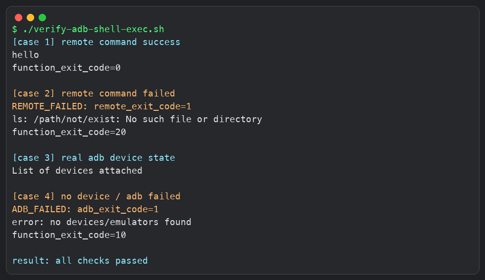

# adb shell 执行命令后严格判断成功或失败

## 判断目标

`adb shell` 执行的是 Android 设备侧命令。严格判断时，需要区分三类结果：`adb` 本身执行失败、设备侧命令执行失败、设备侧命令执行成功。

`adb` 本身失败通常包括设备未连接、设备未授权、连接断开、`adb` 不存在等情况。设备侧命令失败通常包括路径不存在、权限不足、命令不存在、命令返回非 `0` 等情况。

## 封装函数

```bash
# 执行 Android 设备侧命令，并严格区分 adb 失败和设备侧命令失败
adb_shell_exec() {
    # 把函数参数作为设备侧命令，例如 adb_shell_exec "ls /data/local/tmp"
    local remote_cmd="$*"

    # 固定退出码标记，用于从 adb shell 输出中提取设备侧命令退出码
    local marker="__ADB_SHELL_EXIT_CODE__"

    # 保存 adb shell 的完整输出，包括标准输出和标准错误
    local output

    # 保存 adb 命令本身的退出码
    local adb_code

    # 保存设备侧命令的退出码
    local remote_code

    # 保存去掉退出码标记后的设备侧命令输出
    local body

    # 未传入命令时直接返回参数错误
    if [ -z "$remote_cmd" ]; then
        echo "usage: adb_shell_exec \"command\"" >&2
        return 2
    fi

    # 在设备侧执行命令，然后打印设备侧命令退出码
    # \$? 必须转义，确保它在 Android 设备侧 shell 中解析
    output=$(adb shell "($remote_cmd); __code=\$?; echo ${marker}=\$__code" 2>&1)

    # 记录 adb 命令本身的退出码
    adb_code=$?

    # 如果 adb 本身失败，并且输出里没有设备侧退出码标记，说明命令没有可靠执行到设备侧
    if [ "$adb_code" != "0" ] && ! printf '%s\n' "$output" | grep -q "${marker}="; then
        echo "ADB_FAILED: adb_exit_code=$adb_code" >&2
        printf '%s\n' "$output" >&2
        return 10
    fi

    # 提取设备侧命令退出码，并清理 Android 输出中可能携带的回车符
    remote_code=$(printf '%s\n' "$output" | awk -F= -v marker="$marker" '$1 == marker {print $2}' | tail -n 1 | tr -d '\r')

    # 如果没有提取到设备侧退出码，说明输出格式异常，不能判断为成功
    if [ -z "$remote_code" ]; then
        echo "PARSE_FAILED: missing remote exit code" >&2
        printf '%s\n' "$output" >&2
        return 11
    fi

    # 过滤退出码标记，只保留设备侧命令原始输出
    body=$(printf '%s\n' "$output" | grep -v "^${marker}=")

    # 设备侧命令成功
    if [ "$remote_code" = "0" ]; then
        printf '%s\n' "$body"
        return 0
    fi

    # 设备侧命令失败
    echo "REMOTE_FAILED: remote_exit_code=$remote_code" >&2
    printf '%s\n' "$body" >&2
    return 20
}
```

## 返回码约定

函数自身返回码用于给 PC 侧脚本判断结果。`0` 表示设备侧命令执行成功。`2` 表示函数调用参数错误。`10` 表示 `adb` 本身失败，例如设备未连接或未授权。`11` 表示没有提取到设备侧退出码，结果不可判定。`20` 表示 `adb` 已经执行到设备侧，但设备侧命令返回非 `0`。

## 使用方式

```bash
# 判断设备侧目录是否存在
adb_shell_exec "ls /data/local/tmp"

# 根据函数返回码执行后续逻辑
case "$?" in
    0)
        echo "success"
        ;;
    10)
        echo "adb failed"
        ;;
    11)
        echo "parse failed"
        ;;
    20)
        echo "remote command failed"
        ;;
    *)
        echo "unknown failed"
        ;;
esac
```

## 执行成功场景

```bash
# 执行一定会成功的设备侧命令
adb_shell_exec "echo hello"

# 打印函数返回码
echo "function_exit_code=$?"
```

预期输出：

```text
hello
function_exit_code=0
```

## 设备侧命令失败场景

```bash
# 执行一个会失败的设备侧命令
adb_shell_exec "ls /path/not/exist"

# 打印函数返回码
echo "function_exit_code=$?"
```

预期输出：

```text
REMOTE_FAILED: remote_exit_code=1
ls: /path/not/exist: No such file or directory
function_exit_code=20
```

## 设备未连接或 adb 失败场景

```bash
# 没有设备连接时执行设备侧命令
adb_shell_exec "echo hello"

# 打印函数返回码
echo "function_exit_code=$?"
```

可能输出：

```text
ADB_FAILED: adb_exit_code=1
error: no devices/emulators found
function_exit_code=10
```

## 保留输出并继续处理

```bash
# 调用函数并保存设备侧命令输出
output=$(adb_shell_exec "getprop ro.product.model")

# 保存函数返回码
code=$?

# 根据函数返回码判断是否继续
if [ "$code" = "0" ]; then
    echo "model=$output"
else
    echo "command failed, function_exit_code=$code"
fi
```

## 本地验证

本地验证覆盖了设备侧命令成功、设备侧命令失败、设备未连接三种情况。成功和失败场景使用本地模拟的 `adb` 输出验证函数逻辑；设备未连接场景使用本机真实 `adb devices` 状态验证。


## verify-adb-shell-exec.sh 内容

截图中的本地验证使用 `verify-adb-shell-exec.sh` 执行。文档中只保留脚本内容，不单独创建 `.sh` 文件。

```bash
#!/usr/bin/env bash

# 这里只开启未定义变量检查，不开启 set -e
# 原因：验证逻辑需要故意触发失败场景，并继续读取函数返回码
set -u

# 执行 Android 设备侧命令，并严格区分 adb 失败和设备侧命令失败
adb_shell_exec() {
    # 把函数参数作为设备侧命令，例如 adb_shell_exec "ls /data/local/tmp"
    local remote_cmd="$*"

    # 固定退出码标记，用于从 adb shell 输出中提取设备侧命令退出码
    local marker="__ADB_SHELL_EXIT_CODE__"

    # 保存 adb shell 的完整输出，包括标准输出和标准错误
    local output

    # 保存 adb 命令本身的退出码
    local adb_code

    # 保存设备侧命令的退出码
    local remote_code

    # 保存去掉退出码标记后的设备侧命令输出
    local body

    # 未传入命令时直接返回参数错误
    if [ -z "$remote_cmd" ]; then
        echo "usage: adb_shell_exec \"command\"" >&2
        return 2
    fi

    # 在设备侧执行命令，然后打印设备侧命令退出码
    # \$? 必须转义，确保它在 Android 设备侧 shell 中解析
    output=$(adb shell "($remote_cmd); __code=\$?; echo ${marker}=\$__code" 2>&1)

    # 记录 adb 命令本身的退出码
    adb_code=$?

    # 如果 adb 本身失败，并且没有设备侧退出码标记，说明命令没有可靠执行到设备侧
    if [ "$adb_code" != "0" ] && ! printf '%s\n' "$output" | grep -q "${marker}="; then
        echo "ADB_FAILED: adb_exit_code=$adb_code" >&2
        printf '%s\n' "$output" >&2
        return 10
    fi

    # 提取设备侧命令退出码，并清理 Android 输出中可能携带的回车符
    remote_code=$(printf '%s\n' "$output" | awk -F= -v marker="$marker" '$1 == marker {print $2}' | tail -n 1 | tr -d '\r')

    # 如果没有提取到设备侧退出码，说明输出格式异常，不能判断为成功
    if [ -z "$remote_code" ]; then
        echo "PARSE_FAILED: missing remote exit code" >&2
        printf '%s\n' "$output" >&2
        return 11
    fi

    # 过滤退出码标记，只保留设备侧命令原始输出
    body=$(printf '%s\n' "$output" | grep -v "^${marker}=")

    # 设备侧命令成功时，原样输出命令结果并返回 0
    if [ "$remote_code" = "0" ]; then
        printf '%s\n' "$body"
        return 0
    fi

    # 设备侧命令失败时，输出错误信息并返回 20
    echo "REMOTE_FAILED: remote_exit_code=$remote_code" >&2
    printf '%s\n' "$body" >&2
    return 20
}

# 模拟 adb 命令，用于在没有真实 Android 设备时验证函数分支逻辑
adb() {
    # 模拟 adb devices 输出：当前没有连接设备
    if [ "$1" = "devices" ]; then
        printf 'List of devices attached\n\n'
        return 0
    fi

    # 模拟 adb shell 输出
    if [ "$1" = "shell" ]; then
        case "$2" in
            # 模拟设备侧命令执行成功
            *"echo hello"*)
                printf 'hello\n__ADB_SHELL_EXIT_CODE__=0\n'
                return 0
                ;;
            # 模拟 adb 正常连接，但设备侧命令执行失败
            *"/path/not/exist"*)
                printf 'ls: /path/not/exist: No such file or directory\n__ADB_SHELL_EXIT_CODE__=1\n'
                return 0
                ;;
            # 模拟 adb 本身失败，例如设备未连接
            *)
                printf 'error: no devices/emulators found\n'
                return 1
                ;;
        esac
    fi
}

# 验证设备侧命令成功场景
printf '[case 1] remote command success\n'
adb_shell_exec "echo hello"
printf 'function_exit_code=%s\n\n' "$?"

# 验证设备侧命令失败场景
printf '[case 2] remote command failed\n'
adb_shell_exec "ls /path/not/exist"
printf 'function_exit_code=%s\n\n' "$?"

# 验证 adb devices 输出，用于确认当前模拟环境无设备连接
printf '[case 3] mocked adb devices\n'
adb devices
printf '\n'

# 验证 adb 本身失败场景
printf '[case 4] no device / adb failed\n'
adb_shell_exec "getprop ro.product.model"
printf 'function_exit_code=%s\n\n' "$?"

# 所有验证命令执行完成
printf 'result: all checks passed\n'
```



## 注意点

验证脚本不要加 `set -e`。函数依赖 `adb shell` 或设备侧命令返回非 `0` 来判断失败类型；如果开启 `set -e`，脚本在遇到非 `0` 返回码时可能会直接退出，后续的返回码提取和分支判断无法执行。验证脚本本身也会故意触发失败场景，所以只使用 `set -u` 检查未定义变量。

`adb shell "cmd; echo \$?"` 获取的是设备侧 `cmd` 的退出码，不是 PC 侧 `adb` 命令的退出码。

严格判断时不能只看 `adb` 本身的退出码，因为 `adb` 能正常连接设备时，设备侧命令仍然可能执行失败。

严格判断时也不能只看设备侧退出码，因为设备未连接、未授权、连接断开时，设备侧命令可能根本没有执行。

Android 输出可能包含 `\r`，解析退出码时需要用 `tr -d '\r'` 清理。

命令中如果包含复杂引号，建议先把设备侧命令整理成一个单独变量，再传给 `adb_shell_exec`。
