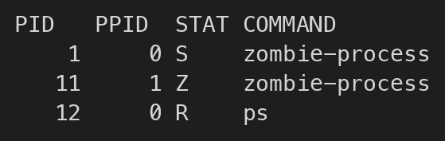

# zombie-process

## 什么是僵尸进程

僵尸进程指的是：**子进程已经退出，但是父进程还没有调用 `wait()` / `waitpid()` 去回收它的退出状态**。这时子进程本身其实已经不再执行代码了，但它在进程表里还会留下一条记录，因此会看到 `Z` 状态，或者看到 `defunct` 之类的描述。

在容器场景里，这类问题更容易被观察到。因为如果容器里的主进程就是业务进程本身，而且它创建了子进程却不回收，那么子进程退出后就可能一直以僵尸状态挂在那里。

## 复现原理

这个示例的思路很简单：父进程先启动，然后执行 `fork()` 创建一个子进程。子进程创建成功后马上退出。父进程故意不调用 `wait()`，而是直接进入睡眠。这样一来，子进程虽然已经结束，但它的退出状态还没有被父进程回收，于是就会变成僵尸进程。

## Go 示例代码

```go
package main

import (
    "fmt"
    "syscall"
    "time"
)

func main() {
    // 打印父进程启动信息，方便在容器日志里观察。
    // 这里的进程通常会成为容器内的 PID 1。
    fmt.Printf("[parent] pid=%d starting\n", syscall.Getpid())

    // 直接调用底层 fork 系统调用，创建一个子进程。
    // fork 的返回值规则是：
    // 1. 在父进程里，返回值是子进程的 PID
    // 2. 在子进程里，返回值是 0
    // 3. 如果创建失败，errno 会非 0
    pid, _, errno := syscall.RawSyscall(syscall.SYS_FORK, 0, 0, 0)
    if errno != 0 {
        panic(fmt.Sprintf("fork failed: %v", errno))
    }

    if pid == 0 {
        // 进入这里说明当前代码运行在“子进程”里。
        // 子进程立刻退出，模拟“很快结束的子任务”。
        fmt.Printf("[child] pid=%d exiting immediately\n", syscall.Getpid())

        // 直接退出子进程。
        // 注意：父进程稍后不会调用 wait()/waitpid() 回收它，
        // 所以这个子进程退出后会在进程表中留下僵尸态记录。
        syscall.Exit(0)
        return
    }

    // 进入这里说明当前代码运行在“父进程”里。
    // 此时 pid 是刚刚创建出来的子进程 PID。
    fmt.Printf("[parent] forked child pid=%d and will not call wait()\n", pid)
    fmt.Println("[parent] sleep for 600 seconds, child should remain as a zombie")

    // 故意长时间休眠，而不是调用 wait()/waitpid()。
    // 这样子进程退出后，父进程始终不回收它，
    // 就可以稳定观察到僵尸进程状态。
    time.Sleep(600 * time.Second)
}
```

## go.mod 内容

```go
module zombie-process

go 1.22
```

## Dockerfile 内容

```dockerfile
# 第一阶段：构建 Go 二进制
FROM golang:1.22-alpine AS builder

# 设置构建目录
WORKDIR /src

# 复制 go.mod 和源码文件
COPY go.mod main.go ./

# 编译 Linux 可执行文件
# CGO_ENABLED=0 让产物更简单，便于放进轻量运行镜像
RUN CGO_ENABLED=0 GOOS=linux GOARCH=amd64 go build -o /out/zombie-process .

# 第二阶段：运行镜像
FROM alpine:3.20

# 设置运行目录
WORKDIR /app

# 从构建阶段复制编译好的二进制
COPY --from=builder /out/zombie-process /app/zombie-process

# 直接让 Go 程序作为容器主进程启动
# 这样它会成为容器内 PID 1，更方便观察僵尸进程现象
CMD ["/app/zombie-process"]
```

## 如何验证

### 1. 构建镜像

```bash
docker build -t zombie-process-demo .
```

### 2. 运行容器

```bash
docker run --rm --name zombie-process-demo zombie-process-demo
```

### 3. 另开终端观察进程状态

```bash
docker exec zombie-process-demo ps -o pid,ppid,stat,comm
```



这里最关键的是第二行里的 `Z`，它表示这个子进程已经退出，但还没有被父进程回收，所以成了僵尸进程。


