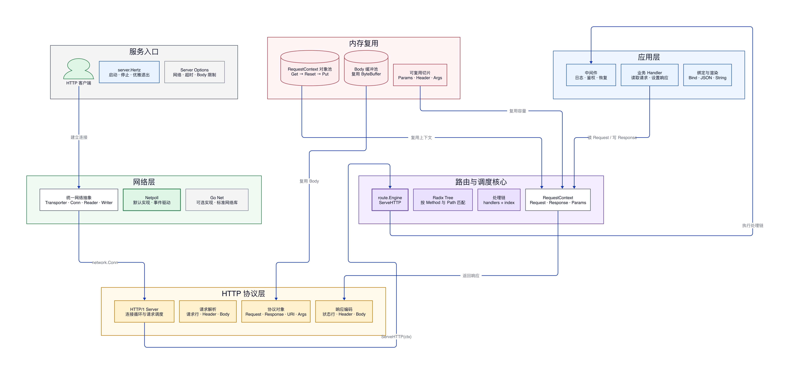
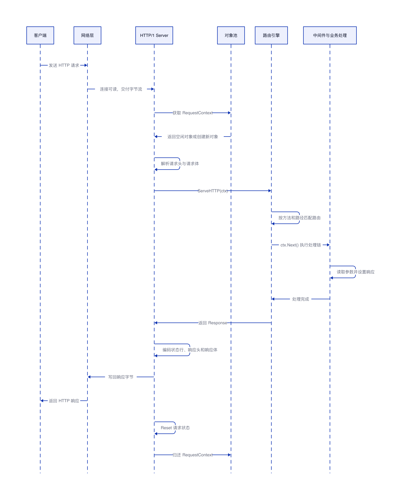
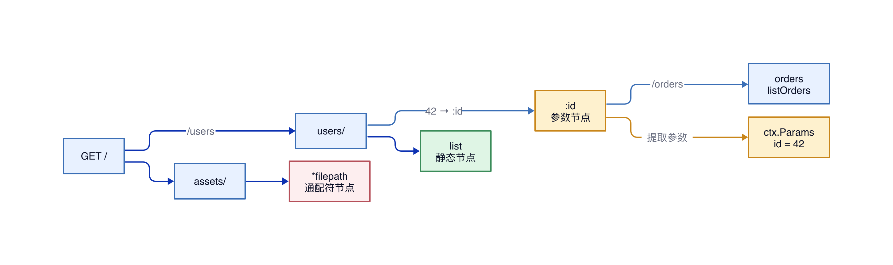
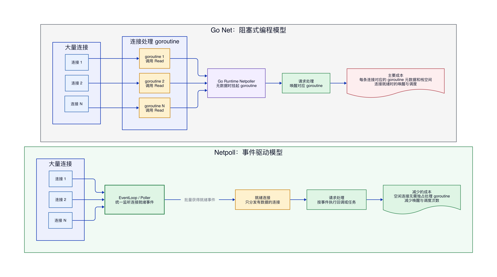

# Hertz 框架原理与高性能实现

## 结论

Hertz 是一个 Go HTTP 框架。本文基于 Hertz `v0.10.6` 分析，其核心请求链路是：网络层接收连接，协议层解析 HTTP，请求进入路由树匹配，中间件和业务 Handler 处理请求，协议层编码响应，网络层写回客户端。

Hertz 的高性能不是来自单个技巧，而是来自整条高频链路的共同优化：Netpoll 降低大量连接的 I/O 管理成本；路由树避免逐条遍历路由；`RequestContext`、请求体和响应体缓冲区反复复用；URI 与表单参数按需解析；内部尽量使用 `[]byte` 并减少数据复制；流式接口避免大请求体一次性完整加载到业务内存。

这些优化的共同代价是更严格的生命周期约束。Handler 返回后，`RequestContext` 及其内部字节数据会被清理并复用。异步任务不能继续直接读取原对象，需要复制所需数据，或者明确让该上下文不再进入对象池。

## 整体架构


Hertz 将网络、HTTP 协议和业务处理分开。网络层只负责收发字节，协议层负责把字节解析成请求并编码响应，`route.Engine` 负责路由和 Handler 调度。上层业务不依赖具体网络实现，因此底层可以使用 Netpoll，也可以切换到 Go Net。

| 层次 | 主要职责 | 关键位置 |
| --- | --- | --- |
| Server | 创建引擎、启动和优雅退出 | `pkg/app/server` |
| 网络层 | 监听连接、读取和写入字节 | `pkg/network/netpoll`、`pkg/network/standard` |
| 协议层 | HTTP/1 请求解析与响应编码 | `pkg/protocol/http1` |
| 框架核心 | 路由匹配和 Handler 调度 | `pkg/route/engine.go`、`pkg/route/tree.go` |
| 请求上下文 | 保存请求、响应和处理状态 | `pkg/app/context.go` |
| 数据结构 | Header、URI、Args、Body | `pkg/protocol` |

## 一次请求如何处理


1. 客户端建立连接并发送 HTTP 请求，Netpoll 或 Go Net 将可读连接交给 HTTP/1 Server。
2. HTTP/1 Server 从对象池中获取一个空闲的 `RequestContext`，然后把请求行、Header 和 Body 填入其中。
3. 协议层调用 `route.Engine.ServeHTTP`，引擎根据 HTTP Method 和 Path 查找路由。
4. 匹配成功后，引擎把中间件和最终 Handler 设置到上下文，通过 `ctx.Next()` 顺序执行。
5. Handler 读取参数并设置状态码、Header 和 Body。此时数据主要写入 Response 对象，还没有直接写入 Socket。
6. 处理链结束后，HTTP/1 Server 编码响应，通过网络层写回客户端。
7. 当前请求状态被 `Reset`，`RequestContext` 归还对象池，供后续请求复用。

## 路由和处理链

### 路由树

Hertz 为不同 HTTP Method 分别维护路由树。静态路径、参数路径和通配符路径按照公共前缀组织，查找时沿请求路径逐段匹配，而不是遍历全部路由。

例如下面三条路由共享 `/users` 前缀：

```go
h.GET("/users/list", listUsers)
h.GET("/users/:id", getUser)
h.GET("/users/:id/orders", listOrders)
```

请求 `/users/42/orders` 会沿公共前缀继续匹配。路径中的 `42` 与参数节点 `:id` 匹配，Hertz 将 `id=42` 保存到当前请求的 `ctx.Params` 中。


Hertz 在 Radix Tree 上进行前缀匹配，按照静态节点、参数节点和通配符节点的优先级向下查找，必要时进行有限回溯。匹配成本主要取决于路径结构和长度，不会随着路由总数简单线性增长。

注册路由时，Engine 还会统计单条路由最多需要多少参数。处理请求时只在现有 `Params` 容量不足时扩容，正常情况下通过将长度重置为零继续使用原底层数组。

### 处理链

全局中间件、路由组中间件、单路由中间件和最终业务 Handler 会按照注册顺序合并为 `[]HandlerFunc`，然后保存到当前请求的 `RequestContext.handlers`。`RequestContext.index` 记录当前执行位置，初始值为 `-1`。

处理链的核心逻辑可以简化为：

```go
func (ctx *RequestContext) Next(c context.Context) {
    // 从下一个 Handler 开始执行。
    ctx.index++

    for ctx.index < int8(len(ctx.handlers)) {
        ctx.handlers[ctx.index](c, ctx)
        ctx.index++
    }
}
```

`route.Engine` 完成路由匹配后调用 `ctx.Next(c)`，从第一个 Handler 开始执行。中间件也可以调用 `ctx.Next(c)`，让后续处理链先执行；后续 Handler 全部返回后，再继续执行当前中间件中 `ctx.Next(c)` 后面的代码。

```go
func AccessLog() app.HandlerFunc {
    return func(c context.Context, ctx *app.RequestContext) {
        start := time.Now()

        // 执行后续中间件和业务 Handler。
        ctx.Next(c)

        // 后续处理完成后再执行，因此可以读取最终状态码。
        fmt.Printf("status=%d cost=%s\n", ctx.Response.StatusCode(), time.Since(start))
    }
}
```

假设处理链为 `日志 → 鉴权 → 业务 Handler`，实际顺序如下：

```text
进入日志中间件
    → 进入鉴权中间件
        → 执行业务 Handler
    ← 返回鉴权中间件
← 返回日志中间件并记录耗时
```

`ctx.Abort()` 通过把 `ctx.index` 设置为一个远大于正常 Handler 下标的 `AbortIndex`，让 `ctx.Next(c)` 的循环条件立即失败，从而跳过剩余 Handler：

```go
func (ctx *RequestContext) Abort() {
    ctx.index = abortIndex
}
```

调用 `ctx.Abort()` 只会阻止后续 Handler，当前 Handler 中位于 `ctx.Abort()` 后面的代码仍会继续执行。需要立即结束当前 Handler 时，应显式 `return`：

```go
func Auth() app.HandlerFunc {
    return func(c context.Context, ctx *app.RequestContext) {
        if !authorized(ctx) {
            ctx.String(401, "unauthorized")
            ctx.Abort()
            return
        }

        ctx.Next(c)
    }
}
```

整个实现只需要一个 Handler 切片和一个整数下标，不需要为每次调用构造新的链表节点或闭包嵌套对象。

## 高性能实现

### Netpoll 降低连接管理成本

Go Net 使用阻塞式编程模型，服务端通常为每条连接安排一个 goroutine 执行 `Read`。连接没有数据时，该 goroutine 会被 Go Runtime 挂起；连接可读后，再唤醒对应 goroutine 继续处理。Netpoll 直接以 EventLoop 统一监听大量连接，只把已经就绪的连接分发给上层处理。


Go Net 并不是“一条连接占用一个操作系统线程”，其底层同样使用 Go Runtime Netpoller，空闲 goroutine 不会持续占用线程。主要差别是连接管理方式：Go Net 保留“一条连接对应一个处理 goroutine”的阻塞式编程抽象；Netpoll 把连接就绪事件集中到 EventLoop，空闲连接不需要各自长期持有处理 goroutine，从而减少大量连接场景下的 goroutine 栈和元数据、唤醒以及调度成本。

Go Net：通常每条连接由一个 goroutine 负责读取、解析并处理请求。进入 Handler 后，一般由该连接对应的 goroutine 继续执行，不会为 Handler 再额外创建一个 goroutine。

Netpoll：连接读取由 Poller 事件驱动；请求进入 Handler 后，再由处理 goroutine 执行业务逻辑。

Netpoll 的 goroutine 数量需要分开计算。Poller goroutine 数量默认按照 `runtime.GOMAXPROCS(0)/20 + 1` 计算，其中除法采用整数除法。例如，`GOMAXPROCS` 为 8 时有 1 个 Poller，为 20 时有 2 个 Poller，为 40 时有 3 个 Poller。一个 Poller 可以监听大量连接，因此 Poller goroutine 数不等于连接数。仅从核心请求处理链看，Netpoll goroutine 数大致为“Poller goroutine 数 + 活跃 Handler goroutine 数”；服务内部的其他后台 goroutine 不包含在这个计算中。

因此，在没有限流的情况下，无论使用 Go Net 还是 Netpoll，每个正在执行且尚未返回的 Handler 通常都会占用一个 goroutine，活跃 Handler goroutine 数大致等于当前在途请求数，而不是累计请求数或 QPS。

Hertz 在受支持的平台上默认使用 Netpoll，同时保留 Go Net 实现，可按需要显式切换；当构建环境不支持 Netpoll 时，使用 Go Net。

Hertz 通过网络接口隔离具体实现。协议层接收的是 `network.Conn`，不直接依赖 Netpoll。

### 复用 RequestContext

`route.Engine` 持有 `ctxPool sync.Pool`。HTTP/1 Server 处理请求时获取上下文，请求结束后重置并归还：

```go
ctx := getRequestContext()
defer putRequestContext(ctx)

// 解析请求并交给路由引擎。
engine.ServeHTTP(c, ctx)
```

池化不表示所有请求共享一个对象。同一个对象从池中取出后就不在池内，归还之前只属于当前请求。因此并发请求会使用不同对象，先后到达的请求才会复用相同地址。

```text
1. 请求 A：Get ctx1
2. 请求 A：使用 ctx1
3. 请求 A：Reset ctx1
4. 请求 A：Put ctx1，归还对象池
5. 请求 B：Get ctx1，取得同一个对象
6. 请求 B：使用 ctx1
```

这里的顺序是 `请求 A Put ctx1 → 请求 B Get ctx1`。请求 B 只有在请求 A 归还 `ctx1` 后，才可能从对象池取得同一个对象。

`Reset` 会清除 Request、Response、路由参数、Handler 下标和请求级键值，但尽量保留可复用的对象和切片容量。这样既隔离前后两个请求的数据，又避免下一次请求重新分配整套对象。

`sync.Pool` 只是临时对象缓存。Go 运行时可以在垃圾回收时清理池中对象，因此它降低的是平均分配次数，不是固定容量的资源池。

### 复用 Request、Response 和 Body

`RequestContext` 内部直接包含 Request 和 Response。上下文复用后，这些对象也随之复用。客户端等独立场景还可以通过 `protocol.AcquireRequest()` 与 `protocol.ReleaseRequest()` 复用 Request。

请求体和响应体使用 `bytebufferpool.ByteBuffer`。首次需要 Body 时才取缓冲区，没有 Body 的请求不会提前创建它。请求完成后根据容量决定保留位置：

```go
if body.Cap() <= maxKeepBodySize {
    // 小缓冲区留在当前对象中，下次直接使用。
    body.Reset()
} else {
    // 大缓冲区退回全局缓冲池，避免当前上下文长期占用。
    requestBodyPool.Put(body)
    body = nil
}
```

`v0.10.6` 的默认 `MaxKeepBodySize` 为 4 MiB。这个阈值不是禁止大请求，而是决定大容量缓冲区是否继续挂在当前 Request 或 Response 上。超过阈值的缓冲区会退回全局池，不会被当前上下文长期保留。

### 延迟解析

协议层必须先读取请求行和 Header 才能确定请求边界，但并非所有高级结构都要立即解析。Hertz 通过状态位让 URI 和表单参数按需解析。

```go
func (req *Request) URI() *URI {
    if !req.parsedURI {
        req.ParseURI()
    }
    return &req.uri
}

func (req *Request) PostArgs() *Args {
    if !req.parsedPostArgs {
        req.parsePostArgs()
    }
    return &req.postArgs
}
```

例如一个 Handler 只返回固定健康状态，它不访问 Query 或 POST 表单，就不需要构造对应的参数结构。延迟解析同时减少无效 CPU 工作和临时对象。

### 为什么内部优先使用 `[]byte`

网络收到的数据本身就是字节。Socket 读取数据后，HTTP 请求行、Path、Header 和 Body 都位于字节缓冲区中。Hertz 可以直接通过切片引用其中一段，不需要为每个字段重新复制数据：

```go
// buf 表示从网络读取的请求数据。
method := buf[0:3]
path := buf[4:13]
```

`method` 和 `path` 只是指向原数组不同区域的切片描述，不会复制底层字节。如果改成常规的字符串转换：

```go
method := string(buf[0:3])
path := string(buf[4:13])
```

Go 需要保证 `string` 的内容不可修改，因此通常要创建独立字符串并复制对应字节。HTTP 解析会处理 Method、URI、Header 名称、Header 值和参数等大量小字段，高并发下这些短命字符串会增加内存分配和 GC 压力。

`[]byte` 还可以复用容量并原地追加。请求结束后，框架可以把切片长度重置为零，再用同一块内存接收后续数据。编码响应时也可以在一个可复用切片上持续追加：

```go
buf = append(buf[:0], "HTTP/1.1 200 OK\r\n"...)
buf = append(buf, "Content-Length: "...)
buf = strconv.AppendInt(buf, int64(bodySize), 10)
buf = append(buf, "\r\n\r\n"...)
```

如果使用 `string` 拼接，字符串不可修改，每次产生的新结果都需要新的存储；而网络写接口最终仍然需要字节，写回前还可能再次发生 `string` 到 `[]byte` 的转换。使用 `[]byte` 可以让数据保持“网络字节 → 协议解析 → 响应编码 → 网络字节”的形态。

这并不表示 `[]byte` 总比 `string` 好。`string` 适合常量、配置、map 键和需要长期保存的业务文本；`[]byte` 适合网络收发、协议解析、缓冲区复用和动态编码。Hertz 的选择是在底层高频路径优先使用 `[]byte`，业务友好接口再按需要提供 `string`。

| 场景 | 更适合的类型 | 原因 |
| --- | --- | --- |
| Socket 读写与 HTTP 解析 | `[]byte` | 原始数据就是字节，可以切片和复用 |
| 动态构造响应 | `[]byte` | 可以使用 `append` 原地追加 |
| 请求期间临时读取 | `[]byte` 或无复制字符串视图 | 避免无意义复制 |
| 常量、配置和 map 键 | `string` | 不可变、可比较，文本语义清晰 |
| 跨请求或跨 goroutine 保存 | 独立 `string` 或复制后的 `[]byte` | 不受池化缓冲区覆盖影响 |

### 少复制与无复制转换

内部高频路径通过 `bytesconv.B2s` 和 `bytesconv.S2b` 进行无复制视图转换。它们只改变数据的观察方式，不复制底层内容，因此转换结果与原缓冲区共享生命周期。该方式适合框架内部同步、短生命周期的读取，不适合把结果长期保存。

设置 Body 时也提供两种语义：

| 方法 | 是否复制输入数据 | 使用要求 |
| --- | --- | --- |
| `SetBody` | 复制 | 调用后可以继续修改原切片 |
| `SetBodyRaw` | 不复制 | Request 使用期间不能修改原切片 |

无复制并非越多越好。Handler 返回后，池化缓冲区可能被后续请求覆盖。只要数据需要跨越当前请求生命周期，就必须创建独立副本：

```go
// 创建独立字符串，适合长期保存文本。
path := string(ctx.Request.Path())

// 创建独立字节切片，适合后续仍按字节处理。
body := append([]byte(nil), ctx.Request.Body()...)
```

Hertz 在底层选择 `[]byte` 的本质不是“字节一定比字符串快”，而是避免网络字节在高频链路中反复转换和复制。

### 复用复制缓冲区

流之间复制数据时，Hertz 使用 `CopyZeroAlloc` 一类实现复用中间缓冲区，避免每次复制都执行类似 `make([]byte, 32*1024)` 的分配。这里的“ZeroAlloc”指这段复制热路径尽量不新建临时缓冲区，不表示完整请求处理绝对零分配。

### 流式处理大 Body

流式 Body 是指业务代码不等待完整请求体全部读入内存，而是通过 Reader 分段读取，收到一部分就处理一部分。

假设客户端上传一个 2 GiB 文件，普通模式需要先把完整 Body 放入内存缓冲区，再交给 Handler；流式模式可以每次读取 64 KiB，处理或写入文件后继续读取下一段。两种模式的内存占用可以概括为：

```text
普通 Body：O(完整 Body 大小)
流式 Body：O(单次读取缓冲区大小)
```

流式读取的处理方式可以简化为：

```go
func handler(c context.Context, ctx *app.RequestContext) {
    reader := ctx.Request.BodyStream()
    buf := make([]byte, 64*1024)

    for {
        n, err := reader.Read(buf)
        if n > 0 {
            // 处理当前分段，例如写入文件或转发给下游。
            processChunk(buf[:n])
        }
        if err == io.EOF {
            break
        }
        if err != nil {
            // 处理客户端中断等读取错误。
            return
        }
    }
}
```

流式 Body 与 HTTP Chunked 编码不是同一个概念。流式 Body 描述业务如何读取请求体；Chunked 描述 HTTP/1.1 如何在网络上传输请求体。带有 `Content-Length` 的请求和使用 Chunked 编码的请求都可以流式读取。

流式 Body 通常只能顺序消费一次，读取过的数据不会自动保留。Handler 需要在返回前完成读取，或者把数据转存到由业务管理的文件、存储或队列中，不能在 Handler 返回后继续异步持有原来的 Body Stream。

流式处理适合大文件上传、代理转发和持续数据流。普通 JSON、表单以及需要多次读取或完整绑定参数的请求更适合普通 Body 模式。使用流式 Body 时还需要设置 Body 大小限制和读取超时，并处理慢速发送、客户端中断等情况。

## RequestContext 如何清理

Hertz 的“清理”不是把底层内存逐字节写成零，而是逐层调用 `Reset()`，让旧数据从逻辑上不可见，同时尽量保留可以复用的内存容量。HTTP/1 Server 在请求结束后执行的过程可以简化为：

```go
func putRequestContext(ctx *app.RequestContext) {
    // 清除当前请求的有效状态。
    ctx.Reset()

    // 清理后的对象放回池中，供后续请求使用。
    ctxPool.Put(ctx)
}
```

`RequestContext.Reset()` 会继续重置内部 Request 和 Response，并清除当前请求特有的状态。其作用可以概括为：

```go
func (ctx *RequestContext) Reset() {
    // 继续清理请求和响应内部状态。
    ctx.Request.Reset()
    ctx.Response.Reset()

    // 清除路由参数的有效长度，保留底层数组容量。
    ctx.Params = ctx.Params[:0]

    // 清除处理链及其执行位置。
    ctx.handlers = nil
    ctx.index = -1
    ctx.fullPath = ""

    // 断开对业务对象、错误和连接等请求级数据的引用。
    ctx.Keys = nil
    ctx.Errors = nil
    ctx.conn = nil
}
```

上面是便于理解的简化代码。实际实现还会清理 Hijack、跟踪和请求完成通知等状态。核心原则是：切片和缓冲区尽量保留容量，不能跨请求保留的引用和状态则恢复为空值。

Request 的清理会继续深入到 Header、URI、参数和 Body：

```go
func (req *Request) Reset() {
    req.Header.Reset()
    req.ResetSkipHeader()
    req.CloseBodyStream()
    req.options = nil
}

func (req *Request) resetSkipHeaderAndConn() {
    req.ResetBody()
    req.uri.Reset()
    req.parsedURI = false
    req.postArgs.Reset()
    req.parsedPostArgs = false
}
```

Response 也采用相同思路，重置响应头、状态码、Body 和流式响应状态。这样下一个请求不会通过正常接口读取到上一个请求的 Method、Path、Header、参数、Body 或状态码。

### 字节数据如何清理

对于常用的小切片，清理通常只把长度改为零：

```go
buf = buf[:0]
```

假设清理前的状态是：

```text
len=9，cap=64，内容为 /users/42
```

清理后变成：

```text
len=0，cap=64，通过当前切片读取不到旧内容
```

底层数组中的 `/users/42` 并没有立即被零值覆盖。下一个请求会在同一块数组上写入新数据。这样既隔离了前后两个请求的逻辑状态，又避免了逐字节擦除和重新申请数组的成本。

Header、URI、Query Args、POST Args 和路由参数中的切片也遵循这个原则。它们会清除有效长度和解析标记，但保留适合后续请求复用的底层容量。

### Body 缓冲区如何清理

Request 和 Response 的 Body 使用可复用的 `ByteBuffer`。重置时会根据缓冲区容量选择保留位置：

```go
func (req *Request) ResetBody() {
    req.bodyRaw = nil
    req.CloseBodyStream()

    if req.body == nil {
        return
    }

    if req.body.Cap() <= req.maxKeepBodySize {
        // 小缓冲区继续挂在当前 Request 上，仅清除有效长度。
        req.body.Reset()
        return
    }

    // 大缓冲区不再由当前 Request 长期持有，而是退回全局池。
    requestBodyPool.Put(req.body)
    req.body = nil
}
```

小缓冲区执行 `Reset()` 后保留容量，下一个请求可以直接覆盖；超过 `MaxKeepBodySize` 的大缓冲区从当前 Request 摘下并退回全局缓冲池，避免一次大请求让该上下文长期占用大量内存。Body Stream 则会被关闭并解除引用。

| 数据类型 | 清理方式 | 目的 |
| --- | --- | --- |
| 小切片和小 Body Buffer | 长度重置，保留容量 | 后续请求直接复用 |
| 大 Body Buffer | 从当前对象摘下并退回全局池 | 避免上下文长期持有大内存 |
| Body Stream | 关闭并解除引用 | 释放流相关资源 |
| Keys、连接和请求级对象 | 设为空值 | 防止请求串数据，并让 GC 可以回收 |
| 解析标记和 Handler 下标 | 恢复初始值 | 保证下一次请求重新解析和执行 |

需要注意，`Reset()` 只能清除 Hertz 对象持有的有效引用，不能撤销业务代码已经保存到其他位置的切片。例如：

```go
var saved []byte

func handler(c context.Context, ctx *app.RequestContext) {
    // saved 与池化 Body 共享底层数组。
    saved = ctx.Request.Body()
}
```

即使 Request 已经重置，`saved` 仍然指向原来的底层数组。后续请求复用并覆盖该数组时，`saved` 观察到的内容也会变化。因此，跨请求保存数据时必须创建独立副本：

```go
body := append([]byte(nil), ctx.Request.Body()...)
```

整个清理和回收过程可以概括为：

```text
Handler 执行结束
    → RequestContext.Reset()
    → Request.Reset() 与 Response.Reset()
    → Header、URI、Args 和 Body 分别重置
    → 清除路由、Handler、Keys、连接等请求级状态
    → RequestContext 放回 sync.Pool
    → 后续请求获取并覆盖可复用缓冲区
```

因此，Hertz 的清理目标是“逻辑隔离并复用内存”，不是“安全擦除物理内存”。如果业务处理密码、密钥等数据，并且要求使用后主动擦除底层字节，需要业务代码在请求结束前对自己持有的敏感缓冲区显式覆盖。

## RequestContext 生命周期与异步安全

Handler 返回后，HTTP/1 Server 会重置并回收上下文。下面的代码把池化对象交给异步 goroutine，会产生数据竞争，也可能读到后续请求的数据：

```go
func handler(c context.Context, ctx *app.RequestContext) {
    go func() {
        // 错误：异步执行时 ctx 可能已经归还并被其他请求复用。
        fmt.Println(ctx.Request.Path())
    }()
}
```

最稳妥的做法是在 Handler 返回前复制异步任务真正需要的数据：

```go
func handler(c context.Context, ctx *app.RequestContext) {
    // 常规 []byte 转 string 会得到独立字符串。
    path := string(ctx.Request.Path())

    // Body 需要显式复制底层字节。
    body := append([]byte(nil), ctx.Request.Body()...)

    go func(path string, body []byte) {
        process(path, body)
    }(path, body)
}
```

Hertz 还提供 `Copy()` 和 `Exile()`。`Copy()` 生成上下文副本，但它是浅拷贝，仍需检查内部引用数据的生命周期；`Exile()` 会标记当前上下文不再归还对象池，适合确实需要延长整个上下文生命周期的特殊场景。普通异步任务优先只复制所需字段，内存边界更清晰。

遍历 Header、Query Args 或 Cookie 时，回调收到的 `[]byte` 同样是临时视图。若需要在回调结束后保存，必须复制。

## 性能优化的边界

| 优化 | 得到的收益 | 需要承担的约束 |
| --- | --- | --- |
| Netpoll | 降低大量连接的 I/O 管理成本 | 需要理解事件驱动和内部缓冲行为 |
| 对象池 | 减少短命对象和 GC 压力 | 归还后不能继续引用对象 |
| 缓冲区复用 | 减少 Body 内存反复申请 | 需要控制大缓冲区保留上限 |
| 延迟解析 | 跳过业务没有使用的解析工作 | 首次访问对应字段时才产生解析成本 |
| 无复制转换 | 避免字节与字符串复制 | 结果不能脱离原缓冲区生命周期 |
| 流式 Body | 降低大请求峰值内存 | Body 通常只能顺序消费一次 |

Hertz 优化的核心可以概括为：框架拥有并循环使用内存，业务代码在当前请求内临时借用。只有明确需要跨请求、跨 goroutine 或长期保存时，才进行复制或改变对象回收策略。

## 阅读源码的主线

建议按照真实请求的执行顺序阅读，先掌握主链路，再看局部优化：

```text
pkg/app/server
    ↓ 创建和启动
pkg/route/engine.go：Engine.Run、Serve
    ↓ 选择协议 Server
pkg/protocol/http1/server.go：Serve
    ↓ 获取 RequestContext、解析请求
pkg/route/engine.go：ServeHTTP
    ↓ 路由匹配
pkg/route/tree.go：node.find
    ↓ 执行处理链
pkg/app/context.go：Next、Abort
    ↓ 编码响应、Reset、归还对象池
pkg/protocol/http1/server.go
```

深入高性能细节时，再查看 `pkg/protocol/request.go` 和 `response.go` 的 Body 管理、`pkg/common/bytebufferpool` 的缓冲池、`internal/bytesconv` 的字节转换，以及 `pkg/network/netpoll` 的网络适配。
