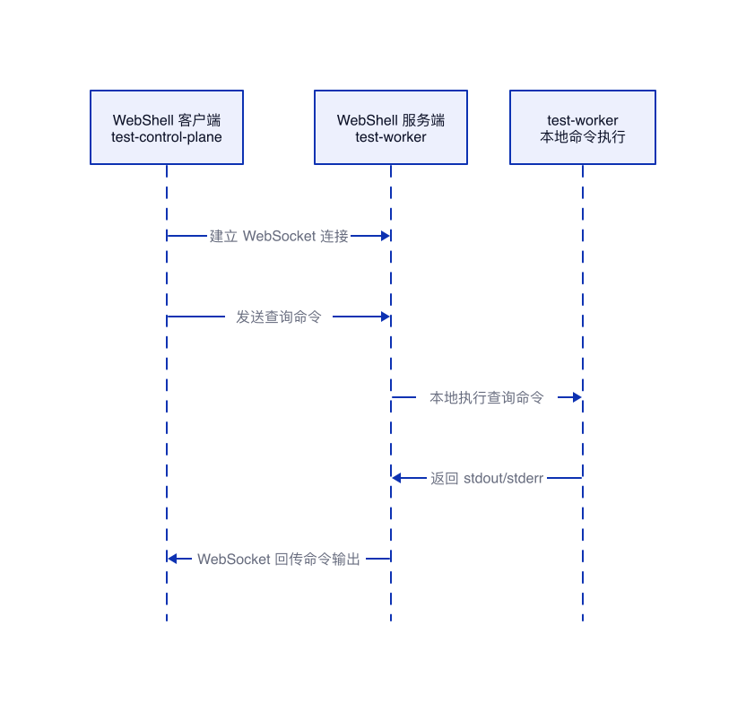
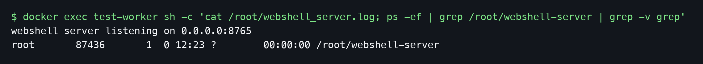
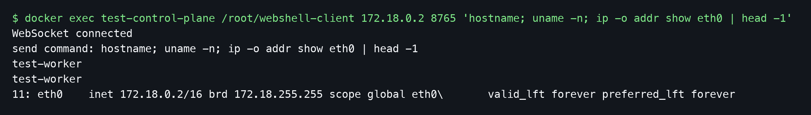

# WebShell 通过 WebSocket 跨节点执行命令

## 结论

本文要表达的模型是：WebShell 客户端部署在 `test-control-plane` 节点上，WebShell 服务端部署在 `test-worker` 节点上。两者之间通过 WebSocket 建立连接，跨节点的是这条 WebSocket 网络连接；命令执行发生在 `test-worker` 本地，由 WebShell 服务端执行查询命令，并把 stdout、stderr 等结果通过 WebSocket 回传给客户端。

这里的 WebShell 和浏览器无关，`Web` 强调的是 WebSocket 这类协议和技术栈。客户端可以是浏览器，也可以是 CLI 工具、脚本程序或服务端进程。本文本地验证没有使用集群命令执行链路，也没有创建任何工作负载资源；kind `test` 只用来提供 `test-control-plane` 和 `test-worker` 这两个互通的节点环境。

## 本地验证环境

| 项目 | 值 |
|---|---|
| 节点环境 | kind `test` 提供的两个节点容器 |
| WebShell 客户端位置 | `test-control-plane` |
| WebShell 服务端位置 | `test-worker` |
| 通信协议 | WebSocket |
| 服务端执行方式 | 在 `test-worker` 本地执行查询命令 |
| 验证动作 | 客户端通过 WebSocket 发送查询命令，服务端本地执行后回传结果 |

## 跨节点执行链路


1. WebShell 服务端在 `test-worker` 上以普通进程方式启动并监听 WebSocket 端口。
2. WebShell 客户端在 `test-control-plane` 上连接 `test-worker` 的 WebSocket 服务端。
3. 客户端通过 WebSocket 发送查询命令。
4. 服务端收到命令后，在 `test-worker` 本地执行查询。
5. 服务端把命令输出通过 WebSocket 回传给客户端。

## 验证代码

下面的代码只用于说明验证链路：服务端监听 WebSocket 端口，收到客户端发送的命令后在本机执行，并把输出回传给客户端。代码使用 Go 语言实现，没有依赖 Kubernetes 资源。

服务端代码运行在 `test-worker`：

```go
package main

import (
    "bufio"
    "crypto/sha1"
    "encoding/base64"
    "encoding/binary"
    "fmt"
    "io"
    "net"
    "net/http"
    "os/exec"
    "strings"
    "time"
)

// WebSocket 协议规定的固定 Magic GUID。
// 它不是安全密钥，不能改、不能省略；服务端会把客户端传来的 Sec-WebSocket-Key
// 和这个固定字符串拼接后计算 SHA-1，再做 Base64 编码，生成 Sec-WebSocket-Accept。
const websocketGUID = "258EAFA5-E914-47DA-95CA-C5AB0DC85B11"

func readClientFrame(r *bufio.Reader) (string, error) {
    // WebSocket 帧前两个 byte 包含 FIN、opcode、mask 标记和基础 payload 长度。
    header := make([]byte, 2)
    if _, err := io.ReadFull(r, header); err != nil {
        return "", err
    }

    // 低 7 位是长度标记：小于 126 表示真实长度；126/127 表示后面还有扩展长度字段。
    length := int(header[1] & 0x7f)
    switch length {
    case 126:
        ext := make([]byte, 2)
        if _, err := io.ReadFull(r, ext); err != nil {
            return "", err
        }
        length = int(binary.BigEndian.Uint16(ext))
    case 127:
        ext := make([]byte, 8)
        if _, err := io.ReadFull(r, ext); err != nil {
            return "", err
        }
        length = int(binary.BigEndian.Uint64(ext))
    }

    // 客户端发送到服务端的 WebSocket 帧必须带 mask，服务端要用这个 mask 还原原始 payload。
    mask := make([]byte, 4)
    if _, err := io.ReadFull(r, mask); err != nil {
        return "", err
    }
    payload := make([]byte, length)
    if _, err := io.ReadFull(r, payload); err != nil {
        return "", err
    }
    for i := range payload {
        payload[i] ^= mask[i%4]
    }
    return string(payload), nil
}

func writeTextFrame(w io.Writer, text string) error {
    // 服务端回包使用文本帧，0x81 表示 FIN=1 且 opcode=text。
    payload := []byte(text)
    header := []byte{0x81}

    // 根据 payload 长度选择普通长度、16 位扩展长度或 64 位扩展长度。
    switch {
    case len(payload) < 126:
        header = append(header, byte(len(payload)))
    case len(payload) <= 65535:
        header = append(header, 126, byte(len(payload)>>8), byte(len(payload)))
    default:
        header = append(header, 127)
        ext := make([]byte, 8)
        binary.BigEndian.PutUint64(ext, uint64(len(payload)))
        header = append(header, ext...)
    }

    // 服务端到客户端的帧不需要 mask，直接写 header 和 payload。
    if _, err := w.Write(header); err != nil {
        return err
    }
    _, err := w.Write(payload)
    return err
}

func handle(conn net.Conn) {
    defer conn.Close()

    // 先读取 HTTP Upgrade 请求。WebSocket 建连的第一步仍然是一个 HTTP 请求。
    reader := bufio.NewReader(conn)
    req, err := http.ReadRequest(reader)
    if err != nil {
        return
    }

    // 根据客户端的 Sec-WebSocket-Key 计算 Sec-WebSocket-Accept，完成协议升级握手。
    key := req.Header.Get("Sec-WebSocket-Key")
    sum := sha1.Sum([]byte(key + websocketGUID))
    accept := base64.StdEncoding.EncodeToString(sum[:])
    response := "HTTP/1.1 101 Switching Protocols\r\n" +
        "Upgrade: websocket\r\n" +
        "Connection: Upgrade\r\n" +
        "Sec-WebSocket-Accept: " + accept + "\r\n\r\n"
    if _, err := conn.Write([]byte(response)); err != nil {
        return
    }

    // 握手成功后读取客户端发来的命令文本帧。
    command, err := readClientFrame(reader)
    if err != nil {
        return
    }
    command = strings.TrimSpace(command)

    // 在 WebShell 服务端所在节点本地执行命令；这里用 sh -c 是为了支持管道等 shell 语法。
    cmd := exec.Command("sh", "-c", command)
    output, err := cmd.CombinedOutput()
    result := string(output)
    if err != nil {
        // 命令执行失败时也把错误信息回传给客户端，避免客户端只看到空输出。
        result += fmt.Sprintf("command failed: %v\n", err)
    }

    // 把命令输出封装成 WebSocket 文本帧回传给客户端。
    _ = writeTextFrame(conn, result)
}

func main() {
    // 服务端监听所有网卡，方便 test-control-plane 跨节点连接 test-worker。
    ln, err := net.Listen("tcp", "0.0.0.0:8765")
    if err != nil {
        panic(err)
    }
    fmt.Println("webshell server listening on 0.0.0.0:8765")

    // 每个连接用一个 goroutine 处理，避免单个连接阻塞后续连接。
    for {
        conn, err := ln.Accept()
        if err != nil {
            time.Sleep(100 * time.Millisecond)
            continue
        }
        go handle(conn)
    }
}
```

客户端代码运行在 `test-control-plane`：

```go
package main

import (
    "bufio"
    "crypto/rand"
    "encoding/base64"
    "encoding/binary"
    "fmt"
    "io"
    "net"
    "net/http"
    "os"
    "strings"
)

func writeClientFrame(w io.Writer, text string) error {
    // 客户端发送文本帧，0x81 表示 FIN=1 且 opcode=text。
    payload := []byte(text)

    // WebSocket 协议要求客户端发往服务端的帧必须带 mask。
    mask := make([]byte, 4)
    if _, err := rand.Read(mask); err != nil {
        return err
    }

    // 第二个 byte 最高位设置为 1 表示带 mask，低 7 位或扩展字段表示 payload 长度。
    header := []byte{0x81}
    switch {
    case len(payload) < 126:
        header = append(header, 0x80|byte(len(payload)))
    case len(payload) <= 65535:
        header = append(header, 0x80|126, byte(len(payload)>>8), byte(len(payload)))
    default:
        header = append(header, 0x80|127)
        ext := make([]byte, 8)
        binary.BigEndian.PutUint64(ext, uint64(len(payload)))
        header = append(header, ext...)
    }

    // 用 4 byte mask 对 payload 做异或，服务端收到后会用同一个 mask 还原。
    masked := make([]byte, len(payload))
    for i := range payload {
        masked[i] = payload[i] ^ mask[i%4]
    }

    // 写入顺序必须是 header、mask、masked payload。
    if _, err := w.Write(header); err != nil {
        return err
    }
    if _, err := w.Write(mask); err != nil {
        return err
    }
    _, err := w.Write(masked)
    return err
}

func readServerFrame(r *bufio.Reader) (string, error) {
    // 服务端返回的文本帧不带 mask，只需要解析长度后直接读取 payload。
    header := make([]byte, 2)
    if _, err := io.ReadFull(r, header); err != nil {
        return "", err
    }
    length := int(header[1] & 0x7f)
    switch length {
    case 126:
        ext := make([]byte, 2)
        if _, err := io.ReadFull(r, ext); err != nil {
            return "", err
        }
        length = int(binary.BigEndian.Uint16(ext))
    case 127:
        ext := make([]byte, 8)
        if _, err := io.ReadFull(r, ext); err != nil {
            return "", err
        }
        length = int(binary.BigEndian.Uint64(ext))
    }
    payload := make([]byte, length)
    if _, err := io.ReadFull(r, payload); err != nil {
        return "", err
    }
    return string(payload), nil
}

func main() {
    // 参数格式：webshell-client <server-ip> <server-port> <command>
    if len(os.Args) < 4 {
        fmt.Println("usage: webshell-client <server-ip> <server-port> <command>")
        os.Exit(1)
    }
    host := os.Args[1]
    port := os.Args[2]
    command := strings.Join(os.Args[3:], " ")

    // 直接用 TCP 连接服务端，后续手动完成 WebSocket 握手和帧收发。
    conn, err := net.Dial("tcp", net.JoinHostPort(host, port))
    if err != nil {
        panic(err)
    }
    defer conn.Close()

    // 生成 Sec-WebSocket-Key，用于发起 WebSocket Upgrade 握手。
    keyBytes := make([]byte, 16)
    if _, err := rand.Read(keyBytes); err != nil {
        panic(err)
    }
    key := base64.StdEncoding.EncodeToString(keyBytes)

    // 构造最小 WebSocket 握手请求。
    request := "GET /webshell HTTP/1.1\r\n" +
        "Host: " + net.JoinHostPort(host, port) + "\r\n" +
        "Upgrade: websocket\r\n" +
        "Connection: Upgrade\r\n" +
        "Sec-WebSocket-Key: " + key + "\r\n" +
        "Sec-WebSocket-Version: 13\r\n\r\n"
    if _, err := conn.Write([]byte(request)); err != nil {
        panic(err)
    }

    // 读取服务端 101 Switching Protocols 响应，确认协议升级成功。
    reader := bufio.NewReader(conn)
    resp, err := http.ReadResponse(reader, nil)
    if err != nil {
        panic(err)
    }
    if resp.StatusCode != http.StatusSwitchingProtocols {
        panic(resp.Status)
    }

    // 握手成功后发送命令，并等待服务端回传本地执行结果。
    fmt.Println("WebSocket connected")
    fmt.Println("send command: " + command)
    if err := writeClientFrame(conn, command); err != nil {
        panic(err)
    }
    result, err := readServerFrame(reader)
    if err != nil {
        panic(err)
    }
    fmt.Print(result)
}
```

## Magic GUID 的含义

`258EAFA5-E914-47DA-95CA-C5AB0DC85B11` 是 WebSocket 协议规定的固定 Magic GUID，所有 WebSocket 实现都使用同一个值。握手时，服务端会把客户端请求头里的 `Sec-WebSocket-Key` 和这个 GUID 拼接，先计算 SHA-1，再做 Base64 编码，得到 `Sec-WebSocket-Accept` 返回给客户端校验。

这个值的作用是确认双方确实在按 WebSocket 协议完成升级握手，避免普通 HTTP 请求或缓存代理被误判成 WebSocket 连接。它不是安全密钥，不能改，也不能省略，否则握手会失败。如果使用现成 WebSocket 库，这段计算会被库封装起来，代码里看不到这个常量，但库实现中仍然使用同一个固定值。

## 启动 WebShell 服务端

WebShell 服务端直接在 `test-worker` 节点上运行，不通过 Kubernetes 部署：

```bash
docker exec test-worker sh -c 'cat /root/webshell_server.log; ps -ef | grep /root/webshell-server | grep -v grep'
```

验证结果显示，服务端普通进程已经运行在 `test-worker` 节点上：


## 从 test-control-plane 连接 test-worker 执行查询

WebShell 客户端在 `test-control-plane` 上发起 WebSocket 连接，目标地址是 `test-worker` 的节点 IP 和服务端监听端口：

```bash
docker exec test-control-plane /root/webshell-client 172.18.0.2 8765 'hostname; uname -n; ip -o addr show eth0 | head -1'
```

验证结果显示，客户端收到的主机名和网卡地址都来自 `test-worker`，说明查询命令是在 `test-worker` 本地执行后通过 WebSocket 回传的：


## 和 WebSocket 的关系

WebShell 需要持续交互，不能按普通 HTTP 请求一次返回全部结果。WebSocket 适合承载这种双向、持续的流式数据，因此客户端看到的是一个在线终端，服务端侧负责接收命令、执行命令并回传结果。

浏览器只是最常见的 WebShell 载体，因为它内置了 WebSocket API，方便直接做成网页终端。但这条链路不依赖浏览器，只要客户端能建立 WebSocket 连接并按约定发送命令，就可以发起同样的跨节点查询。
