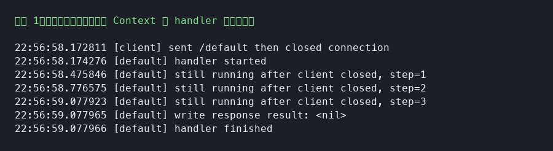

# Go HTTP 客户端断开后服务端行为

## 结论

Go 的 `net/http` 服务端在客户端断开连接后，当前请求对应的 handler 默认不会被强制停止。只要 handler 代码还在执行，它就会继续运行，直到自己返回、进程退出，或者业务代码主动监听取消信号并结束。

客户端断开连接后，Go 会取消请求的 `Context`。服务端可以通过 `r.Context().Done()` 感知请求取消，并主动停止后续处理。

## 默认行为：handler 不会自动停止

如果 handler 里有长时间计算、循环、等待、数据库查询或远程调用，而代码没有检查 `r.Context()`，客户端断开后这些逻辑仍然可能继续执行。

```go
func handler(w http.ResponseWriter, r *http.Request) {
    // 模拟耗时逻辑；客户端断开不会自动中断 Sleep。
    time.Sleep(10 * time.Minute)

    // 到真正写响应时，才可能发现连接已经断开。
    _, _ = w.Write([]byte("done"))
}
```

这种情况下，服务端可能继续占用 goroutine、CPU、内存、数据库连接或下游服务资源。最后写响应时，可能出现 `broken pipe`、`connection reset by peer` 等错误，也可能因为响应很小或连接状态变化而没有明显错误。

## 推荐做法：监听请求 Context

长时间运行的逻辑应该接收并传递 `context.Context`，在关键步骤之间检查取消信号。

```go
func handler(w http.ResponseWriter, r *http.Request) {
    // 请求 Context 会在客户端断开、请求取消、服务端超时等场景下被取消。
    ctx := r.Context()

    for {
        select {
        case <-ctx.Done():
            // 感知到客户端断开或请求取消，及时退出，避免继续浪费资源。
            log.Println("request canceled:", ctx.Err())
            return
        default:
            // 执行业务逻辑；实际代码中应避免 default 分支形成空转。
            doSomeWork()
        }
    }
}
```

更常见的方式是把 `ctx` 传给每个耗时步骤，并在步骤内部响应取消。

```go
func handler(w http.ResponseWriter, r *http.Request) {
    // 从请求中取出 Context，并向下游逻辑传递。
    ctx := r.Context()

    // 每个步骤都应该支持 Context 取消。
    if err := step1(ctx); err != nil {
        return
    }
    if err := step2(ctx); err != nil {
        return
    }
    if err := step3(ctx); err != nil {
        return
    }

    // 只有确认业务处理完成后再写响应。
    _, _ = w.Write([]byte("done"))
}
```

## Context 取消时机

请求的 `Context` 会在客户端主动断开连接时取消，例如客户端关闭 TCP 连接、发送 TCP RST，或者请求连接被提前关闭。服务端调用 `http.Server.Shutdown` 时，也会关闭服务端并取消仍在处理中的请求上下文。

客户端长时间不响应，不等于请求 `Context` 一定会自动取消。Go 不会因为业务处理时间过长就自动取消当前请求。需要限制单个请求的最大处理时间时，应由业务代码显式使用 `context.WithTimeout` 或 `context.WithDeadline`。

```go
func handler(w http.ResponseWriter, r *http.Request) {
    // 基于请求 Context 派生一个带超时的 Context。
    // 客户端断开时，父 Context 会取消；超过 2 秒时，派生 Context 也会取消。
    ctx, cancel := context.WithTimeout(r.Context(), 2*time.Second)
    defer cancel()

    select {
    case <-ctx.Done():
        // 可能是客户端断开，也可能是业务设置的超时到期。
        log.Println("request stopped:", ctx.Err())
        return
    case result := <-doSlowWork(ctx):
        // 业务在超时时间内完成后，正常写响应。
        _, _ = w.Write([]byte(result))
    }
}
```

### 使用 `context.WithoutCancel` 保留后台任务

`context.WithoutCancel` 是 Go 1.21 新增的 API。它用于创建一个不受父 `Context` 取消影响的派生 `Context`。父 `Context` 被取消时，通过 `context.WithoutCancel` 派生出来的 `Context` 不会被取消。

典型场景是 HTTP handler 收到请求后，需要把某些任务交给后台 goroutine 继续处理。即使客户端断开，请求 `Context` 被取消，后台任务也可以继续执行。

```go
func handler(w http.ResponseWriter, r *http.Request) {
    // 请求 Context 会随着客户端断开而取消。
    reqCtx := r.Context()

    // Go 1.21 新增：创建一个不受 reqCtx 取消影响的 Context。
    // 客户端断开导致 reqCtx 取消时，backgroundCtx 不会被取消。
    backgroundCtx := context.WithoutCancel(reqCtx)

    go func() {
        // 后台任务继续执行，不受客户端断开影响。
        // 如果后台任务也需要超时控制，应在这里再显式设置 WithTimeout 或 WithDeadline。
        ctx, cancel := context.WithTimeout(backgroundCtx, 30*time.Second)
        defer cancel()

        if err := runBackgroundJob(ctx); err != nil {
            log.Println("background job failed:", err)
            return
        }
    }()

    // handler 可以尽快返回，后台任务由 goroutine 继续处理。
    _, _ = w.Write([]byte("accepted"))
}
```

## 本地验证

验证程序使用本地 HTTP Server，并用 TCP 客户端发送请求后立即关闭连接。验证结果分为两个 handler：`/default` 不监听 `r.Context()`，`/context` 监听 `r.Context().Done()`。

验证代码如下：

```go
package main

import (
    "context"
    "fmt"
    "log"
    "net"
    "net/http"
    "strings"
    "sync"
    "time"
)

func main() {
    // 只打印微秒时间，方便观察执行顺序。
    log.SetFlags(log.Lmicroseconds)

    var wg sync.WaitGroup
    mux := http.NewServeMux()

    mux.HandleFunc("/default", func(w http.ResponseWriter, r *http.Request) {
        defer wg.Done()
        log.Println("[default] handler started")

        // 不检查 r.Context()，即使客户端已经断开，循环仍会继续执行。
        for i := 1; i <= 3; i++ {
            time.Sleep(300 * time.Millisecond)
            log.Printf("[default] still running after client closed, step=%d", i)
        }

        // 写响应时才可能观察到连接断开的影响。
        _, err := w.Write([]byte("done"))
        log.Printf("[default] write response result: %v", err)
        log.Println("[default] handler finished")
    })

    mux.HandleFunc("/context", func(w http.ResponseWriter, r *http.Request) {
        defer wg.Done()
        log.Println("[context] handler started")

        select {
        case <-r.Context().Done():
            // 客户端断开后，请求 Context 被取消，handler 可以提前退出。
            log.Printf("[context] request context canceled: %v", r.Context().Err())
            log.Println("[context] handler stopped early")
            return
        case <-time.After(2 * time.Second):
            _, _ = w.Write([]byte("done"))
        }
    })

    srv := &http.Server{Handler: mux}
    ln, err := net.Listen("tcp", "127.0.0.1:0")
    if err != nil {
        log.Fatal(err)
    }

    go func() {
        if err := srv.Serve(ln); err != nil && err != http.ErrServerClosed {
            log.Fatal(err)
        }
    }()

    addr := ln.Addr().String()

    wg.Add(1)
    closeAfterRequest(addr, "/default")
    wg.Wait()

    wg.Add(1)
    closeAfterRequest(addr, "/context")
    wg.Wait()

    _ = srv.Shutdown(context.Background())
}

func closeAfterRequest(addr, path string) {
    // 直接使用 TCP 连接，发送 HTTP 请求后立即关闭，模拟客户端断开。
    conn, err := net.Dial("tcp", addr)
    if err != nil {
        log.Fatal(err)
    }

    req := fmt.Sprintf("GET %s HTTP/1.1\r\nHost: %s\r\nConnection: close\r\n\r\n", path, addr)
    _, _ = conn.Write([]byte(req))
    log.Printf("[client] sent %s then closed connection", path)
    _ = conn.Close()

    if !strings.HasPrefix(path, "/") {
        log.Fatal("invalid path")
    }
}
```

### 验证 1：客户端断开后，handler 默认继续运行

`/default` handler 没有监听 `r.Context()`。客户端发送请求后立即关闭连接，但日志显示 handler 仍然继续执行了 3 个步骤，并最终走到写响应逻辑。



### 验证 2：监听 `r.Context().Done()` 可以感知断开

`/context` handler 监听 `r.Context().Done()`。客户端断开后，handler 立即收到 `context canceled`，并提前返回。


## 实践建议

所有可能耗时的服务端逻辑都应传递 `context.Context`。数据库查询、RPC 调用、外部 HTTP 请求、队列消费、文件处理、CPU 密集型循环等逻辑，都应该支持取消。客户端断开后，服务端应尽快停止无意义的处理，释放资源。
