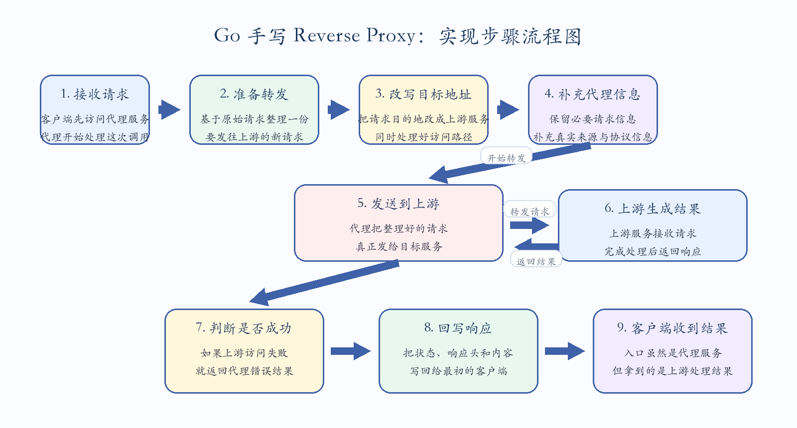
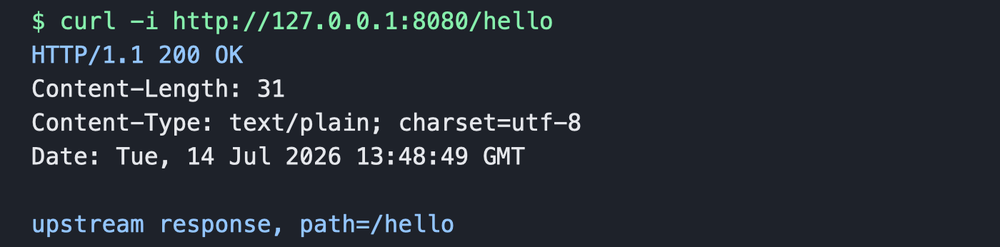

# Go 自己实现 Reverse Proxy

Reverse Proxy 的核心作用，是在服务端接收客户端请求，再由代理程序把请求转发给上游服务，并将上游返回的响应再转回给客户端。对调用方来说，它访问的是代理地址；对上游来说，请求像是由代理发起的。实际项目里，反向代理通常会承担统一入口、路由转发、鉴权、灰度、限流、观测以及隐藏内部服务地址等职责。

自己实现一个简化版 Reverse Proxy，可以把它拆成四件事来看。第一，复制并改写入站请求，准备发给目标服务。第二，决定目标地址，也就是把原始请求的 `Scheme`、`Host`、`Path` 等信息改成上游服务需要的样子。第三，补充或透传常见代理头，比如 `X-Forwarded-For`、`X-Forwarded-Host` 和 `X-Forwarded-Proto`，这样上游可以知道真实来源。第四，把上游响应的状态码、响应头和响应体原样写回给客户端。

如果只看数据流，过程其实很直接：客户端先请求代理服务，代理服务基于原请求构造一个新的出站请求，然后用 `http.Transport` 发到上游，再把上游返回的结果回写给客户端。这里最容易出错的点，通常有三个：一是请求头复制不完整，导致鉴权、Cookie 或内容类型丢失；二是 URL 拼接不正确，尤其是 `Path` 和 `RawQuery` 处理不当；三是没有正确处理超时、连接复用和错误返回。

下面给一个完整可运行的示例。这个示例不依赖 `httputil.ReverseProxy`，而是直接使用标准库 `net/http` 手动实现转发逻辑，适合理解原理。

## 实现流程图

下面这张图把手写 Reverse Proxy 的核心实现步骤串起来了：



## 完整示例

```go
package main

import (
    "context"
    "fmt"
    "io"
    "log"
    "net"
    "net/http"
    "net/url"
    "strings"
    "time"
)

// ReverseProxy 保存反向代理运行时需要的核心依赖。
// target 表示固定的上游服务地址；transport 负责真正发起出站 HTTP 请求。
type ReverseProxy struct {
    target    *url.URL
    transport http.RoundTripper
}

// NewReverseProxy 根据传入的上游地址创建代理实例。
// rawTarget 需要包含 scheme 和 host，例如 http://127.0.0.1:9090。
func NewReverseProxy(rawTarget string) (*ReverseProxy, error) {
    // 先把字符串形式的上游地址解析成 url.URL，后续改写请求时会复用其中的 Scheme、Host、Path。
    target, err := url.Parse(rawTarget)
    if err != nil {
        return nil, err
    }

    // http.Transport 是 Go 标准库里负责连接池、拨号、TLS 握手、HTTP/2 等细节的组件。
    // 这里显式配置一组常见参数，方便理解生产实现里通常需要关注哪些点。
    transport := &http.Transport{
        // 允许读取 HTTP_PROXY、HTTPS_PROXY、NO_PROXY 等环境变量。
        Proxy: http.ProxyFromEnvironment,
        DialContext: (&net.Dialer{
            // 建立 TCP 连接的超时时间，避免上游不可达时长时间卡住。
            Timeout: 5 * time.Second,
            // TCP keepalive，用于维持长连接健康状态。
            KeepAlive: 30 * time.Second,
        }).DialContext,
        // 尽量开启 HTTP/2，标准库会在条件满足时自动使用。
        ForceAttemptHTTP2: true,
        // 全局最大空闲连接数，影响连接复用能力。
        MaxIdleConns: 100,
        // 空闲连接保留时间，超过后连接会被关闭。
        IdleConnTimeout: 90 * time.Second,
        // TLS 握手超时，只对 HTTPS 上游有意义。
        TLSHandshakeTimeout: 5 * time.Second,
        // 客户端发送 Expect: 100-continue 后等待服务端确认的时间。
        ExpectContinueTimeout: 1 * time.Second,
    }

    return &ReverseProxy{
        target:    target,
        transport: transport,
    }, nil
}

// ServeHTTP 让 ReverseProxy 实现 http.Handler 接口。
// 每个进入代理的请求，都会在这里被复制、改写、转发，并把上游响应写回客户端。
func (p *ReverseProxy) ServeHTTP(w http.ResponseWriter, r *http.Request) {
    // Clone 会复制请求对象，并保留 Body。这里不直接修改 r，避免污染入站请求本身。
    outReq := r.Clone(context.Background())

    // 把出站请求的 URL 从“代理地址”改成“上游地址”。
    rewriteRequestURL(outReq, p.target)

    // 复制原始请求头，例如 Authorization、Cookie、Content-Type 等。
    copyHeaders(outReq.Header, r.Header)

    // 设置代理常见的转发头，帮助上游识别真实客户端信息和原始协议。
    setForwardHeaders(outReq, r)

    // RoundTrip 只负责执行一次 HTTP 往返，不会像 http.Client 那样自动处理重定向。
    resp, err := p.transport.RoundTrip(outReq)
    if err != nil {
        // 上游连接失败、超时、DNS 解析失败等，都可以统一返回 502 Bad Gateway。
        http.Error(w, fmt.Sprintf("proxy request failed: %v", err), http.StatusBadGateway)
        return
    }
    defer resp.Body.Close()

    // 先复制响应头，再写状态码；因为 WriteHeader 后再改 Header 就不会生效。
    copyHeaders(w.Header(), resp.Header)
    w.WriteHeader(resp.StatusCode)

    // 流式复制响应体，避免把大响应一次性读入内存。
    if _, err := io.Copy(w, resp.Body); err != nil {
        log.Printf("copy response body failed: %v", err)
    }
}

// rewriteRequestURL 把原始请求 URL 改写到固定上游。
// 例如代理收到 /hello，上游是 http://127.0.0.1:9090/api，最终会转成 http://127.0.0.1:9090/api/hello。
func rewriteRequestURL(outReq *http.Request, target *url.URL) {
    // Scheme 和 Host 决定请求发往哪里，例如 http + 127.0.0.1:9090。
    outReq.URL.Scheme = target.Scheme
    outReq.URL.Host = target.Host

    // Host 头默认可能仍是客户端访问代理时的 Host，这里显式改成上游 Host。
    // 如果希望上游感知原始 Host，可通过 X-Forwarded-Host 传递。
    outReq.Host = target.Host

    // 去掉 target.Path 末尾的 /，以及请求 Path 开头的 /，避免拼接出双斜杠。
    targetPath := strings.TrimSuffix(target.Path, "/")
    requestPath := strings.TrimPrefix(outReq.URL.Path, "/")

    // 拼接上游基础路径和原始请求路径。
    switch {
    case targetPath == "":
        // 上游没有基础路径时，直接使用原始请求路径。
        outReq.URL.Path = "/" + requestPath
    case requestPath == "":
        // 原始请求访问根路径时，直接使用上游基础路径。
        outReq.URL.Path = targetPath
    default:
        // 两边都有路径时，用单个 / 连接。
        outReq.URL.Path = targetPath + "/" + requestPath
    }

    // 兜底保证 Path 不为空，否则某些上游或中间件可能处理不符合预期。
    if outReq.URL.Path == "" {
        outReq.URL.Path = "/"
    }
}

// setForwardHeaders 补充反向代理常见 Header。
// 这些 Header 不是 HTTP 强制标准，但在网关、负载均衡、应用服务里非常常见。
func setForwardHeaders(outReq *http.Request, inReq *http.Request) {
    // RemoteAddr 通常是 ip:port 形式，例如 127.0.0.1:54321。
    clientIP, _, err := net.SplitHostPort(inReq.RemoteAddr)
    if err == nil {
        // 如果请求已经经过上一层代理，X-Forwarded-For 里可能已有链路信息。
        prior := inReq.Header.Get("X-Forwarded-For")
        if prior != "" {
            // 追加当前客户端 IP，形成 client, proxy1, proxy2 的链路格式。
            clientIP = prior + ", " + clientIP
        }
        outReq.Header.Set("X-Forwarded-For", clientIP)
    }

    // 保存客户端访问代理时使用的 Host。
    outReq.Header.Set("X-Forwarded-Host", inReq.Host)

    // 根据入站请求是否走 TLS，记录原始协议。
    if inReq.TLS != nil {
        outReq.Header.Set("X-Forwarded-Proto", "https")
    } else {
        outReq.Header.Set("X-Forwarded-Proto", "http")
    }

    // 客户端请求里 RequestURI 可以是 /path?query，服务端入站请求会带这个字段。
    // 但作为客户端出站请求时，Go 要求 RequestURI 为空，否则 RoundTrip 会报错。
    outReq.RequestURI = ""
}

// copyHeaders 将 src 中的 Header 完整复制到 dst。
// 使用 Del + Add 可以避免目标 Header 中残留旧值，同时保留同名 Header 的多个值。
func copyHeaders(dst, src http.Header) {
    for k, vv := range src {
        dst.Del(k)
        for _, v := range vv {
            dst.Add(k, v)
        }
    }
}

func main() {
    // 固定把所有代理请求转发到本机 9090 端口上的上游服务。
    proxy, err := NewReverseProxy("http://127.0.0.1:9090")
    if err != nil {
        log.Fatalf("create proxy failed: %v", err)
    }

    // 使用 ServeMux 注册路由。这里 / 会匹配所有路径。
    mux := http.NewServeMux()
    mux.Handle("/", proxy)

    // 代理服务监听 8080；客户端访问 8080，代理再转发到 9090。
    log.Println("reverse proxy listening on :8080, upstream is http://127.0.0.1:9090")
    if err := http.ListenAndServe(":8080", mux); err != nil {
        log.Fatalf("proxy server failed: %v", err)
    }
}
```

## 怎么运行

先启动一个上游服务，例如：

```go
package main

import (
    "fmt"
    "log"
    "net/http"
)

func main() {
    http.HandleFunc("/hello", func(w http.ResponseWriter, r *http.Request) {
        fmt.Fprintf(w, "upstream response, path=%s\n", r.URL.Path)
    })

    log.Println("upstream listening on :9090")
    log.Fatal(http.ListenAndServe(":9090", nil))
}
```

分别保存为 `upstream.go` 和 `proxy.go` 后，可以直接运行：

```bash
# 先启动上游服务，占用 9090 端口；这个终端需要保持运行。
go run upstream.go
```

```bash
# 再打开另一个终端启动代理服务，占用 8080 端口，并把请求转发到 9090。
go run proxy.go
```

然后访问：

```bash
# 客户端访问的是代理服务 8080；代理会把 /hello 转发给上游服务 9090。
curl http://127.0.0.1:8080/hello
```

如果一切正常，会看到上游服务返回的内容，但入口地址是代理服务的 `:8080`。

实际运行验证结果如下：可以看到代理服务监听在 `:8080`，上游服务监听在 `:9090`，通过代理访问 `/hello` 后，上游正常返回了 `path=/hello`。




## 这个实现的关键点

这个版本的实现，重点是把标准库里隐藏的几个动作手动展开了。`r.Clone` 用来基于原请求复制出一个新的请求对象，避免直接修改入站请求。`rewriteRequestURL` 负责把请求改写到目标上游。`RoundTrip` 负责真正把请求发出去。最后通过 `io.Copy` 把响应体流式写回客户端，这样不会一次性把整个响应读进内存。

从工程角度看，这个版本已经能说明 Reverse Proxy 的基本机制，但还不是生产级实现。真实场景里通常还会继续补充这些能力：比如更细的超时控制、重试策略、连接池参数调优、WebSocket 或 SSE 透传、对跳转和压缩头的兼容、按路由转发到不同上游，以及更完整的错误日志和观测埋点。

## 和 `httputil.ReverseProxy` 的关系

标准库里的 `httputil.ReverseProxy`，本质上也是在做同一件事，只是把请求改写、Header 处理、错误处理、响应拷贝这些细节都封装好了。自己手写一次的价值，不是为了替代标准库，而是为了真正理解它内部在做什么。理解了这版最小实现，再去看 `httputil.ReverseProxy` 的 `Director`、`Rewrite`、`Transport`、`ModifyResponse` 等扩展点，会更容易把它用对。
