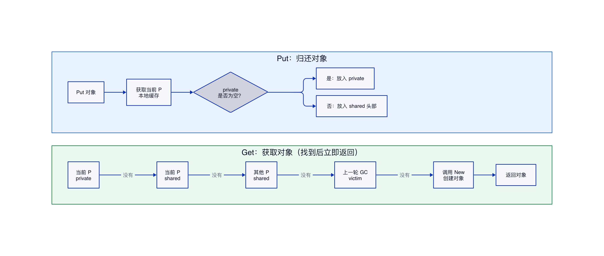

# Go sync.Pool 实现原理

## 结论

`sync.Pool` 用来临时保存可以重复使用的对象。对象使用结束后放回池中，下次需要时优先复用，从而减少内存分配和垃圾回收压力。

它不是可靠的对象仓库。Go 可以在垃圾回收时清理池中的对象，因此只能存放“丢了也能重新创建”的临时对象，例如 `bytes.Buffer`、编码缓冲区和请求处理过程中的临时结构。

本文结合 Go 1.22.4 的实现说明其工作原理。核心机制是：每个 P 优先使用自己的本地缓存，本地没有对象时再从其他 P 获取；GC 到来时，当前缓存会进入一轮备用区，长期未使用的对象最终被清理。

## 简单类比

可以把 `sync.Pool` 想象成办公区的公共雨伞架。

下雨时先从雨伞架取一把伞；架子上没有，就拿一把新伞。使用结束后把伞放回去，下一位同事可以继续使用。

为了避免所有人挤在同一个架子前，每个办公区都有自己的小雨伞架。自己区域没有伞时，才去其他区域寻找。保洁人员会定期清理长期没人使用的伞，所以不能把重要的私人物品存放在这里。

## 简单例子

下面使用 `sync.Pool` 复用 `bytes.Buffer`：

```go
package main

import (
    "bytes"
    "fmt"
    "sync"
)

var bufferPool = sync.Pool{
    // 池中没有可用对象时，创建一个新的 Buffer。
    New: func() any {
        fmt.Println("创建新的 Buffer")
        return new(bytes.Buffer)
    },
}

func main() {
    // 第一次获取时池中没有对象，会调用 New。
    buf := bufferPool.Get().(*bytes.Buffer)
    buf.WriteString("hello")
    fmt.Println(buf.String())

    // 清除内容后放回池中。
    buf.Reset()
    bufferPool.Put(buf)

    // 再次获取时可以复用前面的 Buffer。
    buf2 := bufferPool.Get().(*bytes.Buffer)
    buf2.WriteString("world")
    fmt.Println(buf2.String())

    buf2.Reset()
    bufferPool.Put(buf2)
}
```

在本机 Go 1.22.4 环境中实际运行，输出如下：

```text
创建新的 Buffer
hello
world
```

本次运行只创建了一次 `Buffer`，第二次 `Get()` 复用了之前放回的对象。不过，业务代码不能依赖每次都能取回同一个对象，因为 Go 有权清理池中的内容。

## 核心流程



### Put：归还对象

调用 `Put(x)` 时，`sync.Pool` 先找到当前 P 对应的本地缓存。如果最快的 `private` 位置为空，就直接把对象放进去；如果已经有对象，则放入 `shared` 队列。

P 是 Go 调度器中负责运行 Go 代码的处理单元，可以简单理解为一个执行区域。每个 P 都有自己的本地缓存，因此多个 goroutine 大多数时候不需要争抢同一个全局队列。

| 存放位置 | 特点 | 作用 |
|---|---|---|
| `private` | 当前 P 独享，只放一个对象 | 提供最快的获取和归还路径 |
| `shared` | 当前 P 和其他 P 都能取 | 保存更多可复用对象 |

### Get：获取对象

调用 `Get()` 时，查找顺序如下：

| 顺序 | 查找位置 | 简单理解 |
|---|---|---|
| 1 | 当前 P 的 `private` | 先拿自己手边的对象 |
| 2 | 当前 P 的 `shared` | 再找自己区域的公共缓存 |
| 3 | 其他 P 的 `shared` | 自己没有时去其他区域取 |
| 4 | `victim` 缓存 | 查找上一轮 GC 暂时保留的对象 |
| 5 | `Pool.New` | 全部没有时创建新对象 |
| 6 | 返回 `nil` | 没有对象且未配置 `New` |

当前 P 从自己的 `shared` 头部获取对象，其他 P 从队列尾部取对象。两边尽量操作不同位置，可以减少并发冲突。

### 为什么要暂时禁止抢占

一个 goroutine 运行过程中可能从 P0 切换到 P1。`sync.Pool` 访问本地缓存前，会短暂禁止当前 goroutine 被抢占，先确认当前 P 的编号，再访问对应缓存，操作结束后立即恢复。

这样可以避免 goroutine 已经切换到另一个 P，却仍然把旧 P 的缓存当成自己的本地缓存。这里的禁止抢占只持续很短时间，不是把 goroutine 永久绑定到线程。

### GC 如何处理池中对象

每次 GC 清理 `sync.Pool` 时，缓存会进行一次轮换：

| GC 前的内容 | GC 后的处理 |
|---|---|
| 旧的 `victim` | 丢弃 |
| 当前 `local` | 移动到新的 `victim` |
| 新的 `local` | 清空，后续使用时重新建立 |

`victim` 可以理解为上一轮 GC 留下的备用区。GC 后，本地缓存找不到对象时仍可以到这里查找。如果这些对象一直没有被再次使用，下一次 GC 时就会被丢弃。

因此，`sync.Pool` 可以提高对象复用率，但不会永久占住所有对象。

## 使用注意事项

### 取出后先重置状态

池中的对象可能带着上一次使用留下的数据。使用前应先清理：

```go
buf := bufferPool.Get().(*bytes.Buffer)
// 清除上一次使用留下的内容。
buf.Reset()
```

### Put 后不要继续使用

对象放回池中后，其他 goroutine 可能立即取走它。原调用方必须放弃该对象：

```go
bufferPool.Put(buf)

// 错误：buf 可能已经被其他 goroutine 获取。
// buf.WriteString("继续使用")
```

### 不要缓存异常大的对象

一次大请求可能让 `bytes.Buffer` 扩容到很大。可以设置容量上限，只归还大小合理的对象：

```go
// 避免池中暂时保留过大的底层内存。
if buf.Cap() <= 64*1024 {
    buf.Reset()
    bufferPool.Put(buf)
}
```

### 适用范围

| 适合 | 不适合 |
|---|---|
| `bytes.Buffer` | 数据库连接 |
| 编码、解码缓冲区 | 网络连接 |
| 请求处理中的临时对象 | 文件句柄 |
| 可随时重新创建的对象 | 必须归还或限制数量的资源 |

`sync.Pool` 是否真正提升性能，应通过 Benchmark 和 `allocs/op` 判断。对于创建成本很低，或者本来可以在栈上分配的对象，使用对象池反而会增加额外操作。
