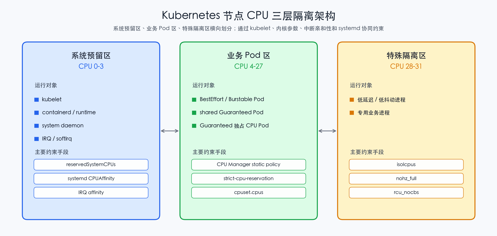

# Kubernetes 节点 CPU 三层隔离方案

本文整理一种面向 Kubernetes 节点的 CPU 隔离方案，用于把普通 Pod、操作系统系统进程、特殊低抖动进程尽量放到不同 CPU 区域运行。这里的“隔离”不是单一开关，而是 kubelet、Linux 内核启动参数、中断亲和性、systemd、cpuset 工具共同形成的约束体系。

> 说明：本文只讨论开源 Kubernetes、Linux cgroup、systemd、irqbalance、cset、tuna 等公开技术，不涉及任何私有平台实现。示例中的 CPU 编号仅用于说明，落地时需要结合机器 NUMA、SMT、网卡队列和业务压测结果调整。

## 1. 目标拆解

节点 CPU 隔离可以拆成三层目标。

第一层是 Pod CPU。普通业务 Pod 应尽量运行在业务 CPU 区，也就是 Kubernetes 可分配给工作负载的 CPU 集合。对 Guaranteed 且整数 CPU request 的 Pod，可以进一步通过 CPU Manager static policy 分配独占 CPU。

第二层是 OS 系统进程。kubelet、容器运行时、systemd 服务、日志采集、监控 agent、sshd、cron 等系统进程应集中运行在系统预留 CPU 区，避免和业务 Pod 抢占核心。

第三层是特殊进程 CPU。对延迟敏感、抖动敏感或需要独占调度环境的进程，可以放到更严格的隔离 CPU 区。该区域需要尽量避开普通 Pod、系统 daemon、中断、内核线程和 RCU callback。

一个常见的节点切分方式如下。

```text
# 示例：32 核节点 CPU 区域划分。
# CPU 0-3：系统预留区，运行 kubelet、容器运行时、系统 daemon 和大部分中断。
# CPU 4-27：普通业务区，运行 Kubernetes 普通 Pod。
# CPU 28-31：特殊隔离区，运行低延迟或抖动敏感进程。
SystemReservedCPUs = 0-3
PodCPUs            = 4-27
SpecialCPUs        = 28-31
```

这三个区域的边界分别由不同机制负责。kubelet 主要约束 Pod 的 cpuset；内核启动参数降低调度 tick、RCU callback 和普通调度对特殊 CPU 的影响；irqbalance 或手动 IRQ affinity 约束中断；systemd `CPUAffinity` 约束系统 daemon；cset 或 tuna 处理普通配置不容易覆盖的内核线程。

## 2. 总体架构图

下面用一个简化图说明 CPU 预留区、业务区和特殊隔离区的关系。



这张图表达的是控制面分工：kubelet 负责 Pod cpuset，systemd 负责用户态 daemon 亲和性，IRQ affinity 负责硬中断入口，内核启动参数和工具负责降低内核线程、调度 tick、RCU callback 对特殊 CPU 的影响。

## 3. kubelet 层：reservedSystemCPUs 与 strict-cpu-reservation

kubelet 层解决的是 Pod 不使用系统预留 CPU 的问题。核心配置是 `reservedSystemCPUs`、`cpuManagerPolicy: static` 和 `strict-cpu-reservation`。

```yaml
# kubelet 配置示例：把 CPU 0-3 作为系统预留区。
# 注意：字段名称和 feature gate 可用性需要按 Kubernetes 版本确认。
apiVersion: kubelet.config.k8s.io/v1beta1
kind: KubeletConfiguration

# 使用 static CPU Manager policy，允许 Guaranteed 整数 CPU Pod 获得独占 CPU。
cpuManagerPolicy: static

# 显式声明系统预留 CPU，通常用于 kubelet、容器运行时、系统 daemon 和中断。
reservedSystemCPUs: "0-3"

cpuManagerPolicyOptions:
  # 开启后，普通共享 Pod 的 defaultCPUSet 会排除 reservedSystemCPUs。
  strict-cpu-reservation: "true"
```

如果没有 `strict-cpu-reservation`，历史行为中 `reservedSystemCPUs` 主要影响独占 CPU 分配，普通共享 Pod 仍可能继承包含 reserved CPU 的 `defaultCPUSet`。开启 strict 后，CPU Manager static policy 在初始化 `defaultCPUSet` 时会从全部 CPU 中扣除 reserved CPU，使 BestEffort、Burstable、非整数 CPU request 的 Guaranteed Pod 也避开系统预留区。

切换该配置时要关注 CPU Manager checkpoint。旧 checkpoint 可能保留包含 reserved CPU 的 `defaultCPUSet`，开启 strict 后 kubelet 可能因为状态不变量不匹配而拒绝启动。生产环境建议先 drain 节点，再清理 `/var/lib/kubelet/cpu_manager_state`，最后重启 kubelet。

```bash
# 示例：查看 CPU Manager checkpoint，确认 defaultCPUSet 是否包含预留 CPU。
cat /var/lib/kubelet/cpu_manager_state

# 示例：在维护窗口清理旧 CPU Manager state。
# 执行前应先 drain 节点，避免影响正在运行的 Pod。
rm -f /var/lib/kubelet/cpu_manager_state

# 示例：重启 kubelet，使 CPU Manager 按新配置重新初始化 state。
systemctl restart kubelet
```

## 4. 内核层：isolcpus、nohz\_full 与 rcu\_nocbs

kubelet 只能约束 Pod 的 cgroup cpuset，不能自动阻止内核调度器、RCU callback、调度 tick 或内核线程干扰特殊 CPU。因此，如果要构造特殊低抖动 CPU 区，需要配合内核启动参数。

常见参数包括 `isolcpus`、`nohz_full` 和 `rcu_nocbs`。

```text
# GRUB 内核参数示例：把 CPU 28-31 作为特殊隔离区。
# isolcpus=domain,managed_irq,28-31：尽量从普通调度域隔离 CPU 28-31，并处理 managed IRQ 影响。
# nohz_full=28-31：让 CPU 28-31 在满足条件时进入 full dynticks，降低周期性调度 tick 干扰。
# rcu_nocbs=28-31：把 CPU 28-31 的 RCU callback offload 到其他 CPU。
GRUB_CMDLINE_LINUX="isolcpus=domain,managed_irq,28-31 nohz_full=28-31 rcu_nocbs=28-31"
```

不同发行版更新 GRUB 的命令略有区别。下面只是常见示例。

```bash
# 示例：生成新的 GRUB 配置，路径以实际发行版为准。
grub2-mkconfig -o /boot/grub2/grub.cfg

# 示例：重启后内核启动参数才会生效。
reboot

# 示例：确认当前内核启动参数包含 CPU 隔离配置。
cat /proc/cmdline
```

需要注意，`isolcpus` 不等于绝对隔离。它主要影响普通调度域，不会自动迁移所有已存在任务，也不会天然屏蔽所有中断或内核线程。`nohz_full` 对低抖动场景很有帮助，但 CPU 上仍可能因为系统调用、内核线程、RCU、perf event、调度负载等原因产生干扰。`rcu_nocbs` 可以降低 RCU callback 对隔离 CPU 的影响，但通常也需要结合线程亲和性和 IRQ 亲和性一起验证。

## 5. 中断层：irqbalance 与 IRQ affinity

中断是 CPU 隔离中最容易被忽略的噪声来源。即使 Pod 和进程都没有运行在特殊 CPU 上，网卡、磁盘、定时器或其他设备中断仍可能打到这些 CPU。

如果系统运行 irqbalance，可以通过配置让 irqbalance 避开某些 CPU。不同发行版的配置文件路径可能不同，常见位置是 `/etc/sysconfig/irqbalance` 或 `/etc/default/irqbalance`。

```bash
# 示例：禁止 irqbalance 把 IRQ 分配到 CPU 28-31。
# IRQBALANCE_BANNED_CPUS 使用十六进制 CPU mask，实际 mask 需要按 CPU 编号计算。
# 这里仅展示配置形式，不直接给出通用 mask，避免套用到不同 CPU 数量的机器。
IRQBALANCE_BANNED_CPUS=<hex-cpu-mask-for-28-31>

# 示例：重启 irqbalance，使配置生效。
systemctl restart irqbalance
```

对关键 IRQ，也可以手动设置 `smp_affinity_list`。这种方式更直接，适合网卡队列、中断数量明确且机器规模较固定的场景。

```bash
# 示例：查看系统中断分布，确认哪些 IRQ 在特殊 CPU 上有计数增长。
cat /proc/interrupts

# 示例：把某个 IRQ 绑定到 CPU 0-3，避免它运行在特殊隔离区。
# <irq-number> 需要替换为实际 IRQ 编号。
echo 0-3 > /proc/irq/<irq-number>/smp_affinity_list

# 示例：确认该 IRQ 的亲和性列表。
cat /proc/irq/<irq-number>/smp_affinity_list
```

如果网卡支持多队列，还需要结合队列数量、RSS、RPS/XPS 等配置统一设计。否则即使 IRQ 被移动，软中断或网络协议栈处理仍可能在非预期 CPU 上产生负载。

## 6. 系统 daemon 层：systemd CPUAffinity

kubelet 的 `reservedSystemCPUs` 并不会自动把系统 daemon 迁移到 reserved CPU。要让 kubelet、容器运行时和其他系统服务固定在系统预留区，需要使用 systemd 的 `CPUAffinity`。

可以通过 systemd drop-in 为服务设置 CPU affinity。

```ini
# 文件示例：/etc/systemd/system/kubelet.service.d/10-cpuaffinity.conf
# 作用：限制 kubelet 主要运行在系统预留 CPU 0-3。
[Service]
CPUAffinity=0 1 2 3
```

```ini
# 文件示例：/etc/systemd/system/containerd.service.d/10-cpuaffinity.conf
# 作用：限制 containerd 主要运行在系统预留 CPU 0-3。
[Service]
CPUAffinity=0 1 2 3
```

修改后需要 reload systemd 并重启对应服务。

```bash
# 示例：重新加载 systemd unit 配置。
systemctl daemon-reload

# 示例：重启 kubelet 和容器运行时，使 CPUAffinity 生效。
systemctl restart kubelet
systemctl restart containerd

# 示例：查看服务主进程 PID。
systemctl show kubelet -p MainPID

# 示例：查看进程 CPU affinity，确认是否限制在 0-3。
taskset -cp <pid>
```

如果希望对大量系统进程统一设置亲和性，可以考虑在系统层面设置默认 `CPUAffinity`，但需要谨慎评估影响。过度收缩系统进程 CPU 可能导致系统预留区过载，反而影响 kubelet 心跳、容器生命周期操作和节点稳定性。

## 7. 内核线程层：cset 与 tuna

某些内核线程不一定完全受 systemd 管理，可能仍然出现在特殊隔离 CPU 上。此时可以使用 `cset` 或 `tuna` 做进一步迁移。

`cset shield` 可以创建 shield cpuset，把普通任务移动到系统区，把特殊任务放入 shield 区。

```bash
# 示例：创建 shield，把 CPU 28-31 作为特殊隔离区，CPU 0-27 作为系统/普通区。
# --kthread=on 表示尝试同时移动可迁移的内核线程。
cset shield --cpu=28-31 --kthread=on

# 示例：把特殊进程放入 shield CPU 区运行。
# <command> 替换为实际要运行的特殊进程命令。
cset shield --exec -- <command>

# 示例：查看当前 cpuset shield 状态。
cset shield --status
```

`tuna` 更适合直接迁移线程和 IRQ。它可以把线程从某些 CPU 上移走，也可以把指定进程绑定到目标 CPU。

```bash
# 示例：把所有可迁移线程从 CPU 28-31 移走。
# 具体参数在不同发行版 tuna 版本中可能略有差异，使用前建议先查看 tuna --help。
tuna --cpus=28-31 --isolate

# 示例：把指定 PID 移动到 CPU 28-31。
# <pid> 需要替换为特殊进程的实际 PID。
tuna --threads=<pid> --cpus=28-31 --move

# 示例：查看线程调度和亲和性状态。
tuna --show_threads
```

需要注意，内核线程并非全部都能安全迁移。有些 per-cpu kthread 与 CPU 生命周期或内核子系统绑定，不能简单移动。实际落地时应先在测试环境观察 `/proc/interrupts`、`ps -eLo pid,tid,psr,comm`、`trace-cmd` 或 `perf sched` 的结果，再决定迁移策略。

## 8. 各手段隔离效果对比

| 隔离手段                      | 主要控制对象                              | 能解决的问题                            | 不能解决的问题                          | 推荐用途             |
| ------------------------- | ----------------------------------- | --------------------------------- | -------------------------------- | ---------------- |
| `reservedSystemCPUs`      | kubelet CPU Manager reserved CPU 集合 | 为系统侧预留 CPU，影响独占 CPU 分配            | 历史行为下普通共享 Pod 仍可能使用 reserved CPU | 基础 CPU 预留配置      |
| `strict-cpu-reservation`  | kubelet `defaultCPUSet`             | 让普通共享 Pod 也避开 reserved CPU        | 不迁移系统 daemon、中断和内核线程             | Pod 与系统预留区隔离     |
| CPU Manager static policy | Guaranteed 整数 CPU Pod               | 为符合条件的 Pod 分配独占 CPU               | 不处理 BestEffort/Burstable 的资源保证   | 高性能 Pod 独占 CPU   |
| `isolcpus`                | Linux 普通调度域                         | 降低普通调度器把任务放到隔离 CPU 的概率            | 不自动屏蔽所有中断和内核线程                   | 特殊 CPU 初步隔离      |
| `nohz_full`               | 调度 tick                             | 降低隔离 CPU 上周期性 tick 干扰             | CPU 上仍可能因内核活动产生 tick             | 低延迟和低抖动场景        |
| `rcu_nocbs`               | RCU callback                        | 把 RCU callback 从指定 CPU offload 出去 | 不处理普通进程、中断和其他 kthread            | 配合 nohz\_full 使用 |
| irqbalance 配置             | 设备 IRQ 分布                           | 避免 irqbalance 把中断分配到特殊 CPU        | 配置错误时可能导致中断集中或性能下降               | 自动化管理多数 IRQ      |
| 手动 IRQ affinity           | 指定 IRQ                              | 精确控制关键中断运行 CPU                    | 机器差异大，维护成本高                      | 网卡队列、存储中断精细绑定    |
| systemd `CPUAffinity`     | systemd 管理的 daemon                  | 把 kubelet、容器运行时等固定到系统预留 CPU       | 不覆盖所有内核线程和非 systemd 启动进程         | 系统 daemon 隔离     |
| `cset` / `tuna`           | 进程、线程、部分 kthread、IRQ                | 迁移难以通过 kubelet/systemd 管理的执行流     | 部分 per-cpu kthread 不能迁移          | 特殊进程低抖动补强        |

这张表的核心结论是：CPU 隔离需要分层做。kubelet 层只能解决 Pod cpuset；内核层降低调度和 RCU 噪声；中断层处理 IRQ；systemd 层处理系统 daemon；cset/tuna 处理剩余线程和特殊进程放置。

## 9. 推荐落地顺序

建议按从低风险到高约束的顺序推进。

1. 先做 CPU 拓扑规划，明确系统预留区、普通 Pod 区、特殊隔离区。
2. 配置 `cpuManagerPolicy: static`、`reservedSystemCPUs` 和 `strict-cpu-reservation`，确保普通 Pod 不进入系统预留区。
3. 使用 systemd `CPUAffinity` 把 kubelet、容器运行时和关键系统 daemon 放到系统预留区。
4. 调整 irqbalance 或手动 IRQ affinity，避免关键中断进入特殊隔离区。
5. 对特殊隔离区增加 `isolcpus`、`nohz_full` 和 `rcu_nocbs`。
6. 使用 cset 或 tuna 处理残留线程、内核线程和特殊进程放置。
7. 通过 cgroup、进程 affinity、中断计数和延迟指标持续验证。

验证时可以重点看以下信息。

```bash
# 示例：查看 CPU Manager 记录的 defaultCPUSet 和独占 CPU assignment。
cat /var/lib/kubelet/cpu_manager_state

# 示例：查看容器 cgroup 实际生效的 CPU 集合，cgroup v2 下优先看 effective 文件。
cat /sys/fs/cgroup/<container-cgroup-path>/cpuset.cpus.effective

# 示例：查看进程实际 CPU affinity。
taskset -cp <pid>

# 示例：查看中断是否仍打到特殊隔离 CPU。
cat /proc/interrupts

# 示例：查看线程当前运行 CPU，PSR 列表示最近运行 CPU。
ps -eLo pid,tid,psr,comm
```

## 10. 总结

Kubernetes 节点 CPU 隔离不是单独依赖 `reservedSystemCPUs` 就能完成的。`reservedSystemCPUs` 与 `strict-cpu-reservation` 主要负责把 Pod 的 cpuset 边界划清；`isolcpus`、`nohz_full` 和 `rcu_nocbs` 降低内核调度噪声；IRQ affinity 处理硬中断入口；systemd `CPUAffinity` 约束系统 daemon；cset 和 tuna 用于迁移残留线程或运行特殊进程。

如果目标只是避免普通 Pod 使用系统预留 CPU，kubelet 层配置通常已经足够。如果目标是低延迟、低抖动或强隔离运行环境，就必须把 Pod、系统进程、中断和内核线程作为四类不同干扰源分别治理。
