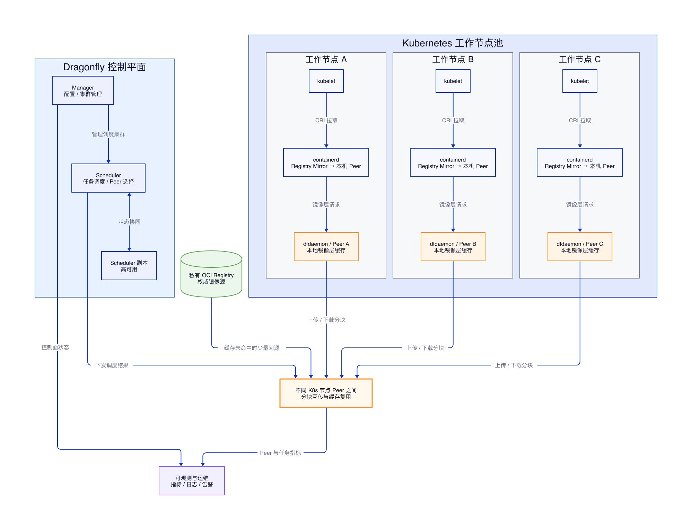
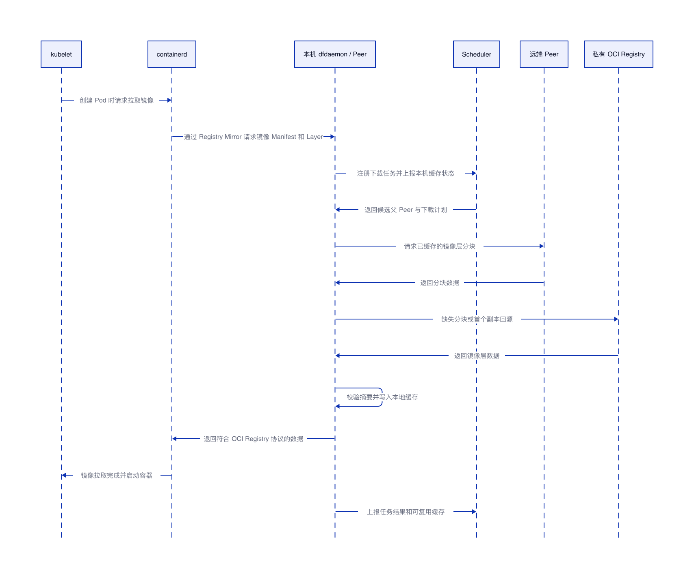

# Dragonfly 镜像加速分发架构

## 结论

Dragonfly 适合解决 Kubernetes 集群内大规模镜像分发问题。它不替代私有镜像仓库，而是在 containerd 与私有 OCI Registry 之间增加一层 P2P 分发能力：每个节点运行 dfdaemon/Peer，本节点优先从其他已缓存节点获取镜像层分块，只有缓存未命中时才回源私有 Registry。这样可以把“每个节点都直接打到 Registry”的拉取模式，改成“少量节点回源、集群内部 P2P 复用”的分发模式。

本文以 [Dragonfly v2.5.0](https://d7y.io/blog/2026/06/25/dragonfly-v2-5-0-has-been-released/) 为说明对象，重点关注 Kubernetes + containerd + 私有 OCI Registry 场景。本文未执行本地集群部署验证，只整理架构、组件工作方式和关键配置思路。



## 适用问题

| 问题 | 传统拉取方式 | Dragonfly 分发方式 |
|---|---|---|
| 多节点同时扩容 | 每个节点都访问 Registry | 少量节点回源，其他节点从 Peer 获取分块 |
| 大镜像分发慢 | 每个节点重复下载完整镜像层 | 镜像层按分块复用，节点间互相供给 |
| Registry 出口带宽高 | Registry 承担全部镜像层流量 | Registry 只承担缓存未命中的回源流量 |
| 跨节点缓存无法复用 | containerd 只使用本机缓存 | dfdaemon 将节点本地缓存纳入 P2P 网络 |
| Registry 短暂不可用 | 未缓存镜像无法拉取 | 已缓存镜像层仍可在集群内部继续分发 |


## P2P 含义

P2P 是 Peer-to-Peer 的缩写，中文可理解为“点对点”或“对等网络”。在 Dragonfly 的 Kubernetes 镜像分发场景里，P2P 准确来说是不同 Kubernetes 节点上的 dfdaemon/Peer 之间进行镜像层分块传输。每个 Kubernetes 工作节点上的 dfdaemon 都是一个 Peer，它既可以从其他节点下载镜像层分块，也可以把自己已经缓存的分块提供给其他节点。

| 角色 | 在 Dragonfly 中的含义 |
|---|---|
| Peer | 运行 dfdaemon 的 Kubernetes 节点，负责下载、缓存和上传镜像层分块 |
| 父 Peer | 当前节点下载时选择的上游 Peer，通常已经缓存了目标镜像层或正在下载该镜像层 |
| 子 Peer | 当前节点向其他节点提供数据时，对方节点就是子 Peer |
| Scheduler | 负责告诉 Peer 应该向哪些父 Peer 下载，不直接承载主要镜像层流量 |

P2P 的核心不是让所有节点固定互连，也不是 Pod 之间互传镜像，而是在某个镜像层下载任务发生时，由 Scheduler 在不同 Kubernetes 节点的 dfdaemon/Peer 之间动态选择下载来源。这样可以把 Registry 的集中压力拆散到多个已经缓存镜像层的节点上。

## 组件职责

| 组件 | 部署位置 | 主要职责 | 数据面压力 |
|---|---|---|---|
| 私有 OCI Registry | 集群外或基础设施区 | 保存镜像 Manifest、Config 和 Layer，是权威镜像源 | 只承担缓存未命中的回源流量 |
| Manager | Dragonfly 控制平面 | 管理 Dragonfly 集群、配置、Scheduler 分组和运行状态 | 不承载镜像层主流量 |
| Scheduler | Dragonfly 控制平面 | 管理下载任务，为 Peer 选择父节点，控制回源与重试 | 不承载镜像层主流量 |
| dfdaemon / Peer | 每个 Kubernetes 节点 | 接收 containerd 镜像请求，下载、缓存、上传镜像层分块 | 承载主要 P2P 数据流量 |
| containerd | 每个 Kubernetes 节点 | 通过 Registry Mirror 把镜像请求转给本机 dfdaemon | 承载本机镜像拉取和解包 |
| kubelet | 每个 Kubernetes 节点 | 通过 CRI 请求 containerd 拉取镜像并启动容器 | 不直接参与 P2P |

## 镜像拉取时序



## 组件具体如何工作

### kubelet 与 containerd

kubelet 只知道需要启动某个 Pod，并通过 CRI 请求 containerd 拉取镜像。containerd 仍然按照 OCI Registry 协议处理镜像 Manifest、Config 和 Layer。Dragonfly 的接入点在 containerd Registry Mirror 配置中：把目标仓库的请求转发到本机 dfdaemon，让 dfdaemon 作为本机镜像代理。

### dfdaemon / Peer

每个工作节点部署一个 dfdaemon，它既是本机 containerd 的镜像代理，也是 Dragonfly P2P 网络中的 Peer。它收到镜像层请求后，会先根据镜像层摘要判断本机缓存是否命中；本机未命中时向 Scheduler 注册下载任务；拿到调度结果后优先向其他 Peer 请求分块；如果没有可用 Peer 或分块缺失，再回源私有 Registry。

| dfdaemon 行为 | 作用 |
|---|---|
| 代理 Registry 请求 | 让 containerd 不需要感知 P2P 细节 |
| 维护本地缓存 | 让已下载镜像层可以被本机和其他节点复用 |
| 分块下载 | 将镜像层拆成可调度、可并行传输的数据块 |
| 分块上传 | 把本机已缓存数据提供给其他 Peer |
| 摘要校验 | 确保返回给 containerd 的内容与 OCI 镜像摘要一致 |
| 回源 Registry | 在 P2P 网络无法满足请求时保证可用性 |

### Scheduler

Scheduler 是 P2P 网络的调度中心，但不承载镜像层主流量。Peer 向 Scheduler 注册任务时，Scheduler 根据当前有哪些 Peer 拥有目标内容、Peer 的任务状态、可用性和调度策略，返回一个候选父节点列表。Peer 根据这个列表向其他 Peer 下载分块。

| Scheduler 管理对象 | 说明 |
|---|---|
| 下载任务 | 某个镜像层或文件的下载过程 |
| Peer 状态 | 节点是否在线、是否持有目标内容、任务是否完成 |
| 父节点选择 | 为当前 Peer 选择可下载的上游 Peer |
| 回源控制 | 在没有合适 Peer 时允许少量 Peer 回源 Registry |
| 失败重试 | Peer 失败后重新选择其他父节点或回源 |

### Manager

Manager 负责 Dragonfly 控制面的管理能力，包括 Scheduler 集群管理、配置分发和运行状态维护。它不直接参与镜像层传输，因此在数据面瓶颈分析中，重点关注 Scheduler 的调度稳定性和 Peer 的网络带宽。

### 私有 OCI Registry

私有 OCI Registry 仍然是镜像的权威源。Dragonfly 不改变镜像构建、推送和制品管理链路。它只改变节点拉取镜像时的分发路径。镜像首次进入某个 Dragonfly 调度域时，仍需要回源 Registry；当集群内已经存在对应镜像层后，后续节点优先通过 P2P 网络复用。

## P2P 网络如何实现

Dragonfly 的 P2P 网络可以理解为由 Scheduler 管理拓扑、由 Peer 承载数据传输的分块分发网络。它不是让所有节点互相建立固定全连接，而是在每个下载任务发生时动态选择父 Peer。

| 阶段 | 实现机制 | 结果 |
|---|---|---|
| 内容标识 | 使用镜像层摘要或任务标识定位内容 | 同一个镜像层在不同节点之间可以被识别为同一份内容 |
| 任务注册 | Peer 向 Scheduler 注册下载任务 | Scheduler 知道哪个 Peer 需要什么内容 |
| 父节点选择 | Scheduler 返回已缓存或正在下载该内容的 Peer | 下载节点不直接盲目广播 |
| 分块传输 | Peer 按分块从多个父 Peer 拉取数据 | 提高并行度，减少单点压力 |
| 本地缓存 | 下载完成或部分完成的数据进入本地缓存 | 当前节点变成新的可选父 Peer |
| 回源兜底 | 没有可用 Peer 时从 Registry 获取 | 保证首个副本和缓存缺失场景可用 |
| 摘要校验 | 写入和返回前校验数据完整性 | 保证最终交给 containerd 的内容可信 |

P2P 网络的核心收益来自“缓存传播”。第一个节点拉取镜像层时需要回源 Registry；第二个节点开始拉取时，可以从第一个节点获取部分或全部分块；随着更多节点完成下载，可供选择的父 Peer 增加，Registry 的压力逐步下降。


## 磁盘空间成本

Dragonfly 不是零磁盘成本的镜像加速方案。普通 Kubernetes 节点本来就会在 containerd 中保存镜像内容和解包后的 snapshot；引入 Dragonfly 后，dfdaemon 还会维护一份用于 P2P 分发的可回收缓存。因此节点侧会增加额外磁盘占用。

| 存储位置 | 内容 | 是否由 Dragonfly 引入 | 作用 |
|---|---|---|---|
| containerd content store | 镜像 Manifest、Config 和 Layer 内容 | 否 | containerd 拉取和管理镜像所需 |
| containerd snapshot | 镜像层解包后的 rootfs 数据 | 否 | 容器运行时挂载和启动所需 |
| dfdaemon cache | 用于 P2P 分发的镜像层或文件分块缓存 | 是 | 让其他节点可以复用本节点已经下载的数据 |

所以更准确的理解是：Dragonfly 不减少单节点运行镜像所需的 containerd 存储，它额外增加一层可回收的 P2P 缓存，用这部分磁盘空间换取跨节点镜像层复用、Registry 压力下降和批量扩容速度提升。

| 场景 | 是否适合承担这部分磁盘成本 |
|---|---|
| 节点少、镜像小、扩容频率低 | 不适合，收益覆盖不了额外缓存成本 |
| 节点多、镜像大、批量扩容频繁 | 适合，P2P 复用可以明显降低 Registry 压力 |
| 节点磁盘紧张 | 谨慎使用，必须限制缓存容量并监控磁盘水位 |
| 跨可用区或跨地域拉取成本高 | 适合评估，但需要按网络区域划分调度域 |

生产环境需要把 dfdaemon cache 当作独立缓存层管理。推荐做法包括：把缓存目录放到独立数据盘或独立目录，为缓存设置最大容量，配置淘汰策略，避免挤占系统盘和 containerd 目录，并持续监控缓存使用量、P2P 命中率、Registry 回源流量和节点磁盘水位。

## 推荐部署形态

| 部署对象 | 推荐方式 | 说明 |
|---|---|---|
| dfdaemon | DaemonSet | 每个工作节点一个 Peer，贴近 containerd |
| Scheduler | 多副本 Deployment | 控制面高可用，避免单点调度故障 |
| Manager | 多副本 Deployment | 管理面高可用，便于统一配置 |
| 缓存目录 | 独立磁盘或独立目录 | 避免与系统盘、容器运行时目录互相挤占 |
| 监控 | Prometheus + 日志系统 | 关注回源流量、P2P 命中率、下载耗时和失败率 |

## containerd 接入示例

下面示例只表达接入思路，实际地址、端口和 TLS 配置需要按部署环境调整。参数说明直接写在注释中。

```toml
# 示例文件位置：/etc/containerd/certs.d/registry.example.com/hosts.toml
# registry.example.com 表示私有 OCI Registry 域名。
# containerd 访问该仓库时，优先请求本机 dfdaemon。

server = "https://registry.example.com"

[host."http://127.0.0.1:65001"]
  # 127.0.0.1:65001 表示本机 dfdaemon 暴露给 containerd 的 Registry Mirror 地址。
  # pull 表示允许通过该 mirror 拉取镜像内容。
  capabilities = ["pull", "resolve"]

[host."https://registry.example.com"]
  # 保留原始 Registry 作为兜底路径。
  # 当本机 dfdaemon 不可用或需要直接回源时，containerd 仍有权访问权威源。
  capabilities = ["pull", "resolve"]
```

## Dragonfly 配置关注点

```yaml
# 该片段只展示关键配置方向，不是完整 Helm values。
# 生产环境需要结合官方 Chart、集群网络和 Registry TLS 配置补齐。

scheduler:
  # Scheduler 需要多副本，避免调度中心单点故障。
  replicas: 3

manager:
  # Manager 负责管理配置，也建议多副本部署。
  replicas: 2

dfdaemon:
  # dfdaemon 以 DaemonSet 方式运行，让每个工作节点都有本机 Peer。
  hostNetwork: true
  # 缓存目录需要容量控制，避免占满节点磁盘。
  storage:
    path: /var/lib/dragonfly
    maxSize: 100Gi
  # 代理端口需要与 containerd hosts.toml 中的 mirror 地址一致。
  proxy:
    port: 65001
```

## 关键指标

| 指标 | 观察目的 | 判断方向 |
|---|---|---|
| Registry 回源流量 | 判断是否真正降低仓库压力 | 大规模扩容时回源流量应低于传统直连模式 |
| P2P 命中率 | 判断节点间缓存复用效果 | 热门镜像应逐步提高命中率 |
| 镜像拉取耗时 | 判断用户侧收益 | 扩容场景下 P95/P99 应下降 |
| Peer 下载失败率 | 判断 P2P 网络稳定性 | 失败率升高时检查节点网络和缓存目录 |
| Scheduler 调度耗时 | 判断控制面瓶颈 | 调度耗时升高时检查 Scheduler 负载和副本数 |
| 节点缓存占用 | 判断磁盘风险 | 需要与镜像大小、发布频率和清理策略匹配 |

## 故障边界

| 故障场景 | 影响 | 处理方式 |
|---|---|---|
| 单个 Peer 故障 | 该节点不能为其他节点供给缓存 | Scheduler 重新选择其他 Peer |
| Scheduler 单副本故障 | 新下载任务调度受影响 | 使用多副本 Scheduler |
| Manager 故障 | 管理与配置能力受影响 | 已有数据传输不应依赖 Manager 单点 |
| Registry 短暂故障 | 未缓存镜像无法回源 | 已缓存镜像层仍可通过 Peer 分发 |
| 节点缓存被清理 | 当前节点无法继续供给对应内容 | 其他 Peer 或 Registry 继续兜底 |

## 落地顺序

| 阶段 | 目标 | 验收点 |
|---|---|---|
| 第一阶段 | 单集群接入 Dragonfly | containerd 能通过本机 dfdaemon 拉取私有镜像 |
| 第二阶段 | 验证 P2P 命中 | 多节点重复拉取同一镜像时，Registry 回源流量下降 |
| 第三阶段 | 压测扩容场景 | 批量 Pod 创建时，镜像拉取耗时和 Registry 带宽下降 |
| 第四阶段 | 补齐高可用和观测 | Scheduler 多副本、Peer 指标、回源流量、失败率可观测 |
| 第五阶段 | 制定缓存策略 | 根据镜像大小和发布频率设置缓存容量与清理策略 |
