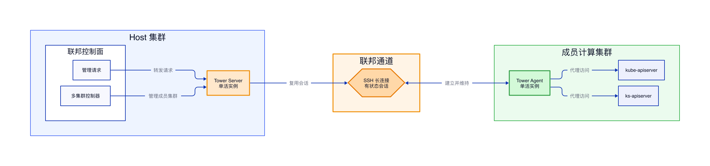

# KubeSphere Tower 联邦通道

## 结论

KubeSphere 开源 Tower 采用有状态的 SSH 长连接实现 Host 集群与成员计算集群之间的联邦通道。默认部署模型可以理解为两端单活：每个成员集群运行一个 Tower Agent，Host 集群运行一个 Tower Server（开源代码中也称 Proxy）。

Tower Agent 和 Tower Server 都不适合仅通过增加 Deployment 副本数实现高可用。Pod 故障后可以由 Kubernetes 重新拉起，但通道重建期间会出现短暂中断。这属于故障恢复，不是多副本同时工作和无损切换。

## 架构

Tower Agent 主动连接 Host 集群中的 Tower Server。双方完成握手后建立受 SSH 保护的长连接，Host 集群访问成员集群 `kube-apiserver` 或 `ks-apiserver` 的请求通过该连接进行转发。

联邦通道是架构中的关键状态边界。连接建立在哪个 Tower Server 进程中，对应的 Tunnel 会话就由哪个进程持有，因此它不能直接按照普通无状态服务的方式进行负载均衡。

## Tower Agent 的实例模型

一个成员集群对应一套集群身份，主要包括集群名称和 Token。多个 Agent 副本如果使用相同身份同时连接 Tower Server，可能发生连接覆盖、反复重连或者请求落到不确定连接的问题。

因此，每个成员集群通常只保留一个活跃的 Tower Agent。Agent Pod 异常退出后，由 Deployment 创建新 Pod；新 Agent 重新完成握手并建立通道后，成员集群才恢复可访问状态。

## Tower Server 的实例模型

Tower Server 持有 Agent 建立的 SSH 长连接及其关联的 Tunnel 会话。假设 Agent 的连接建立在 Tower Server A，而 Host 侧请求经过 Service 被转发到 Tower Server B，Server B 没有对应会话，请求就无法通过原有通道到达成员集群。

即使控制器使用 Leader Election，也主要用于避免多个控制器实例同时处理同一资源，并不等于 Tunnel 会话能够在多个 Server 实例间共享。因而，开源实现通常将 Tower Server 保持为单实例。

## 可用性边界

Tower Agent 或 Tower Server 重启时，原有 SSH 长连接会断开，需要重新握手和建连。在此期间，Host 集群通过联邦通道访问成员集群 API 的请求可能失败，但成员集群自身的 Kubernetes 工作负载通常不会因此停止运行。

如果需要真正的多副本高可用，不能只调整 `replicas`，还需要补充连接归属管理、请求粘性路由、会话同步或 Agent 多通道等机制，使请求始终能够到达持有对应 Tunnel 会话的 Server 实例。

## 参考实现

开源代码与工作原理可查看 [kubesphere/tower](https://github.com/kubesphere/tower)。
