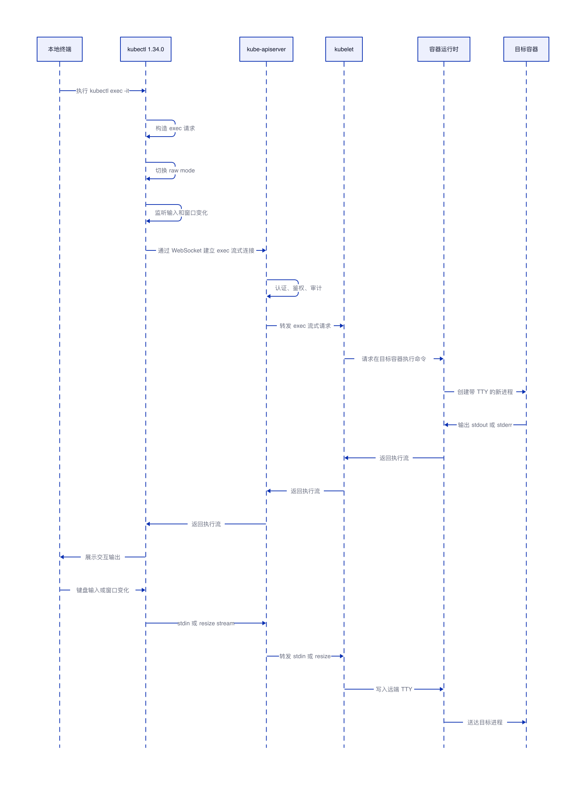
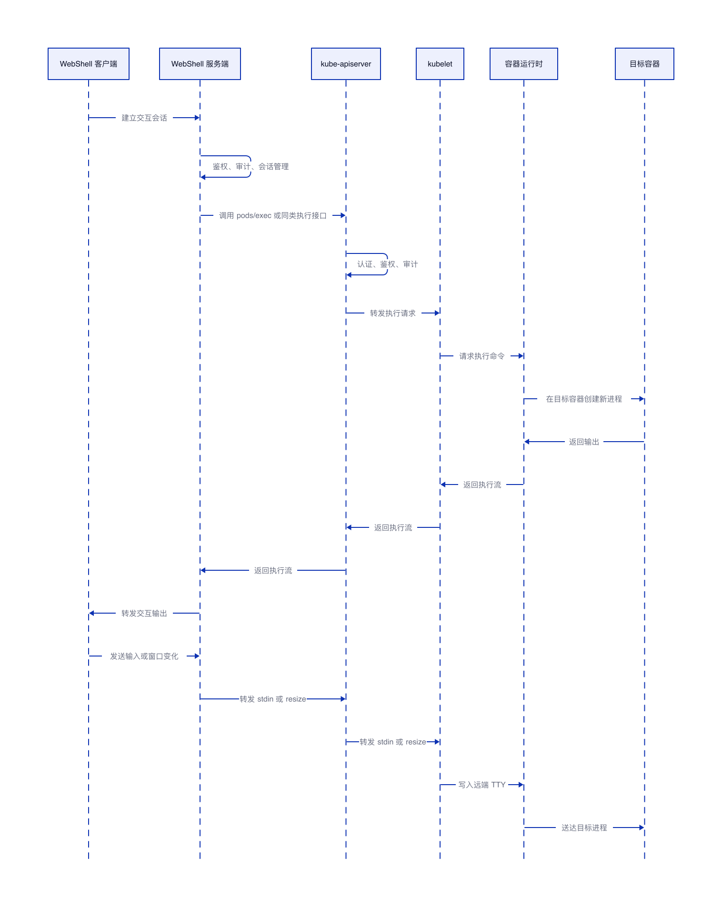

# Kubernetes 1.34.0 kubectl exec 实现原理

## 结论

Kubernetes 1.34.0 中，`kubectl exec` 是 Kubernetes 原生远程执行能力，不依赖 WebShell。它默认优先使用 WebSocket 建立流式连接，并在一条连接中复用 `stdin`、`stdout`、`stderr`、`error`、`resize` 等数据流；当 WebSocket 升级失败或遇到 HTTPS 代理问题时，再回退到 SPDY。

没有 WebShell 也能交互式执行，是因为 `kubectl` 自己就是交互式客户端。它负责读取本地终端输入、切换 raw mode、监听窗口大小变化，并把这些数据通过 Kubernetes streaming 连接转发给目标容器内新启动的 TTY 进程。

针对 `kubectl exec`，持续交互式和非持续交互式的一次性执行要分开理解：持续交互式执行会在目标容器内创建连接 TTY 的新进程，例如 `kubectl exec -it <pod> -- sh` 会创建一个连接 TTY 的 `sh` 进程；非持续交互式的一次性执行只会在目标容器内创建命令本身进程，例如 `kubectl exec <pod> -- ls /` 只会创建 `ls` 进程，不会额外创建 shell 或 TTY 交互进程。

WebShell 服务端收到 WebShell 客户端请求后，是否在服务端本机创建新进程，取决于它对接的执行后端。若 WebShell 后端对接 Kubernetes exec API，它一般创建的是会话对象、连接对象或协程，真正的新进程由容器运行时在目标容器里创建；若 WebShell 后端对接 SSH、主机 Agent 或其他执行后端，新进程会在对应目标环境中创建。

## kubectl exec 在 1.34.0 中的执行链路

1. 用户执行 `kubectl exec -it <pod> -- <command>`。
2. `kubectl` 构造 `pods/exec` 子资源请求，并设置 `PodExecOptions`，其中包含容器名、命令、是否打开 stdin、stdout、stderr、TTY。
3. `kubectl` 在 1.34.0 中优先创建 WebSocket executor，同时保留 SPDY executor 作为回退路径。
4. WebSocket 路径使用 `GET` 请求发起协议升级，并建立 exec 流式连接。
5. `kube-apiserver` 完成认证、鉴权、审计后，把 exec streaming 请求转发给目标 Pod 所在节点的 `kubelet`。
6. `kubelet` 通过容器运行时接口请求在目标容器里执行命令。
7. 容器运行时在目标容器已有隔离环境中创建新进程，而不是重启容器，也不是进入已有进程。若是 `-it` 持续交互式执行，会创建连接 TTY 的新进程；若是一次性执行，只创建命令本身进程。
8. 新进程的输入、输出、错误、终端大小变化通过 streaming 通道持续传输。

## 没有 WebShell 时如何实现交互式

交互式的关键不是 WebShell，而是本地终端、远端 TTY 和流式连接的组合。

执行 `kubectl exec -it` 时，`-i` 表示保持 stdin 打开，`-t` 表示为目标容器内的新进程分配 TTY。`kubectl` 会把本地终端切到 raw mode，让方向键、Tab、Ctrl+C、Backspace 等控制输入按更原始的方式传给远端进程。同时，`kubectl` 会监听本地窗口大小变化，并通过 resize stream 通知远端 TTY。

因此，交互式链路可以拆成三条持续数据流：

1. 本地键盘输入进入 `kubectl`，再通过 stdin stream 发送给容器内进程。
2. 容器内进程的 stdout 或 stderr 经过运行时、`kubelet`、`kube-apiserver` 返回给 `kubectl`，再显示到本地终端。
3. 本地终端窗口变化由 `kubectl` 转成 resize stream，最终作用到远端 TTY。

这说明 `kubectl exec -it` 的交互式能力来自 Kubernetes streaming 机制，不来自 WebShell。这里创建的是目标容器内连接 TTY 的新进程。

如果执行的是非持续交互式命令，例如 `kubectl exec <pod> -- date` 或 `kubectl exec <pod> -- cat /etc/hostname`，Kubernetes 仍然会通过 exec 链路在目标容器内创建新进程，但这个新进程就是命令本身。命令执行结束后，进程退出，exec 会话结束。此时没有持续输入，也不需要 TTY。

## 为什么 1.34.0 要使用 WebSocket

1.34.0 使用 WebSocket 的核心原因是 exec 不是一次性请求响应模型，而是长时间、双向、实时的数据传输模型。

普通 HTTP 请求适合“请求一次、响应一次、连接结束”的场景。`kubectl exec -it` 需要持续处理输入、输出、错误、窗口大小变化和执行状态，因此需要一条可持续传输的双向连接。WebSocket 正好提供 HTTP Upgrade 后的双向通信能力，可以承载这类远程命令流。

在 1.34.0 的客户端实现中，WebSocket executor 使用 `GET` 发起升级请求，这是 WebSocket 握手协议要求；SPDY executor 仍使用老的 `POST` 方式作为回退路径。最终执行时优先走 WebSocket，只有 WebSocket 升级失败或 HTTPS 代理相关错误时才回退到 SPDY。

1.34.0 的 WebSocket exec 会在一条 WebSocket 连接上复用多个逻辑流，每个二进制消息通过 stream id 区分数据类型。这样就能在同一条连接中承载 stdin、stdout、stderr、error 和 resize。

## WebShell 服务端会不会创建新进程

WebShell 服务端是否创建新 TTY 进程，取决于它本身是不是最终执行端。

若 WebShell 服务端本身就是最终执行端，它会在服务端本机创建 PTY 和 shell 进程，从而完成持续交互式会话。例如服务端直接执行 `/bin/sh`、`bash` 或其他命令时，服务端会负责创建伪终端，把客户端输入写入 PTY，再把 PTY 输出转发回客户端。

若 WebShell 服务端只是接入网关，它不必然在服务端本机创建真正的用户 shell 进程。此时它主要负责鉴权、审计、会话管理、协议转换和流式转发，真正的新进程由后端执行环境创建，例如目标容器、目标主机或远端执行 Agent。

在 Kubernetes exec 场景中，WebShell 服务端如果调用的是 `pods/exec` API，那么真正的新进程由容器运行时在目标容器内创建。持续交互式执行时，目标容器内会创建连接 TTY 的新进程；一次性执行时，目标容器内只创建命令本身进程。

如果 WebShell 服务端对接的是 SSH，新 shell 进程会创建在 SSH 目标主机上。如果对接的是主机 Agent 或自研执行后端，新进程会创建在对应目标环境中。

判断标准是：谁最终调用 `fork/exec`、`pty.Start`、`exec.Command`、SSH server session 或 container runtime exec，谁就是创建新进程的一方。

## kubectl exec 和 WebShell 的优势对比

| 维度 | kubectl exec | WebShell |
|---|---|---|
| 定位 | Kubernetes 原生命令执行客户端 | 远程交互式 Shell 接入层 |
| 链路 | 直接访问 `kube-apiserver`，再到 `kubelet` 和运行时 | 客户端先到 WebShell 服务端，再进入后端执行链路 |
| 新进程位置 | 容器运行时在目标容器内创建 | 由 WebShell 后端对接的目标执行环境决定 |
| 自动化 | 适合脚本、巡检、CI 和批量诊断 | 适合受控交互和平台化接入 |
| 权限模型 | 直接依赖 Kubernetes RBAC，例如 `pods/exec` 的 `create` 权限 | 可以叠加统一登录、租户权限、命令管控、审计和会话管理 |
| 故障点 | 链路短，排障直接 | 多一层接入服务，治理能力更强，链路也更长 |

`kubectl exec` 的优势是原生、链路短、自动化友好、行为贴近 Kubernetes 标准。它适合开发、排障、脚本化诊断和需要直接确认 Kubernetes 原生行为的场景。

WebShell 的优势是统一接入、统一鉴权、统一审计、命令管控和跨环境适配。它适合向多类用户提供受控交互入口，避免每个客户端都直接持有完整集群访问能力。
