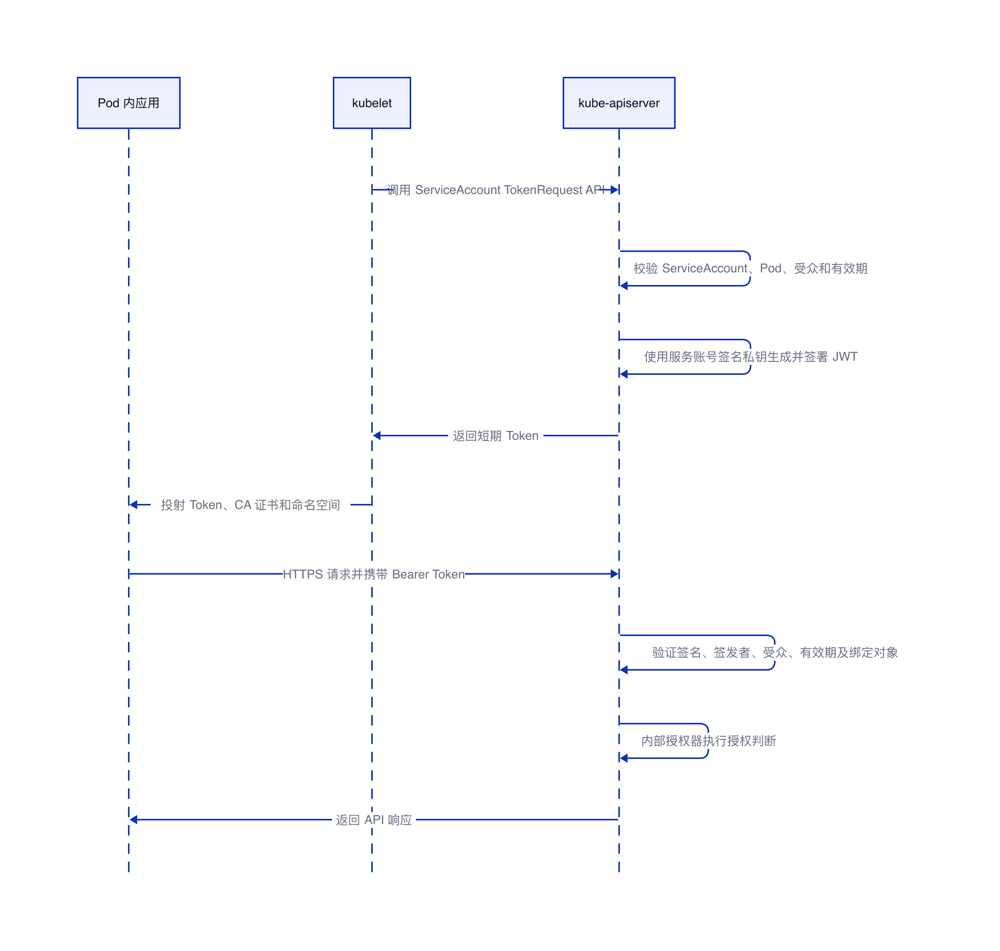

# ServiceAccount 不创建 RBAC 规则访问 kube-apiserver

## 结论

本文分析对象为 Kubernetes v1.36.2。

ServiceAccount 只解决身份认证，不决定 API 权限。Pod 使用 ServiceAccount Token 访问 kube-apiserver 时，kube-apiserver 先把请求识别为 `system:serviceaccount:<namespace>:<name>`，再交给授权器判断是否允许。

当前推荐使用 TokenRequest API 签发的短期 Token。Pod 场景中，kubelet 负责发起 TokenRequest 并把 Token 投射进容器；真正生成并签署 Token 的是 kube-apiserver。Kubernetes v1.36.2 自动注入的投射卷默认请求 `3607` 秒有效期，约为 1 小时；kubelet 在 Token 使用时间超过总有效期的 80% 时主动申请轮换。kube-apiserver 使用 `--service-account-signing-key-file` 指定的私钥签署 JWT，并使用 `--service-account-issuer` 写入签发者。kubelet 不是 Token 签发者，只是申请、挂载和轮换 Token。


## 认证和授权的边界

访问 kube-apiserver 会依次经过 TLS、认证和授权。容器内的 CA 证书用于验证 kube-apiserver 的服务端身份，ServiceAccount Token 用于证明调用方身份，授权器决定该身份能否执行具体操作。这三部分不能互相替代。

| 环节 | 使用的材料或组件 | 作用 |
|---|---|---|
| TLS 服务端校验 | `/var/run/secrets/kubernetes.io/serviceaccount/ca.crt` | 确认访问的是受信任的 kube-apiserver |
| 身份认证 | ServiceAccount Bearer Token | 识别为 `system:serviceaccount:<namespace>:<name>` |
| 身份分组 | kube-apiserver | 同时加入 `system:serviceaccounts`、`system:serviceaccounts:<namespace>` 和 `system:authenticated` |
| 授权 | RBAC、Webhook、ABAC、Node 或 AlwaysAllow | 判断能否访问目标资源和执行目标动作 |

## Token 是谁生成的

### Pod 自动挂载的短期 Token

Pod 使用默认的投射卷机制时，ServiceAccount 准入控制器注入的 `expirationSeconds` 为 `3607` 秒，即 1 小时 7 秒。kubelet 按这个有效期调用 TokenRequest API，并在 Token 使用时间超过总有效期的 80% 或超过 24 小时时主动申请新 Token，以先达到的条件为准；按默认值计算，轮换点约为签发后的 48 分 6 秒。若投射卷显式配置了 `expirationSeconds`，则以配置值及 kube-apiserver 的有效期限制为准。

Token 的生成链路如下：

1. kubelet 根据 Pod 使用的 ServiceAccount 调用该 ServiceAccount 的 `token` 子资源，即 TokenRequest API。
2. kube-apiserver 校验 ServiceAccount、Pod 绑定关系、受众和有效期。
3. kube-apiserver 使用服务账号签名私钥生成并签署 JWT，然后把短期 Token 返回给 kubelet。
4. kubelet 将 Token、集群 CA 证书和命名空间投射到容器，并在 Token 到期前负责轮换。
5. 应用读取投射文件，以 Bearer Token 方式调用 kube-apiserver。

相关 kube-apiserver 参数如下：

```yaml
# JWT 中的 issuer；配置多个值时，第一个值用于签发新 Token
--service-account-issuer=https://kubernetes.default.svc

# kube-apiserver 签发 TokenRequest Token 时使用的私钥
--service-account-signing-key-file=/etc/kubernetes/pki/sa.key

# kube-apiserver 验证 ServiceAccount Token 签名时使用的公钥或私钥文件
--service-account-key-file=/etc/kubernetes/pki/sa.pub

# 限制 TokenRequest 可请求的最长有效期
--service-account-max-token-expiration=24h
```

`sa.key` 和 `sa.pub` 是 JWT 签名密钥，不是 X.509 证书。私钥必须限制访问范围；公钥可以用于验证 Token 签名。

