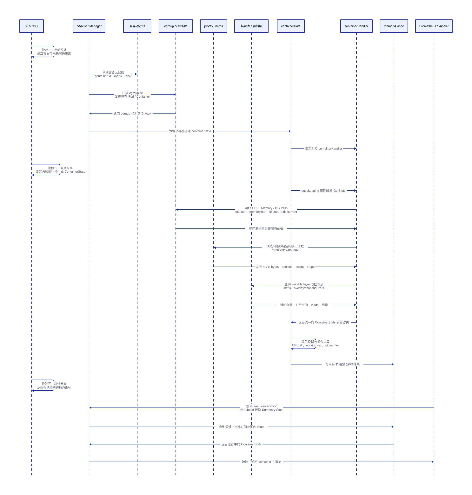

# cAdvisor 采集指标来源、路径与计算方式

## 结论

cAdvisor 的核心工作是把 Linux 内核暴露的 cgroup、procfs、sysfs 和容器运行时元数据转换成容器维度指标。CPU 指标来自 CPU cgroup 的累计时间，最终通过差分或 Prometheus `rate()` 得到当前消耗核数；Memory 如果关注容器进程自身消耗，核心看 RSS/anon，如果关注 cgroup 总计费内存，则看 usage/current；网络指标来自容器 network namespace 下的接口计数器；磁盘 IO 来自 blkio/io cgroup；文件系统容量类指标来自容器可写层、挂载点和 `statfs`。

本文以开源组件 **cAdvisor v0.49.1** 的常见指标口径为说明对象。不同 Kubernetes、内核、cgroup v1/v2、容器运行时和 cAdvisor 版本会带来字段名和暴露指标的细节差异，但整体计算思路一致。

## 指标采集的基本路径

cAdvisor 不是进入容器内部执行命令采集指标，而是在宿主机上定位容器对应的 cgroup 和 network namespace，然后读取内核维护的统计文件。定位容器资源路径的关键入口是 `/proc/<pid>/cgroup`，其中 `<pid>` 是容器主进程 PID，或者 Kubernetes Pod 场景下 pause container 对应的 PID。

cgroup v1 下，同一个容器在不同 controller 下有不同目录，例如 CPU 在 `/sys/fs/cgroup/cpuacct/<cg>/`，Memory 在 `/sys/fs/cgroup/memory/<cg>/`，blkio 在 `/sys/fs/cgroup/blkio/<cg>/`。cgroup v2 下是统一层级，大部分文件集中在 `/sys/fs/cgroup/<cg>/` 下。这里的 `<cg>` 表示从 `/proc/<pid>/cgroup` 拿到的 cgroup 相对路径。

## CPU：容器进程实际消耗量

如果只关心容器进程实际消耗了多少 CPU，核心指标只需要看 `container_cpu_usage_seconds_total`。它表示容器内进程累计消耗的 CPU 时间，单位是秒，是 counter，不是瞬时使用率。

| 指标 | 含义 | cgroup v1 取值路径 | cgroup v2 取值路径 | 计算方式 |
|---|---|---|---|---|
| `container_cpu_usage_seconds_total` | 容器进程累计实际消耗 CPU 时间，单位秒 | `/sys/fs/cgroup/cpuacct/<cg>/cpuacct.usage`，或 `/sys/fs/cgroup/cpu,cpuacct/<cg>/cpuacct.usage` | `/sys/fs/cgroup/<cg>/cpu.stat` 中的 `usage_usec` | v1：`cpuacct.usage / 1e9`；v2：`usage_usec / 1e6` |

示例：cgroup v1 中 `cpuacct.usage = 123456789000`，单位是纳秒，则 `container_cpu_usage_seconds_total = 123456789000 / 1e9 = 123.456789` 秒。cgroup v2 中 `cpu.stat` 里 `usage_usec = 123456789`，单位是微秒，则 `container_cpu_usage_seconds_total = 123456789 / 1e6 = 123.456789` 秒。

CPU 当前使用量需要对累计 counter 做差分。公式是 `CPU 使用核数 = Δcontainer_cpu_usage_seconds_total / Δwall_time_seconds`。例如 10 秒内 `container_cpu_usage_seconds_total` 从 100 增加到 115，则 CPU 使用核数是 `(115 - 100) / 10 = 1.5 core`。在 Prometheus 中写成 `rate(container_cpu_usage_seconds_total[1m])`，结果就是最近 1 分钟平均消耗的 CPU 核数。如果要按单核百分比展示，则使用 `rate(container_cpu_usage_seconds_total[1m]) * 100`，结果 150 表示相当于 1.5 核。

如果要看容器用了自己 CPU limit 的多少，需要额外读取 quota 和 period。cgroup v1 的路径是 `/sys/fs/cgroup/cpu/<cg>/cpu.cfs_quota_us` 与 `/sys/fs/cgroup/cpu/<cg>/cpu.cfs_period_us`；cgroup v2 的路径是 `/sys/fs/cgroup/<cg>/cpu.max`。计算公式是 `CPU limit 核数 = quota / period`，相对 limit 的使用率是 `rate(container_cpu_usage_seconds_total[1m]) / (quota / period) * 100`。

## Memory：容器进程实际消耗量

Memory 的“实际消耗”有两个口径。如果关注容器进程本身吃掉了多少内存，优先看 `container_memory_rss`，它更接近进程匿名常驻内存。如果关注容器 cgroup 对节点造成的总内存计费压力，看 `container_memory_usage_bytes`。如果关注 Kubernetes 常见内存压力口径，可看 `container_memory_working_set_bytes`，但它包含部分活跃 page cache，不等于进程自身堆内存。

| 指标 | 含义 | cgroup v1 取值路径 | cgroup v2 取值路径 | 计算方式 |
|---|---|---|---|---|
| `container_memory_rss` | 容器进程匿名常驻内存，更接近应用堆、栈、匿名 mmap 等进程自身消耗 | `/sys/fs/cgroup/memory/<cg>/memory.stat` 中的 `rss` | `/sys/fs/cgroup/<cg>/memory.stat` 中的 `anon` | v1：取 `rss`；v2：取 `anon` 或按 cAdvisor 版本适配映射 |
| `container_memory_usage_bytes` | cgroup 当前被计费的总内存，包含进程匿名内存、page cache、部分内核内存等 | `/sys/fs/cgroup/memory/<cg>/memory.usage_in_bytes` | `/sys/fs/cgroup/<cg>/memory.current` | 直接取原始值 |
| `container_memory_working_set_bytes` | 当前工作集内存，常用于判断容器内存压力 | `memory.usage_in_bytes` 加 `memory.stat` 中的 `inactive_file` | `memory.current` 加 `memory.stat` 中的 `inactive_file` | `working_set = usage - inactive_file`，如果结果小于 0 则按 0 处理 |

示例：cgroup v2 中 `memory.current = 1073741824`，`memory.stat` 中 `anon = 600000000`，`file = 300000000`，`inactive_file = 200000000`。此时 `container_memory_usage_bytes = 1073741824`，`container_memory_rss ≈ 600000000`，`container_memory_working_set_bytes = 1073741824 - 200000000 = 873741824`。如果你的问题是“业务进程本身占了多少内存”，看 RSS/anon；如果你的问题是“这个容器对节点内存压力有多大”，看 usage 或 working set。

Memory 是 gauge，本身就是当前时刻的值，不需要 `rate()`。Memory 使用率的计算方式是 `当前内存值 / memory limit * 100`。memory limit 在 cgroup v1 中来自 `/sys/fs/cgroup/memory/<cg>/memory.limit_in_bytes`，在 cgroup v2 中来自 `/sys/fs/cgroup/<cg>/memory.max`。如果 `memory.max` 是 `max`，或者 v1 中出现非常大的 sentinel 值，表示没有有效内存限制，此时不适合计算相对 limit 的百分比。

## Network：接口收发计数

网络指标不主要来自 cgroup，而是来自容器所在 network namespace 的接口统计。常用路径是 `/proc/<pid>/net/dev`。这里的 `<pid>` 必须是目标容器或 Pod network namespace 对应的进程 PID。Kubernetes 中同一个 Pod 的多个业务容器共享 pause container 持有的 network namespace，因此网络指标天然更适合看 Pod 维度。

| 指标 | 含义 | 取值路径 | 计算方式 |
|---|---|---|---|
| `container_network_receive_bytes_total` | 接收 byte 总数 | `/proc/<pid>/net/dev` 中目标接口的 `rx_bytes` | 直接取 `rx_bytes` |
| `container_network_transmit_bytes_total` | 发送 byte 总数 | `/proc/<pid>/net/dev` 中目标接口的 `tx_bytes` | 直接取 `tx_bytes` |
| `container_network_receive_packets_total` | 接收包总数 | `/proc/<pid>/net/dev` 中目标接口的 `rx_packets` | 直接取 `rx_packets` |
| `container_network_transmit_packets_total` | 发送包总数 | `/proc/<pid>/net/dev` 中目标接口的 `tx_packets` | 直接取 `tx_packets` |
| `container_network_receive_errors_total` | 接收错误包总数 | `/proc/<pid>/net/dev` 中目标接口的 `rx_errs` | 直接取 `rx_errs` |
| `container_network_transmit_errors_total` | 发送错误包总数 | `/proc/<pid>/net/dev` 中目标接口的 `tx_errs` | 直接取 `tx_errs` |
| `container_network_receive_packets_dropped_total` | 接收方向丢包总数 | `/proc/<pid>/net/dev` 中目标接口的 `rx_drop` | 直接取 `rx_drop` |
| `container_network_transmit_packets_dropped_total` | 发送方向丢包总数 | `/proc/<pid>/net/dev` 中目标接口的 `tx_drop` | 直接取 `tx_drop` |

`/proc/<pid>/net/dev` 中一行内容类似 `eth0: 1000000 1000 0 2 0 0 0 0 3000000 2000 0 1 0 0 0 0`。前半部分是接收方向，后半部分是发送方向，按顺序分别对应 bytes、packets、errs、drop 等字段。网络吞吐需要对 counter 做速率计算，例如 `rate(container_network_receive_bytes_total[1m])` 表示最近 1 分钟平均接收byte每秒，如果要换算成 bit/s，则乘以 8。

## Filesystem：容器文件系统容量与可写层用量

文件系统容量类指标不完全来自 cgroup，而是需要结合容器运行时存储路径、挂载点和 `statfs`。containerd overlayfs 常见路径是 `/var/lib/containerd/io.containerd.snapshotter.v1.overlayfs/snapshots/<snapshot-id>/fs`，Docker overlay2 常见路径是 `/var/lib/docker/overlay2/<id>/diff`、`merged`、`work` 等。cAdvisor 需要从容器运行时元数据知道某个容器对应哪个 snapshot 或 overlay 目录。

| 指标 | 含义 | 取值来源 | 计算方式 |
|---|---|---|---|
| `container_fs_usage_bytes` | 容器文件系统使用量，通常关注 writable layer | containerd snapshot 路径、Docker overlay2 upperdir/diff 路径，具体由 runtime metadata 决定 | 对 writable layer 做目录用量统计，或读取 runtime/storage driver 返回值，可近似理解为 `sum(file_blocks * block_size)` |
| `container_fs_limit_bytes` | 容器文件系统所在挂载点容量，或容器级 storage quota | `/proc/self/mountinfo` 定位 mount point 后执行 `statfs`；启用 quota 时来自 quota | 无 quota 时为 `statfs.blocks * statfs.block_size`；有 quota 时取 quota limit |
| `container_fs_available_bytes` | 容器文件系统所在挂载点可用空间 | mount point 的 `statfs` | `statfs.bavail * statfs.block_size` |
| `container_fs_inodes_total` | 文件系统 inode 总数 | mount point 的 `statfs` | 取 `statfs.files` |
| `container_fs_inodes_free` | 文件系统空闲 inode 数 | mount point 的 `statfs` | 取 `statfs.ffree` |

这里要注意，`container_fs_usage_bytes` 不等于 PVC 使用量，也不一定包含所有 volume 使用量。PVC、emptyDir、hostPath 等 volume 的统计通常需要看 kubelet volume stats 或 CSI 侧指标。

## Disk IO：块设备读写行为

Disk IO 指标来自 blkio/io cgroup，描述 cgroup 对块设备的读写行为。它关注的是读写动作，不是目录占用空间。

| 指标 | 含义 | cgroup v1 取值路径 | cgroup v2 取值路径 | 计算方式 |
|---|---|---|---|---|
| `container_fs_reads_bytes_total` | 块设备读取 byte 总数 | `/sys/fs/cgroup/blkio/<cg>/blkio.throttle.io_service_bytes` 中的 `Read` | `/sys/fs/cgroup/<cg>/io.stat` 中的 `rbytes` | v1：取 `Read`；v2：取 `rbytes` |
| `container_fs_writes_bytes_total` | 块设备写入 byte 总数 | `/sys/fs/cgroup/blkio/<cg>/blkio.throttle.io_service_bytes` 中的 `Write` | `/sys/fs/cgroup/<cg>/io.stat` 中的 `wbytes` | v1：取 `Write`；v2：取 `wbytes` |
| `container_fs_reads_total` | 块设备读操作次数 | `/sys/fs/cgroup/blkio/<cg>/blkio.throttle.io_serviced` 中的 `Read` | `/sys/fs/cgroup/<cg>/io.stat` 中的 `rios` | v1：取 `Read`；v2：取 `rios` |
| `container_fs_writes_total` | 块设备写操作次数 | `/sys/fs/cgroup/blkio/<cg>/blkio.throttle.io_serviced` 中的 `Write` | `/sys/fs/cgroup/<cg>/io.stat` 中的 `wios` | v1：取 `Write`；v2：取 `wios` |

cgroup v2 的 `io.stat` 示例是 `8:0 rbytes=10485760 wbytes=20971520 rios=100 wios=200 dbytes=0 dios=0`。对应结果是 `container_fs_reads_bytes_total{device="8:0"} = 10485760`，`container_fs_writes_bytes_total{device="8:0"} = 20971520`，`container_fs_reads_total{device="8:0"} = 100`，`container_fs_writes_total{device="8:0"} = 200`。IO 吞吐和 IOPS 也需要用 `rate()`，例如 `rate(container_fs_reads_bytes_total[1m])` 和 `rate(container_fs_reads_total[1m])`。

## PIDs：进程和线程数量

PIDs 指标来自 pids cgroup，用于判断容器是否接近进程数限制。它不是 CPU 或内存消耗，但排查 `fork: Resource temporarily unavailable` 这类问题时很关键。

| 指标 | 含义 | cgroup v1 取值路径 | cgroup v2 取值路径 | 计算方式 |
|---|---|---|---|---|
| `container_processes` | 当前 cgroup 内进程或线程数量，具体口径依 cAdvisor 版本而定 | `/sys/fs/cgroup/pids/<cg>/pids.current` | `/sys/fs/cgroup/<cg>/pids.current` | 直接取 `pids.current` |
| `container_threads_max` | 最大进程或线程限制 | `/sys/fs/cgroup/pids/<cg>/pids.max` | `/sys/fs/cgroup/<cg>/pids.max` | 直接取 `pids.max`；如果是 `max` 表示无限制 |

示例：`pids.current = 37`，`pids.max = 4096`，则当前数量是 37，上限是 4096。

## PSI：资源压力指标

PSI 表示任务因为 CPU、Memory 或 IO 不足而发生等待的程度。它不表示资源用了多少，而表示资源不足造成了多少停顿。

| 指标 | 含义 | 取值路径 | 计算方式 |
|---|---|---|---|
| `some avg10/avg60/avg300` | 至少有一个任务因为资源不足等待的比例 | 系统级：`/proc/pressure/cpu`、`/proc/pressure/memory`、`/proc/pressure/io`；cgroup 级：`/sys/fs/cgroup/<cg>/cpu.pressure`、`memory.pressure`、`io.pressure` | 直接取对应字段 |
| `full avg10/avg60/avg300` | 所有非 idle 任务都因为资源不足等待的比例 | 同上 | 直接取对应字段 |
| `some total` | some 状态累计等待时间 | 同上 | 原始单位通常是微秒；如果按秒暴露则 `total / 1e6` |
| `full total` | full 状态累计等待时间 | 同上 | 原始单位通常是微秒；如果按秒暴露则 `total / 1e6` |

内容示例是 `some avg10=0.10 avg60=0.05 avg300=0.01 total=123456` 和 `full avg10=0.00 avg60=0.00 avg300=0.00 total=789`。CPU usage 高表示 CPU 被用掉了，CPU PSI 高表示任务在等 CPU；Memory usage 高表示内存占用高，Memory PSI 高表示任务因为内存压力被阻塞。

## 常用排查口径

| 目标 | 推荐指标 | 说明 |
|---|---|---|
| 看容器进程实际消耗多少 CPU | `rate(container_cpu_usage_seconds_total[1m])` | 结果表示平均消耗多少 CPU 核 |
| 看容器进程自身占了多少内存 | `container_memory_rss` | 更接近应用进程匿名常驻内存 |
| 看容器整体内存压力 | `container_memory_working_set_bytes` | Kubernetes 监控中常用，但不等于 RSS |
| 看容器 cgroup 总计费内存 | `container_memory_usage_bytes` | 包含 page cache 等，容易高于进程自身内存 |
| 看网络吞吐 | `rate(container_network_receive_bytes_total[1m])`、`rate(container_network_transmit_bytes_total[1m])` | 结果是 bytes/s，乘以 8 是 bit/s |
| 看磁盘吞吐 | `rate(container_fs_reads_bytes_total[1m])`、`rate(container_fs_writes_bytes_total[1m])` | 结果是 bytes/s |
| 看 IOPS | `rate(container_fs_reads_total[1m])`、`rate(container_fs_writes_total[1m])` | 结果是 ops/s |
| 看是否资源不足导致等待 | PSI `some/full` 指标 | 用来补充 usage 类指标 |
