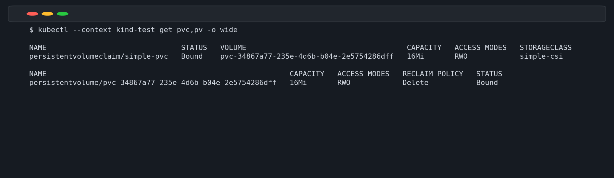
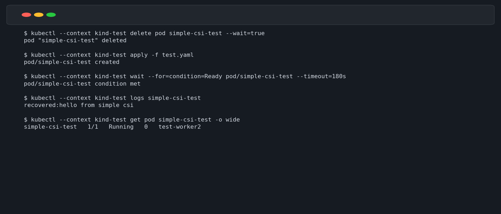

# 从零实现一个简单的 CSI 插件并在 kind 中验证

## 结论

本文实现了一个可运行的教学版 CSI 插件 `simple.csi.local`，并在本地三节点 kind 集群中完成动态创建 PVC、Pod 挂载、数据写入和 Pod 重建后的数据持久性验证。

插件使用 Go 实现 CSI Identity、Controller 和 Node 三类服务。`external-provisioner` 监听 PVC 并调用 `CreateVolume`；`csi-node-driver-registrar` 将 Node 插件注册到 kubelet；kubelet 调用 `NodePublishVolume`，插件通过 bind mount 将节点本地目录挂载到 Pod。

实际验证结果为：PVC 和 PV 均进入 `Bound` 状态，测试 Pod 正常运行；删除并重建 Pod 后，容器成功读取此前写入的 `hello from simple csi`。该实现适合学习 CSI 调用链，但不是生产级存储系统：它不支持跨节点共享、容量限制、扩容、快照、拓扑和故障恢复。

## 1. CSI 组件分工

CSI 插件通过 Unix Socket 提供 gRPC 服务。其中，Controller Service 由 external-provisioner 等 CSI Sidecar 容器调用，Node Service 由 kubelet 调用。Identity Service 返回插件名称、版本和能力；Controller Service 管理卷的创建与删除；Node Service 负责把卷挂载到业务 Pod 所在节点。

本示例将每个卷映射为节点上的一个目录：

```text
/var/lib/simple-csi/<volume-id>
```

`external-provisioner` 根据 PVC 调用 `CreateVolume`，插件创建这个目录。Pod 启动时，kubelet 调用 `NodePublishVolume`，插件使用 bind mount 将目录挂载到 kubelet 提供的目标路径。因为使用节点本地目录，所以同一个卷不能在不同节点之间共享数据。

## 2. 工作时序


创建 PVC 后，API Server 保存对象，external-provisioner 监听到 PVC 事件并调用 CSI Controller 的 `CreateVolume`。插件创建卷目录并返回 `volumeId`，随后 provisioner 创建 PV，使 PVC 与 PV 完成绑定。

创建 Pod 后，调度器选择运行节点。该节点的 kubelet 通过注册信息连接 CSI Unix Socket，调用 `NodePublishVolume(volumeId, targetPath)`。插件创建目标目录并执行 bind mount，kubelet 再把该目录挂入业务容器的 `/data`。

删除 Pod 时，kubelet 调用 `NodeUnpublishVolume` 解除挂载，但卷数据目录仍然保留。删除 PVC 后，external-provisioner 根据 `Delete` 回收策略调用 `DeleteVolume`，插件才会删除卷数据目录。

## 3. CSI 插件实现

下面是插件的核心实现。为便于学习，Controller 和 Node 服务由同一个进程提供。

```go
package main

import (
    "context"
    "flag"
    "log"
    "net"
    "os"
    "path/filepath"
    "syscall"

    csi "github.com/container-storage-interface/spec/lib/go/csi"
    "google.golang.org/grpc"
    "google.golang.org/grpc/codes"
    "google.golang.org/grpc/status"
)

// driver 同时实现 Identity、Controller 和 Node 三类 CSI 服务。
type driver struct {
    csi.UnimplementedIdentityServer
    csi.UnimplementedControllerServer
    csi.UnimplementedNodeServer
    nodeID   string
    dataRoot string
}

// GetPluginInfo 返回 CSI 驱动名称和版本。
func (d *driver) GetPluginInfo(context.Context, *csi.GetPluginInfoRequest) (*csi.GetPluginInfoResponse, error) {
    return &csi.GetPluginInfoResponse{Name: "simple.csi.local", VendorVersion: "0.1.0"}, nil
}

// GetPluginCapabilities 声明插件提供 Controller Service。
func (d *driver) GetPluginCapabilities(context.Context, *csi.GetPluginCapabilitiesRequest) (*csi.GetPluginCapabilitiesResponse, error) {
    return &csi.GetPluginCapabilitiesResponse{Capabilities: []*csi.PluginCapability{{
        Type: &csi.PluginCapability_Service_{Service: &csi.PluginCapability_Service{
            Type: csi.PluginCapability_Service_CONTROLLER_SERVICE,
        }},
    }}}, nil
}

func (d *driver) Probe(context.Context, *csi.ProbeRequest) (*csi.ProbeResponse, error) {
    return &csi.ProbeResponse{}, nil
}

// ControllerGetCapabilities 声明支持创建和删除卷。
func (d *driver) ControllerGetCapabilities(context.Context, *csi.ControllerGetCapabilitiesRequest) (*csi.ControllerGetCapabilitiesResponse, error) {
    return &csi.ControllerGetCapabilitiesResponse{Capabilities: []*csi.ControllerServiceCapability{{
        Type: &csi.ControllerServiceCapability_Rpc{Rpc: &csi.ControllerServiceCapability_RPC{
            Type: csi.ControllerServiceCapability_RPC_CREATE_DELETE_VOLUME,
        }},
    }}}, nil
}

// CreateVolume 使用 PVC 对应的名称作为 volumeId，并创建节点本地目录。
func (d *driver) CreateVolume(_ context.Context, r *csi.CreateVolumeRequest) (*csi.CreateVolumeResponse, error) {
    if r.Name == "" {
        return nil, status.Error(codes.InvalidArgument, "name is required")
    }
    id := r.Name
    if err := os.MkdirAll(filepath.Join(d.dataRoot, id), 0755); err != nil {
        return nil, status.Errorf(codes.Internal, "mkdir: %v", err)
    }
    log.Printf("CreateVolume name=%s id=%s", r.Name, id)
    return &csi.CreateVolumeResponse{Volume: &csi.Volume{
        VolumeId: id, CapacityBytes: r.CapacityRange.GetRequiredBytes(),
    }}, nil
}

// DeleteVolume 保持幂等：目录不存在时 RemoveAll 也会成功。
func (d *driver) DeleteVolume(_ context.Context, r *csi.DeleteVolumeRequest) (*csi.DeleteVolumeResponse, error) {
    if err := os.RemoveAll(filepath.Join(d.dataRoot, r.VolumeId)); err != nil {
        return nil, status.Errorf(codes.Internal, "remove: %v", err)
    }
    return &csi.DeleteVolumeResponse{}, nil
}

func (d *driver) ValidateVolumeCapabilities(context.Context, *csi.ValidateVolumeCapabilitiesRequest) (*csi.ValidateVolumeCapabilitiesResponse, error) {
    return &csi.ValidateVolumeCapabilitiesResponse{
        Confirmed: &csi.ValidateVolumeCapabilitiesResponse_Confirmed{},
    }, nil
}

func (d *driver) NodeGetInfo(context.Context, *csi.NodeGetInfoRequest) (*csi.NodeGetInfoResponse, error) {
    return &csi.NodeGetInfoResponse{NodeId: d.nodeID}, nil
}

func (d *driver) NodeGetCapabilities(context.Context, *csi.NodeGetCapabilitiesRequest) (*csi.NodeGetCapabilitiesResponse, error) {
    return &csi.NodeGetCapabilitiesResponse{}, nil
}

// NodePublishVolume 把卷目录 bind mount 到 kubelet 提供的 Pod 目标路径。
func (d *driver) NodePublishVolume(_ context.Context, r *csi.NodePublishVolumeRequest) (*csi.NodePublishVolumeResponse, error) {
    if r.VolumeId == "" || r.TargetPath == "" {
        return nil, status.Error(codes.InvalidArgument, "volume_id and target_path are required")
    }
    source := filepath.Join(d.dataRoot, r.VolumeId)
    if err := os.MkdirAll(source, 0755); err != nil {
        return nil, status.Errorf(codes.Internal, "mkdir source: %v", err)
    }
    if err := os.MkdirAll(r.TargetPath, 0755); err != nil {
        return nil, status.Errorf(codes.Internal, "mkdir target: %v", err)
    }
    if err := syscall.Mount(source, r.TargetPath, "", syscall.MS_BIND, ""); err != nil {
        // kubelet 可能重试请求，已挂载时直接返回成功以保证幂等。
        if err == syscall.EBUSY {
            return &csi.NodePublishVolumeResponse{}, nil
        }
        return nil, status.Errorf(codes.Internal, "bind mount: %v", err)
    }
    return &csi.NodePublishVolumeResponse{}, nil
}

// NodeUnpublishVolume 解除 bind mount 并清理 Pod 目标目录，不删除卷数据。
func (d *driver) NodeUnpublishVolume(_ context.Context, r *csi.NodeUnpublishVolumeRequest) (*csi.NodeUnpublishVolumeResponse, error) {
    if err := syscall.Unmount(r.TargetPath, 0); err != nil && err != syscall.EINVAL && err != syscall.ENOENT {
        return nil, status.Errorf(codes.Internal, "unmount: %v", err)
    }
    if err := os.RemoveAll(r.TargetPath); err != nil {
        return nil, status.Errorf(codes.Internal, "remove target: %v", err)
    }
    return &csi.NodeUnpublishVolumeResponse{}, nil
}

func main() {
    endpoint := flag.String("endpoint", "unix:///csi/csi.sock", "CSI Unix Socket")
    nodeID := flag.String("node-id", "node", "节点 ID")
    dataRoot := flag.String("data-root", "/var/lib/simple-csi", "卷数据根目录")
    flag.Parse()

    socketPath := (*endpoint)[len("unix://"):]
    _ = os.Remove(socketPath)
    if err := os.MkdirAll(filepath.Dir(socketPath), 0755); err != nil {
        log.Fatal(err)
    }
    listener, err := net.Listen("unix", socketPath)
    if err != nil {
        log.Fatal(err)
    }

    d := &driver{nodeID: *nodeID, dataRoot: *dataRoot}
    server := grpc.NewServer()
    csi.RegisterIdentityServer(server, d)
    csi.RegisterControllerServer(server, d)
    csi.RegisterNodeServer(server, d)
    log.Fatal(server.Serve(listener))
}
```

Go Module 使用公开的 CSI Spec 和 gRPC 依赖：

```go
module example.com/simple-csi

go 1.22

require (
    // CSI 官方接口定义。
    github.com/container-storage-interface/spec v1.9.0
    // CSI 使用 gRPC 作为通信协议。
    google.golang.org/grpc v1.62.1
)
```

容器镜像使用多阶段构建：

```dockerfile
# 编译阶段：生成不依赖 CGO 的 Linux 静态二进制。
FROM golang:1.22 AS build
WORKDIR /src
COPY go.mod go.sum* ./
RUN go mod download
COPY main.go ./
RUN CGO_ENABLED=0 GOOS=linux go build -o /simple-csi .

# 运行阶段：使用体积较小的 distroless 镜像。
FROM gcr.io/distroless/static-debian12:nonroot
COPY --from=build /simple-csi /simple-csi
ENTRYPOINT ["/simple-csi"]
```

## 4. 部署到 kind

DaemonSet 中包含插件、node-driver-registrar 和 external-provisioner 三个容器。插件需要特权权限执行 bind mount，并通过 `Bidirectional` 挂载传播让 kubelet 看到挂载结果。

```yaml
apiVersion: apps/v1
kind: DaemonSet
metadata:
  name: simple-csi
  namespace: kube-system
spec:
  selector:
    matchLabels:
      app: simple-csi
  template:
    metadata:
      labels:
        app: simple-csi
    spec:
      serviceAccountName: simple-csi
      # kind 控制平面节点通常带有污点，教学环境允许插件部署到所有节点。
      tolerations:
        - operator: Exists
      containers:
        - name: plugin
          image: simple-csi:dev
          imagePullPolicy: IfNotPresent
          args:
            - --endpoint=unix:///csi/csi.sock
            - --node-id=$(NODE_ID)
          env:
            - name: NODE_ID
              valueFrom:
                fieldRef:
                  fieldPath: spec.nodeName
          # bind mount 需要 root 和特权权限。
          securityContext:
            privileged: true
            runAsUser: 0
          volumeMounts:
            - name: plugin-dir
              mountPath: /csi
            - name: pods-dir
              mountPath: /var/lib/kubelet/pods
              mountPropagation: Bidirectional
            - name: data-dir
              mountPath: /var/lib/simple-csi
        - name: node-driver-registrar
          image: registry.k8s.io/sig-storage/csi-node-driver-registrar:v2.13.0
          args:
            - --csi-address=/csi/csi.sock
            - --kubelet-registration-path=/var/lib/kubelet/plugins/simple.csi.local/csi.sock
          volumeMounts:
            - name: plugin-dir
              mountPath: /csi
            - name: registration-dir
              mountPath: /registration
        - name: external-provisioner
          image: registry.k8s.io/sig-storage/csi-provisioner:v5.2.0
          args:
            - --csi-address=/csi/csi.sock
            - --leader-election=true
          volumeMounts:
            - name: plugin-dir
              mountPath: /csi
      volumes:
        - name: plugin-dir
          hostPath:
            path: /var/lib/kubelet/plugins/simple.csi.local
            type: DirectoryOrCreate
        - name: registration-dir
          hostPath:
            path: /var/lib/kubelet/plugins_registry
            type: Directory
        - name: pods-dir
          hostPath:
            path: /var/lib/kubelet/pods
            type: Directory
        - name: data-dir
          hostPath:
            path: /var/lib/simple-csi
            type: DirectoryOrCreate
---
apiVersion: storage.k8s.io/v1
kind: CSIDriver
metadata:
  name: simple.csi.local
spec:
  # 本地目录卷不需要 ControllerPublishVolume，即不需要 attach 阶段。
  attachRequired: false
  podInfoOnMount: false
---
apiVersion: storage.k8s.io/v1
kind: StorageClass
metadata:
  name: simple-csi
# 必须与 GetPluginInfo 返回的驱动名称一致。
provisioner: simple.csi.local
reclaimPolicy: Delete
volumeBindingMode: Immediate
```

部署前构建镜像并载入 kind 节点：

```bash
# 构建本地镜像。
docker build -t simple-csi:dev .

# 将镜像导入名为 test 的 kind 集群，避免从远端拉取。
kind load docker-image simple-csi:dev --name test

# 部署 RBAC、DaemonSet、CSIDriver 和 StorageClass。
kubectl --context kind-test apply -f deploy.yaml

# 等待 CSI 插件在所有节点就绪。
kubectl --context kind-test -n kube-system rollout status daemonset/simple-csi --timeout=180s
```

## 5. 创建 PVC 和测试 Pod

```yaml
apiVersion: v1
kind: PersistentVolumeClaim
metadata:
  name: simple-pvc
spec:
  storageClassName: simple-csi
  accessModes:
    - ReadWriteOnce
  resources:
    requests:
      storage: 16Mi
---
apiVersion: v1
kind: Pod
metadata:
  name: simple-csi-test
spec:
  restartPolicy: Never
  containers:
    - name: writer
      image: busybox:1.36
      # 第一次启动时写入文件；重建后输出已有文件内容。
      command:
        - sh
        - -c
        - if [ -f /data/result.txt ]; then echo recovered:$(cat /data/result.txt); else echo 'hello from simple csi' | tee /data/result.txt; fi; sleep 3600
      volumeMounts:
        - name: data
          mountPath: /data
  volumes:
    - name: data
      persistentVolumeClaim:
        claimName: simple-pvc
```

执行测试：

```bash
# 创建 PVC 和测试 Pod。
kubectl --context kind-test apply -f test.yaml

# 等待 Pod 完成卷挂载并进入 Ready 状态。
kubectl --context kind-test wait --for=condition=Ready pod/simple-csi-test --timeout=180s

# 检查容器写入的数据。
kubectl --context kind-test exec simple-csi-test -- cat /data/result.txt
```

## 6. 实际验证结果

PVC 与动态创建的 PV 均进入 `Bound` 状态，容量、访问模式和 StorageClass 与申请一致。



删除测试 Pod 后重新创建，新 Pod 能读取此前写入的数据，说明 Pod 生命周期结束时只解除了挂载，并没有删除卷目录。



验证使用的命令如下：

```bash
# 删除原 Pod，PVC 和 PV 保持不变。
kubectl --context kind-test delete pod simple-csi-test --wait=true

# 使用同一个 PVC 重建 Pod。
kubectl --context kind-test apply -f test.yaml

# 等待新 Pod 完成挂载。
kubectl --context kind-test wait --for=condition=Ready pod/simple-csi-test --timeout=180s

# 输出应为 recovered:hello from simple csi。
kubectl --context kind-test logs simple-csi-test
```

## 7. 实现边界与改进方向

该插件把卷映射到节点本地目录，但 `volumeBindingMode` 使用 `Immediate`，PV 本身也没有记录节点亲和性。因此，Pod 重建后如果被调度到另一节点，该节点会创建同名空目录，无法看到原节点的数据。更完整的本地存储插件应使用 `WaitForFirstConsumer`，实现 CSI 拓扑能力，并在 PV 中约束卷所属节点。

当前实现只把 PVC 请求容量写入 CSI 返回值，没有进行磁盘配额限制；也没有实现 `ControllerExpandVolume`、`NodeExpandVolume`、快照、卷统计和健康检测。生产实现还需要更严格的幂等处理、挂载点检测、并发控制、路径校验、错误恢复和安全隔离。

本示例为了减少组件数量，让 external-provisioner 与 Node 插件一起以 DaemonSet 运行，并通过 leader election 保证只有一个 provisioner 工作。生产环境通常将 Controller 插件及其 CSI Sidecar 容器部署为独立 Deployment，将 Node 插件和 node-driver-registrar 部署为 DaemonSet。
