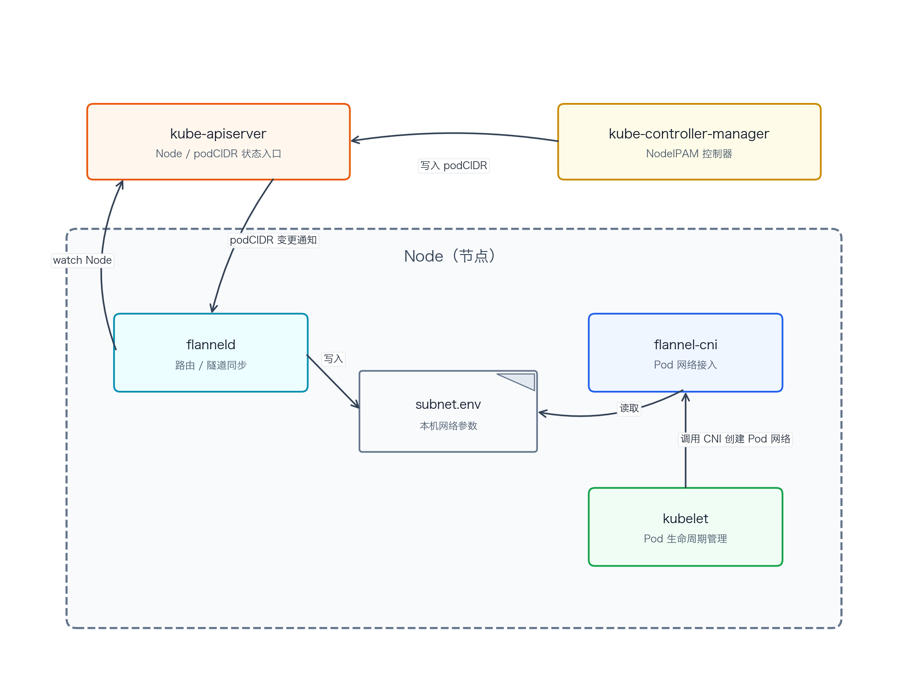

# flannel 架构

kube-apiserver 保存 Node 信息和 PodCIDR，是 kube-controller-manager 写入状态、flanneld 监听状态的统一入口。

kube-controller-manager 通过 NodeIPAM 为节点分配 PodCIDR，并写入 kube-apiserver 中的 Node 对象。

flanneld 运行在节点上，从 kube-apiserver watch Node 获取 PodCIDR，并把本节点网络参数写入 `/run/flannel/subnet.env`。

flannel-cni 运行在节点上，由 kubelet 创建 Pod 网络时调用，并读取 `/run/flannel/subnet.env` 完成 Pod 网络配置。

kubelet 运行在节点上，负责 Pod 生命周期管理，并在创建 Pod 沙箱时调用 flannel-cni。
