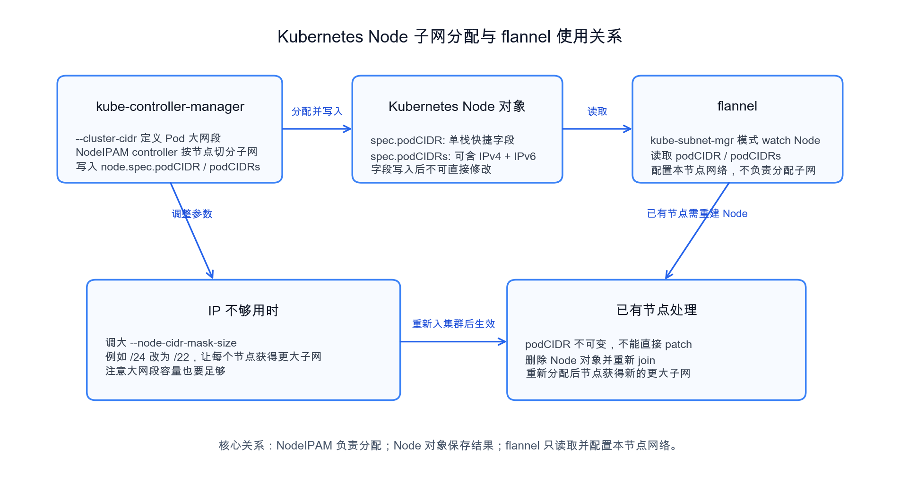

# Kubernetes 中 kube-controller-manager 与 flannel 的子网分配关系

本文说明 Kubernetes 集群中节点 Pod 子网的分配链路：kube-controller-manager 的 NodeIPAM controller 负责从集群 Pod 大网段中为每个 Node 分配子网，flannel 在 `kube-subnet-mgr` 模式下只读取 Node 对象上的分配结果，并据此配置本节点网络。文末给出当 Pod IP 不够用时的处理方案。

## 1. 子网分配的职责边界

在 Kubernetes 中，Pod 子网的分配职责属于 kube-controller-manager，而不是 flannel。kube-controller-manager 启用 NodeIPAM controller 后，会根据 `--cluster-cidr` 指定的集群 Pod 大网段，为每个 Node 分配一个较小的节点级 Pod 子网，并把分配结果写入 Node 对象的 `node.spec.podCIDR` 和 `node.spec.podCIDRs` 字段。

flannel 使用 Kubernetes 作为子网管理后端时，也就是运行在 `kube-subnet-mgr` 模式时，会 watch Node 对象，并从 `podCIDR` 或 `podCIDRs` 读取本节点已经分配好的 Pod 子网。随后 flannel 根据该子网配置本节点的网络接口和路由规则。也就是说，flannel 负责消费和应用子网分配结果，自身不负责从集群大网段里切分和分配节点子网。



## 2. `podCIDR` 与 `podCIDRs` 的关系

`node.spec.podCIDR` 可以理解为 `node.spec.podCIDRs[0]` 的快捷字段。单栈 IPv4 集群中，通常只需要关注 `podCIDR`，它与 `podCIDRs` 的第一项一致。双栈集群中，`podCIDRs` 会同时包含 IPv4 和 IPv6 两条 CIDR，通常第一条对应主协议族，第二条对应另一个协议族。

示例 Node 片段如下，字段内容仅用于说明结构。

```yaml
# Node 对象中的 Pod 子网字段示例
# podCIDR 是 podCIDRs[0] 的快捷字段，单栈集群中通常只看这一项即可
# podCIDRs 在双栈集群中可以同时保存 IPv4 和 IPv6 两条 Pod 子网
apiVersion: v1
kind: Node
metadata:
  name: worker-01
spec:
  podCIDR: 10.244.1.0/24
  podCIDRs:
    - 10.244.1.0/24
    - fd00:10:244:1::/64
```

## 3. 为什么不能直接 patch 修改已有 Node 的 `podCIDR`

Node 对象上的 `spec.podCIDR` 在写入后是不可变字段。也就是说，当 NodeIPAM controller 已经为某个节点分配过 Pod 子网后，不能通过 `kubectl patch node` 直接修改这个字段。即使修改 kube-controller-manager 的参数，也不会自动把已有 Node 的 `podCIDR` 改成新的更大网段。

下面命令只用于说明验证字段的观察方式，不代表可以直接修改 `podCIDR`。

```bash
# 查看节点上已经分配的 Pod 子网
# podCIDR 是快捷字段，podCIDRs 是完整列表，双栈时会有两条记录
kubectl get node worker-01 -o jsonpath='{.spec.podCIDR}{"\n"}{.spec.podCIDRs}{"\n"}'
```

如果尝试直接 patch 已有节点的 `spec.podCIDR`，通常会遇到不可变字段相关错误。因此，已有节点想要获得新的子网大小，需要重新触发 NodeIPAM 对该 Node 的分配流程。

## 4. Pod IP 不够用时的解决方案

当每个节点可用 Pod IP 不够时，常见原因是 kube-controller-manager 的 `--node-cidr-mask-size` 设置过小。例如 IPv4 场景下默认常见值为 24，即每个节点拿到一个 `/24` 子网。如果单节点需要承载更多 Pod，可以把该参数调大子网容量，例如改为 22，让每个节点获得 `/22` 子网。

需要注意，`--node-cidr-mask-size` 调整的是每个节点拿到的子网大小。节点子网变大后，同一个 `--cluster-cidr` 大网段内可容纳的节点数量会减少。因此调整前需要同时评估两个容量：单节点 Pod 数量是否足够，以及整个集群 Pod 大网段是否还能容纳预期节点数量。

配置示例如下。

```yaml
# kube-controller-manager 静态 Pod 参数示例
# --cluster-cidr 定义整个集群可用于 Pod 的大网段
# --allocate-node-cidrs=true 表示为 Node 分配 PodCIDR
# --node-cidr-mask-size=22 表示每个节点分配 /22 子网，比 /24 能容纳更多 Pod IP
apiVersion: v1
kind: Pod
metadata:
  name: kube-controller-manager
  namespace: kube-system
spec:
  containers:
    - name: kube-controller-manager
      command:
        - kube-controller-manager
        - --allocate-node-cidrs=true
        - --cluster-cidr=10.244.0.0/16
        - --node-cidr-mask-size=22
```

对新加入的节点，NodeIPAM 会按照新的 `--node-cidr-mask-size` 分配子网。对已经存在并已经写入 `podCIDR` 的节点，由于 `podCIDR` 不可变，需要先安全驱逐节点上的业务 Pod，然后删除 Kubernetes 中的 Node 对象，再让节点重新 join 集群。节点重新注册后，NodeIPAM 才会按新参数分配新的更大子网。

操作思路如下。

```bash
# 先驱逐节点上的业务 Pod，避免直接中断业务
kubectl drain worker-01 --ignore-daemonsets --delete-emptydir-data

# 删除旧的 Node 对象；删除后该 Node 的旧 podCIDR 记录也会释放
kubectl delete node worker-01

# 在节点侧按集群安装方式重新加入集群
# 具体 join 命令以当前集群生成的命令为准
kubeadm join <control-plane-endpoint> --token <token> --discovery-token-ca-cert-hash <hash>

# 重新加入后检查新的 Pod 子网是否已经按新 mask 分配
kubectl get node worker-01 -o jsonpath='{.spec.podCIDR}{"\n"}{.spec.podCIDRs}{"\n"}'
```
