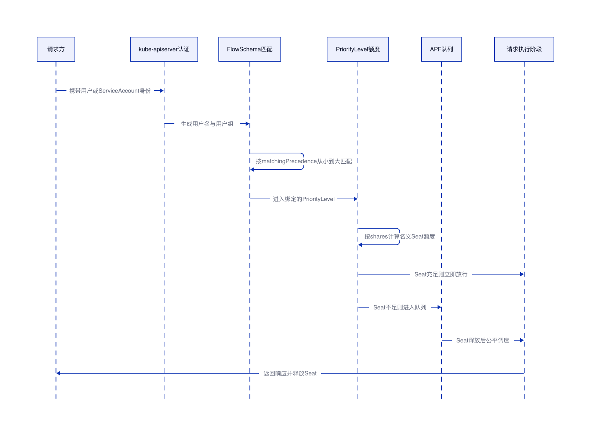

# kube-apiserver APF默认流并发量与ServiceAccount自定义

## 结论

APF 的“并发量”不是每个 FlowSchema 固定一个请求数，而是 FlowSchema 先把请求分到 PriorityLevel，PriorityLevel 再按 `nominalConcurrencyShares` 在 kube-apiserver 的 APF 总 Seat 中分配名义并发额度。以 Kubernetes v1.34.0 官方默认引导配置为例，Limited 类型 PriorityLevel 的 shares 总和是 245；如果 kube-apiserver 使用默认 `--max-requests-inflight=400` 和 `--max-mutating-requests-inflight=200`，可按 ServerCL=600 估算名义 Seat，则 `workload-low` 约 245 个 Seat，`workload-high` 约 98 个 Seat，`leader-election` 约 25 个 Seat，`system` 约 74 个 Seat，`node-high` 约 98 个 Seat，`global-default` 约 49 个 Seat，`catch-all` 约 13 个 Seat。这里的 Seat 是执行能力，不等同于请求条数，大 LIST 等请求会占用多个 Seat。

自定义 ServiceAccount 如果不在 `kube-system`，默认命中 `service-accounts` FlowSchema，进入 `workload-low`，名义额度约 245 个 Seat，但这是整个 `workload-low` PriorityLevel 共享的额度，不是单个 ServiceAccount 独占额度。自定义 ServiceAccount 如果在 `kube-system`，普通请求默认命中 `kube-system-service-accounts` FlowSchema，进入 `workload-high`，名义额度约 98 个 Seat；如果它发起的是 `coordination.k8s.io/leases` 的 `get/create/update` 领导选举请求，会先命中 `system-leader-election`，进入 `leader-election`，名义额度约 25 个 Seat。

要自己设置某个自定义 ServiceAccount 的并发量，做法是新建一个 PriorityLevelConfiguration 表达它的 shares 和排队策略，再新建一个更高匹配优先级的 FlowSchema 精确匹配该 ServiceAccount。不要直接把 `workload-high` 或 `exempt` 给普通业务控制器；这样会挤占系统控制面请求，风险高。

## 版本与计算口径

本文以 Kubernetes v1.34.0 的 APF 默认引导配置为基准。默认 FlowSchema 与 PriorityLevelConfiguration 来自 Kubernetes 源码中的 `staging/src/k8s.io/apiserver/pkg/apis/flowcontrol/bootstrap/default.go`，字段含义以 Kubernetes 官方 API 文档为准；不同 Kubernetes 版本或发行版可以调整这些默认对象，线上集群应以 `kubectl get flowschema` 和 `kubectl get prioritylevelconfiguration` 的实际输出为准。Kubernetes v1.34.0 默认 APF 源码

PriorityLevel 名义 Seat 的计算方式如下，`ceil` 表示向上取整。这个计算得到的是名义额度，实际运行时还会受到 Seat 估算、排队、借入借出、请求完成速度和 kube-apiserver 实际启动参数影响。Kubernetes PriorityLevelConfiguration API

```text
NominalCL(i) = ceil(ServerCL * NCS(i) / sum(NCS))
```

在默认 kube-apiserver 参数下：

```text
ServerCL = max-requests-inflight + max-mutating-requests-inflight = 400 + 200 = 600
sum(NCS) = 30 + 40 + 10 + 40 + 100 + 20 + 5 = 245
```

## APF请求流转链路



请求进入 kube-apiserver 后，APF 先按 FlowSchema 的 `matchingPrecedence` 从小到大匹配。匹配到 FlowSchema 后，请求进入该 FlowSchema 绑定的 PriorityLevel。PriorityLevel 有可用 Seat 时请求立即执行，没有可用 Seat 时按 `limitResponse` 决定排队或拒绝。默认配置中大多数 Limited PriorityLevel 使用 Queue，`catch-all` 使用 Reject。

## 默认PriorityLevel并发量

| PriorityLevel | 类型 | NCS | lendablePercent | 队列配置 | 默认 ServerCL=600 时的名义 Seat | 主要用途 |
|---|---:|---:|---:|---|---:|---|
| `exempt` | Exempt | 0 | 0% | 不走普通队列 | 不受普通 APF 限制 | 特权系统管理员请求、健康探针 |
| `node-high` | Limited | 40 | 25% | 64 队列，handSize 6，队列长 50 | 98 | 节点健康、节点 Lease、节点状态类高优先级请求 |
| `system` | Limited | 30 | 33% | 64 队列，handSize 6，队列长 50 | 74 | 节点和系统组件的普通系统请求 |
| `leader-election` | Limited | 10 | 0% | 16 队列，handSize 4，队列长 50 | 25 | 控制器领导选举 Lease 请求 |
| `workload-high` | Limited | 40 | 50% | 128 队列，handSize 6，队列长 50 | 98 | 内置控制器、调度器、`kube-system` ServiceAccount 的普通请求 |
| `workload-low` | Limited | 100 | 90% | 128 队列，handSize 6，队列长 50 | 245 | 其他 ServiceAccount 的请求 |
| `global-default` | Limited | 20 | 50% | 128 队列，handSize 6，队列长 50 | 49 | 非特权用户、普通 `kubectl` 等未被前置规则命中的请求 |
| `catch-all` | Limited | 5 | 0% | Reject，不排队 | 13 | 兜底流量，正常情况下被 `global-default` 先匹配 |

表里的并发量是 PriorityLevel 级别的名义 Seat，不是 FlowSchema 级别的固定并发，也不是单个 ServiceAccount 的独享并发。比如 `workload-high` 的约 98 个 Seat 会被 `kube-controller-manager`、`kube-scheduler`、`kube-system-service-accounts` 等 FlowSchema 命中的请求共同使用。

## 默认FlowSchema流向

| FlowSchema | matchingPrecedence | 进入的 PriorityLevel | distinguisherMethod | 默认匹配对象 | 并发量口径 |
|---|---:|---|---|---|---|
| `exempt` | 1 | `exempt` | 无 | `system:masters` 等特权组 | 不受普通 APF 限制 |
| `probes` | 2 | `exempt` | 无 | `/healthz`、`/readyz`、`/livez` 探针 | 不受普通 APF 限制 |
| `system-leader-election` | 100 | `leader-election` | `ByUser` | `kube-controller-manager`、`kube-scheduler`、`kube-system` ServiceAccount 的 Lease `get/create/update` | 共享 `leader-election` 的约 25 Seat |
| `system-node-high` | 400 | `node-high` | `ByUser` | 节点的 `nodes`、`nodes/status`、Lease 请求 | 共享 `node-high` 的约 98 Seat |
| `system-nodes` | 500 | `system` | `ByUser` | 节点组的其他资源和非资源请求 | 共享 `system` 的约 74 Seat |
| `kube-controller-manager` | 800 | `workload-high` | `ByNamespace` | `system:kube-controller-manager` | 共享 `workload-high` 的约 98 Seat |
| `kube-scheduler` | 800 | `workload-high` | `ByNamespace` | `system:kube-scheduler` | 共享 `workload-high` 的约 98 Seat |
| `kube-system-service-accounts` | 900 | `workload-high` | `ByNamespace` | `kube-system` 下的所有 ServiceAccount | 共享 `workload-high` 的约 98 Seat |
| `service-accounts` | 9000 | `workload-low` | `ByUser` | 所有 ServiceAccount | 共享 `workload-low` 的约 245 Seat |
| `global-default` | 9900 | `global-default` | `ByUser` | 所有认证和未认证用户 | 共享 `global-default` 的约 49 Seat |
| `catch-all` | 10000 | `catch-all` | `ByUser` | 所有认证和未认证用户 | 共享 `catch-all` 的约 13 Seat |

`matchingPrecedence` 数值越小越先匹配。`kube-system-service-accounts` 的优先级是 900，早于 `service-accounts` 的 9000，所以 `kube-system` 下的 ServiceAccount 普通请求会进入 `workload-high`，不会再落到 `workload-low`。但同一个 `kube-system` ServiceAccount 发起 Lease `get/create/update` 时，`system-leader-election` 的 100 更靠前，因此领导选举请求会进入 `leader-election`。

## 自定义ServiceAccount不在kube-system时的默认并发量

假设 ServiceAccount 是 `demo/my-controller`，它的用户名是 `system:serviceaccount:demo:my-controller`，用户组包含 `system:serviceaccounts` 和 `system:serviceaccounts:demo`。默认情况下，它不会命中 `kube-system-service-accounts`，会在 `service-accounts` 这条 FlowSchema 中被匹配，进入 `workload-low`。

| 请求来源 | 默认命中的 FlowSchema | 进入的 PriorityLevel | 默认名义 Seat | 是否单个 ServiceAccount 独占 |
|---|---|---|---:|---|
| `demo/my-controller` | `service-accounts` | `workload-low` | 约 245 | 否，所有非前置规则命中的 ServiceAccount 共享 |

`service-accounts` 使用 `ByUser` 区分 Flow，因此不同 ServiceAccount 会形成不同 Flow，APF 的公平排队会降低单个 ServiceAccount 长期占满队列的概率。但它们仍然共享 `workload-low` 这个 PriorityLevel 的总 Seat，不能把 245 理解为每个 ServiceAccount 都有 245 个并发。

## 自定义ServiceAccount在kube-system时的默认并发量

假设 ServiceAccount 是 `kube-system/my-controller`，普通资源请求会先命中 `kube-system-service-accounts`，进入 `workload-high`。如果它请求的是 `coordination.k8s.io/leases` 的 `get/create/update`，会更早命中 `system-leader-election`，进入 `leader-election`。

| 请求类型 | 默认命中的 FlowSchema | 进入的 PriorityLevel | 默认名义 Seat | 说明 |
|---|---|---|---:|---|
| 普通资源或非资源请求 | `kube-system-service-accounts` | `workload-high` | 约 98 | 与内置控制器、调度器等共享 |
| Lease `get/create/update` | `system-leader-election` | `leader-election` | 约 25 | 用于领导选举，额度更小但隔离性更强 |

`kube-system-service-accounts` 使用 `ByNamespace` 区分 Flow。对于放在 `kube-system` 的业务控制器，这意味着它默认会进入更高优先级的 `workload-high`，但也会与关键系统组件共享同一 PriorityLevel。普通业务控制器不要仅为了提高 APF 并发就放进 `kube-system`。

## 如何自己设置自定义ServiceAccount并发量

自定义并发量的核心是新增一组 APF 对象：一个 PriorityLevelConfiguration 定义并发权重和排队策略，一个 FlowSchema 精确匹配目标 ServiceAccount，并让它的 `matchingPrecedence` 早于默认 ServiceAccount 规则。

对于非 `kube-system` ServiceAccount，`matchingPrecedence` 设置为小于 9000 即可早于 `service-accounts`。对于 `kube-system` ServiceAccount，如果要覆盖普通请求，`matchingPrecedence` 需要小于 900；如果要覆盖领导选举 Lease 请求，`matchingPrecedence` 还要小于 100，这会影响控制器选主请求，应谨慎使用。

```yaml
apiVersion: flowcontrol.apiserver.k8s.io/v1
kind: PriorityLevelConfiguration
metadata:
  name: custom-sa-pl
spec:
  type: Limited
  limited:
    # 表示相对权重，不是固定请求并发数；实际 Seat 由 ServerCL、所有 Limited PriorityLevel 的 shares 总和共同决定。
    nominalConcurrencyShares: 20

    # 允许把暂时未用完的名义 Seat 借给其他 PriorityLevel，避免空闲额度浪费。
    lendablePercent: 50

    # 限制本 PriorityLevel 最多能从其他 PriorityLevel 借入多少额外 Seat；0 表示不主动借入。
    borrowingLimitPercent: 0

    limitResponse:
      type: Queue
      queuing:
        # 队列数量越多，流之间隔离空间越大，但维护成本更高。
        queues: 64

        # 每条 Flow 从 queues 中抽取 handSize 个候选队列，APF 再选择合适队列入队。
        handSize: 6

        # 单个队列最多积压的请求数；超过后返回 HTTP 429。
        queueLengthLimit: 50
---
apiVersion: flowcontrol.apiserver.k8s.io/v1
kind: FlowSchema
metadata:
  name: custom-sa-fs
spec:
  # 非 kube-system ServiceAccount 小于 9000 即可覆盖默认 service-accounts。
  # kube-system ServiceAccount 的普通请求要小于 900；领导选举 Lease 请求要小于 100 才能覆盖。
  matchingPrecedence: 2000

  # 命中该 FlowSchema 的请求进入上面定义的 PriorityLevel。
  priorityLevelConfiguration:
    name: custom-sa-pl

  # ByUser 会按用户区分 Flow，适合精确隔离不同 ServiceAccount。
  distinguisherMethod:
    type: ByUser

  rules:
    - subjects:
        - kind: ServiceAccount
          serviceAccount:
            name: my-controller
            namespace: demo
      resourceRules:
        - apiGroups: ["*"]
          resources: ["*"]
          verbs: ["*"]
          namespaces: ["*"]
          clusterScope: true
      nonResourceRules:
        - verbs: ["*"]
          nonResourceURLs: ["*"]
```

如果希望给 `kube-system/my-controller` 的普通请求单独设置并发，可以把 FlowSchema 改成如下主体，并把 `matchingPrecedence` 调整为小于 900。

```yaml
subjects:
  - kind: ServiceAccount
    serviceAccount:
      name: my-controller
      namespace: kube-system
matchingPrecedence: 850
```

调整 `nominalConcurrencyShares` 后，可以用下面的公式估算新 PriorityLevel 的名义 Seat。新增 PriorityLevel 后，`sum(NCS)` 会随之变大，其他 PriorityLevel 的名义 Seat 会被重新分配。

```text
新增后的 custom-sa-pl 名义 Seat = ceil(ServerCL * 20 / (245 + 20))
默认 ServerCL=600 时约为 ceil(600 * 20 / 265) = 46 Seat
```

这 46 个 Seat 仍然是 PriorityLevel 级别的执行能力。如果该 ServiceAccount 发起大量 LIST，每个请求占用多个 Seat，实际可同时执行的请求数会少于 46。反过来，如果请求很轻，执行很快，客户端看到的吞吐也不只由这个 Seat 数决定。
