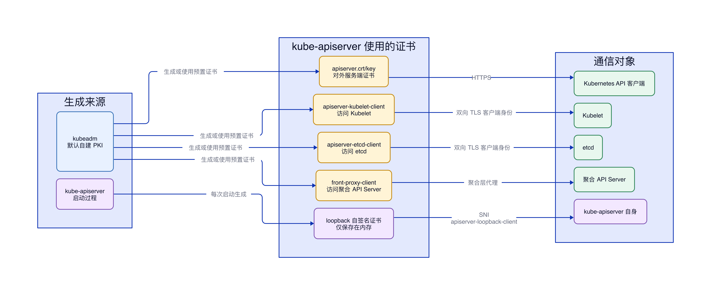
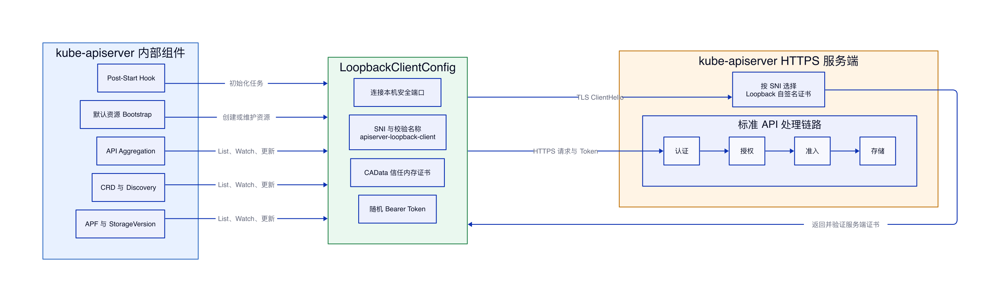

# kube-apiserver 证书机制

## 结论

本文分析对象为 Kubernetes v1.34.0。

在 kubeadm 默认自建 PKI、使用本地堆叠 etcd 的部署模式下，磁盘中的证书由 kubeadm 生成；loopback 证书由 kube-apiserver 每次启动时在内存中自行生成。若接入外部 CA、预置证书或外部 etcd，则磁盘证书不一定由 kubeadm 签发，kubeadm 只负责检查和使用。

kube-apiserver 使用的 X.509 证书可以分为三类：对外提供 HTTPS 服务的服务端证书、访问 Kubelet、etcd 和聚合 API Server 时出示的客户端证书，以及验证各类通信对端的 CA 证书。此外，kube-apiserver 会在启动时生成一张只保存在内存中的 loopback 自签名服务端证书，用于安全地调用自身 API。

ServiceAccount 使用的 `sa.key` 和 `sa.pub` 是 JWT 签名密钥，不是 X.509 证书，不属于本文讨论范围。


## kube-apiserver 持有的证书

| 证书 | kube-apiserver 的角色 | 签发者 | 默认位置或保存方式 | 主要用途 |
|---|---|---|---|---|
| API Server 服务端证书 | HTTPS 服务端 | Kubernetes CA | `/etc/kubernetes/pki/apiserver.crt`、`apiserver.key` | 对 kubectl、控制面组件和 Kubelet 等客户端提供 HTTPS 服务 |
| Kubelet 客户端证书 | HTTPS 客户端 | Kubernetes CA | `/etc/kubernetes/pki/apiserver-kubelet-client.crt`、`.key` | 调用 Kubelet，承载 logs、exec、attach 和 port-forward 等请求 |
| etcd 客户端证书 | HTTPS 客户端 | etcd CA | `/etc/kubernetes/pki/apiserver-etcd-client.crt`、`.key` | 通过双向 TLS 访问 etcd |
| Front Proxy 客户端证书 | HTTPS 客户端 | Front Proxy CA | `/etc/kubernetes/pki/front-proxy-client.crt`、`.key` | 通过聚合层访问扩展 API Server |
| Loopback 服务端证书 | HTTPS 服务端 | 自签名 | 仅保存在 kube-apiserver 进程内存中 | kube-apiserver 通过 loopback 地址调用自身 API |
| 额外 SNI 服务端证书 | HTTPS 服务端 | 外部 CA 或自定义 CA | 由 `--tls-sni-cert-key` 指定 | 为不同域名返回对应的服务端证书 |

API Server 默认服务端证书的 SAN 应覆盖集群内实际访问入口，包括 Kubernetes Service IP、控制面节点 IP、主机名、负载均衡 VIP 和相关 DNS 名称。额外 SNI 证书不是 kubeadm 默认 PKI 的必需组成部分，只有显式配置 `--tls-sni-cert-key` 时才会加载。

## kube-apiserver 加载的 CA 证书

| CA 证书 | 对应配置 | 验证对象 |
|---|---|---|
| Kubernetes CA | `--client-ca-file` | 验证访问 kube-apiserver 的客户端证书 |
| etcd CA | `--etcd-cafile` | 验证 etcd 服务端证书 |
| Front Proxy CA | `--requestheader-client-ca-file` | 验证能够通过请求头传递用户身份的可信代理 |
| Kubelet CA | `--kubelet-certificate-authority` | 验证 Kubelet 服务端证书；该配置不是 kubeadm 默认必然生成并启用的独立证书项 |

CA 证书用于建立信任，不要求 kube-apiserver 持有对应 CA 私钥。生产环境不应把 CA 私钥挂载到 kube-apiserver 容器中。

## kubeadm 生成磁盘证书

在默认自建 PKI 模式下，`kubeadm init` 会按阶段生成 CA、服务端证书和客户端证书。相关阶段如下：

```bash
# 生成 Kubernetes 根 CA
kubeadm init phase certs ca --config kubeadm.yaml

# 生成 kube-apiserver 对外提供 HTTPS 服务的证书
kubeadm init phase certs apiserver --config kubeadm.yaml

# 生成 kube-apiserver 访问 Kubelet 的客户端证书
kubeadm init phase certs apiserver-kubelet-client --config kubeadm.yaml

# 为本地堆叠 etcd 生成独立 CA 和 kube-apiserver 客户端证书
kubeadm init phase certs etcd-ca --config kubeadm.yaml
kubeadm init phase certs apiserver-etcd-client --config kubeadm.yaml

# 生成聚合层使用的 CA 和 kube-apiserver 客户端证书
kubeadm init phase certs front-proxy-ca --config kubeadm.yaml
kubeadm init phase certs front-proxy-client --config kubeadm.yaml
```

如果目标路径中已经存在完整且符合要求的证书与私钥，kubeadm 会使用现有文件，不会覆盖并重新签发。接入外部 CA 时，kubeadm 可以生成待外部 CA 签发的证书请求；使用外部 etcd 时，etcd CA、etcd 服务端证书和 kube-apiserver 访问 etcd 的客户端证书也可以由外部 etcd 管理方提供。

## loopback 证书生成机制

loopback 证书不由 kubeadm 生成。kube-apiserver 每次启动时，通用 API Server 框架执行 `SecureServingOptionsWithLoopback.ApplyTo()`，调用 `GenerateSelfSignedCertKeyWithOptions()` 在内存中生成证书和私钥：

```go
// Kubernetes v1.34.0 为 loopback 证书设置 1096 天有效期。
maxAge := (3*365 + 1) * 24 * time.Hour

// Host 使用固定的虚拟服务端名称，不依赖 127.0.0.1 或节点地址。
certPem, keyPem, err := certutil.GenerateSelfSignedCertKeyWithOptions(
    certutil.SelfSignedCertKeyOptions{
        Host:   server.LoopbackClientServerNameOverride,
        MaxAge: maxAge,
    },
)
```

`LoopbackClientServerNameOverride` 的固定值是：

```text
apiserver-loopback-client
```

生成后的证书被注册为 SNI 证书，并放在 SNI 证书列表最前面。内部客户端虽然连接 `127.0.0.1` 或本机 IPv6 loopback 地址，但 TLS ClientHello 携带的 SNI 和校验名称都是 `apiserver-loopback-client`。kube-apiserver 因此返回专用的 loopback 证书，而不是磁盘中的 `apiserver.crt`。

客户端指定的 SNI 就是其 TLS 配置中的 `ServerName`。未显式指定时，客户端一般使用连接目标的主机名；Go 标准库则通过 `tls.Config.ServerName` 显式设置。这个值具有两个作用：TLS ClientHello 会把它作为 SNI 发送给服务端，客户端还会用它校验服务端证书中的 DNS 名称。

kube-apiserver 的 loopback 客户端在 `rest.Config` 中设置：

```go
TLSClientConfig: rest.TLSClientConfig{
    ServerName: "apiserver-loopback-client",
}
```

该配置最终会转换为 Go 标准库的 `tls.Config.ServerName`。因此，即使实际 TCP 连接目标是 `127.0.0.1:6443`，ClientHello 中的 SNI 仍固定为 `apiserver-loopback-client`，从而命中内存中的 loopback SNI 证书；客户端也使用同一个名称校验证书。

使用 OpenSSL 测试时，`-servername apiserver-loopback-client` 用于显式指定 SNI。curl 没有单独的 `ServerName` 参数，SNI 默认取 URL 中的主机名；若客户端已经信任该自签名证书，要连接 `127.0.0.1`，同时让 SNI 和证书校验名称保持为 `apiserver-loopback-client`，可以通过 `--resolve` 把该名称解析到目标地址：

```bash
curl --resolve apiserver-loopback-client:6443:127.0.0.1 https://apiserver-loopback-client:6443/
```

`--connect-to` 也可以只改变实际连接地址，同时保留 URL 主机名作为 SNI 和证书校验名称。

loopback 客户端配置同时把该证书放入 `CAData`，从而直接信任这张自签名证书。客户端身份认证仍由启动时生成的随机 Bearer Token 完成。两者职责不同：loopback 证书负责 TLS 服务端身份验证，Bearer Token 负责客户端身份认证。

在 Kubernetes v1.34.0 中，loopback 证书有效期为 `1096` 天，即约三年。证书和私钥不会写入 `/etc/kubernetes/pki`，也不会被 `kubeadm certs check-expiration` 管理。kube-apiserver 重启后会重新生成证书、私钥和有效期。

## 为什么需要 loopback 证书

kube-apiserver 进程内部有一部分控制逻辑不会直接调用底层存储函数，而是使用 Kubernetes Client 重新请求自身 API。因此，kube-apiserver 在这些流程中同时扮演 HTTPS 服务端和客户端。

内部客户端连接的是 `127.0.0.1`、本机 IPv6 loopback 地址或本地绑定地址，而磁盘中的对外服务端证书不一定包含这些地址。专用 loopback 证书通过固定 SNI `apiserver-loopback-client` 消除本机地址与证书 SAN 不匹配的问题，也使内部访问不依赖外部 DNS、负载均衡、Service IP 和集群网络。

内部调用仍然通过标准 Kubernetes API 处理链路。loopback 证书负责验证 HTTPS 服务端身份，随机 Bearer Token 负责客户端身份认证；请求进入 kube-apiserver 后，继续经过认证、授权、准入、审计和存储流程。



## 哪些流程会触发 loopback 调用

具体控制器会随 Kubernetes 版本和启用的 API 功能变化，但判断标准保持一致：只要 kube-apiserver 进程内部的组件使用 `LoopbackClientConfig` 创建客户端并访问自身 API，就会触发 loopback TLS 连接。

| 场景或流程 | 是否使用 loopback | 主要操作 | 说明 |
|---|---:|---|---|
| Post-Start Hook | 是 | 初始化、等待同步 | 启动内部控制器并执行 API Server 启动后的初始化任务 |
| 默认资源 Bootstrap | 是 | Create、Get、Update | 创建或维护默认 Namespace、`kubernetes` Service 等系统资源 |
| API Aggregation | 是 | List、Watch、Update | 维护 `APIService` 注册、可用性状态和 OpenAPI 聚合 |
| CRD 与 API Extensions | 是 | List、Watch、Update | 监听 CRD，维护发现信息和相关资源状态 |
| OpenAPI 与 Discovery | 是 | List、Watch、刷新 | 聚合并刷新 API 定义和发现信息 |
| StorageVersion 管理 | 是 | List、Watch、Update | 读取和维护 API 存储版本信息 |
| API Priority and Fairness | 是 | List、Watch、Update | 监听并维护流量控制相关资源 |
| 内部 Informer | 是 | List、Watch | 为 kube-apiserver 内部控制器提供资源缓存和事件 |
| `kubectl` 访问 kube-apiserver | 否 | 用户 API 请求 | 使用 kubeconfig 中配置的 CA、客户端证书、Token 或认证插件 |
| Kubelet、Scheduler、Controller Manager | 否 | 组件 API 请求 | 使用各自 kubeconfig 中的客户端凭据 |
| Pod 访问 `kubernetes.default.svc` | 否 | Pod API 请求 | 使用 ServiceAccount Token 和集群 CA |
| kube-apiserver 访问 etcd | 否 | 存储读写 | 使用 etcd CA 和 apiserver-etcd-client 证书 |
| kube-apiserver 访问 Kubelet | 否 | logs、exec、attach 等 | 使用 apiserver-kubelet-client 证书 |

一次典型调用的关键链路是：内部组件通过 `LoopbackClientConfig` 连接本机安全端口，TLS ClientHello 携带 `apiserver-loopback-client` SNI，服务端返回内存中的 loopback 证书；TLS 建立后，客户端携带随机 Bearer Token 发出 API 请求，请求随后进入 kube-apiserver 的标准处理链路。

## 非 kube-apiserver 调用者能否使用 loopback 连接

非 kube-apiserver 进程可以触发并接收 loopback 服务端证书。kube-apiserver 根据 TLS ClientHello 中的 SNI 选择服务端证书，不会在 TLS 层判断连接是否由自身进程发起。只要调用者能访问 kube-apiserver 的 HTTPS 端口，并把 SNI 设置为 `apiserver-loopback-client`，kube-apiserver 就会返回内存中的 loopback 自签名证书。

这只代表调用者能够尝试建立 TLS 连接，不代表它能通过 Kubernetes API 认证。loopback 证书是服务端证书，作用是让内部客户端验证被调用方是 kube-apiserver；客户端不会出示该证书，也不依靠它证明自己的身份。由于证书是自签名证书，其他调用者还必须预先信任这张证书，或者跳过服务端证书验证，才能完成 TLS 校验。

TLS 建立后，kube-apiserver 使用启动时随机生成的 Bearer Token 认证 loopback 客户端。内部客户端发出的 HTTP 请求相当于：

```http
Authorization: Bearer <loopback-token>
```

非 kube-apiserver 调用者若没有当前进程对应的 Token，请求会认证失败。仅获取 loopback 证书，甚至同时获取其私钥，都不能获得 loopback 客户端身份；真正需要防止泄漏的是随机 Bearer Token。

| 调用者持有的材料 | 能否建立 TLS | 能否通过 loopback 身份认证 |
|---|---|---|
| 仅有 loopback 证书 | 可以，但必须信任该自签名证书 | 不能 |
| loopback 证书和私钥 | 可以 | 不能 |
| loopback Token，并跳过证书验证 | 可以 | 可以 |
| loopback 证书和 Token | 可以 | 可以 |

因此，非 kube-apiserver 调用者确实可以触发这张证书并建立 TLS 连接，但不能仅凭该证书调通需要认证的 Kubernetes API。只有同时获得当前 kube-apiserver 进程的 loopback Bearer Token，才能冒充内部 loopback 客户端，安全风险集中在 Token 泄漏。

## 检查 loopback 证书是否过期

loopback 证书只保存在 kube-apiserver 内存中，不能直接读取 `/etc/kubernetes/pki`，也不能通过 `kubeadm certs check-expiration` 检查。应在控制平面节点上连接 kube-apiserver 的 HTTPS 端口，并显式携带 `apiserver-loopback-client` SNI，从 TLS 握手中取出当前进程实际使用的证书。

```bash
# 查看证书的生效时间、过期时间、签发者、使用者和 SAN
openssl s_client -connect 127.0.0.1:6443 -servername apiserver-loopback-client -showcerts </dev/null 2>/dev/null | openssl x509 -noout -subject -issuer -startdate -enddate -ext subjectAltName
```

若只需要输出证书的过期时间，可以执行：

```bash
# 仅输出过期时间 notAfter
openssl s_client -connect 127.0.0.1:6443 -servername apiserver-loopback-client </dev/null 2>/dev/null | openssl x509 -noout -enddate
```

同时输出生效时间和过期时间，可以执行：

```bash
# 输出 notBefore 和 notAfter
openssl s_client -connect 127.0.0.1:6443 -servername apiserver-loopback-client </dev/null 2>/dev/null | openssl x509 -noout -dates
```

若 kube-apiserver 使用的安全端口不是 `6443`，需要把命令中的端口替换为 `--secure-port` 的实际值。关键参数是 `-servername apiserver-loopback-client`；缺少它时，服务端可能返回磁盘中的默认 `apiserver.crt`，检查结果将不是 loopback 证书。

可以使用下面的命令直接判断当前证书是否已经过期：

```bash
# 返回“Certificate will not expire”表示当前未过期；返回“Certificate has expired”表示已经过期
openssl s_client -connect 127.0.0.1:6443 -servername apiserver-loopback-client </dev/null 2>/dev/null | openssl x509 -noout -checkend 0
```

提前检查证书是否会在未来 30 天内过期时，把检查窗口设置为 `2592000` 秒：

```bash
# 返回“Certificate will expire”表示证书将在未来 30 天内到期
openssl s_client -connect 127.0.0.1:6443 -servername apiserver-loopback-client </dev/null 2>/dev/null | openssl x509 -noout -checkend 2592000
```

`openssl x509 -checkend` 返回码为 `0` 表示证书在指定秒数之后仍然有效，返回码非 `0` 表示证书已经过期或将在检查窗口内过期。Kubernetes v1.34.0 的 loopback 证书过期后，应重启对应的 kube-apiserver 进程，使其重新生成证书、私钥和有效期；多控制面集群应逐个实例检查和滚动重启，因为每个 kube-apiserver 进程都维护自己的 loopback 证书。

## 证书与启动参数的对应关系

kube-apiserver 的主要证书配置可以概括为：

```yaml
# 对外 HTTPS 服务端证书
--tls-cert-file=/etc/kubernetes/pki/apiserver.crt
--tls-private-key-file=/etc/kubernetes/pki/apiserver.key

# 验证访问 kube-apiserver 的客户端证书
--client-ca-file=/etc/kubernetes/pki/ca.crt

# 访问 Kubelet 时出示的客户端证书
--kubelet-client-certificate=/etc/kubernetes/pki/apiserver-kubelet-client.crt
--kubelet-client-key=/etc/kubernetes/pki/apiserver-kubelet-client.key

# 访问 etcd 时验证服务端并出示客户端证书
--etcd-cafile=/etc/kubernetes/pki/etcd/ca.crt
--etcd-certfile=/etc/kubernetes/pki/apiserver-etcd-client.crt
--etcd-keyfile=/etc/kubernetes/pki/apiserver-etcd-client.key

# 聚合层验证可信代理并访问扩展 API Server
--requestheader-client-ca-file=/etc/kubernetes/pki/front-proxy-ca.crt
--proxy-client-cert-file=/etc/kubernetes/pki/front-proxy-client.crt
--proxy-client-key-file=/etc/kubernetes/pki/front-proxy-client.key
```

loopback 证书没有对应的命令行文件参数，因为它由 kube-apiserver 内部代码生成并注册到 SNI 证书列表中。磁盘证书的更新由部署者或 kubeadm 负责，loopback 证书的更新则通过重启 kube-apiserver 自动完成。
