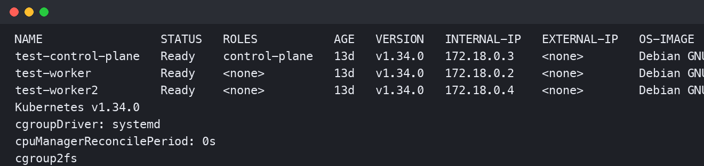
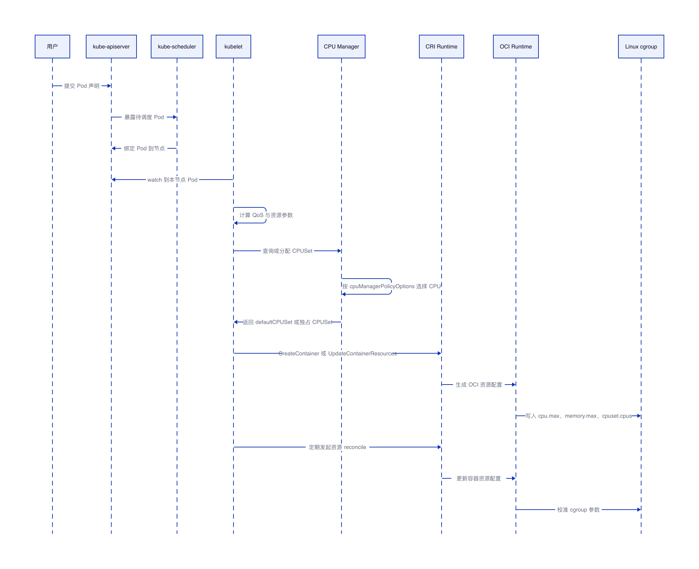
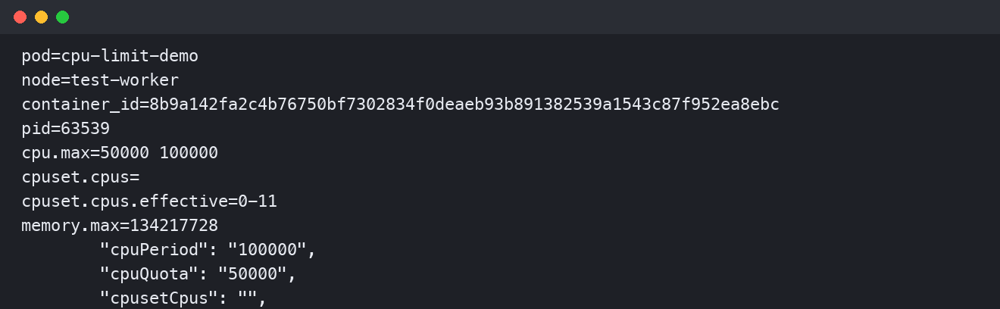
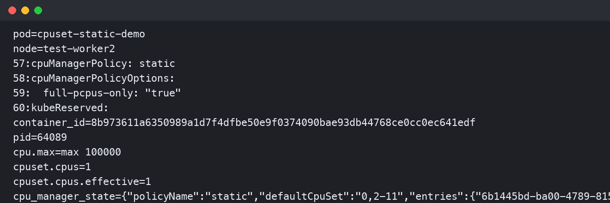

# kubelet cgroup 与 cpuset 配置机制

## 结论

kubelet 对 cgroup 的配置可以分成两条主线：CPU、内存这类资源上限会被转换成 cgroup controller 参数，CPU 亲和性则由 CPU Manager 在 static policy 下决定。对于 cgroup v2，CPU limit 落到 `cpu.max`；对于 cgroup v1，CPU limit 落到 `cpu.cfs_quota_us / cpu.cfs_period_us`。`cpuset.cpus` 不是 CPU limit 的直接结果，它来自 kubelet CPU Manager 对共享 CPU 池或独占 CPU 的分配结果。

在 Kubernetes v1.34.0 的实测 kind 集群中，普通 Burstable Pod 设置 `limits.cpu: 500m` 后，容器 cgroup 中的 `cpu.max` 为 `50000 100000`；启用 `cpuManagerPolicy: static` 和 `cpuManagerPolicyOptions.full-pcpus-only: "true"` 后，Guaranteed 整数核 Pod 被 CPU Manager 分配到独占 CPU，容器 cgroup 中的 `cpuset.cpus` 被设置为 `1`，同时 kubelet 的 `cpu_manager_state` 记录了 `defaultCpuSet` 和容器独占 CPUSet。

## 验证环境

| 项目 | 值 |
|---|---|
| 测试集群 | 本地 kind test 集群 |
| Kubernetes 版本 | v1.34.0 |
| 容器运行时 | containerd 2.1.3 |
| cgroup 版本 | cgroup v2 |
| kubelet cgroup driver | systemd |
| 验证节点 | test-worker、test-worker2 |



## kubelet 配置 cgroup 的整体链路



用户将 Pod 声明提交给 kube-apiserver 后，kube-scheduler 会把 Pod 绑定到目标节点；节点上的 kubelet 通过 kube-apiserver watch 到属于本节点的 Pod，再完成 QoS 分类和资源参数计算。对于 CPU、内存、PID 这类普通资源，kubelet 将资源参数放进 CRI 的 `LinuxContainerResources`；containerd 或 CRI-O 再生成 OCI 配置，最后由 OCI runtime 写入 Linux cgroup。对于 `cpuset.cpus`，kubelet 还会经过 CPU Manager，由 CPU Manager 决定该容器使用共享 CPU 池还是独占 CPUSet。

## CPU limit 到 cgroup 参数的映射

| Kubernetes 配置 | cgroup v1 | cgroup v2 | 说明 |
|---|---|---|---|
| `requests.cpu` | `cpu.shares` | `cpu.weight` | CPU 竞争时的相对权重 |
| `limits.cpu` | `cpu.cfs_quota_us / cpu.cfs_period_us` | `cpu.max` | CPU 时间上限 |
| `limits.memory` | `memory.limit_in_bytes` | `memory.max` | 内存使用上限 |
| `cpuset` | `cpuset.cpus` | `cpuset.cpus` | CPU 亲和性，不是 CPU limit 的默认结果 |

cgroup v1 中，CPU limit 的计算方式是 `可用 CPU 核数 = cpu.cfs_quota_us / cpu.cfs_period_us`。例如 `50000 / 100000 = 0.5`，表示容器最多使用 0.5 核 CPU 时间。cgroup v2 把这两个值合并到了 `cpu.max`，格式是 `<quota> <period>`；不限制时为 `max 100000`。

本地 kind 集群实测创建了一个 Burstable Pod，配置如下：

```yaml
apiVersion: v1
kind: Pod
metadata:
  name: cpu-limit-demo
spec:
  containers:
    - name: cpu-limit-demo
      image: registry.k8s.io/pause:3.10
      resources:
        requests:
          cpu: 250m      # 参与调度和 CPU 权重计算
          memory: 64Mi   # 参与调度和 QoS 分类
        limits:
          cpu: 500m      # 在 cgroup v2 中映射为 cpu.max = 50000 100000
          memory: 128Mi  # 在 cgroup v2 中映射为 memory.max = 134217728
```



验证结果显示，`limits.cpu: 500m` 对应 `cpu.max=50000 100000`，`limits.memory: 128Mi` 对应 `memory.max=134217728`。该 Pod 没有启用独占 CPU，因此容器自己的 `cpuset.cpus` 为空，但 `cpuset.cpus.effective=0-11` 表示它实际继承了父 cgroup 的可用 CPU 集合。

## CPU Manager static 与 cpuset.cpus

`cpuset.cpus` 由 CPU Manager 控制。kubelet 使用 `cpuManagerPolicy` 选择 CPU Manager 策略，并通过 `cpuManagerPolicyOptions` 细化 static policy 的行为。Kubernetes 官方文档中列出的 static policy options 包括 `full-pcpus-only`、`distribute-cpus-across-numa`、`align-by-socket`、`distribute-cpus-across-cores`、`strict-cpu-reservation` 和 `prefer-align-cpus-by-uncorecache`。

```yaml
apiVersion: kubelet.config.k8s.io/v1beta1
kind: KubeletConfiguration
cpuManagerPolicy: static              # 启用 CPU Manager static policy
cpuManagerPolicyOptions:
  full-pcpus-only: "true"              # 只分配完整物理核，避免只拿同一物理核的部分硬件线程
cpuManagerReconcilePeriod: 10s        # 定期把内存中的 CPU 分配状态同步到容器 cgroup
kubeReserved:
  cpu: 100m                            # 为 kubelet 等节点组件预留资源，用于形成 reserved pool
```

在 static policy 下，kubelet 会维护 `defaultCPUSet` 和容器级分配结果。普通 BestEffort、Burstable 以及不满足独占条件的 Guaranteed 容器运行在 `defaultCPUSet` 上。满足 Guaranteed QoS、CPU request 等于 CPU limit、CPU 数量为整数核的容器，可以从 `defaultCPUSet` 中获得独占 CPUSet。

本地 kind 集群在 `test-worker2` 上启用 `cpuManagerPolicy: static` 和 `full-pcpus-only: "true"` 后，创建了如下 Guaranteed Pod：

```yaml
apiVersion: v1
kind: Pod
metadata:
  name: cpuset-static-demo
spec:
  containers:
    - name: cpuset-static-demo
      image: registry.k8s.io/pause:3.10
      resources:
        requests:
          cpu: "1"       # 整数核请求，是独占 CPU 分配的必要条件
          memory: 128Mi   # 与 limit 相等，使 Pod 满足 Guaranteed QoS
        limits:
          cpu: "1"       # 与 request 相等，使 CPU Manager 可以分配独占 CPU
          memory: 128Mi   # 与 request 相等，使 Pod 满足 Guaranteed QoS
```



验证结果显示，CPU Manager 给该容器分配了独占 CPU `1`，容器 cgroup 中的 `cpuset.cpus=1`，`cpu_manager_state` 中的 `entries` 也记录了该 Pod 对应的 CPUSet。同时 `defaultCpuSet` 变成 `0,2-11`，说明 CPU `1` 已经从共享池中移出。

## 关键判断点

| 问题 | 明确结论 |
|---|---|
| CPU limit 是否等于 cpuset | 不是，CPU limit 控制 CPU 时间上限，cpuset 控制进程可以在哪些 CPU 上运行 |
| cgroup v1 下 CPU limit 写哪里 | 写入 `cpu.cfs_quota_us / cpu.cfs_period_us` |
| cgroup v2 下 CPU limit 写哪里 | 写入 `cpu.max` |
| 什么时候设置容器级 `cpuset.cpus` | 启用 CPU Manager static policy，且容器满足 Guaranteed、整数 CPU、request 等于 limit |
| `cpuManagerPolicyOptions` 影响什么 | 影响 static policy 选择哪些 CPU，例如完整物理核、NUMA、socket、core、uncore cache 对齐等 |
| kubelet 是否直接写所有 cgroup 文件 | kubelet 负责策略和资源参数，最终通常由 CRI runtime 和 OCI runtime 写入容器 cgroup |
