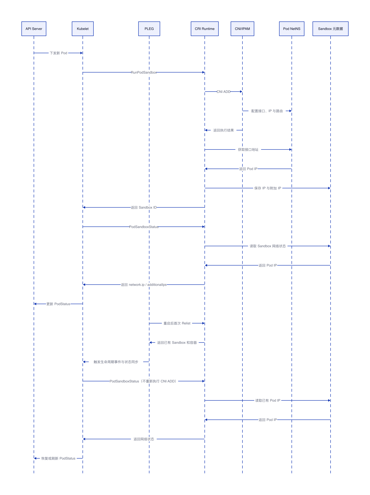

# Kubelet 如何获取 Pod IP

## 结论

Kubelet 不会直接执行 CNI，也不会直接进入 Pod NetNS 读取普通 Pod 的 IP。除 `hostNetwork` Pod 外，Kubelet 统一通过 CRI `PodSandboxStatus` 获取 Sandbox 网络状态，再把主 IP 和附加 IP 写入 Kubernetes `PodStatus.PodIP` 与 `PodStatus.PodIPs`。

PLEG 不直接读取 Pod IP。它负责发现 Sandbox 和容器的生命周期变化，并触发 Pod 状态同步。无论是新建 Pod、周期性状态同步，还是 Kubelet 重启后重新发现已有 Pod，普通 Pod 的 IP 最终都来自 CRI `PodSandboxStatus`。

| 场景 | 是否执行 CNI `ADD` | Kubelet 获取 IP 的方式 | 关键触发者 |
| --- | --- | --- | --- |
| 新建普通 Pod | 是 | `PodSandboxStatus` | Pod worker 创建 Sandbox |
| 已运行 Pod 状态同步 | 否 | `PodSandboxStatus` | 周期同步或状态变化 |
| Kubelet 重启，Sandbox 正常 | 否 | `PodSandboxStatus` | PLEG 重新发现并触发同步 |
| containerd 重启，Sandbox 成功恢复 | 否 | `PodSandboxStatus` | PLEG、Pod worker 或周期同步 |
| Sandbox 丢失或不可用 | 是，重新创建时执行 | 新 Sandbox 的 `PodSandboxStatus` | Pod worker 重建 Sandbox |
| dockershim 重启后发现已有 Pause 容器 | 否 | `PodSandboxStatus`，运行时侧检查 NetNS | PLEG 重新发现并触发同步 |
| `hostNetwork` Pod | 否 | Kubelet 使用节点 IP | Kubelet 状态生成逻辑 |
| 双栈 Pod | 新建时执行一次 | `ip` 与 `additionalIps` | 与普通 Pod 相同 |

## 获取时序



## 新建普通 Pod

新建 Pod 时，Kubelet 先调用 `RunPodSandbox`。CRI Runtime 创建 Sandbox 并执行 CNI `ADD`，CNI/IPAM 把地址配置到 Pod NetNS。CRI Runtime 随后取得并保存 Sandbox 网络状态。

`RunPodSandbox` 的响应只返回 Sandbox ID，不直接携带 Pod IP。Kubelet 需要调用 `PodSandboxStatus`，从以下字段取得地址：

```text
status.network.ip
status.network.additionalIps
```

Kubelet 将这些地址转换为 `PodStatus.PodIP` 和 `PodStatus.PodIPs`，再通过 status manager 更新到 API Server。

## 已运行 Pod 的状态同步

Pod 已经运行时，Kubelet 的状态同步、周期性同步或其他 Pod worker 触发条件都会重新查询运行时状态。Pod IP 仍然来自 `PodSandboxStatus`，不会重新执行 CNI `ADD`。

## Kubelet 重启

Kubelet 重启后，本地 PLEG 缓存重新初始化。PLEG 首次 `Relist` 通过 CRI 发现节点上已经存在的 Sandbox 和容器，并产生生命周期事件，推动 Pod worker 重新同步。

PLEG 只负责发现运行时变化和触发同步，不读取 Pod IP。状态同步过程中，Kubelet 调用 `PodSandboxStatus` 获取已有 Pod IP。只要原 Sandbox 仍然处于 Ready 状态，就不会因为 Kubelet 重启而重新执行 CNI `ADD`。

## containerd 重启

containerd 重启后，如果 Sandbox、NetNS 和元数据均成功恢复，Kubelet 查询 `PodSandboxStatus` 时，containerd 从恢复后的 Sandbox 网络元数据返回 Pod IP，不重新执行 CNI `ADD`。

如果 Sandbox 元数据丢失、Sandbox 不再 Ready 或 NetNS 已失效，Kubelet 会把原 Sandbox 视为不可用并重新创建。只有进入重新创建 Sandbox 的流程时，CRI Runtime 才会再次执行 CNI `ADD`。

## dockershim 与 Docker 场景

Kubelet 重启时，内置 dockershim 也随之重启。Docker Engine 可以重新提供已有 Pause 容器及其 NetNS 信息，但不会保存由 Kubernetes CNI 配置的 Pod IP。dockershim 根据已有 Sandbox NetNS 恢复网络状态，并通过 `PodSandboxStatus` 把地址返回给 Kubelet。

因此，Kubelet 对 containerd 和 dockershim 使用相同的 CRI 查询方式，差别在于运行时侧如何恢复 Pod IP：containerd 读取 Sandbox 元数据，dockershim 根据 Pause 容器的 NetNS 查询地址。

## hostNetwork Pod

`hostNetwork: true` 的 Pod 不创建独立 Pod 网络，也不执行普通 CNI `ADD`。它直接使用节点网络命名空间，Kubelet 将节点 IP 作为 Pod IP。这个场景不依赖 CRI 返回普通 Sandbox 的 CNI 网络地址。

## 双栈 Pod

双栈 Pod 的获取入口不变。CRI Runtime 通过 `status.network.ip` 返回主 IP，通过 `status.network.additionalIps` 返回其他地址。Kubelet 整理后写入 `PodStatus.PodIPs`，并用首个地址设置 `PodStatus.PodIP`。

## Pod IP 为空或非法

如果 `PodSandboxStatus` 没有返回地址，普通 Pod 的 `PodStatus.PodIP` 会保持为空，等待后续状态同步。如果返回的地址无法解析，Kubelet 会记录运行时状态查询或 IP 解析错误。

| 检查位置 | 检查内容 |
| --- | --- |
| Kubernetes Pod 状态 | `status.podIP`、`status.podIPs` 是否为空 |
| CRI Sandbox 状态 | `crictl inspectp <sandbox-id>` 中的 `status.network` |
| CRI Runtime 元数据 | Sandbox IP、附加 IP 和 NetNS 路径是否完整 |
| Pod NetNS | 默认接口是否存在、地址是否已经配置 |
| CNI/IPAM 状态 | 地址是否成功分配，缓存与实际 NetNS 是否一致 |
