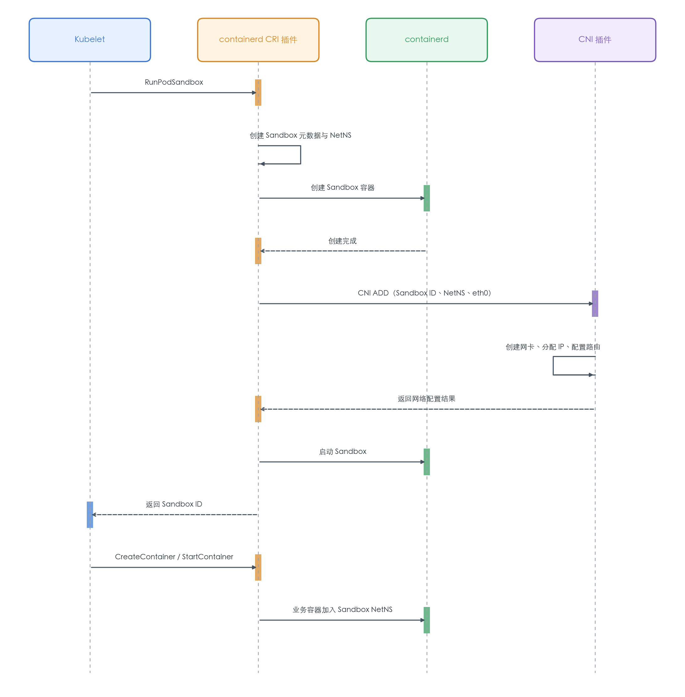
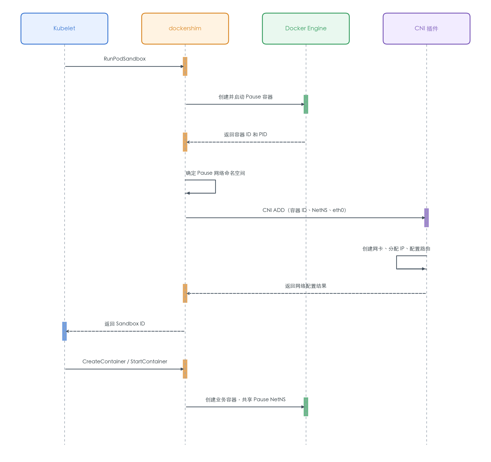

# kubelet 调用 CNI 流程（containerd 与 dockershim 对比）

## 结论

Kubelet 通常不直接执行 CNI 插件。它通过 CRI 发起 Pod Sandbox 创建请求，再由 CRI 实现负责调用 CNI：containerd 场景由 containerd 的 CRI 插件调用 CNI；dockershim 场景由 Kubelet 内置的 dockershim 调用 CNI。

两种实现的共同点是：CNI 只为 Pod Sandbox 配置一次网络，业务容器随后共享 Sandbox 的网络命名空间，不会逐个调用 CNI。

| 场景 | 调用链路 | CNI 调用者 |
| --- | --- | --- |
| containerd | Kubelet → CRI gRPC → containerd CRI 插件 → CNI | containerd CRI 插件 |
| dockershim | Kubelet → dockershim → CNI | dockershim |

## containerd 场景

### Pod 创建流程

containerd 通常从 `/etc/cni/net.d/` 加载网络配置，从 `/opt/cni/bin/` 查找插件程序。执行 CNI 时，关键输入包括 Sandbox ID、网络命名空间路径、容器内接口名（通常是 `eth0`）以及 Kubernetes Pod 元数据。

CNI 插件完成的具体动作取决于网络实现，常见操作包括创建 veth pair、把容器侧接口移入 Sandbox 网络命名空间、分配 IP、配置路由以及写入必要的网络规则。

### Pod 删除流程

Kubelet 调用 `StopPodSandbox` 后，containerd CRI 插件通过 CNI `DEL` 清理网络并释放 IP，随后停止和删除 Sandbox。即使网络命名空间已经丢失，CNI 实现也应尽可能根据缓存信息完成幂等清理。

## dockershim 场景

### Pod 创建流程

Docker Engine 负责容器生命周期，但不负责实现 Kubernetes 的 CNI 网络配置。dockershim 在 Pause 容器启动后找到其网络命名空间，再调用 CNI。业务容器创建时使用共享容器网络命名空间的方式加入 Pause 容器，因此同一 Pod 内的容器共享 IP、路由、接口和端口空间。

### Pod 删除流程

Kubelet 发起 Sandbox 停止请求后，dockershim 调用 CNI `DEL` 释放 IP、删除虚拟网卡并清理网络资源，然后通过 Docker API 停止和删除 Pause 容器。

## Sandbox NetNS 与 Pause 容器 NetNS 的区别

### 本质区别

两者在 Linux 网络命名空间层面没有本质区别：目标都是为一个 Pod 准备独立 NetNS，并让 Pod 内所有业务容器加入该 NetNS。Pod 内容器因此共享 IP、网卡、路由和端口空间。

真正的区别在于 NetNS 由谁管理，以及运行时通过什么方式让业务容器加入。

| 对比项 | containerd 的 Sandbox NetNS | dockershim 的 Pause 容器 NetNS |
| --- | --- | --- |
| 抽象主体 | CRI PodSandbox | Docker Pause 容器 |
| 生命周期管理者 | containerd CRI 插件 | dockershim 与 Docker Engine |
| NetNS 创建和持有 | CRI 插件创建或管理 NetNS，并与 Sandbox 关联；Linux 默认实现通常仍由 Sandbox/Pause 进程保持其生命周期 | Docker 启动 Pause 容器并创建 NetNS，由 Pause 进程保持其生命周期 |
| CNI 调用者 | containerd CRI 插件 | dockershim |
| 业务容器加入方式 | containerd 按 Sandbox 配置把容器加入同一个 NetNS | Docker 使用共享 Pause 容器网络命名空间的方式加入，例如 `container:<pause-container-id>` |
| 对上层暴露 | Kubelet 面向统一的 CRI Sandbox，不依赖具体容器实现 | dockershim 把 CRI Sandbox 映射为 Docker Pause 容器 |
| 扩展能力 | Sandbox 抽象可以适配普通 Linux 容器、虚拟机 Sandbox 等不同实现 | 与 Docker 容器和 Pause 容器模型耦合较深 |

### 如何理解

在默认 Linux containerd 场景中，Pod Sandbox 通常也会运行一个 Pause 容器。因此，“Sandbox NetNS”并不表示不再需要 Pause 进程，而是强调 NetNS 属于 CRI 的 PodSandbox 抽象，并由 containerd CRI 插件统一管理。

在 dockershim 场景中，Sandbox 基本等同于 Docker 中的 Pause 容器。dockershim 先让 Docker 创建并启动 Pause 容器，再根据其 PID 找到 NetNS，调用 CNI 完成网络配置。后续业务容器通过 Docker 的容器网络共享能力加入该 NetNS。

因此可以简单记为：containerd 以 **CRI Sandbox** 为管理中心，dockershim 以 **Docker Pause 容器** 为实现中心；底层共享的仍然是同一个 Linux Network Namespace。

## 关键差异

| 对比项 | containerd | dockershim |
| --- | --- | --- |
| CRI 实现位置 | containerd 内部的 CRI 插件 | Kubelet 内置 |
| 容器生命周期管理 | 直接使用 containerd 内部接口 | 通过 Docker API |
| CNI 调用位置 | containerd 进程侧 | Kubelet/dockershim 侧 |
| Pod 网络承载者 | Pod Sandbox | Pause 容器 |
| 业务容器网络 | 共享 Sandbox NetNS | 共享 Pause 容器 NetNS |
| 当前状态 | Kubernetes 常用方案 | 已从 Kubernetes 1.24 移除 |

## CNI 调用边界

CNI 关注的是“如何配置一个已有的网络命名空间”，不负责创建业务容器。一次典型的 `ADD` 调用需要以下信息：

| 输入 | 作用 |
| --- | --- |
| `CNI_COMMAND=ADD` | 表示添加网络 |
| `CNI_CONTAINERID` | 标识 Pod Sandbox |
| `CNI_NETNS` | 指定需要配置的网络命名空间 |
| `CNI_IFNAME` | 指定容器内接口名，通常为 `eth0` |
| `CNI_PATH` | 指定 CNI 插件程序搜索路径 |
| stdin 中的 JSON | 传递插件链、IPAM 和运行时参数 |

同一个 Pod 的普通业务容器不会重复执行 CNI `ADD`。它们通过共享 Sandbox 网络命名空间获得相同的网络环境。

## 常见故障定位

| 现象 | 优先检查 |
| --- | --- |
| `RunPodSandbox` 超时 | CRI 日志、CNI 插件耗时、IPAM 状态 |
| `cni config not initialized` | `/etc/cni/net.d/` 是否存在有效配置 |
| 找不到 CNI 插件 | `/opt/cni/bin/` 及运行时配置的插件路径 |
| Pod 一直处于 `ContainerCreating` | Kubelet 事件、运行时日志、CNI 日志 |
| `failed to setup network for sandbox` | 插件链、IP 地址池、路由和宿主机网络依赖 |
| `failed to destroy network for sandbox` | CNI 缓存、NetNS 是否提前删除、`DEL` 幂等性 |

排障时应围绕 `RunPodSandbox` 关联 Sandbox ID，并按“Kubelet → CRI 实现 → CNI 插件 → IPAM/数据面”的顺序定位。
