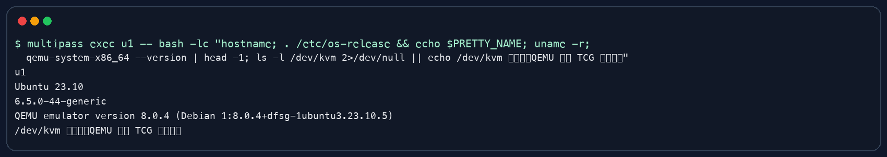
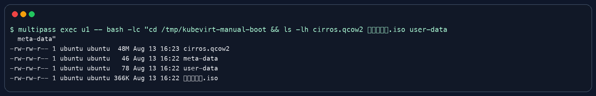
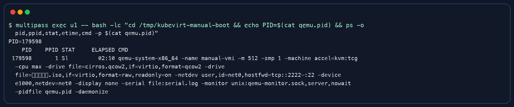
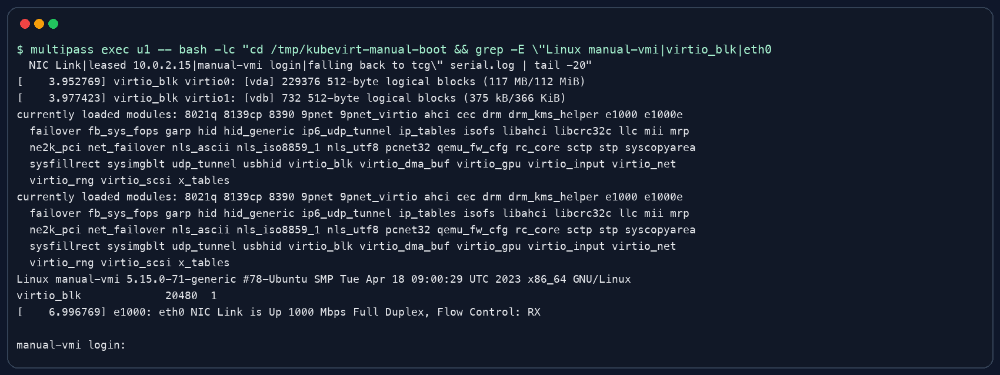
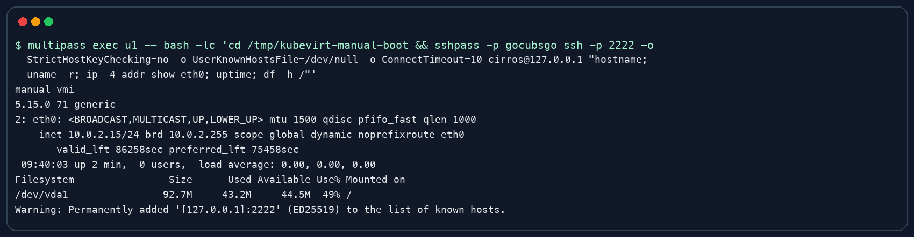

# KubeVirt 从 virt-launcher Pod 到虚拟机开机过程

## 结论

KubeVirt 从 kubelet 启动虚拟机容器开始，并不是由 kubelet 直接启动虚拟机。kubelet 只负责把 `virt-launcher Pod` 按普通 Pod 拉起来，真正把 VMI 转成虚拟机进程的是节点上的 `virt-handler` 和 Pod 内的 `virt-launcher`。主链路是：kubelet 创建 Pod 运行环境，`virt-launcher` 初始化控制通道，`virt-handler` 准备磁盘、网络和设备，再调用 `virt-launcher` 生成 libvirt Domain，libvirt 启动 QEMU/KVM，Guest OS 完成 BIOS/UEFI、kernel、systemd 和 cloud-init 初始化，最后由 `virt-handler` 把运行状态回写到 VMI。

本文分析版本为 KubeVirt v1.4.0 的通用启动链路。不同小版本的函数名和部分实现细节会变化，但 `kubelet -> virt-launcher Pod -> virt-handler -> virt-launcher -> libvirt -> QEMU/KVM -> Guest OS -> VMI status` 这条核心链路保持一致。

本地验证使用 `u1` 虚拟机手动模拟关键动作。该模拟不是完整 KubeVirt 集群，而是用 QEMU 手动复刻 `virt-launcher` 最核心的执行行为：准备虚拟机磁盘和初始化数据，启动 QEMU 进程，观察 Guest OS 开机日志，并用进程状态类比 Domain 运行状态。


## kubelet 启动 virt-launcher Pod

当 VMI 已经被调度到某个节点后，kubelet 看到的是一个普通 Pod，也就是 `virt-launcher Pod`。kubelet 按容器运行时流程创建 Pod sandbox、调用 CNI 创建网络命名空间、挂载 PVC、containerDisk、cloud-init、ConfigMap、Secret 等 volume，然后启动 `virt-launcher` 容器。

这里的关键点是：kubelet 不理解虚拟机语义，也不会直接拼 QEMU 命令。kubelet 只保证承载虚拟机的 Pod 环境存在，后续虚拟机开机由 KubeVirt 节点侧组件继续推动。

## virt-launcher 初始化虚拟机控制入口

`virt-launcher` 容器启动后，会先初始化运行目录、本地 libvirt 相关能力和 Unix socket。这个 socket 是 `virt-handler` 控制虚拟机的入口。可以把 `virt-launcher` 理解为虚拟机在 Pod 内的执行代理，它在 Pod 的隔离环境中负责创建和管理 QEMU 进程。

`virt-launcher` 不只是启动阶段存在。虚拟机运行期间，它会一直陪伴 QEMU 生命周期，用于响应关机、强制停止、暂停、迁移、console 访问和状态查询等操作。

## virt-handler 准备虚拟机运行环境

节点上的 `virt-handler` watch 到 VMI 已调度到当前节点，并且对应的 `virt-launcher Pod` 已经可用后，会进入同步逻辑。这个同步逻辑的目标是让节点实际状态追上 VMI 期望状态。

`virt-handler` 会准备磁盘、网络、cgroup 和虚拟设备。磁盘可能来自 PVC、DataVolume、containerDisk、emptyDisk、cloud-init、Secret 或 ConfigMap。网络会在 Pod 网络命名空间基础上继续创建 tap 设备、桥接、NAT 或其他接入方式。CPU、内存、NUMA、hugepages、SR-IOV、GPU、watchdog、rng、console、serial、firmware 等配置也会在这一阶段被整理成虚拟机运行所需的描述。

## virt-launcher 生成 libvirt Domain

环境准备完成后，`virt-handler` 通过 Unix socket 调用 `virt-launcher`，把 VMI 期望状态下发过去。`virt-launcher` 根据 VMI spec 生成 libvirt Domain XML。

Domain XML 是虚拟机启动的核心描述，包含虚拟机名称、UID、CPU 拓扑、内存大小、磁盘、网卡、console、serial、firmware、PCI 地址和 QEMU 参数。此时虚拟机还没有真正开机，只是已经具备了可以交给 libvirt 创建的完整定义。

## libvirt 启动 QEMU/KVM

`virt-launcher` 调用 libvirt API 定义并启动 Domain。libvirt 根据 Domain XML 生成最终 QEMU 运行配置，然后 fork/exec QEMU 进程。QEMU 初始化 vCPU、内存、virtio 磁盘、virtio 网卡等虚拟硬件。如果节点支持硬件虚拟化，QEMU 通过 KVM 加速运行；如果没有 KVM，则可以退化成软件模拟，但性能会明显下降。

从这一刻开始，虚拟机才真正进入开机过程。Guest OS 会依次经历 BIOS/UEFI、bootloader、kernel、systemd 和 cloud-init。cloud-init 读取初始化数据盘中的 user-data 和 meta-data，完成主机名、用户、SSH key、网络和启动脚本等初始化动作。

## 状态回写到 VMI

QEMU 运行后，libvirt 可以感知 Domain 状态，例如 Running、Paused、Shutoff 或 Crashed。`virt-launcher` 查询或接收这些状态，`virt-handler` 再把状态同步回 Kubernetes API Server 的 VMI status。用户通过 `kubectl get vmi` 或 `virtctl` 看到的状态，就是这条链路回写后的结果。

## 本地模拟验证

本地使用 Multipass 中的 `u1` 虚拟机进行验证。验证环境是 Ubuntu 23.10。由于 `u1` 中没有 `/dev/kvm`，QEMU 启动时自动回退到 TCG 软件模拟，这不影响理解启动链路，只是性能低于 KVM 加速。



### 步骤 1：安装验证工具

先在 `u1` 中安装 QEMU 和 cloud-init 镜像生成工具。这个动作只是为了本地手动模拟，真实 KubeVirt 节点上这些能力由节点镜像、virt-launcher 镜像和运行时环境提供。

```bash
multipass exec u1 -- bash -lc 'sudo DEBIAN_FRONTEND=noninteractive apt-get update && sudo DEBIAN_FRONTEND=noninteractive apt-get install -y qemu-system-x86 qemu-utils cloud-image-utils'
```

### 步骤 2：准备工作目录和虚拟机系统盘

创建临时工作目录，并下载一个 CirrOS qcow2 镜像作为虚拟机系统盘。这个动作对应真实 KubeVirt 中准备 PVC、DataVolume 或 containerDisk 的过程。

```bash
multipass exec u1 -- bash -lc 'rm -rf /tmp/kubevirt-manual-boot && mkdir -p /tmp/kubevirt-manual-boot && cd /tmp/kubevirt-manual-boot && curl -L -o cirros.qcow2 https://download.cirros-cloud.net/0.6.2/cirros-0.6.2-x86_64-disk.img'
```

### 步骤 3：准备 cloud-init 初始化数据盘

写入 `user-data` 和 `meta-data`，再生成 `初始化数据.iso`。这个动作对应真实 KubeVirt 中准备 cloud-init volume 的过程，Guest OS 启动后会从这个只读介质读取初始化配置。

```bash
multipass exec u1 -- bash -lc 'cd /tmp/kubevirt-manual-boot && printf "#cloud-config\n" > user-data && printf "{\"uuid\":\"manual-vmi\",\"hostname\":\"manual-vmi\"}\n" > meta-data && cloud-localds 初始化数据.iso user-data meta-data && ls -lh cirros.qcow2 初始化数据.iso user-data meta-data'
```



### 步骤 4：手动启动 QEMU

执行下面的命令启动 QEMU。这个动作对应真实 KubeVirt 中 `virt-launcher` 调用 libvirt，再由 libvirt 根据 Domain XML 创建 QEMU 进程的过程。命令里的系统盘、初始化数据盘、网卡、串口日志、monitor socket 和 pidfile，分别对应 Domain XML 中的磁盘、cloud-init、网络、console、monitor 和进程管理配置。

```bash
multipass exec u1 -- bash -lc 'cd /tmp/kubevirt-manual-boot && qemu-system-x86_64 -name manual-vmi -m 512 -smp 1 -machine accel=kvm:tcg -cpu max -drive file=cirros.qcow2,if=virtio,format=qcow2 -drive file=初始化数据.iso,if=virtio,format=raw,readonly=on -netdev user,id=net0,hostfwd=tcp::2222-:22 -device e1000,netdev=net0 -display none -serial file:serial.log -monitor unix:qemu-monitor.sock,server,nowait -pidfile qemu.pid -daemonize'
```

### 步骤 5：观察 QEMU 进程

启动后通过 pidfile 找到 QEMU 进程。这个动作对应真实 KubeVirt 中观察 libvirt Domain 已经进入运行状态。

```bash
multipass exec u1 -- bash -lc 'cd /tmp/kubevirt-manual-boot && echo PID=$(cat qemu.pid) && ps -o pid,ppid,stat,etime,cmd -p $(cat qemu.pid)'
```



### 步骤 6：查看 Guest OS 开机日志

最后查看串口日志。日志中可以看到 Guest 内核启动、virtio 块设备识别、网卡 link up、DHCP 获取地址，以及进入 `manual-vmi login`。这些现象对应 KubeVirt 中虚拟机从 QEMU 进程启动到 Guest OS 完成基础开机的过程。

```bash
multipass exec u1 -- bash -lc 'cd /tmp/kubevirt-manual-boot && grep -E "Linux manual-vmi|virtio_blk|eth0 NIC Link|leased 10.0.2.15|manual-vmi login|falling back to tcg" serial.log | tail -20'
```



### 步骤 7：登录 Guest OS 确认虚拟机可用

只看到启动日志还不能完整证明虚拟机可用，还需要登录进 Guest OS 执行命令。这里通过 QEMU user network 的 `hostfwd=tcp::2222-:22` 端口转发，从 `u1` 访问本地 `127.0.0.1:2222`，登录 CirrOS 测试镜像内部，然后检查主机名、内核版本、网卡地址、运行时间和根文件系统。命令能正常返回，说明 Guest OS 已经完成开机，网络和文件系统也可正常使用。

```bash
multipass exec u1 -- bash -lc 'cd /tmp/kubevirt-manual-boot && sshpass -p gocubsgo ssh -p 2222 -o StrictHostKeyChecking=no -o UserKnownHostsFile=/dev/null -o ConnectTimeout=10 cirros@127.0.0.1 "hostname; uname -r; ip -4 addr show eth0; uptime; df -h /"'
```



## 手动模拟和真实 KubeVirt 的对应关系

| 手动模拟动作 | 对应 KubeVirt 阶段 |
|---|---|
| 准备 qcow2 镜像 | 准备 PVC、DataVolume 或 containerDisk |
| 准备初始化数据 ISO | 准备 cloud-init volume |
| 执行 QEMU 命令 | libvirt 根据 Domain XML 启动 QEMU |
| 观察 QEMU 进程 | 观察 libvirt Domain / virt-launcher 内的 QEMU |
| 查看 serial.log | 查看 Guest OS BIOS、kernel、cloud-init 启动过程 |
| 看到 login 提示 | Guest OS 已完成基础开机 |
| SSH 登录 Guest OS 并执行命令 | 确认虚拟机网络、系统和文件系统可用 |

真实 KubeVirt 比手动模拟多了 Kubernetes API、VMI 对象、Pod 生命周期、CNI、CRI、libvirt Domain XML 生成、状态回写、热插拔、迁移和异常恢复等自动化能力。手动模拟只保留最核心的一段：准备输入，启动 QEMU，Guest OS 开机，观察运行状态。
