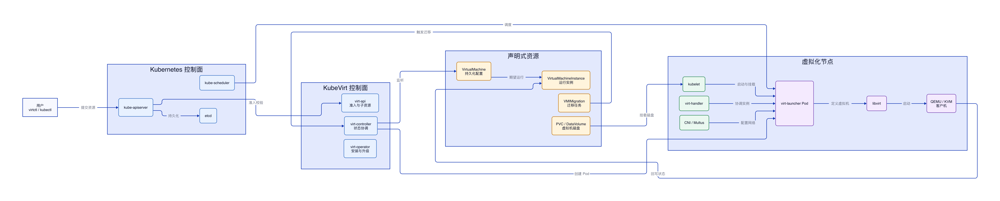
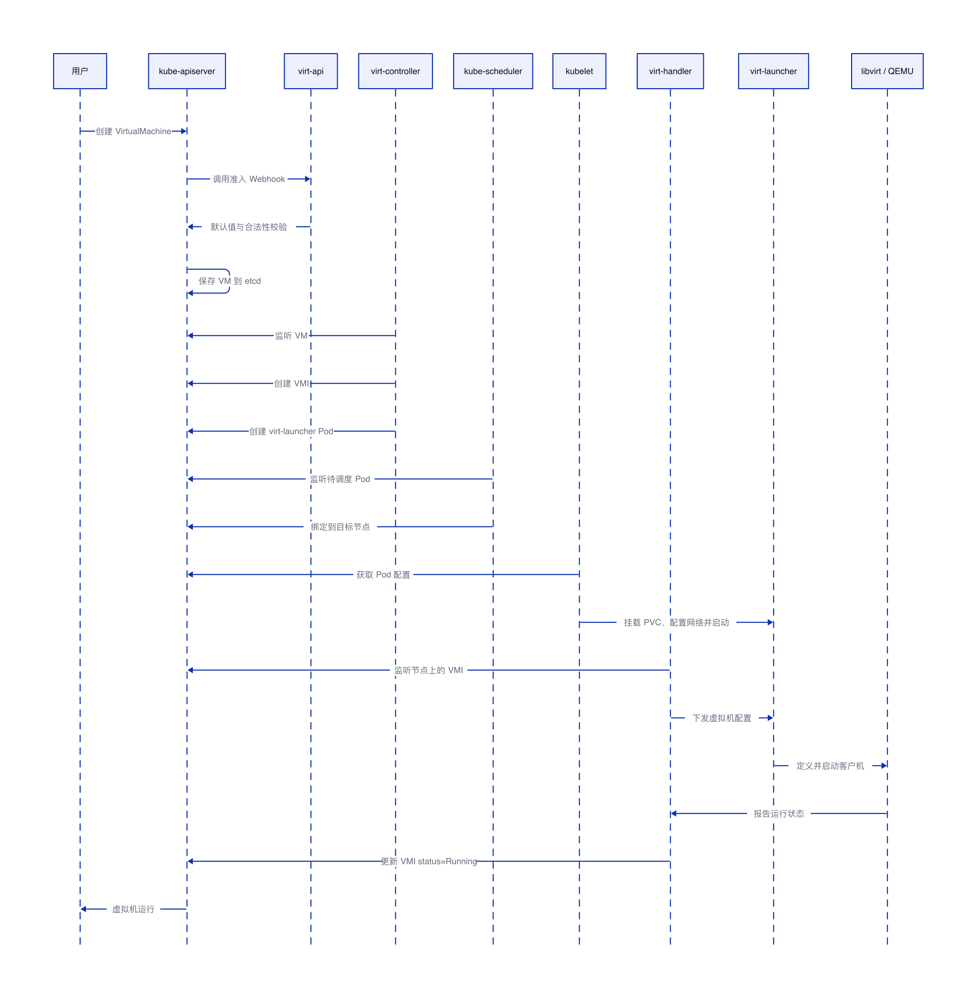
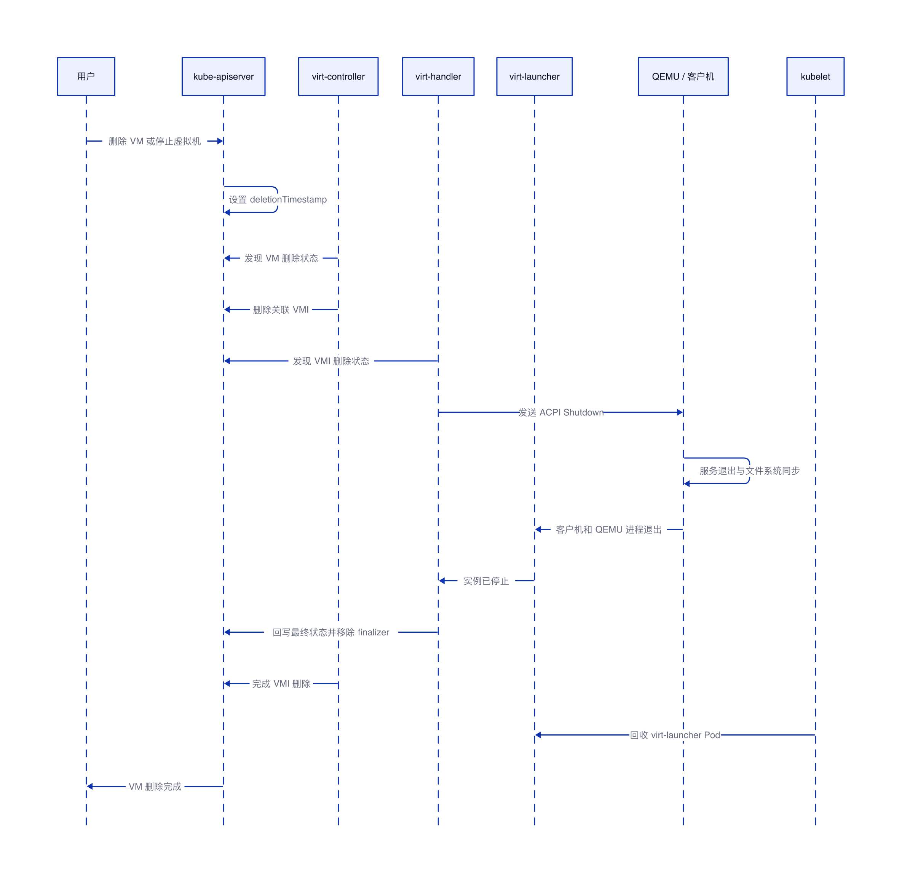
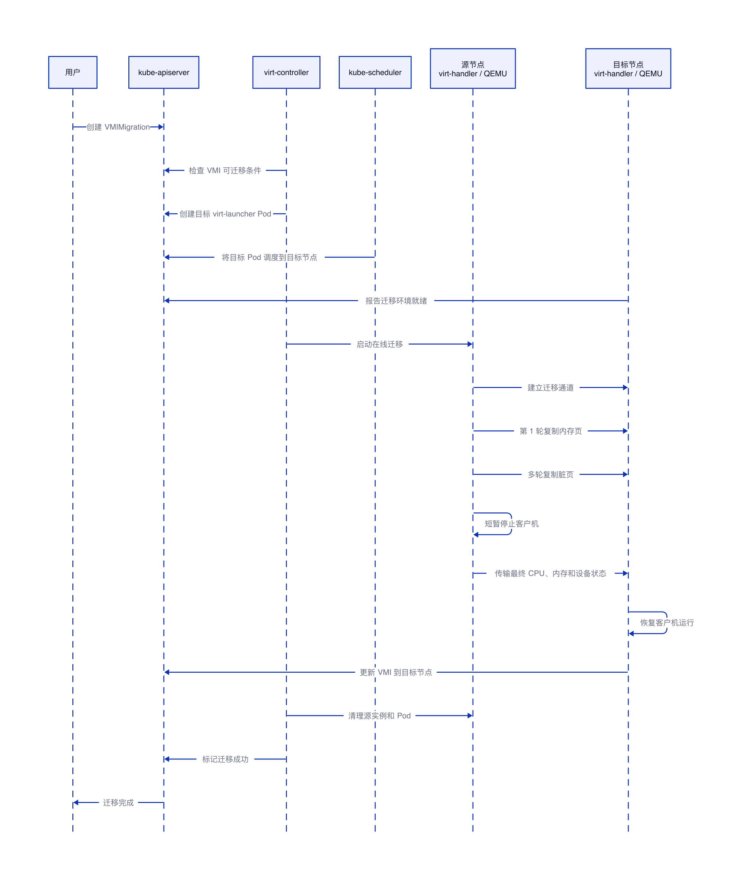

# KubeVirt 基本原理与虚拟机生命周期

## 结论

KubeVirt 通过 Kubernetes CRD 和控制器，把虚拟机纳入 Kubernetes 的声明式资源管理体系。Kubernetes 继续负责 API、调度、网络、存储和 Pod 生命周期，KubeVirt 负责把 `VirtualMachine`、`VirtualMachineInstance` 等资源转换为 `virt-launcher Pod` 以及节点上的 libvirt/QEMU 操作，最终由 QEMU/KVM 运行完整的客户机操作系统。

虚拟机创建的核心链路是“VM → VMI → virt-launcher Pod → libvirt/QEMU/KVM”；删除的核心链路是“删除 VM → 级联删除 VMI → 客户机优雅关机 → 回收 virt-launcher Pod”；在线迁移则是在源虚拟机继续运行时迭代复制内存页，待数据收敛后短暂停机，将最终 CPU 和设备状态切换到目标节点。

## 1. KubeVirt 基本架构



KubeVirt 不会替代 Kubernetes，也没有重新实现 Hypervisor。它在 Kubernetes 控制面与 QEMU/KVM 数据面之间增加了一层虚拟机资源模型和协调逻辑。

`VirtualMachine`，简称 VM，是持久化的虚拟机配置，描述 CPU、内存、磁盘、网络和运行策略。停止虚拟机后，VM 对象仍然存在。

`VirtualMachineInstance`，简称 VMI，表示一次实际运行的虚拟机实例。它的生命周期更接近 Pod：每次启动 VM 都可能产生一个新的 VMI，停止后对应 VMI 会被删除。

`VirtualMachineInstanceMigration` 描述一次 VMI 在线迁移任务。控制器通过该资源协调目标 Pod 准备、内存复制、最终切换和源端清理。

### 1.1 核心组件

**virt-operator：** 负责 KubeVirt 自身组件的安装、升级、证书和 CRD 管理。

**virt-api：** 提供准入 Webhook、字段默认值、合法性校验以及 Console、VNC 等 API 子资源。

**virt-controller：** 监听 VM、VMI 和迁移资源，协调期望状态，并创建或删除 `virt-launcher Pod`。

**virt-handler：** 以 DaemonSet 形式运行在虚拟化节点上，负责节点侧 VMI 生命周期、虚拟机实例状态同步和在线迁移。

**virt-launcher：** 每个运行中的 VMI 对应一个 `virt-launcher Pod`。Pod 内承载 libvirt 和 QEMU 相关进程，是 Kubernetes 调度与隔离虚拟机进程的载体。

**QEMU/KVM：** QEMU 提供虚拟 CPU、磁盘、网卡和其他设备模型，KVM 使用宿主机 CPU 的硬件虚拟化扩展执行客户机指令。

### 1.2 网络与存储

虚拟机网络通常复用 Kubernetes CNI。需要多网卡、Underlay 网络或 SR-IOV 时，可以结合 Multus 和相应网络插件。虚拟机磁盘通常来自 PVC，CDI 可以完成镜像上传、导入和克隆，再通过 DataVolume/PVC 提供给 VMI。

## 2. 虚拟机创建时序



用户创建 VM 后，请求首先进入 `kube-apiserver`。`kube-apiserver` 调用 `virt-api` 提供的准入 Webhook，完成默认值填充和合法性校验，随后将 VM 对象持久化到 etcd。

`virt-controller` 根据 VM 的 `runStrategy` 或兼容字段判断虚拟机是否应该运行。如果期望状态是运行，控制器会创建对应 VMI，并继续为 VMI 创建 `virt-launcher Pod`。

真正参与 Kubernetes 调度的是 `virt-launcher Pod`。Pod 会声明 CPU、内存、KVM 设备、PVC、网络、亲和性和拓扑约束。`kube-scheduler` 选择符合条件的节点，节点 kubelet 完成镜像拉取、PVC 挂载、CNI 配置和设备分配。

节点上的 `virt-handler` 发现 VMI 后，将配置转换为 libvirt 虚拟机实例配置，并协调 `virt-launcher` 启动 QEMU。虚拟机启动后，虚拟机实例和 Guest 状态持续回写到 VMI 的 `status`。

创建链路可以使用以下命令逐层观察：

```bash
# VM 保存持久化配置和运行策略
kubectl get vm <vm-name> -o yaml

# VMI 表示当前运行实例
kubectl get vmi <vm-name> -o yaml

# 真正被调度到节点的是 virt-launcher Pod
kubectl get pod -l kubevirt.io=virt-launcher -o wide

# 查看调度、挂载、网络和启动阶段的事件
kubectl describe vmi <vm-name>
```

当只有 VM、没有 VMI 时，应重点检查运行策略和 `virt-controller`；有 VMI、没有 Pod 时，应检查控制器和准入事件；Pod 长时间 Pending 时，应检查 CPU、内存、KVM 设备、亲和性和存储拓扑；Pod 停在 ContainerCreating 时，应检查镜像、PVC 和 CNI；Pod 已运行但 VMI 未进入 Running 时，应检查 `virt-handler`、libvirt 和 QEMU。

## 3. 虚拟机删除时序



用户删除 VM 后，API Server 为对象设置 `deletionTimestamp`，Kubernetes 与 KubeVirt 开始执行 finalizer 和 OwnerReference 级联清理。`virt-controller` 不再维持该 VM 的运行状态，并删除关联 VMI。

VMI 进入删除状态后，节点上的 `virt-handler` 请求客户机优雅关机。正常情况下，QEMU 向客户机发送 ACPI Shutdown，客户机完成服务退出和文件系统同步后关机。QEMU 进程退出、libvirt 中的虚拟机实例消失后，`virt-handler` 回写最终状态并移除相关 finalizer，随后 VMI 和 `virt-launcher Pod` 被回收。

如果客户机没有响应 ACPI Shutdown，超过 `terminationGracePeriodSeconds` 后，节点侧会强制终止虚拟机实例及其 QEMU 进程。强制终止类似断电，可能造成客户机未落盘数据丢失或文件系统损坏。

```bash
# 停止虚拟机但保留 VM 配置
virtctl stop <vm-name>

# 删除 VM 配置及其当前运行实例
kubectl delete vm <vm-name>

# 观察对象进入删除状态以及相关事件
kubectl get vm,vmi,pod -w
```

只删除 VMI 不一定能永久停止虚拟机。如果对应 VM 的运行策略仍要求运行，`virt-controller` 可能重新创建 VMI。需要停止但保留配置时，应优先操作 VM 的运行状态。

删除 VM 通常不会自动删除独立 PVC，因此磁盘数据一般仍然保留。DataVolume 是否被级联删除取决于 OwnerReference 和删除策略；独立创建的 Service、Secret、ConfigMap 和网络附件定义通常也需要单独处理。

## 4. 虚拟机在线迁移时序



在线迁移通过 `VirtualMachineInstanceMigration` 发起。`virt-controller` 首先检查 VMI 是否满足迁移条件，然后创建目标 `virt-launcher Pod`。调度器把目标 Pod 放到符合 CPU、设备、网络和存储约束的节点上，目标端准备好运行环境后，源端与目标端建立迁移通道。

KubeVirt 底层依赖 QEMU 的迁移能力。典型预拷贝模式下，源虚拟机继续运行，同时把内存页复制到目标端。客户机运行期间仍会修改内存，QEMU 因此需要多轮复制脏页。当剩余脏页收敛到可接受范围后，虚拟机会短暂停机，源端传输最终 CPU、内存和设备状态，目标端随即接管并恢复运行。

目标端运行稳定后，VMI 状态更新为目标节点，源端虚拟机实例和 `virt-launcher Pod` 被清理，迁移对象进入成功状态。迁移前或预拷贝阶段失败时，源虚拟机通常仍可继续运行；最终切换阶段的故障处理则取决于迁移状态和已经完成的接管动作。

```bash
# 发起在线迁移
virtctl migrate <vm-name>

# 查看迁移对象和阶段
kubectl get virtualmachineinstancemigration
kubectl describe virtualmachineinstancemigration <migration-name>

# 观察 VMI 所在节点变化
kubectl get vmi <vm-name> -o wide -w
```

在线迁移要求源节点和目标节点具有兼容的 CPU/KVM 能力，磁盘能够被目标节点访问，网络插件能够在目标端恢复虚拟机网络身份，并且 VMI 使用的设备、卷和网络都满足可迁移约束。共享 RWX 存储是常见方案；使用本地盘、直通设备或不支持迁移的网络能力时，VMI 可能被标记为不可迁移。

迁移期间应重点关注迁移带宽、内存脏页速率、累计传输数据、迁移耗时和最终停机时间。如果客户机持续高速写内存，预拷贝可能长期无法收敛，迁移可能超时、取消，或在策略允许时采用其他迁移方式。
