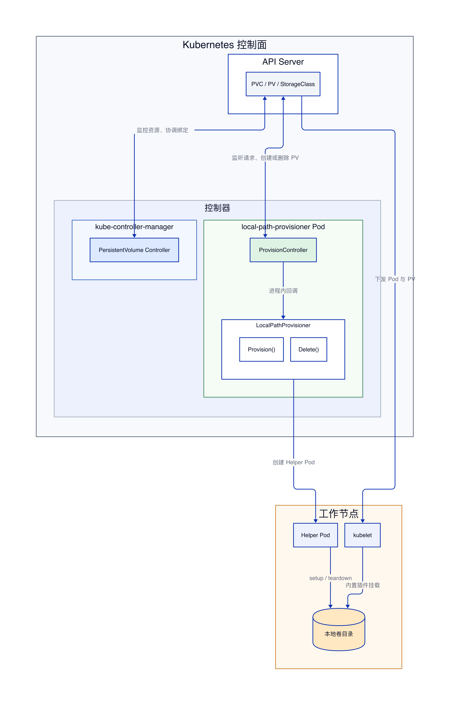
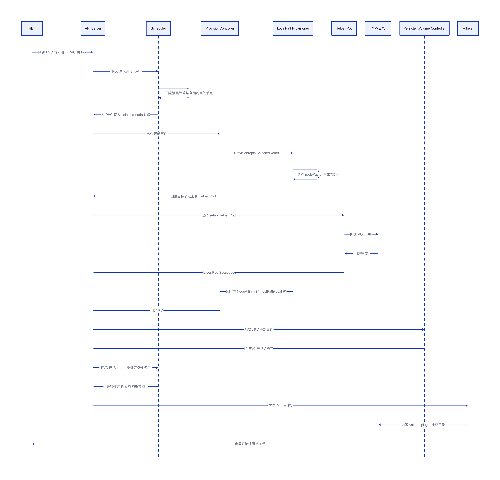
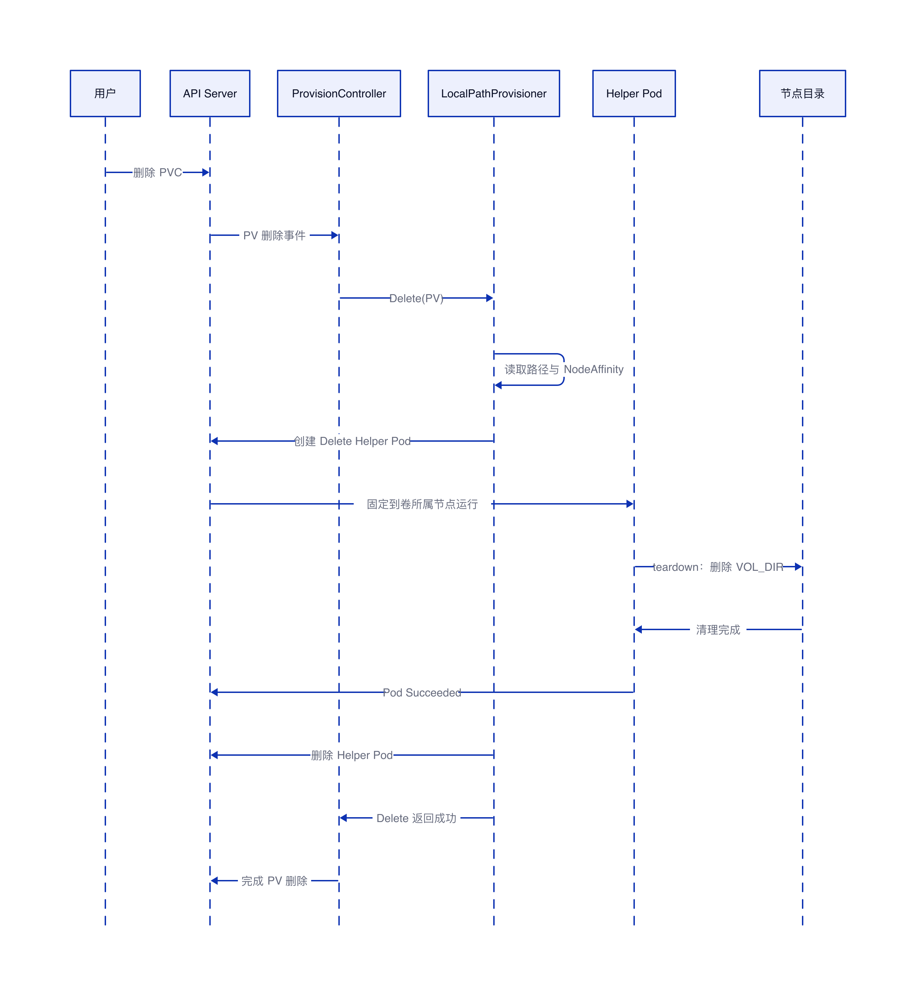

# Rancher local-path-provisioner 源码架构与工作流程

## 结论

`rancher/local-path-provisioner` 不是 CSI 驱动，不会接收或处理 CSI gRPC 请求。项目没有实现 CSI Identity、Controller、Node Service，也没有 CSI Unix Socket、`CreateVolume`、`DeleteVolume`、`NodePublishVolume` 等 RPC。

它是基于 `sigs.k8s.io/sig-storage-lib-external-provisioner` 实现的独立 PV Provisioner Controller。通用 ProvisionController 监听 PVC、PV 和 StorageClass，再回调项目实现的 `Provision()` 与 `Delete()` Go 接口。项目通过临时 Helper Pod 在目标节点执行 setup 或 teardown 脚本，创建或删除本地目录，然后生成使用 `hostPath` 或 `local` volume source 的 PV。Pod 使用卷时，由 kubelet 内置的 hostPath 或 local volume plugin 完成挂载。

本文基于公开仓库 `rancher/local-path-provisioner` 的 master 分支源码分析，未进行本地集群部署验证。

## 1. 项目定位

项目用于动态供给节点本地持久卷。默认 provisioner 名称为 `rancher.io/local-path`，与 StorageClass 的 `provisioner` 字段对应：

```yaml
apiVersion: storage.k8s.io/v1
kind: StorageClass
metadata:
  name: local-path
# ProvisionController 只处理与该名称匹配的 PVC。
provisioner: rancher.io/local-path
# 延迟到出现消费者后再确定目标节点。
volumeBindingMode: WaitForFirstConsumer
reclaimPolicy: Delete
```

项目依赖的是 external provisioner 开发库：

```go
// 用于实现 Kubernetes out-of-tree dynamic provisioner，和 CSI gRPC 无关。
sigs.k8s.io/sig-storage-lib-external-provisioner/v11
```

这里的 external provisioner library 不等同于 CSI 生态中的 `csi-provisioner` Sidecar。前者提供监听 PVC/PV、工作队列和回调机制；后者是调用 CSI Controller Service 的独立程序。

## 2. 核心架构

系统由 ProvisionController、LocalPathProvisioner、Helper Pod、ConfigMap、API Server 和 kubelet 共同完成。

ProvisionController 来自 `sig-storage-lib-external-provisioner`，负责监听 Kubernetes 资源、筛选匹配 `rancher.io/local-path` 的 PVC、处理重试及调用 `Provision()` 和 `Delete()`。

LocalPathProvisioner 是项目自身实现，负责选择目标节点和存储路径、创建 Helper Pod，以及构造 `hostPath` 或 `local` 类型的 PV。

ConfigMap 保存 `config.json`、`helperPod.yaml`、setup 和 teardown 脚本。`nodePathMap` 指定每个节点允许使用的根目录；配置多个目录时，默认随机选择一个。

Helper Pod 是一次性执行单元。创建卷时执行 setup，删除卷时执行 teardown。它通过 hostPath 挂载节点目录，执行完成后由 LocalPathProvisioner 删除。

kubelet 不与 LocalPathProvisioner 建立专用连接。PV 绑定完成后，kubelet 使用内置 volume plugin 将 PV 指向的节点路径挂载给 Pod。

### 2.1 ProvisionController 与 PersistentVolume Controller 的关系



ProvisionController 不属于 kube-controller-manager。它来自 `sigs.k8s.io/sig-storage-lib-external-provisioner/v11/controller`，由 local-path-provisioner 进程通过 `NewProvisionController()` 创建，并在该进程内运行。它负责监听与 `rancher.io/local-path` 匹配的 PVC、PV 和 StorageClass，维护动态供给工作队列，并回调 LocalPathProvisioner 实现的 `Provision()` 与 `Delete()`。

kube-controller-manager 中运行的是 Kubernetes 内置的 PersistentVolume Controller。它负责 PVC 与 PV 的匹配、绑定和状态维护，但不会直接调用 `LocalPathProvisioner.Provision()`，也不负责在节点上创建本地目录。

两个控制器不存在进程内调用关系，也不通过专用网络接口直接通信。它们分别监控 API Server 中的 PVC、PV 等资源，通过资源状态变化间接协作：ProvisionController 完成后端目录准备并创建 PV，PersistentVolume Controller 再协调该 PV 与 PVC 完成绑定。

## 3. 启动流程

`main.go` 中，程序先创建 Kubernetes Client 和 LocalPathProvisioner，再启动通用 ProvisionController：

```go
// 初始化项目自己的 Provisioner 实现。
provisioner, err := NewProvisioner(
    ctx,
    kubeClient,
    configFile,
    namespace,
    helperImage,
    configMapName,
    serviceAccountName,
    helperPodYaml,
    allowUnsafeHelperPodTemplate,
)
if err != nil {
    return err
}

// 通用控制器负责监听 PVC/PV，并回调 Provision 和 Delete。
pc := pvController.NewProvisionController(
    ctx,
    kubeClient,
    provisionerName,
    provisioner,
    // 当前 master 源码显式关闭 leader election。
    pvController.LeaderElection(false),
    pvController.FailedProvisionThreshold(provisioningRetryCount),
    pvController.FailedDeleteThreshold(deletionRetryCount),
    pvController.Threadiness(workerThreads),
)

// 进入资源监听和工作队列循环。
pc.Run(ctx)
```

LocalPathProvisioner 需要实现 external provisioner library 约定的核心接口：

```go
// PVC 需要动态供给时被调用，返回一个待创建的 PV 对象。
func (p *LocalPathProvisioner) Provision(
    ctx context.Context,
    opts pvController.ProvisionOptions,
) (*v1.PersistentVolume, pvController.ProvisioningState, error)

// PV 按 Delete 策略回收时被调用，负责清理后端目录。
func (p *LocalPathProvisioner) Delete(
    ctx context.Context,
    pv *v1.PersistentVolume,
) error
```

这些是进程内 Go 接口调用，不是网络请求或 CSI RPC。

## 4. 动态创建卷时序



当 StorageClass 使用 `WaitForFirstConsumer` 时，PVC 创建后暂不立即供给。Pod 进入调度流程后，Scheduler 先预选一个同时满足计算资源和存储拓扑约束的节点，并将该节点写入 PVC 的 `volume.kubernetes.io/selected-node` 注解；此时 PV 尚未创建，Pod 也尚未完成最终绑定。ProvisionController 监听到 PVC 更新后，从供给上下文的 `opts.SelectedNode` 获得该节点，再调用 `LocalPathProvisioner.Provision()`。待本地目录准备完成、PV 创建且 PVC/PV 绑定后，Scheduler 才将 Pod 最终绑定到之前预选的节点。

### 4.1 选择节点与路径

`Provision()` 调用 `provisionFor()`。非共享文件系统要求 `SelectedNode` 不为空，并且只允许 `ReadWriteOnce` 或 `ReadWriteOncePod`：

```go
node := opts.SelectedNode

// 本地目录必须先确定目标节点。
if !sharedFS && node == nil {
    return nil, pvController.ProvisioningFinished,
        fmt.Errorf("configuration error, no node was specified")
}
```

项目根据 StorageClass 选择配置，再从 `nodePathMap` 查找节点对应路径。如果节点未单独配置，则尝试使用 `DEFAULT_PATH_FOR_NON_LISTED_NODES`。配置多个路径时随机选择；StorageClass 指定 `nodePath` 时使用该路径。

默认卷目录名称为：

```text
<PVName>_<PVC.Namespace>_<PVC.Name>
```

也可以通过 StorageClass 的 `pathPattern` 定制。当前源码会对路径前缀和目录穿越进行校验；除非显式启用 `allowUnsafePathPattern`，路径必须以 PVC 命名空间和名称开头。

### 4.2 Helper Pod 创建目录

确定完整路径后，`provisionFor()` 调用：

```go
// 创建一次性 Helper Pod，在目标节点准备卷目录。
err := p.createHelperPod(
    ActionTypeCreate,
    provisionCmd,
    volumeOptions{
        Name:        name,
        Path:        path,
        Mode:        *pvc.Spec.VolumeMode,
        SizeInBytes: storage.Value(),
        Node:        nodeName,
    },
    config,
)
```

Helper Pod 使用 `spec.nodeName` 固定到目标节点：

```go
// 不经过普通调度选择，直接指定执行节点。
if helperPod.Spec.NodeName == "" && options.Node != "" {
    helperPod.Spec.NodeName = options.Node
}
```

目标目录的父目录以 hostPath 形式挂入 Helper Pod。项目将卷信息注入环境变量：

```text
VOL_DIR          实际卷目录
VOL_MODE         Filesystem 或 Block
VOL_SIZE_BYTES   PVC 请求容量
VOL_USER         目录用户
VOL_GROUP        目录用户组
VOL_PERM         目录权限
```

默认 setup 脚本为：

```sh
#!/bin/sh
set -eu
# 容量参数目前不会形成磁盘配额，只创建目录。
mkdir -m 0777 -p "$VOL_DIR"
```

LocalPathProvisioner 轮询 Helper Pod 状态。Pod 进入 `Succeeded` 后，控制器读取其日志并删除 Helper Pod；超过 `cmdTimeoutSeconds` 则返回错误，由 ProvisionController 按策略重试。

### 4.3 构造并创建 PV

目录准备成功后，项目根据注解选择 PV 类型。默认使用 hostPath：

```go
// 默认类型，kubelet 后续使用内置 hostPath volume plugin。
PersistentVolumeSource{
    HostPath: &v1.HostPathVolumeSource{
        Path: path,
        Type: &hostPathDirectoryOrCreate,
    },
}
```

配置 `volumeType: local` 时使用：

```go
// local PV 由 kubelet 内置 local volume plugin 处理。
PersistentVolumeSource{
    Local: &v1.LocalVolumeSource{
        Path: path,
    },
}
```

对于节点本地文件系统，项目为 PV 设置 NodeAffinity，默认使用 `kubernetes.io/hostname` 标签，确保使用该 PV 的 Pod 被调度到拥有实际目录的节点。StorageClass 可以通过 `nodeAffinityKey` 指定更稳定的节点标签。

`provisionFor()` 返回 PV 对象后，真正将 PV 写入 API Server 的是通用 ProvisionController。之后 Kubernetes 的 PersistentVolume Controller 协调 PVC 与 PV 完成绑定。

### 4.4 Scheduler 对延迟绑定 PVC 的判断

当 StorageClass 使用 `WaitForFirstConsumer` 时，PVC 创建后不会立即完成动态供给。只有引用该 PVC 的 Pod 进入调度流程后，kube-scheduler 的 VolumeBinding 插件才会参与判断。

这里的判断不是调用 local-path-provisioner 试创建目录，也不是检查节点真实磁盘剩余容量，而是基于 Kubernetes 已有对象做可调度性判断：

1. PVC 处于未绑定状态，并且引用的 StorageClass 存在。
2. StorageClass 的 `volumeBindingMode` 为 `WaitForFirstConsumer`，允许先选节点、后供给 PV。
3. 候选节点满足 StorageClass 的 `allowedTopologies` 约束；如果没有配置 `allowedTopologies`，则这一层不限制节点。
4. 对于已经绑定的 PVC，VolumeBinding 插件会检查对应 PV 的 `nodeAffinity` 是否匹配当前候选节点。
5. 对于可匹配静态 PV 的 PVC，VolumeBinding 插件会同时检查 PV 的容量、访问模式、StorageClass、VolumeMode、Selector 和 NodeAffinity。

对 local-path-provisioner 的默认用法来说，核心判断可以简化为：StorageClass 允许延迟绑定，并且候选节点没有被 StorageClass 拓扑约束排除。判断通过后，scheduler 选定节点，并给 PVC 写入注解：

```text
volume.kubernetes.io/selected-node: <node-name>
```

local-path-provisioner 监听到该注解后，才在对应节点上创建目录并生成 PV。这个 PV 随后带有 NodeAffinity，用于保证后续使用该 PV 的 Pod 仍然调度到拥有实际目录的节点。

`CSIStorageCapacity` 主要用于 CSI 动态供给场景，让 scheduler 判断某个拓扑域内是否有足够容量。local-path-provisioner 不是 CSI 驱动，默认不发布 `CSIStorageCapacity`，因此这里不依赖它完成节点选择，也不会基于 PVC 请求容量做精确磁盘容量调度。

## 5. Pod 挂载流程

PV 绑定以后，local-path-provisioner 不再参与 Pod 的挂载过程。

API Server 将 Pod 与 PV 信息下发给目标节点 kubelet。PV 使用 hostPath 时，kubelet 内置 hostPath volume plugin 处理目录；PV 使用 local 时，kubelet内置 local volume plugin 处理目录。最终节点路径被挂载到 Pod volume 目录，再映射到容器的 `volumeMounts.mountPath`。

因此，该项目不需要以下 CSI 资源或组件：

```text
CSIDriver
CSINode
VolumeAttachment
csi-node-driver-registrar
CSI Unix Socket
```

运行过程中也不会出现以下 CSI RPC：

```text
CreateVolume
DeleteVolume
ControllerPublishVolume
NodeStageVolume
NodePublishVolume
```

## 6. 删除卷时序



PVC 被删除且 PV 的回收策略为 `Delete` 时，ProvisionController 调用 `LocalPathProvisioner.Delete()`。

项目先从 PV 的 `spec.hostPath.path` 或 `spec.local.path` 取得目录，再从 NodeAffinity 找到所属节点。若节点已经不存在，当前实现会跳过目录清理并返回成功，因为已经无法在原节点启动 Helper Pod。

对于仍存在的节点，项目创建 Delete 类型 Helper Pod，并执行默认 teardown 脚本：

```sh
#!/bin/sh
set -eu
# 删除该 PV 对应的节点目录及其中所有数据。
rm -rf "$VOL_DIR"
```

清理成功后，Helper Pod 被删除，`Delete()` 返回成功，ProvisionController 完成 PV 删除。如果 PV 的回收策略为 `Retain`，项目只记录保留日志，不会删除实际目录。

## 7. 配置对行为的影响

`nodePathMap` 用于配置不同节点允许使用的本地根目录。节点未列出时可以回退到 `DEFAULT_PATH_FOR_NON_LISTED_NODES`；节点显式配置为空路径列表时，该节点拒绝供给。

`sharedFileSystemPath` 表示所有节点共同访问同一个文件系统路径。此模式不创建 NodeAffinity，并允许 `ReadWriteOnce`、`ReadOnlyMany` 和 `ReadWriteMany`。它与 `nodePathMap`、`storageClassConfigs` 互斥。

`storageClassConfigs` 可以为不同 StorageClass 提供独立路径配置。StorageClass 还可以设置 `nodePath`、`pathPattern`、`nodeAffinityKey`、`userPattern`、`groupPattern` 和 `permPattern`。

项目支持定期重新加载配置。新配置校验失败时，会记录错误并继续使用上一份有效配置，避免无效更新中断已有供给能力。

## 8. 与 CSI 驱动的区别

| 环节 | Rancher local-path-provisioner | CSI 驱动 |
|---|---|---|
| 控制器框架 | sig-storage external ProvisionController | CSI Sidecar 容器 |
| 卷创建入口 | `LocalPathProvisioner.Provision()` | `CreateVolume` gRPC |
| 卷删除入口 | `LocalPathProvisioner.Delete()` | `DeleteVolume` gRPC |
| 后端操作 | Helper Pod 执行脚本 | CSI 驱动自行调用存储后端 |
| PV 创建者 | 通用 ProvisionController | `csi-provisioner` |
| 节点挂载 | kubelet 内置 hostPath/local plugin | CSI Node Service |
| 节点挂载接口 | kubelet 内部 volume plugin 接口 | `NodeStageVolume`、`NodePublishVolume` |
| 通信方式 | Kubernetes API 与进程内 Go 回调 | Unix Socket 上的 gRPC |
| CSI 注册 | 不需要 | 需要 node-driver-registrar |

两者都能实现 PVC 动态供给，但扩展层次不同。local-path-provisioner 生成 Kubernetes 原生 hostPath/local PV，将节点挂载交给 kubelet 内置插件；CSI 驱动通过标准 gRPC 接口同时扩展控制面卷管理和节点挂载能力。

## 9. 实现限制与使用注意

项目 README 明确说明当前不支持容量限制。PVC 中的请求容量会写入 PV Capacity，并传给 Helper Pod，但默认 setup 脚本只执行 `mkdir`，不会建立磁盘配额，因此它不是实际的容量隔离机制。

节点本地模式下，数据与具体节点绑定。节点永久丢失时，即使 PV 对象仍存在，数据也可能不可访问。NodeAffinity 只能保证 Pod 调度到正确节点，不能提供副本、迁移或故障恢复。

当前 master 源码创建 ProvisionController 时配置了 `LeaderElection(false)`。如果部署多个 local-path-provisioner 实例，需要额外评估重复处理与高可用策略，不能直接套用 CSI external-provisioner 常见的 leader election 结论。

Helper Pod 对节点目录执行创建和删除操作，ConfigMap 中的 setup、teardown 以及 Helper Pod 模板应由可信管理员维护。当前项目会校验 Helper Pod 模板中的高风险字段；确需使用特权模板时，必须显式开启 `--allow-unsafe-helper-pod-template`，这也意味着需要承担相应的节点安全风险。
