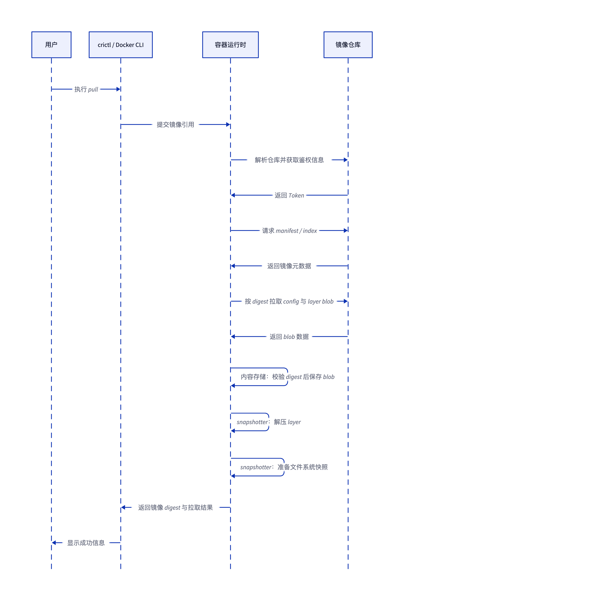
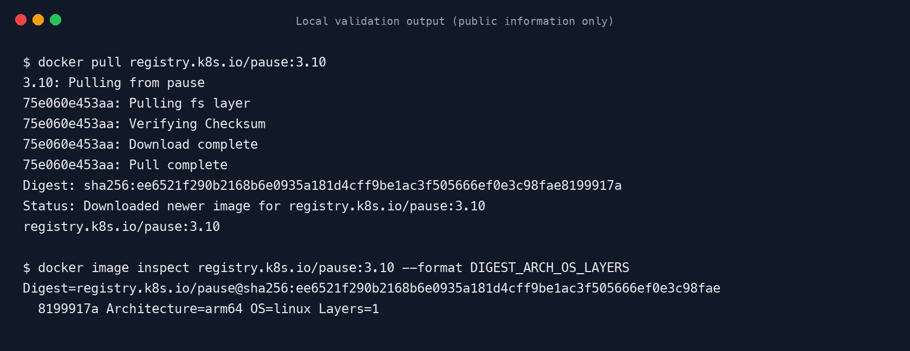

# 容器镜像拉取过程

## 结论

容器镜像拉取不是一次性下载单个文件，而是按“解析镜像引用、获取鉴权、拉取 manifest、按 digest 拉取 config 与 layer blob、校验内容、解压并生成快照”的顺序完成。`crictl pull` 通过 CRI 把请求交给 containerd；`docker pull` 由 Docker Engine 执行对应流程。两者的命令入口不同，但都遵循 OCI Distribution 与 OCI Image 的核心模型。

本地使用 Docker Desktop 29.1.3 拉取公开镜像 `registry.k8s.io/pause:3.10` 验证成功。拉取结果包含仓库 digest，镜像平台为 `linux/arm64`，镜像包含 1 个 layer。终端输出中的 `Pulling fs layer`、`Verifying Checksum`、`Download complete` 和 `Pull complete` 分别对应 layer 发现、摘要校验、内容下载完成和拉取流程完成。

## 拉取时序



## 关键阶段

| 阶段 | 主要动作 | 本地可观察结果 |
| --- | --- | --- |
| 解析引用 | 将镜像名拆分为 registry、repository、tag 或 digest | `registry.k8s.io/pause:3.10` |
| 鉴权 | 根据仓库响应获取匿名或账号 Token | 公开镜像可自动完成，无需交互 |
| 获取 manifest | 获取镜像索引或指定平台的 manifest | 最终得到仓库 digest |
| 拉取 blob | 按 digest 下载 config 和 layer | `Pulling fs layer`、`Download complete` |
| 内容校验 | 对下载内容计算摘要并与 digest 比对 | `Verifying Checksum` |
| 解压落盘 | 将 layer 解压到 snapshotter 管理的快照中 | `Pull complete` 后镜像可被容器使用 |

## 本地验证

验证环境为 macOS 15.6.1、Apple Silicon，Docker Client 与 Server 版本均为 29.1.3。先删除本地缓存镜像，再重新拉取，确保截图能够展示完整的 layer 下载与校验过程。

```bash
# 删除本地缓存，确保下一次 pull 重新下载镜像内容
docker image rm registry.k8s.io/pause:3.10

# 拉取公开镜像
docker pull registry.k8s.io/pause:3.10

# 检查仓库 digest、镜像平台和 layer 数量
docker image inspect registry.k8s.io/pause:3.10 --format 'Digest={{index .RepoDigests 0}} Architecture={{.Architecture}} OS={{.Os}} Layers={{len .RootFS.Layers}}'
```



验证结果显示，仓库 digest 为 `sha256:ee6521f290b2168b6e0935a181d4cff9be1ac3f505666ef0e3c98fae8199917a`，平台为 `linux/arm64`，layer 数量为 1。仓库 digest 标识 manifest 内容；终端中的 layer ID 标识被下载的文件系统层，两者用途不同。
