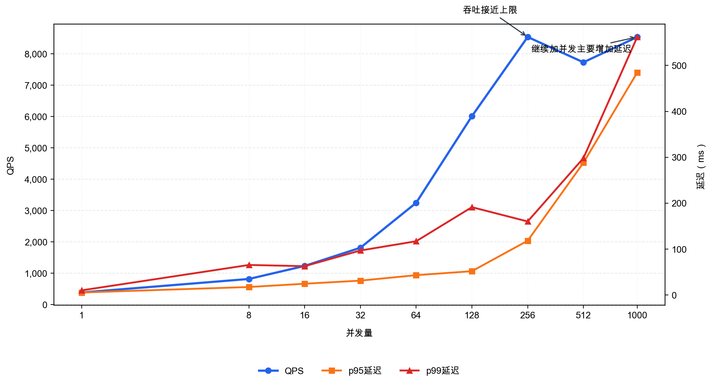
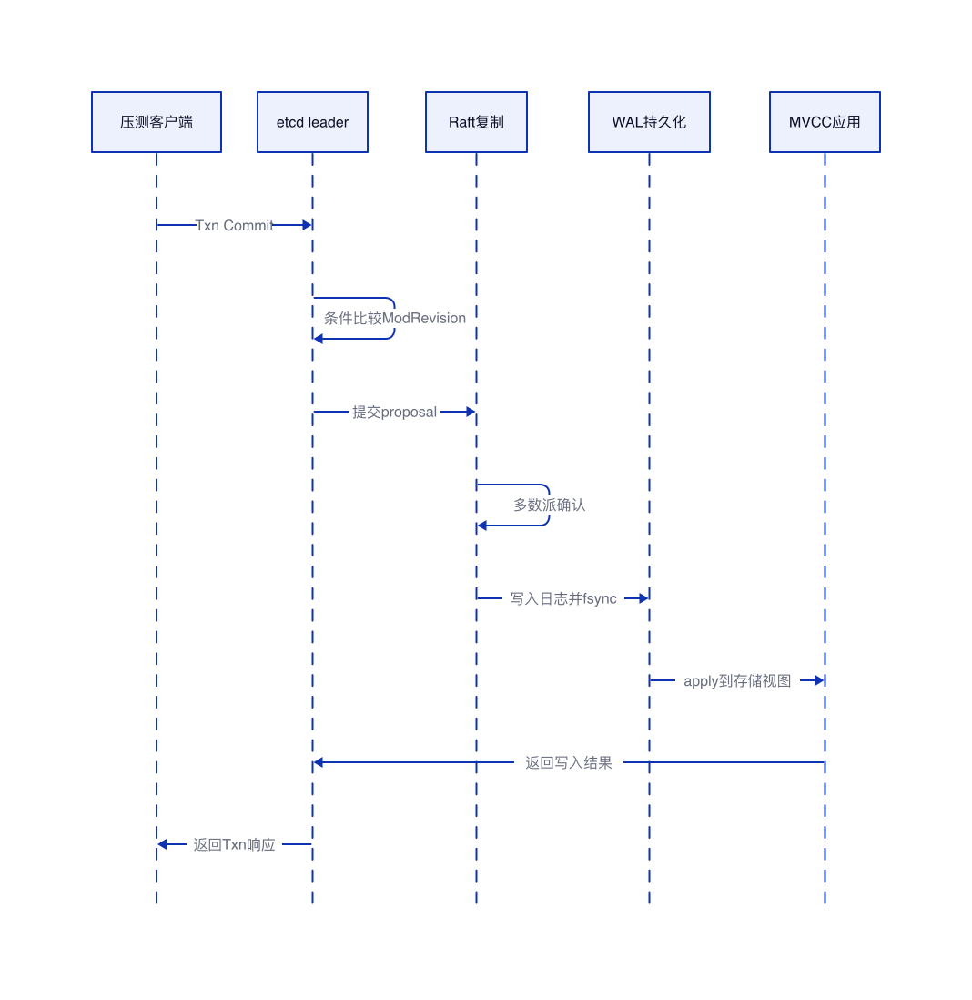

# 本地 etcd 并发写入性能测试

## 结论

本次测试在本地启动 3 节点 etcd v3.5.17 集群，使用 etcd v3 Txn 模拟 kube-apiserver 创建资源对象时的条件写入方式。测试结果显示，并发从 1 提升到 256 时，QPS 从 387.9 提升到 8535.8，吞吐提升明显；并发继续提升到 512 和 1000 后，QPS 没有继续线性提升，但 p95、p99 延迟显著升高。

因此，这组测试的关键结论是：etcd 写入能力存在稳定吞吐上限，超过该上限后，继续增加并发主要增加排队时间，而不是提升有效吞吐。并发 1000 时，QPS 为 8534.3，和并发 256 基本持平，但 p95 从 118.14ms 升到 484.68ms，p99 从 160.12ms 升到 562.05ms。



| 并发 | 总写入 | 成功写入 | QPS | p50 | p95 | p99 | max |
|---:|---:|---:|---:|---:|---:|---:|---:|
| 1 | 10000 | 10000 | 387.9 | 2.32ms | 5.35ms | 10.08ms | 57.50ms |
| 8 | 10000 | 10000 | 819.7 | 8.11ms | 17.32ms | 65.35ms | 119.03ms |
| 16 | 10000 | 10000 | 1235.4 | 11.40ms | 24.46ms | 62.69ms | 103.79ms |
| 32 | 10000 | 10000 | 1815.9 | 15.45ms | 31.24ms | 96.88ms | 224.72ms |
| 64 | 10000 | 10000 | 3248.1 | 16.50ms | 43.08ms | 117.06ms | 221.38ms |
| 128 | 10000 | 10000 | 6010.8 | 16.73ms | 51.81ms | 191.28ms | 214.75ms |
| 256 | 10000 | 10000 | 8535.8 | 19.96ms | 118.14ms | 160.12ms | 246.53ms |
| 512 | 10000 | 10000 | 7728.0 | 33.35ms | 287.93ms | 298.11ms | 376.22ms |
| 1000 | 10000 | 10000 | 8534.3 | 91.48ms | 484.68ms | 562.05ms | 567.70ms |

## 测试环境

| 项目 | 内容 |
|---|---|
| 集群形态 | 本地 3 节点 etcd 集群 |
| etcd 版本 | v3.5.17 |
| 访问方式 | Go client 访问本地 endpoints |
| 写入模型 | etcd v3 Txn 条件写入 |
| key 前缀 | `/registry/pods/default/bench-...` |
| 写入资源 | 模拟 Kubernetes Pod 对象，key 使用 `/registry/pods/default/bench-<并发>/<序号>` 形式，value 使用 1024B 随机字节模拟对象序列化后的内容 |
| value 大小 | 1024B |
| 每组写入量 | 10000 条 |
| 并发梯度 | 1、8、16、32、64、128、256、512、1000 |
| TLS | 未开启 |
| 数据持久化目录 | 临时目录，测试结束后清理 |

## 测试方法

本次测试不是直接调用 `Put`，而是使用 `Txn` 模拟 kube-apiserver 创建对象时的条件写入语义。每次写入先判断目标 key 的 `ModRevision` 是否为 0，满足条件后再执行 `Put`。这种方式比简单写入更接近 Kubernetes 对象创建流程。

```go
// 使用 Txn 模拟创建对象时的条件写入。
// ModRevision(key) == 0 表示 key 不存在，满足条件后才写入。
resp, err := cli.Txn(ctx).
    If(clientv3.Compare(clientv3.ModRevision(key), "=", 0)).
    Then(clientv3.OpPut(key, value)).
    Commit()

// err == nil 且 resp.Succeeded == true 时，认为本次写入成功。
```

写入链路如下图所示。客户端看到的耗时是端到端耗时，包含请求发送、leader 处理、Raft 复制、WAL 持久化、MVCC apply 和响应返回。

本次写入的资源不是一个真实 Kubernetes Pod 对象，而是压测程序构造的模拟资源。key 采用 Kubernetes 在 etcd 中常见的 registry 路径风格，例如 `/registry/pods/default/bench-128/1`，其中 `pods` 表示资源类型，`default` 表示命名空间，后面的编号表示本轮压测中的不同对象。value 使用 1024B 随机字节，作用是模拟对象经过序列化后写入 etcd 的 payload 大小。这样可以重点观察 etcd 写入链路本身的吞吐和延迟，而不引入 kube-apiserver admission、鉴权、对象校验、序列化等额外开销。



## QPS 和并发量的含义

| 指标 | 含义 | 解读方式 |
|---|---|---|
| 并发量 | 同时发起写入请求的 goroutine 数量 | 并发越高，瞬时进入 etcd 的请求越多 |
| QPS | 每秒成功完成的写入事务数量 | 代表有效吞吐，不等于并发量 |
| p50 | 50% 请求的耗时不超过该值 | 代表中位数延迟 |
| p95 | 95% 请求的耗时不超过该值 | 代表大部分请求的尾部体验 |
| p99 | 99% 请求的耗时不超过该值 | 代表高尾延迟，适合观察排队和抖动 |
| max | 单次请求最大耗时 | 容易受瞬时抖动影响，需结合 p95、p99 判断 |

并发量是施加到系统上的压力，QPS 是系统实际完成工作的速度。并发增加时，QPS 在未达到瓶颈前会上升；达到瓶颈后，继续增加并发会让更多请求排队，QPS 不再明显提升，延迟反而快速升高。

## 耗时分析

| 并发阶段 | 现象 | 主要耗时来源 |
|---|---|---|
| 1 到 16 | QPS 平稳提升，p95 较低 | 单次 Txn、Raft 提交、WAL fsync、MVCC apply |
| 32 到 128 | QPS 快速提升，p99 开始升高 | etcd 批处理收益增加，部分请求开始排队 |
| 256 | QPS 达到较高水平，p95 明显升高 | leader proposal 队列、Raft ready 处理、WAL 持久化等待 |
| 512 到 1000 | QPS 不再线性提升，p95 和 p99 快速恶化 | client/gRPC 调度竞争、leader 排队、写入 apply 堆积 |

低并发阶段，单次请求能较快完成完整写入链路，因此 p50、p95 都较低。中等并发阶段，etcd 可以通过批处理摊薄部分提交成本，所以吞吐明显提升。高并发阶段，请求进入速度超过 etcd 稳定处理速度，新增并发主要转化为排队时间，端到端延迟明显放大。

并发 256 和并发 1000 的对比最能说明问题：两者 QPS 都在 8500 左右，但并发 1000 的 p95 是并发 256 的 4 倍以上。这说明系统吞吐已经接近上限，继续加并发不能提升有效写入能力。

## 测试结论

| 结论 | 说明 |
|---|---|
| etcd 写入存在吞吐上限 | 本地 3 节点集群在本轮测试中稳定上限约为 8500 QPS |
| 高并发主要放大排队耗时 | 并发超过 256 后，QPS 不再明显提升，但 p95、p99 快速升高 |
| 端到端耗时不能等同于磁盘耗时 | 客户端观察到的 Txn 延迟包含排队、复制、持久化、apply 和返回 |
| p95、p99 比平均吞吐更敏感 | 高尾延迟能更早暴露写入队列堆积问题 |
| 模拟 kube-apiserver 写入应使用 Txn | 条件比较加写入比单纯 Put 更贴近 Kubernetes 对象创建语义 |

对于 kube-apiserver 写 etcd 的场景，如果观察到写入 p95、p99 持续升高，需要优先判断 etcd 是否已经出现请求排队。排查时应重点关注 proposal pending、WAL fsync、backend commit、apply duration、leader CPU、gRPC inflight 请求，以及 apiserver 侧 mutating 请求并发。
