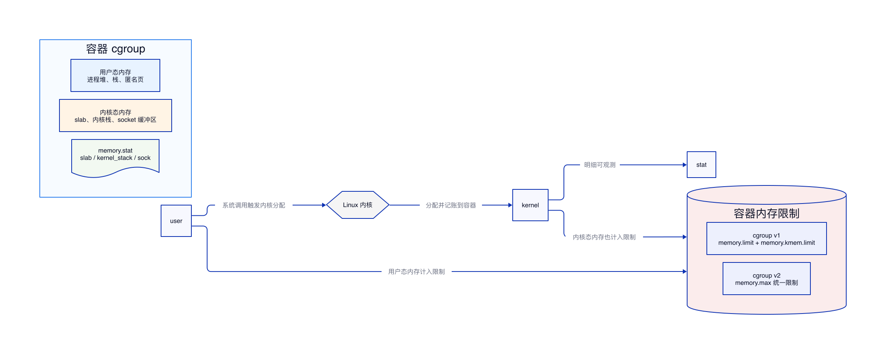

# Linux 内核内存分摊到容器

## 结论

Linux 内核内存分摊到容器，指的是容器内进程触发的内核态内存分配，也会被记账到该容器所属的 cgroup 内存体系中。这样做的目的，是避免容器只被限制用户态内存，却可以通过 slab 缓存、内核栈、socket 缓冲区等内核内存继续消耗宿主机资源。

## 什么是内核内存

容器进程使用内存时，不只有用户态内存。用户态内存包括进程堆、栈、匿名页、文件页缓存等；内核态内存则是内核为了服务这些进程而分配的内存。

| 类型 | 示例 | 是否与容器进程相关 |
| --- | --- | --- |
| slab 缓存 | dentry、inode、网络对象等内核对象缓存 | 是 |
| 内核栈 | 线程进入内核态执行时使用的栈 | 是 |
| socket 缓冲区 | TCP/UDP 收发缓冲区 | 是 |
| 页表等管理结构 | 进程地址空间管理相关结构 | 是 |

这些内存虽然由内核分配，但分配原因来自容器内进程，所以需要计入容器的内存消耗。

## 为什么要分摊到容器

如果只限制用户态内存，容器仍然可以通过高并发连接、大量文件元数据访问、频繁创建线程等方式消耗大量内核内存。宿主机上的内核内存是全局共享资源，一旦被某个容器过度占用，会影响同一宿主机上的其他容器，甚至导致宿主机整体内存压力升高。

把内核内存分摊到容器后，容器的内存限制更完整：容器既不能无限使用用户态内存，也不能绕过限制大量消耗内核态内存。

## cgroup v1 与 cgroup v2 的差异

| 对比项 | cgroup v1 | cgroup v2 |
| --- | --- | --- |
| 限制方式 | 用户态内存和内核内存可以分开限制 | 统一纳入 memory.max 限制 |
| 内核内存限制入口 | memory.kmem.limit_in_bytes | 不再单独设置 kmem limit |
| 观测方式 | memory.stat 中查看相关统计 | memory.stat 中查看 slab、kernel_stack、sock 等字段 |
| 使用理解 | 内核内存可单独约束 | 容器总内存统一约束，明细按字段观测 |

cgroup v1 里存在独立的内核内存限制能力，例如 memory.kmem.limit_in_bytes。cgroup v2 则改为统一内存模型，内核内存不再单独设置一套限制，而是并入 memory.max 这类统一限制中，具体明细通过 memory.stat 观察。

## 常见观测字段

| 字段 | 含义 |
| --- | --- |
| slab | 内核对象缓存占用 |
| kernel_stack | 内核栈占用 |
| sock | socket 缓冲区占用 |
| anon | 匿名页占用 |
| file | 文件页缓存占用 |

排查容器内存问题时，不能只看应用进程的 RSS。若容器内存持续升高，但应用堆内存没有明显增长，需要进一步查看 memory.stat 中 slab、kernel_stack、sock 等字段，判断是否存在内核内存占用过高。

## 示例理解

1. 容器内程序建立大量 TCP 连接。
2. 内核为这些连接分配 socket 缓冲区和相关网络对象。
3. 这些内存虽然处于内核态，但触发者是容器内进程。
4. cgroup 将这部分内存记账到容器。
5. 当用户态内存与内核态内存合计触达限制时，容器会进入内存压力处理流程。

## 排查思路

| 现象 | 重点检查 |
| --- | --- |
| 容器内存高，但应用堆不高 | memory.stat 中 slab、sock、kernel_stack |
| 网络连接数很多 | socket 缓冲区、连接状态、收发队列 |
| 文件访问量很大 | dentry、inode 相关 slab 占用 |
| 线程数异常增长 | kernel_stack 占用 |

排查时先确认容器所在环境使用 cgroup v1 还是 cgroup v2，再选择对应的限制和观测方式。cgroup v2 下重点看统一内存限制和 memory.stat 明细；cgroup v1 下还要确认是否配置了独立的内核内存限制。
