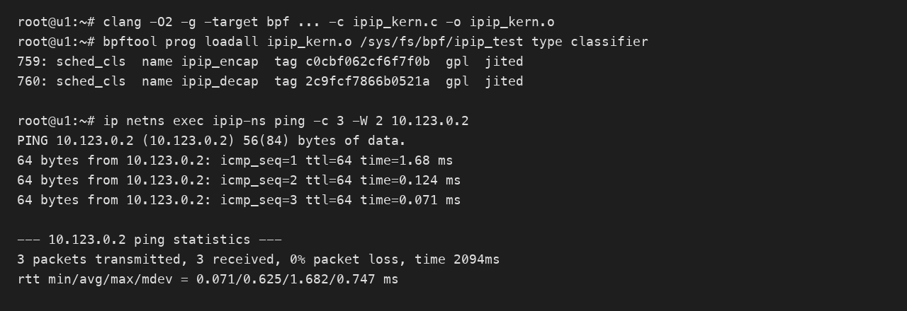

# eBPF 封装与解封装 IPIP 报文

## 结论

在 TC eBPF 程序中，可以使用 `bpf_skb_adjust_room()` 封装和解封装 IPIP 报文。封装时在二层头与原 IPv4 头之间增加外层 IPv4 头，并将外层协议设置为 `IPPROTO_IPIP`；解封装时校验外层报文后，以负数长度删除外层 IPv4 头。

`bpf_skb_adjust_room()` 可能重新分配 skb。每次调用后，之前取得的 `data`、`data_end` 和报文头指针都会失效，继续访问报文前必须重新获取指针并重新进行边界检查。

本文示例面向普通 Ethernet II、IPv4 over IPv4 报文，不包含 VLAN、外层 IPv4 分片、GSO 和实际路由转发处理。

## 报文结构

封装前后的报文结构如下表所示。

| 阶段 | 报文结构 |
| --- | --- |
| 封装前 | Ethernet + Inner IPv4 + Payload |
| 封装后 | Ethernet + Outer IPv4 + Inner IPv4 + Payload |
| 解封装后 | Ethernet + Inner IPv4 + Payload |

外层 IPv4 头的 `protocol` 字段必须为 `IPPROTO_IPIP`，其数值为 4。纯 IPIP 不需要 GRE 头，因此不应设置 `BPF_F_ADJ_ROOM_ENCAP_L4_GRE`。

## 公共头文件与校验和函数

下面的校验和函数用于计算无选项的 20 字节 IPv4 头校验和。

```c
#include <linux/bpf.h>
#include <linux/if_ether.h>
#include <linux/in.h>
#include <linux/ip.h>
#include <linux/pkt_cls.h>
#include <bpf/bpf_helpers.h>
#include <bpf/bpf_endian.h>

#define IPV4_FRAG_OFFSET 0x1fff
#define IPV4_MF          0x2000
#define IPV4_DF          0x4000

static __always_inline __u16 ipv4_checksum(struct iphdr *iph)
{
    __u32 sum = 0;
    __u16 *words = (__u16 *)iph;

    /* IPv4 基本头固定为 20 字节，共 10 个 16 位字。 */
#pragma unroll
    for (int i = 0; i < 10; i++)
        sum += words[i];

    /* 将进位折叠回低 16 位。 */
    sum = (sum & 0xffff) + (sum >> 16);
    sum = (sum & 0xffff) + (sum >> 16);

    return ~sum;
}
```

## 封装 IPIP 报文

下面的程序挂载在 TC 路径，通过 `BPF_ADJ_ROOM_MAC` 在 Ethernet 头后增加 20 字节，再写入外层 IPv4 头。

```c
SEC("tc/encap")
int ipip_encap(struct __sk_buff *skb)
{
    void *data = (void *)(long)skb->data;
    void *data_end = (void *)(long)skb->data_end;
    struct ethhdr *eth = data;
    struct iphdr *inner_ip;
    struct iphdr outer_ip = {};
    __u32 outer_len;
    int ret;

    if ((void *)(eth + 1) > data_end)
        return TC_ACT_SHOT;

    /* 本示例只处理没有 VLAN 头的 IPv4 Ethernet 报文。 */
    if (eth->h_proto != bpf_htons(ETH_P_IP))
        return TC_ACT_OK;

    inner_ip = (void *)(eth + 1);
    if ((void *)(inner_ip + 1) > data_end)
        return TC_ACT_SHOT;

    if (inner_ip->version != 4 || inner_ip->ihl < 5)
        return TC_ACT_SHOT;

    ret = bpf_skb_adjust_room(
        skb,
        sizeof(struct iphdr),
        BPF_ADJ_ROOM_MAC,
        BPF_F_ADJ_ROOM_ENCAP_L3_IPV4
    );
    if (ret < 0)
        return TC_ACT_SHOT;

    /* adjust_room 后 skb->len 已包含新增的外层 IPv4 头。 */
    outer_len = skb->len - sizeof(struct ethhdr);
    if (outer_len > 0xffff)
        return TC_ACT_SHOT;

    outer_ip.version = 4;
    outer_ip.ihl = 5;
    outer_ip.tos = 0;
    outer_ip.tot_len = bpf_htons((__u16)outer_len);
    outer_ip.id = 0;
    outer_ip.frag_off = bpf_htons(IPV4_DF);
    outer_ip.ttl = 64;
    outer_ip.protocol = IPPROTO_IPIP;

    /* 示例地址为文档保留地址，实际使用时应替换。 */
    outer_ip.saddr = bpf_htonl(0xc0000201); /* 192.0.2.1 */
    outer_ip.daddr = bpf_htonl(0xc6336401); /* 198.51.100.1 */
    outer_ip.check = 0;
    outer_ip.check = ipv4_checksum(&outer_ip);

    if (bpf_skb_store_bytes(
            skb,
            sizeof(struct ethhdr),
            &outer_ip,
            sizeof(outer_ip),
            0) < 0)
        return TC_ACT_SHOT;

    /* 若下一跳或出口改变，还需更新二层头并执行路由或重定向。 */
    return TC_ACT_OK;
}
```

新增空间之后，原始 IPv4 头自然成为内层 IPv4 头。实际转发场景通常还需要结合 `bpf_fib_lookup()`、`bpf_redirect()` 或 `bpf_redirect_neigh()` 处理下一跳、二层地址和出口设备。

## 解封装 IPIP 报文

解封装时不能固定删除 20 字节。外层 IPv4 可能带有 Options，应根据 `ihl * 4` 计算实际头长。对于外层 IPv4 分片，非首分片中不一定包含完整内层 IPv4 头，因此本示例直接拒绝，生产环境应先完成分片重组。

```c
SEC("tc/decap")
int ipip_decap(struct __sk_buff *skb)
{
    void *data = (void *)(long)skb->data;
    void *data_end = (void *)(long)skb->data_end;
    struct ethhdr *eth = data;
    struct iphdr *outer_ip;
    struct iphdr *inner_ip;
    __u32 outer_ihl;
    __u16 frag_off;
    int ret;

    if ((void *)(eth + 1) > data_end)
        return TC_ACT_SHOT;

    /* 本示例只处理没有 VLAN 头的 IPv4 Ethernet 报文。 */
    if (eth->h_proto != bpf_htons(ETH_P_IP))
        return TC_ACT_OK;

    outer_ip = (void *)(eth + 1);
    if ((void *)(outer_ip + 1) > data_end)
        return TC_ACT_SHOT;

    if (outer_ip->version != 4)
        return TC_ACT_OK;

    if (outer_ip->protocol != IPPROTO_IPIP)
        return TC_ACT_OK;

    outer_ihl = (__u32)outer_ip->ihl * 4;
    if (outer_ihl < sizeof(struct iphdr))
        return TC_ACT_SHOT;

    if ((void *)outer_ip + outer_ihl > data_end)
        return TC_ACT_SHOT;

    /* 外层分片应先重组，不能逐分片直接删除外层 IP 头。 */
    frag_off = bpf_ntohs(outer_ip->frag_off);
    if (frag_off & (IPV4_MF | IPV4_FRAG_OFFSET))
        return TC_ACT_SHOT;

    inner_ip = (void *)outer_ip + outer_ihl;
    if ((void *)(inner_ip + 1) > data_end)
        return TC_ACT_SHOT;

    if (inner_ip->version != 4 || inner_ip->ihl < 5)
        return TC_ACT_SHOT;

    if ((void *)inner_ip + ((__u32)inner_ip->ihl * 4) > data_end)
        return TC_ACT_SHOT;

    /* 负数 len_diff 表示删除 Ethernet 头之后的空间。 */
    ret = bpf_skb_adjust_room(
        skb,
        -((int)outer_ihl),
        BPF_ADJ_ROOM_MAC,
        0
    );
    if (ret < 0)
        return TC_ACT_SHOT;

    /* helper 调用后重新获取并检查所有报文指针。 */
    data = (void *)(long)skb->data;
    data_end = (void *)(long)skb->data_end;
    eth = data;

    if ((void *)(eth + 1) > data_end)
        return TC_ACT_SHOT;

    inner_ip = (void *)(eth + 1);
    if ((void *)(inner_ip + 1) > data_end)
        return TC_ACT_SHOT;

    /* 内层仍为 IPv4，EtherType 保持 ETH_P_IP。 */
    eth->h_proto = bpf_htons(ETH_P_IP);

    return TC_ACT_OK;
}

char LICENSE[] SEC("license") = "GPL";
```

## 挂载方式

假设编译后的目标文件为 `ipip_kern.o`，可以将封装和解封装程序分别挂载到 TC egress 与 ingress。使用 `clsact` 时，同一网卡可以同时具有 ingress 和 egress 挂载点。

```bash
# 创建 clsact；已存在时不需要重复执行。
tc qdisc add dev eth0 clsact

# 出方向执行 IPIP 封装。
tc filter add dev eth0 egress bpf da obj ipip_kern.o sec tc/encap

# 入方向执行 IPIP 解封装。
tc filter add dev eth0 ingress bpf da obj ipip_kern.o sec tc/decap
```

## 本地验证

验证环境为 Ubuntu 23.10、Linux 6.5.0、ARM64。使用 Clang 16 将文档中的代码编译为 BPF 目标文件，随后通过 `bpftool prog loadall` 加载。内核校验器接受了 `ipip_encap` 和 `ipip_decap`，两者均成功加载为 `sched_cls` 程序。

功能验证使用一对 veth 和独立网络命名空间。发送端 TC egress 挂载封装程序，接收端 TC ingress 挂载解封装程序。发送端连续发送 3 个 ICMP Echo Request，接收端解封装后正常回复，结果为 3 发 3 收、0% 丢包。



验证使用的核心命令如下。

```bash
# 编译 BPF 目标文件。
clang -O2 -g -target bpf -D__TARGET_ARCH_arm64 -I/usr/include/aarch64-linux-gnu -c /tmp/ipip_kern.c -o /tmp/ipip_kern.o

# 加载程序并触发内核校验器检查。
bpftool prog loadall /tmp/ipip_kern.o /sys/fs/bpf/ipip_test type classifier

# 在发送端 egress 挂载封装程序，在接收端 ingress 挂载解封装程序。
tc filter add dev ipip-ns0 egress bpf da pinned /sys/fs/bpf/ipip_test/ipip_encap
tc filter add dev ipip-root ingress bpf da pinned /sys/fs/bpf/ipip_test/ipip_decap

# 从发送端验证封装、传输、解封装和协议栈接收。
ip netns exec ipip-ns ping -c 3 -W 2 10.123.0.2
```

## 使用限制

| 场景 | 本文处理方式 | 生产环境建议 |
| --- | --- | --- |
| VLAN | 未处理 | 解析 802.1Q/802.1ad，正确定位网络层头 |
| 外层 IPv4 Options | 解封装按 `ihl * 4` 删除 | 同时校验选项和总长度 |
| 外层 IPv4 分片 | 拒绝 | 解封装前完成分片重组 |
| GSO/GRO | 未展开 | 根据内核版本和网卡能力评估相关标志及 offload 行为 |
| 路由转发 | 未处理 | 查询 FIB、更新二层地址并重定向 |
| 内层 IPv6 | 未处理 | 使用正确 EtherType 和封装标志实现 IPv6 over IPv4 |

该方案依赖 skb 语义，因此适用于 TC eBPF。XDP 操作的是更早阶段的原始数据包缓冲区，应使用 `bpf_xdp_adjust_head()` 或 `bpf_xdp_adjust_meta()` 等 XDP Helper，不能直接使用 `bpf_skb_adjust_room()`。
