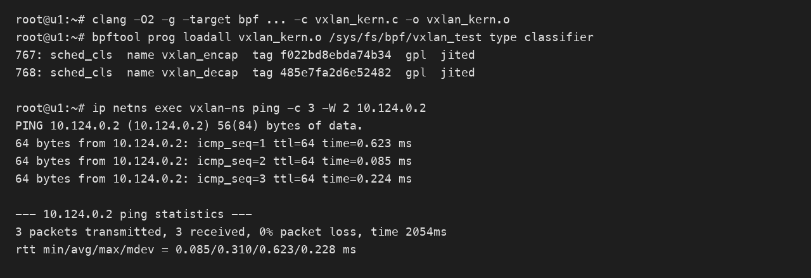

# eBPF 封装与解封装 VXLAN 报文

## 结论

在 TC eBPF 程序中，可以使用 `bpf_skb_adjust_room()` 完成 VXLAN 封装与解封装。封装时保留当前 Ethernet 头作为外层二层头，在其后增加外层 IPv4、UDP、VXLAN 和内层 Ethernet 头；解封装时保存内层 Ethernet 头，删除新增的隧道头，再恢复内层 Ethernet 头。

本文代码已在 Ubuntu 23.10、Linux 6.5.0、ARM64 环境完成编译、内核校验器加载和端到端测试。测试结果为 ICMP 报文 3 发 3 收、0% 丢包。

示例面向 Ethernet over IPv4/UDP VXLAN，不处理 VLAN、外层 IPv4 分片、GSO/GRO、ECMP 源端口计算和实际路由转发。

## 报文结构

| 阶段 | 报文结构 |
| --- | --- |
| 封装前 | Ethernet + Inner IPv4 + Payload |
| 封装后 | Outer Ethernet + Outer IPv4 + UDP + VXLAN + Inner Ethernet + Inner IPv4 + Payload |
| 解封装后 | Inner Ethernet + Inner IPv4 + Payload |

固定头部开销为 50 字节，其中外层 IPv4 为 20 字节、UDP 为 8 字节、VXLAN 为 8 字节、内层 Ethernet 为 14 字节。外层 Ethernet 头复用 skb 当前的二层头，不计入 `bpf_skb_adjust_room()` 新增长度。

## 完整代码

```c
#include <linux/bpf.h>
#include <linux/if_ether.h>
#include <linux/in.h>
#include <linux/ip.h>
#include <linux/udp.h>
#include <linux/pkt_cls.h>
#include <bpf/bpf_helpers.h>
#include <bpf/bpf_endian.h>

#define VXLAN_PORT 4789
#define VXLAN_VNI 100
#define VXLAN_FLAG_I 0x08
#define VXLAN_HDR_LEN 8
#define VXLAN_OVERHEAD (sizeof(struct iphdr) + sizeof(struct udphdr) + \
                        VXLAN_HDR_LEN + sizeof(struct ethhdr))
#define IPV4_DF 0x4000
#define IPV4_FRAG_OFFSET 0x1fff
#define IPV4_MF 0x2000

struct vxlanhdr {
    __u8 flags;
    __u8 reserved1[3];
    __be32 vni_reserved;
} __attribute__((packed));

static __always_inline __u16 ipv4_checksum(struct iphdr *iph)
{
    __u32 sum = 0;
    __u16 *words = (__u16 *)iph;

    /* 无 Options 的 IPv4 基本头包含 10 个 16 位字。 */
#pragma unroll
    for (int i = 0; i < 10; i++)
        sum += words[i];

    sum = (sum & 0xffff) + (sum >> 16);
    sum = (sum & 0xffff) + (sum >> 16);
    return ~sum;
}

SEC("tc/encap")
int vxlan_encap(struct __sk_buff *skb)
{
    void *data = (void *)(long)skb->data;
    void *data_end = (void *)(long)skb->data_end;
    struct ethhdr *eth = data;
    struct ethhdr inner_eth;
    struct iphdr outer_ip = {};
    struct udphdr outer_udp = {};
    struct vxlanhdr vxh = {};
    __u32 outer_len;
    __u32 udp_len;
    int ret;

    if ((void *)(eth + 1) > data_end)
        return TC_ACT_SHOT;

    /* 本示例只封装没有 VLAN 头的 IPv4 Ethernet 报文。 */
    if (eth->h_proto != bpf_htons(ETH_P_IP))
        return TC_ACT_OK;

    /* 当前 Ethernet 头将在隧道内部再次出现。 */
    __builtin_memcpy(&inner_eth, eth, sizeof(inner_eth));

    ret = bpf_skb_adjust_room(
        skb,
        VXLAN_OVERHEAD,
        BPF_ADJ_ROOM_MAC,
        BPF_F_ADJ_ROOM_ENCAP_L3_IPV4 |
        BPF_F_ADJ_ROOM_ENCAP_L4_UDP |
        BPF_F_ADJ_ROOM_ENCAP_L2(sizeof(struct ethhdr))
    );
    if (ret < 0)
        return TC_ACT_SHOT;

    /* skb->len 已包含新增的 50 字节。 */
    outer_len = skb->len - sizeof(struct ethhdr);
    udp_len = outer_len - sizeof(struct iphdr);
    if (outer_len > 0xffff || udp_len > 0xffff)
        return TC_ACT_SHOT;

    outer_ip.version = 4;
    outer_ip.ihl = 5;
    outer_ip.tot_len = bpf_htons((__u16)outer_len);
    outer_ip.frag_off = bpf_htons(IPV4_DF);
    outer_ip.ttl = 64;
    outer_ip.protocol = IPPROTO_UDP;

    /* 文档保留地址，实际使用时应替换。 */
    outer_ip.saddr = bpf_htonl(0xc0000201); /* 192.0.2.1 */
    outer_ip.daddr = bpf_htonl(0xc6336401); /* 198.51.100.1 */
    outer_ip.check = ipv4_checksum(&outer_ip);

    outer_udp.source = bpf_htons(40000);
    outer_udp.dest = bpf_htons(VXLAN_PORT);
    outer_udp.len = bpf_htons((__u16)udp_len);

    /* IPv4 UDP 允许校验和为 0；IPv6 UDP 不允许这样处理。 */
    outer_udp.check = 0;

    /* I 标志表示 VNI 字段有效，VNI 位于高 24 位。 */
    vxh.flags = VXLAN_FLAG_I;
    vxh.vni_reserved = bpf_htonl((__u32)VXLAN_VNI << 8);

    if (bpf_skb_store_bytes(
            skb, sizeof(struct ethhdr),
            &outer_ip, sizeof(outer_ip), 0) < 0)
        return TC_ACT_SHOT;

    if (bpf_skb_store_bytes(
            skb, sizeof(struct ethhdr) + sizeof(struct iphdr),
            &outer_udp, sizeof(outer_udp), 0) < 0)
        return TC_ACT_SHOT;

    if (bpf_skb_store_bytes(
            skb, sizeof(struct ethhdr) + sizeof(struct iphdr) +
                 sizeof(struct udphdr),
            &vxh, sizeof(vxh), 0) < 0)
        return TC_ACT_SHOT;

    if (bpf_skb_store_bytes(
            skb, sizeof(struct ethhdr) + sizeof(struct iphdr) +
                 sizeof(struct udphdr) + sizeof(struct vxlanhdr),
            &inner_eth, sizeof(inner_eth), 0) < 0)
        return TC_ACT_SHOT;

    /* 实际转发还需更新外层二层地址并选择出口。 */
    return TC_ACT_OK;
}

SEC("tc/decap")
int vxlan_decap(struct __sk_buff *skb)
{
    void *data = (void *)(long)skb->data;
    void *data_end = (void *)(long)skb->data_end;
    struct ethhdr *outer_eth = data;
    struct iphdr *outer_ip;
    struct udphdr *outer_udp;
    struct vxlanhdr *vxh;
    struct ethhdr *inner_eth_ptr;
    struct ethhdr inner_eth;
    __u32 outer_ihl;
    __u32 remove_len;
    __u16 frag_off;
    int ret;

    if ((void *)(outer_eth + 1) > data_end)
        return TC_ACT_SHOT;

    if (outer_eth->h_proto != bpf_htons(ETH_P_IP))
        return TC_ACT_OK;

    outer_ip = (void *)(outer_eth + 1);
    if ((void *)(outer_ip + 1) > data_end)
        return TC_ACT_SHOT;

    if (outer_ip->version != 4 || outer_ip->protocol != IPPROTO_UDP)
        return TC_ACT_OK;

    outer_ihl = (__u32)outer_ip->ihl * 4;
    if (outer_ihl < sizeof(*outer_ip) ||
        (void *)outer_ip + outer_ihl > data_end)
        return TC_ACT_SHOT;

    /* 外层 IPv4 分片应先重组。 */
    frag_off = bpf_ntohs(outer_ip->frag_off);
    if (frag_off & (IPV4_MF | IPV4_FRAG_OFFSET))
        return TC_ACT_SHOT;

    outer_udp = (void *)outer_ip + outer_ihl;
    if ((void *)(outer_udp + 1) > data_end)
        return TC_ACT_SHOT;

    if (outer_udp->dest != bpf_htons(VXLAN_PORT))
        return TC_ACT_OK;

    vxh = (void *)(outer_udp + 1);
    if ((void *)(vxh + 1) > data_end)
        return TC_ACT_SHOT;

    if (!(vxh->flags & VXLAN_FLAG_I))
        return TC_ACT_SHOT;

    if ((bpf_ntohl(vxh->vni_reserved) >> 8) != VXLAN_VNI)
        return TC_ACT_OK;

    inner_eth_ptr = (void *)(vxh + 1);
    if ((void *)(inner_eth_ptr + 1) > data_end)
        return TC_ACT_SHOT;

    __builtin_memcpy(&inner_eth, inner_eth_ptr, sizeof(inner_eth));

    remove_len = outer_ihl + sizeof(struct udphdr) +
                 sizeof(struct vxlanhdr) + sizeof(struct ethhdr);

    /* adjust_room 保留最外层 Ethernet 头，先将其改为内层头。 */
    if (bpf_skb_store_bytes(
            skb, 0, &inner_eth, sizeof(inner_eth), 0) < 0)
        return TC_ACT_SHOT;

    ret = bpf_skb_adjust_room(
        skb,
        -((int)remove_len),
        BPF_ADJ_ROOM_MAC,
        0
    );
    if (ret < 0)
        return TC_ACT_SHOT;

    return TC_ACT_OK;
}

char LICENSE[] SEC("license") = "GPL";
```

## 关键处理

VXLAN 是二层覆盖网络协议，隧道内部必须保留完整的内层 Ethernet 帧。调用 `bpf_skb_adjust_room()` 时，新增长度不仅包含外层 IPv4、UDP 和 VXLAN 头，还要包含一份内层 Ethernet 头。

封装标志同时指定 `BPF_F_ADJ_ROOM_ENCAP_L3_IPV4`、`BPF_F_ADJ_ROOM_ENCAP_L4_UDP` 和 `BPF_F_ADJ_ROOM_ENCAP_L2(sizeof(struct ethhdr))`，用于向内核描述新增头部的层次。Helper 调用可能重新分配 skb，因此调用前取得的直接报文指针不能继续使用。

解封装不能直接删除全部头部而忽略二层地址。`BPF_ADJ_ROOM_MAC` 会保留最外层 Ethernet 头，因此代码先将内层 Ethernet 头复制到最外层位置，再删除外层 IPv4、UDP、VXLAN 和隧道内的 Ethernet 头。

## 挂载方式

```bash
# 创建 clsact；已存在时不需要重复执行。
tc qdisc add dev eth0 clsact

# 出方向执行 VXLAN 封装。
tc filter add dev eth0 egress bpf da obj vxlan_kern.o sec tc/encap

# 入方向执行 VXLAN 解封装。
tc filter add dev eth0 ingress bpf da obj vxlan_kern.o sec tc/decap
```

## 本地验证

验证环境为 Ubuntu 23.10、Linux 6.5.0、ARM64，编译器为 Clang 16。代码成功编译为 BPF 目标文件，`bpftool prog loadall` 加载成功，内核校验器接受 `vxlan_encap` 和 `vxlan_decap`，两者均成为已 JIT 的 `sched_cls` 程序。

功能测试使用一对 veth 和独立网络命名空间。发送端 TC egress 挂载封装程序，接收端 TC ingress 挂载解封装程序。发送端发出的 Ethernet/IPv4/ICMP 报文依次经过 VXLAN 封装和解封装，接收端协议栈正常回复。测试结果为 3 发 3 收、0% 丢包。



验证使用的核心命令如下。

```bash
# 编译并通过内核校验器加载。
clang -O2 -g -target bpf -D__TARGET_ARCH_arm64 -I/usr/include/aarch64-linux-gnu -c /tmp/vxlan_kern.c -o /tmp/vxlan_kern.o
bpftool prog loadall /tmp/vxlan_kern.o /sys/fs/bpf/vxlan_test type classifier

# 分别挂载封装和解封装程序。
tc filter add dev vxlan-ns0 egress bpf da pinned /sys/fs/bpf/vxlan_test/vxlan_encap
tc filter add dev vxlan-root ingress bpf da pinned /sys/fs/bpf/vxlan_test/vxlan_decap

# 端到端验证。
ip netns exec vxlan-ns ping -c 3 -W 2 10.124.0.2
```

## 使用限制

| 场景 | 本文处理方式 | 生产环境建议 |
| --- | --- | --- |
| VLAN | 未处理 | 解析 802.1Q/802.1ad 并计算正确头长 |
| 外层 IPv4 Options | 解封装按 `ihl * 4` 计算 | 继续校验总长度和 Options |
| 外层 IPv4 分片 | 拒绝 | 解封装前完成分片重组 |
| UDP 校验和 | IPv4 下设置为 0 | 需要完整性保护或使用 IPv6 时正确计算 |
| UDP 源端口 | 固定为 40000 | 根据内层五元组哈希，支持 ECMP |
| MTU | 未处理 | 预留至少 50 字节并处理超长报文 |
| GSO/GRO | 未展开 | 结合内核版本和网卡 offload 能力验证 |
| 路由转发 | 未处理 | 查询 FIB、更新外层二层地址并重定向 |
| VNI | 固定为 100 | 根据租户或网络映射动态选择 |

该方案依赖 skb 语义，适用于 TC eBPF。XDP 程序应使用 `bpf_xdp_adjust_head()` 调整原始数据包缓冲区，不能直接调用 `bpf_skb_adjust_room()`。
