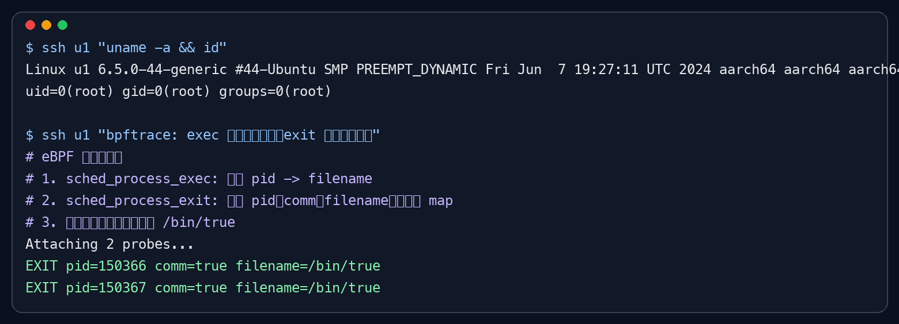

# eBPF 监听进程退出事件验证

本文记录一次在本地 Linux 虚拟机中使用 eBPF 监听进程退出事件的验证过程。验证目标是确认内核的 `sched:sched_process_exit` tracepoint 可以捕获进程退出，并能读取退出进程的 `pid` 和 `comm` 信息。

## 环境确认

验证环境为 ARM64 Linux 虚拟机，内核版本如下：

```bash
# 查看当前内核版本与 CPU 架构，确认 eBPF 验证运行在目标虚拟机中
uname -a

# 确认当前用户具备加载 eBPF 程序所需的权限；本次验证使用 root 用户执行
id
```

实际环境信息：

```text
Linux u1 6.5.0-44-generic #44-Ubuntu SMP PREEMPT_DYNAMIC Fri Jun  7 19:27:11 UTC 2024 aarch64 aarch64 aarch64 GNU/Linux
uid=0(root) gid=0(root) groups=0(root)
```

## 监听点选择

Linux 内核提供了 `sched_process_exit` tracepoint，用于在进程退出路径上触发事件。该事件可以读取进程名和进程 ID，因此适合用来验证“进程退出监听”这类场景。

```bash
# 查看 sched_process_exit tracepoint 是否存在；存在则说明当前内核暴露了该调度事件
ls /sys/kernel/debug/tracing/events/sched/sched_process_exit/format
```

本次验证中，该 tracepoint 文件存在，说明当前内核支持通过该事件观察进程退出。

## eBPF 程序加载位置

eBPF 程序不是加载到某个普通用户进程里，也不是作为磁盘上的可执行文件直接运行，而是加载到 Linux 内核的 eBPF 子系统中。用户态工具负责生成和提交程序，真正的 eBPF 指令码在通过内核校验后，会以内核对象的形式存在，并挂载到指定的 hook 点上执行。

结合本文的验证命令，`bpftrace` 本身运行在用户态。它会先把脚本编译成 eBPF 指令码，然后通过 `bpf()` 系统调用提交给内核。内核中的 verifier 会检查程序是否安全，例如不能越界访问内存、不能出现不受控的循环、不能随意访问内核地址。校验通过后，程序会被加载到内核中，并 attach 到 `sched:sched_process_exec` 和 `sched:sched_process_exit` 这类 tracepoint 上。

当进程执行或退出时，内核触发对应 tracepoint，挂载在该 tracepoint 上的 eBPF 程序就会在内核上下文中执行。本文中记录完整路径的逻辑，就是在 `sched_process_exec` 触发时记录 `pid -> filename`，再在 `sched_process_exit` 触发时根据 `pid` 取出 `filename` 并输出。

```text
用户态 bpftrace
  -> 编译脚本生成 eBPF 指令码
  -> 通过 bpf() 系统调用提交给内核
  -> 内核 verifier 做安全校验
  -> 加载到内核 eBPF 子系统
  -> attach 到 tracepoint
  -> tracepoint 触发时在内核上下文执行
```

还需要注意生命周期问题：本文使用的是临时验证方式，没有把 eBPF 程序 pin 到 bpffs，也没有通过长期运行的守护进程维持链接。因此 `bpftrace` 进程退出后，对应的 eBPF 程序和 map 通常也会随之卸载，不会长期留在内核中。

## BPF map 保存的信息

本文为了在进程退出时输出完整路径，确实使用了 BPF map 来临时保存信息。`bpftrace` 脚本中的 `@filename` 是 `bpftrace` 提供的 map 语法，底层会由内核创建和管理对应的 BPF map。

```bash
# exec 事件触发时，把当前 pid 和完整文件路径保存到 BPF map 中
@filename[args->pid] = str(args->filename);

# exit 事件触发时，用 pid 从 BPF map 中取出之前保存的完整路径
@filename[args->pid]

# 输出后删除对应 key，避免 pid 复用或 map 持续增长带来干扰
delete(@filename[args->pid]);
```

这里的执行过程可以理解为：进程执行 `/bin/true` 时，`sched_process_exec` 先触发，eBPF 程序把 `pid -> /bin/true` 写入 BPF map；进程退出时，`sched_process_exit` 再触发，eBPF 程序用同一个 `pid` 从 BPF map 中查到 `/bin/true`，然后输出并删除这条记录。

需要注意的是，`@filename` 不是普通用户态程序里的 HashMap，而是 `bpftrace` 帮我们声明和操作的 BPF map。因为本文没有对 map 做 pinning，所以它的生命周期也跟随这次 `bpftrace` 验证程序；当 `bpftrace` 退出后，这个 map 通常会被释放。

## 验证命令

下面的命令使用 `bpftrace` 加载一个很小的 eBPF 程序。需要注意的是，`sched_process_exit` 事件本身只能直接拿到 `pid` 和 `comm`，其中 `comm` 通常只是进程名，例如 `true`，不是完整命令路径。为了在退出时输出 `/bin/true` 这样的完整路径，可以同时监听 `sched_process_exec`：进程执行时先记录 `pid -> filename`，进程退出时再用 `pid` 查出完整路径并输出。

```bash
# 清理旧的验证输出，避免历史日志影响本次判断
rm -f /tmp/exit_fullcmd_learning_note.log

# 启动 bpftrace，同时监听进程 exec 和 exit 两类事件
# sched_process_exec: 进程执行时记录 pid 到完整文件路径 filename 的映射
# sched_process_exit: 进程退出时读取前面记录的 filename，输出 pid、comm 和完整路径
# delete: 输出后清理 map，避免长时间运行时 pid 复用或 map 膨胀带来干扰
timeout 8 bpftrace -e 'tracepoint:sched:sched_process_exec { @filename[args->pid] = str(args->filename); } tracepoint:sched:sched_process_exit /@filename[args->pid] != ""/ { printf("EXIT pid=%d comm=%s filename=%s\n", args->pid, args->comm, @filename[args->pid]); delete(@filename[args->pid]); }' > /tmp/exit_fullcmd_learning_note.log 2>&1 &

# 等待 bpftrace 完成探针加载，避免测试进程过早退出导致漏采
sleep 2

# 连续执行两个短生命周期进程，用于触发进程退出事件；期望输出完整路径 /bin/true
/bin/true
/bin/true

# 查看 eBPF 程序捕获到的进程退出事件
cat /tmp/exit_fullcmd_learning_note.log
```

实际输出如下：

```text
Attaching 2 probes...
EXIT pid=150366 comm=true filename=/bin/true
EXIT pid=150367 comm=true filename=/bin/true
```

## 验证截图



## 结论

本次验证确认：在当前本地 Linux 虚拟机中，eBPF 可以通过 `sched:sched_process_exit` tracepoint 监听到进程退出事件。测试中连续执行两次 `/bin/true` 后，eBPF 程序分别捕获到了两个退出事件，并成功打印了对应的 `pid`、`comm` 和完整路径 `filename=/bin/true`。这说明该方式不仅可用于判断进程是否退出，也可以通过关联 exec 事件补齐退出进程的完整命令路径。
