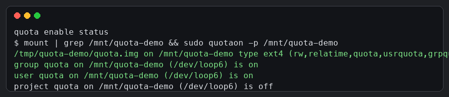
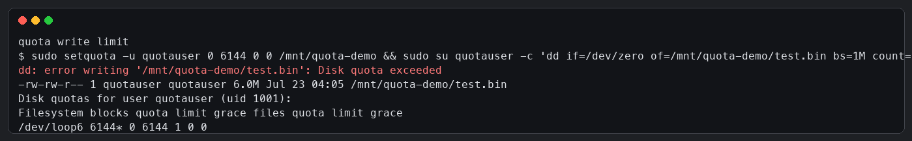

# Linux 配置 quota 避免写入内容超限

## 原理说明

quota 的实现点在文件系统，而不是在 `dd`、`cp`、应用程序或 shell 这一层。Linux 进程写文件时，会通过 `write`、`truncate`、`fallocate` 等系统调用进入内核，内核再把写入请求交给目标文件所在的文件系统。启用 quota 后，文件系统在分配数据块或 inode 之前，会先检查这次分配属于哪个用户、用户组或 project，再读取该对象当前已使用的配额计数，并判断新增后是否超过硬限制。

如果没有超过硬限制，文件系统会完成块或 inode 分配，同时更新 quota 计数。如果超过硬限制，文件系统会拒绝本次分配，并向上返回 `EDQUOT` 错误。用户态程序通常会把这个错误显示成 `Disk quota exceeded`。因此，quota 能阻止继续写入，是因为写入数据最终必须经过文件系统分配空间，而文件系统在分配空间前做了配额校验。

quota 限制的是“已分配给某个对象的文件系统资源”。块容量限制的是数据块占用量，inode 限制的是文件数量。本文只讨论硬限制：达到硬限制后，新的写入会立即失败。硬限制不同于磁盘总容量限制，它只限制某个用户、用户组或 project 在指定文件系统上的占用，即使磁盘仍有剩余空间，超过该对象硬限制的写入也会失败。

quota 只对启用配额的挂载点生效。也就是说，给 `/data` 启用 quota 后，只限制写入 `/data` 文件系统的内容，不会自动影响 `/var`、`/home` 或其他挂载点。如果 `/data/logs` 实际上又挂载了另一个文件系统，那么 `/data` 上的 quota 也不会自动限制 `/data/logs`，需要在对应挂载点单独启用和配置。

## 适用场景

开发机、测试机、共享服务器和日志目录都适合使用 quota。典型场景是限制某个用户、某个用户组或某个业务目录的最大写入量，避免异常日志、临时文件、批处理输出把磁盘写满。

## ext4 用户配额配置案例

案例目标是在一个 ext4 文件系统上限制用户 `quotauser` 的写入容量。本文只设置 6MiB 硬限制。测试时写入 8MiB 文件，最终写入在 6MiB 位置失败，系统返回 `Disk quota exceeded`。

### 1. 安装工具

```bash
# Debian/Ubuntu 安装 quota 工具包，提供 quotacheck、quotaon、setquota、quota 等命令
sudo apt-get update && sudo apt-get install -y quota e2fsprogs
```

### 2. 挂载时启用用户和用户组配额

临时验证可以直接使用 `mount -o`，生产环境建议写入 `/etc/fstab`，保证重启后仍然生效。

```bash
# 创建挂载目录
sudo mkdir -p /data

# 挂载 ext4 文件系统，并启用用户配额和用户组配额
sudo mount -o usrquota,grpquota /dev/sdb1 /data

# 检查挂载参数中是否包含 usrquota 和 grpquota
mount | grep ' /data '
```

`/etc/fstab` 示例：

```fstab
# /dev/sdb1 是需要限制写入的 ext4 分区
# /data 是挂载点
# usrquota 启用用户配额，grpquota 启用用户组配额
/dev/sdb1  /data  ext4  defaults,usrquota,grpquota  0  2
```

### 3. 初始化并开启 quota

```bash
# 扫描文件系统并生成用户、用户组配额数据库文件
sudo quotacheck -cugm /data

# 开启 /data 文件系统上的 quota
sudo quotaon /data

# 查看 quota 是否已经开启
sudo quotaon -p /data
```

关键验证截图：



### 4. 设置用户写入限制

```bash
# 创建测试用户，不创建家目录
sudo useradd -M -s /bin/sh quotauser

# 为 quotauser 设置块配额：块容量硬限制 6144KiB
# inode 配额设置为 0 0，表示不限制文件数量
sudo setquota -u quotauser 0 6144 0 0 /data

# 查看用户配额
sudo quota -u quotauser
```

`setquota` 参数含义直接写在命令注释里：

```bash
# -u quotauser：设置用户 quotauser 的用户配额
# 第一个块容量参数填写 0，本文只使用后面的硬限制参数
# 6144：块硬限制，单位通常按 KiB 计，对应 6MiB
# 第一个 inode 参数填写 0，表示不限制
# 第二个 inode 参数填写 0，表示不限制
# /data：quota 生效的文件系统挂载点
sudo setquota -u quotauser 0 6144 0 0 /data
```

### 5. 写入超限验证

```bash
# 使用 quotauser 写入 8MiB 文件，预期超过 6MiB 硬限制后失败
sudo su quotauser -c 'dd if=/dev/zero of=/data/test.bin bs=1M count=8 status=none'

# 查看实际文件大小和 quota 使用情况
sudo ls -lh /data/test.bin
sudo quota -u quotauser
```

关键验证截图：



验证结果说明：`test.bin` 最终大小为 6.0MiB，用户使用量达到硬限制 `6144`。继续写入时系统返回 `Disk quota exceeded`，证明 quota 已经阻止超限写入。

## 常用管理命令

```bash
# 查看指定用户的 quota 使用情况
sudo quota -u quotauser

# 查看指定用户组的 quota 使用情况
sudo quota -g groupname

# 以报表形式查看当前文件系统的用户配额使用情况
sudo repquota -u /data

# 关闭指定文件系统的 quota
sudo quotaoff /data

# 重新开启指定文件系统的 quota
sudo quotaon /data
```

## 排查要点

如果 `quotaon` 报错，需要先确认内核是否支持 quota，挂载参数是否包含 `usrquota` 或 `grpquota`，以及是否已经执行 `quotacheck` 生成配额数据库。对于云主机或容器环境，还要确认当前内核模块完整可用，部分精简内核可能缺少 quota 相关模块。

如果 `setquota` 已执行但写入没有被限制，优先检查写入路径是否真的位于启用 quota 的挂载点下。quota 按文件系统生效，路径看起来相近但跨挂载点时不会被限制。

如果只想限制某个目录而不是整个用户在文件系统内的所有写入，可以优先考虑 XFS project quota。ext4 用户 quota 更适合按用户或用户组限制，XFS project quota 更适合按目录树限制。

## XFS project quota 目录级限制示例

XFS project quota 适合限制某个目录树，例如限制 `/data/app-cache` 的总写入量。它不依赖单个 Linux 用户，更适合服务进程共用账号但需要按目录隔离容量的场景。

```bash
# 挂载 XFS 文件系统时启用 project quota
sudo mount -o prjquota /dev/sdb1 /data

# 注册 project id 和目录映射
# 1001 是 project id，/data/app-cache 是要限制的目录
printf '1001:/data/app-cache\n' | sudo tee -a /etc/projects

# 注册 project 名称和 project id 映射
printf 'appcache:1001\n' | sudo tee -a /etc/projid

# 初始化 project quota 目录树
sudo xfs_quota -x -c 'project -s appcache' /data

# 设置目录树容量硬限制为 6g
sudo xfs_quota -x -c 'limit -p bhard=6g appcache' /data

# 查看 project quota 报表
sudo xfs_quota -x -c 'report -p -h' /data
```

## 配置建议

生产环境建议先按真实业务峰值观察一段时间，再设置硬限制。硬限制用于兜底阻止写满磁盘。日志、缓存和临时目录应配合清理策略使用，quota 负责阻断异常增长，清理策略负责释放历史数据。
