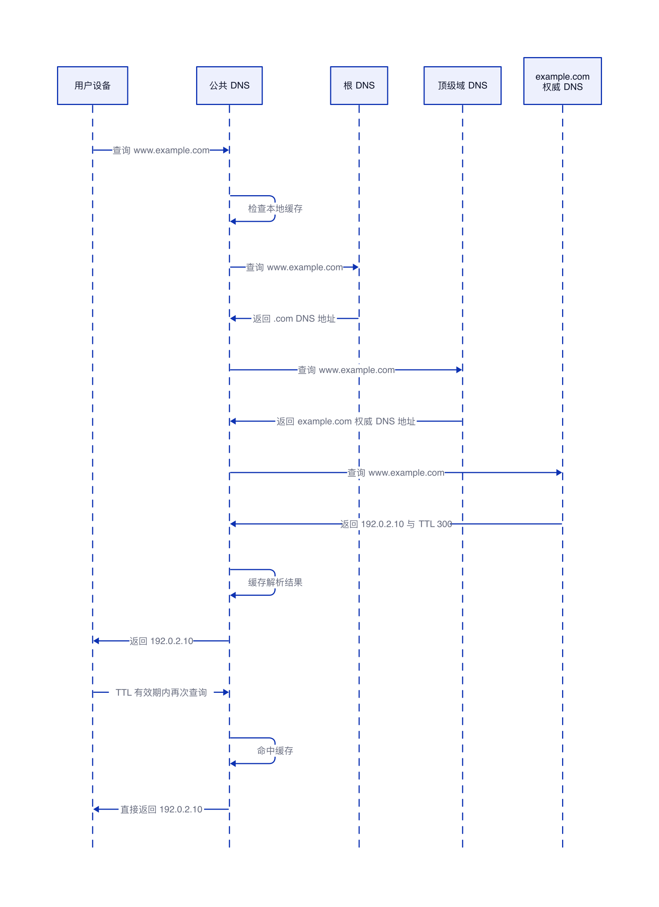

# 权威 DNS 与公共 DNS 的解析流程

## 结论

权威 DNS 不会主动把解析结果推送给公共 DNS。公共 DNS 收到用户查询后，如果本地没有可用缓存，才会沿着 DNS 层级主动找到权威 DNS，并向它查询最终结果。

权威 DNS 返回域名记录和 TTL。公共 DNS 按 TTL 缓存结果，在缓存有效期内直接回答用户；TTL 到期后，下一次查询才会再次访问权威 DNS。

这里的“公共 DNS”本质上是递归 DNS，例如运营商 DNS 或公共递归解析服务。它负责替用户完成后续查询。

## 简单类比

可以把权威 DNS 看成公司的官方通讯录，把公共 DNS 看成咨询台。

咨询台不知道某个人的电话时，会主动查询官方通讯录，然后把结果暂时记下来。之后其他人再询问，咨询台可以直接回答。记录过期后，咨询台才会重新查询官方通讯录。

官方通讯录不会主动通知所有咨询台，也不知道哪些咨询台保存了旧记录。

## 简单例子

假设权威 DNS 保存了下面的记录：

```text
www.example.com.  300  IN  A  192.0.2.10
```

这条记录表示：`www.example.com` 的 IPv4 地址是 `192.0.2.10`，TTL 为 300 秒。

第一次查询时，公共 DNS 没有缓存，因此会访问权威 DNS：

```text
用户查询 www.example.com
公共 DNS 查询权威 DNS
权威 DNS 返回 192.0.2.10 和 TTL 300
公共 DNS 缓存结果并返回给用户
```

在 TTL 有效期内再次查询时，公共 DNS 直接返回缓存中的 `192.0.2.10`，不再访问权威 DNS。

## 核心流程


一次完整查询按以下顺序执行：

1. 用户设备向公共 DNS 查询 `www.example.com`。
2. 公共 DNS 先检查本地缓存。没有可用缓存时，向根 DNS 查询。
3. 根 DNS 不返回最终 IP，只告诉公共 DNS 去哪里查询 `.com`。
4. 公共 DNS 向 `.com` 顶级域 DNS 查询。
5. 顶级域 DNS 返回 `example.com` 的权威 DNS 信息。
6. 公共 DNS 向 `example.com` 的权威 DNS 查询 `www.example.com`。
7. 权威 DNS 返回最终记录 `192.0.2.10` 和 TTL 300。
8. 公共 DNS 缓存结果，并把 IP 返回给用户。

根 DNS 和顶级域 DNS 返回的主要是下一层服务器信息，这种应答叫作“转介”。真正保存 `www.example.com` 记录的是该域名的权威 DNS。

## 公共 DNS 如何找到权威 DNS

域名所有者需要在域名注册商处配置权威 DNS，也就是为域名设置 NS 服务器。注册商把这些信息提交给对应的顶级域注册局，顶级域 DNS 随后保存该域名的 NS 记录。

因此，公共 DNS 查询顶级域 DNS 时，可以得到目标域名的权威 DNS 名称。必要时，顶级域 DNS 还会同时返回权威 DNS 的 IP，这类辅助地址叫作 Glue 记录。公共 DNS 拿到这些信息后，才能继续向权威 DNS 查询最终记录。

这一步仍然不是权威 DNS 主动推送解析结果，而是提前在上级 DNS 中登记“应该去哪里查询”。

## 各类 DNS 的职责

| 角色 | 保存或处理的内容 | 是否返回最终结果 |
|---|---|---|
| 用户设备 | 发起域名查询，通常保存少量本地缓存 | 不负责递归查询 |
| 公共 DNS | 代替用户查询并缓存结果 | 命中缓存或查询完成后返回 |
| 根 DNS | 告知对应顶级域 DNS 的位置 | 不返回业务域名 IP |
| 顶级域 DNS | 告知目标域名权威 DNS 的位置 | 不返回业务域名 IP |
| 权威 DNS | 保存域名的 A、AAAA、CNAME 等记录 | 返回自己负责区域内的权威答案 |

## TTL 如何控制缓存

TTL 表示公共 DNS 最长可以缓存一条记录多长时间。公共 DNS 返回缓存结果时，TTL 会随着时间递减。

| 状态 | 公共 DNS 的处理方式 |
|---|---|
| 缓存不存在 | 查询根 DNS、顶级域 DNS 和权威 DNS |
| 缓存存在且 TTL 未到期 | 直接返回缓存结果 |
| TTL 已到期 | 删除或停止使用旧缓存，重新查询 |
| 权威记录已经修改，但旧缓存未到期 | 继续返回旧结果，直到旧 TTL 到期 |

例如，权威 DNS 把地址从 `192.0.2.10` 修改为 `192.0.2.20`，已经缓存旧记录的公共 DNS 不会立即知道。它会继续返回旧地址，直到 TTL 到期并重新查询。

准备变更重要记录时，可以提前调低 TTL。等待旧的高 TTL 缓存过期后再修改记录，可以缩短新旧地址并存的时间。变更稳定后，再把 TTL 调回正常值。

## DNS NOTIFY 的作用

DNS NOTIFY 不是用来通知公共 DNS 刷新缓存的。它用于同一个 DNS 区域的权威服务器之间同步数据：

```text
主权威 DNS 通知从权威 DNS 区域已经更新
从权威 DNS 检查序列号
从权威 DNS 通过区域传送获取新数据
```

公共 DNS 不参与这个同步流程。它仍然按照 TTL 管理缓存，普通权威 DNS 没有标准机制可以强制所有公共 DNS 立即删除旧记录。

## 使用注意事项

查询问题时，应先区分权威 DNS 上的记录是否正确，以及公共 DNS 是否还在使用旧缓存。权威 DNS 已经返回新记录，不代表所有公共 DNS 都已经更新。

可以分别查询权威 DNS 和指定公共 DNS，对比两边的结果和 TTL。若权威 DNS 已返回新结果，而公共 DNS 仍返回旧结果，说明旧缓存还没有到期。

部分公共 DNS 提供手动刷新缓存的额外功能，但这不是标准 DNS 查询流程，也不能代替合理设置 TTL。
