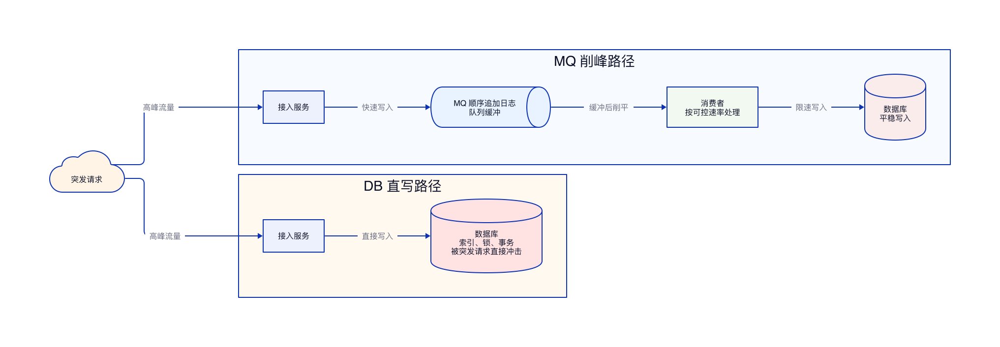

# MQ 为什么能削峰而 DB 不适合

## 结论

MQ 能削峰，是因为它把「接收请求」和「实际处理」拆成了两个节奏：生产者先把突发请求快速写入 MQ，消费者再按数据库能承受的速度慢慢消费。突发流量不会直接打到 DB，而是先被队列缓冲下来。

DB 不适合直接削峰，是因为 DB 写入本身就是最终处理动作。请求一来就要执行索引维护、锁竞争、事务提交、数据落盘等操作，突发流量会直接转化为数据库压力。DB 没有天然的队列缓冲层，不能把高峰请求自动摊平到后面慢慢处理。

## 核心差异

| 对比项 | MQ | DB |
| --- | --- | --- |
| 写入方式 | 顺序追加日志 | 数据页写入、索引更新、事务提交 |
| 主要目标 | 先接住消息 | 直接完成数据变更 |
| 高峰处理方式 | 队列缓冲，消费者限速处理 | 请求直接冲击数据库 |
| 扩展方式 | 分区、队列、消费者组水平扩展 | 写入扩展受索引、锁、事务约束 |
| 适合场景 | 异步处理、削峰填谷、解耦上下游 | 强一致查询、事务更新、最终状态存储 |

## MQ 为什么写得更快

MQ 的核心写入模型是追加日志。生产者发送消息时，MQ 主要做的是把消息按顺序追加到日志文件中，再维护必要的消费位点和索引信息。这类写入模式更接近顺序 I/O，吞吐能力高，适合快速接住大量请求。

DB 的写入目标不是简单保存一条日志，而是维护可查询、可事务化的数据状态。一次写入会涉及数据页修改、索引维护、锁控制、事务日志、约束检查等工作。尤其在大量并发写入同一批表或索引时，锁竞争和索引维护会成为瓶颈。

## MQ 如何把高峰削平

1. 高峰流量进入系统时，生产者先把请求写入 MQ。
2. MQ 用队列保存这些消息，形成缓冲区。
3. 消费者不需要按生产速度消费，而是按下游 DB 能承受的速度消费。
4. 高峰期积压的消息在后续低峰期继续被消费。
5. DB 感受到的是被限速后的平稳写入，而不是瞬时峰值。

这个过程的关键，是 MQ 把入口流量和处理能力解耦。生产者只负责快速投递，消费者负责按节奏处理，中间的积压由 MQ 承担。

## DB 为什么不能直接承担削峰

DB 接收到写请求后，需要立即执行实际的数据变更。请求越多，DB 要同时处理的事务、锁、索引更新、日志写入就越多。突发流量不会被自然缓冲，而是直接变成 CPU、I/O、锁等待和连接数压力。

如果把 DB 当队列使用，例如大量请求先写入一张任务表，再由后台任务扫描处理，本质上是在 DB 上模拟 MQ。这样会让 DB 同时承担队列和存储两类职责，任务表还会面临频繁插入、扫描、状态更新和索引膨胀，最终瓶颈仍然落在 DB 上。

## 一个简单例子

假设一秒内来了 10 万个下单后的异步通知任务，而 DB 稳定处理能力是每秒 1 万次写入。

| 方案 | 高峰期表现 | DB 压力 |
| --- | --- | --- |
| 直接写 DB | 10 万次请求直接进入 DB | 瞬时超过承载能力 |
| 先写 MQ | 10 万条消息先进入队列 | 消费者按每秒 1 万次写入 |

使用 MQ 时，系统接受请求的速度可以高于 DB 的处理速度。多出来的 9 万条消息不会丢给 DB 硬扛，而是先留在队列里，后续逐步消费。

## 使用 MQ 削峰的注意点

| 注意点 | 说明 |
| --- | --- |
| 消息积压 | 削峰不是消灭流量，只是把高峰流量延后处理 |
| 消费限速 | 消费速度要按 DB 承载能力设置，不能无限拉高 |
| 幂等处理 | 消费失败重试会带来重复投递，业务侧要保证幂等 |
| 延迟影响 | 削峰会牺牲一部分实时性，适合异步场景 |

MQ 适合削峰，不代表所有写入都应该异步化。强一致、必须立即返回最终结果的核心链路仍然需要同步写 DB；可以延后处理的通知、日志、统计、异步状态流转，更适合放到 MQ 中削峰处理。
