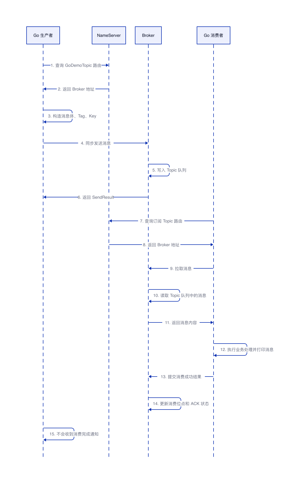

# RocketMQ Go 生产与消费 Demo

## 结论

本次在虚拟机 `u1` 中完成了 RocketMQ 单机版环境搭建，并使用 Go 编写了生产者和消费者 Demo。验证结果表明，Go 生产者已经成功向 `GoDemoTopic` 写入消息，Go 消费者也已经成功从同一 Topic 消费到该消息。

本次使用的开源组件版本为 `apache/rocketmq:5.3.2`，Go 版本为 `go1.21.1 linux/arm64`。RocketMQ Broker 初次启动时因默认 JVM 内存占用较高被系统终止，后续通过限制 NameServer 和 Broker 的 JVM 堆内存后启动成功。



## 环境准备

RocketMQ 使用 Docker 容器运行，包含一个 NameServer 和一个 Broker。NameServer 负责保存和返回 Topic 路由信息，Broker 负责消息写入、存储和消费分发。

```bash
# 创建 RocketMQ 专用 Docker 网络，便于 NameServer 和 Broker 通过容器名互相访问
docker network create rocketmq

# 拉取 RocketMQ 5.3.2 镜像
docker pull apache/rocketmq:5.3.2
```

Broker 配置文件如下，配置说明直接写在注释中。

```properties
# Broker 所属集群名称，单机 Demo 使用默认集群即可
brokerClusterName = DefaultCluster

# Broker 名称，NameServer 会把 Topic 路由关联到该 Broker
brokerName = broker-a

# 0 表示 Master Broker
brokerId = 0

# 历史 CommitLog 文件清理时间点
# 这里保持 RocketMQ 默认风格配置
deleteWhen = 04

# 消息文件保留时间，单位为小时
fileReservedTime = 48

# Broker 角色，单机 Demo 使用异步主节点
brokerRole = ASYNC_MASTER

# 刷盘方式，异步刷盘适合 Demo 和普通吞吐场景
flushDiskType = ASYNC_FLUSH

# Broker 对外暴露的 IP，Go 客户端会根据该地址连接 Broker
brokerIP1 = 192.168.64.2

# 允许自动创建 Topic；本次仍显式创建 Topic，便于验证路由存在
autoCreateTopicEnable = true

# Broker 监听端口
listenPort = 10911
```

启动 NameServer 和 Broker 的命令如下。

```bash
# 启动 NameServer，并限制 JVM 内存，避免小规格虚拟机内存压力过大
docker run -d --name rocketmq-namesrv --network rocketmq -e JAVA_OPT_EXT="-Xms128m -Xmx128m -Xmn64m" -p 9876:9876 apache/rocketmq:5.3.2 sh mqnamesrv

# 启动 Broker，挂载本地 broker.conf，并连接到 NameServer
docker run -d --name rocketmq-broker --network rocketmq -e JAVA_OPT_EXT="-Xms256m -Xmx256m -Xmn128m" -p 10911:10911 -p 10909:10909 -v "$HOME/rocketmq-go-demo/conf/broker.conf:/home/rocketmq/rocketmq-5.3.2/conf/broker.conf" apache/rocketmq:5.3.2 sh mqbroker -n rocketmq-namesrv:9876 -c /home/rocketmq/rocketmq-5.3.2/conf/broker.conf

# 查看容器状态，确认 NameServer 和 Broker 均处于 Up 状态
docker ps
```

创建 Topic 的命令如下。

```bash
# 在 DefaultCluster 中创建 GoDemoTopic，用于本次 Go 生产者和消费者验证
docker exec rocketmq-broker sh mqadmin updateTopic -n rocketmq-namesrv:9876 -c DefaultCluster -t GoDemoTopic
```

## Go 工程结构

本次 Go Demo 放在虚拟机的 `~/rocketmq-go-demo` 目录中，包含 `go.mod`、`producer.go` 和 `consumer.go` 三个文件。

```go
// go.mod
// 定义 Go 模块，并引入 RocketMQ Go 客户端依赖。
module rocketmq-go-demo

go 1.21

require github.com/apache/rocketmq-client-go/v2 v2.1.2
```

## 生产者实现

生产者连接 NameServer，查询 Topic 路由，然后向 Broker 同步发送一条消息。消息体中带有当前时间，便于在消费端确认消费到的是本次发送的消息。

```go
package main

import (
	"context"
	"fmt"
	"os"
	"time"

	"github.com/apache/rocketmq-client-go/v2"
	"github.com/apache/rocketmq-client-go/v2/primitive"
	"github.com/apache/rocketmq-client-go/v2/producer"
)

// topic 是生产者写入、消费者订阅的消息主题。
const topic = "GoDemoTopic"

func main() {
	// NameServer 地址默认使用本机 9876 端口，也支持通过环境变量覆盖。
	nameServer := os.Getenv("ROCKETMQ_NAMESRV")
	if nameServer == "" {
		nameServer = "127.0.0.1:9876"
	}

	// 创建同步生产者，配置 NameServer 和发送重试次数。
	p, err := rocketmq.NewProducer(
		producer.WithNameServer([]string{nameServer}),
		producer.WithRetry(2),
	)
	if err != nil {
		panic(err)
	}

	// 启动生产者，完成客户端初始化和路由加载。
	if err := p.Start(); err != nil {
		panic(err)
	}
	defer p.Shutdown()

	// 构造消息体，并设置 Tag 和 Key，方便后续过滤和排查。
	body := fmt.Sprintf("hello rocketmq from go, time=%s", time.Now().Format(time.RFC3339))
	msg := primitive.NewMessage(topic, []byte(body))
	msg.WithTag("go-demo")
	msg.WithKeys([]string{fmt.Sprintf("go-demo-%d", time.Now().UnixNano())})

	// 同步发送消息，发送成功后打印 msgID 和队列信息。
	result, err := p.SendSync(context.Background(), msg)
	if err != nil {
		panic(err)
	}

	fmt.Printf("send success: topic=%s msgID=%s queue=%v body=%q\n", topic, result.MsgID, result.MessageQueue, body)
}
```

## 消费者实现

消费者使用 PushConsumer 订阅同一个 Topic，收到消息后在回调函数中打印消息内容，并返回 `ConsumeSuccess` 表示消费成功。

```go
package main

import (
	"context"
	"fmt"
	"os"
	"time"

	"github.com/apache/rocketmq-client-go/v2"
	"github.com/apache/rocketmq-client-go/v2/consumer"
	"github.com/apache/rocketmq-client-go/v2/primitive"
)

// topic 必须与生产者写入的 Topic 保持一致。
const topic = "GoDemoTopic"

func main() {
	// NameServer 地址默认使用本机 9876 端口，也支持通过环境变量覆盖。
	nameServer := os.Getenv("ROCKETMQ_NAMESRV")
	if nameServer == "" {
		nameServer = "127.0.0.1:9876"
	}

	// 创建 PushConsumer，同一个消费组会共同分摊 Topic 中的消息。
	c, err := rocketmq.NewPushConsumer(
		consumer.WithNameServer([]string{nameServer}),
		consumer.WithGroupName("go-demo-consumer-group"),
	)
	if err != nil {
		panic(err)
	}

	// 订阅 Topic。回调函数中处理消息，并返回 ConsumeSuccess 确认消费成功。
	if err := c.Subscribe(topic, consumer.MessageSelector{}, func(ctx context.Context, msgs ...*primitive.MessageExt) (consumer.ConsumeResult, error) {
		for _, msg := range msgs {
			fmt.Printf("consume success: topic=%s msgID=%s queueID=%d offset=%d body=%q\n", msg.Topic, msg.MsgId, msg.Queue.QueueId, msg.QueueOffset, string(msg.Body))
		}
		return consumer.ConsumeSuccess, nil
	}); err != nil {
		panic(err)
	}

	// 启动消费者，等待 30 秒用于接收消息。
	if err := c.Start(); err != nil {
		panic(err)
	}
	defer c.Shutdown()

	fmt.Println("consumer started, waiting messages for 30s...")
	time.Sleep(30 * time.Second)
	fmt.Println("consumer stopped")
}
```

## 验证过程

先运行生产者发送消息。

```bash
# 进入 Demo 目录并运行 Go 生产者
cd ~/rocketmq-go-demo && go run producer.go
```

生产者输出如下，说明消息已经成功写入 RocketMQ。

```text
send success: topic=GoDemoTopic msgID=C0A8400298B600000000363117b80001 queue=MessageQueue [topic=GoDemoTopic, brokerName=broker-a, queueId=1] body="hello rocketmq from go, time=2026-08-11T12:33:07+08:00"
```

再运行消费者消费消息。

```bash
# 进入 Demo 目录并运行 Go 消费者
cd ~/rocketmq-go-demo && go run consumer.go
```

消费者输出如下，说明消费者已经从 `GoDemoTopic` 拉取并消费到生产者写入的消息。

```text
consumer started, waiting messages for 30s...
consume success: topic=GoDemoTopic msgID=C0A8400298B600000000363117b80001 queueID=1 offset=0 body="hello rocketmq from go, time=2026-08-11T12:33:07+08:00"
consumer stopped
```

## 消息生产与消费流程

1. Go 生产者连接 NameServer，查询 `GoDemoTopic` 对应的路由信息。
2. NameServer 返回 Broker 地址，生产者根据路由连接 Broker。
3. Go 生产者构造消息体、Tag 和 Key，并同步发送消息。
4. Broker 接收消息后，在 Broker 内部把消息写入 `GoDemoTopic` 对应队列。
5. Broker 返回 `SendResult`，生产者打印 `msgID` 和队列信息。
6. Go 消费者连接 NameServer，查询订阅 Topic 的路由信息。
7. Go 消费者连接 Broker，拉取待消费消息。
8. Broker 在内部读取 Topic 队列中的消息，并把消息返回给消费者。
9. 消费者处理消息后返回 `ConsumeSuccess`，Broker 在内部更新消费位点和 ACK 状态。
10. 生产者不会收到消费者消费完成通知。

## 生产者能感知消息已经被消费吗

结论是：即使使用 RocketMQ 5.x，生产者默认也不能直接感知某条消息是否已经被消费者消费。RocketMQ 的发布/订阅解耦模型没有改变，生产者发送消息后只能拿到 Broker 返回的发送结果，也就是 `SendResult`。这个结果只能说明 Broker 是否成功接收了消息，不能说明消费者是否已经处理了消息。

消费者消费完成后，会向 Broker 提交消费成功结果，Broker 会更新消费位点和 ACK 状态。RocketMQ 官方文档把消费成功后的消息状态称为 `Commit`，含义是消费者返回成功响应后，服务端可以结束这条消息的消费状态机；消费失败会触发重试，超过最大重试次数后进入死信队列 DLQ。这个状态流转发生在消费者和 Broker 之间，不会回传给生产者。RocketMQ 5.x 官方消费重试说明中明确描述了 Ready、Inflight、Commit、DLQ 等状态，其中 Commit 表示消费者返回成功响应后，服务端可以结束这条消息的消费状态机；消费失败会触发重试，超过最大重试次数后进入死信队列 DLQ。

RocketMQ 5.x 确实有一些新能力和行为变化，但这些能力都不等于「生产者能感知消费结果」。例如，RocketMQ 5.0 引入了新的客户端接入形态和 Proxy/gRPC 模式，Proxy 会把 `send`、`pop`、`ack` 等请求转换到后端 Broker 和 NameServer；这改善的是多语言客户端、云原生接入和协议适配方式，不会把消费者 ACK 自动通知给原生产者。本次验证环境使用的是 `apache/rocketmq:5.3.2`，属于 RocketMQ 5.x 版本，因此上述 5.0 起的架构变化适用于理解 5.3.2 的客户端接入模型。RocketMQ 5.0 的 Proxy 模式说明中提到，Proxy 会把 send、pop、ack 等请求转换到后端 Broker 和 NameServer，用于支持多协议适配、云原生接入和多语言轻量客户端。

RocketMQ 5.x 还强化了消息类型模型。官方 5.x 文档中定义了普通消息、顺序消息、定时/延时消息和事务消息；并且从 RocketMQ 5.0 开始，支持按 Topic 强制校验消息类型，也就是一个 Topic 只允许发送一种消息类型。当前验证环境是 `apache/rocketmq:5.3.2`，创建 Topic 和理解消息类型时需要按 5.x 的模型看待。消息类型影响的是发送、投递、延迟、顺序或事务一致性语义，不改变生产者与消费者解耦这一点。RocketMQ 5.x 官方概念说明中定义了普通消息、顺序消息、事务消息和定时/延时消息，并说明从 5.0 开始支持按 Topic 校验消息类型。

事务消息尤其容易被误解。事务消息是 RocketMQ 5.x 文档中的消息类型之一；在本次验证的 `apache/rocketmq:5.3.2` 中，也应按 5.x 的事务消息语义理解。RocketMQ 事务消息解决的是「本地事务执行」与「消息发送」之间的一致性问题：生产者先发送半消息，执行本地事务，再向 Broker 提交 Commit 或 Rollback。它保证的是本地事务和消息投递之间的一致性，不是消费者消费完成通知，也不能用来证明消息已经被消费。RocketMQ 5.x 官方事务消息说明中描述了半消息、本地事务执行、Commit 和 Rollback 的处理过程，这部分语义用于保证本地事务和消息发送之间的一致性。

如果业务需要让生产者知道「消息已经被消费」或「消费结果是什么」，需要单独设计业务机制。常见做法如下。

| 方案 | 适用场景 | 说明 |
|---|---|---|
| RPC 同步调用 | 生产者必须立即拿到处理结果 | 如果本质上需要请求-响应结果，直接使用 RPC 更清晰，不要强行绕成消息队列模型。 |
| 回执 Topic | 生产者需要异步感知消费完成 | 消费者处理完原消息后，向另一个反向 Topic 发送回执消息，原生产者或相关服务订阅该回执 Topic。 |
| 状态回写 DB/Redis | 需要查询处理状态 | 消费者处理完后把状态写入 DB 或 Redis，生产者按业务 ID 查询状态。 |
| 事务消息 | 保证本地事务与发消息一致 | 事务消息解决的是本地事务与消息发送的一致性，不是消费确认，不能把它当成消费者已消费通知。 |

## 问题处理

Broker 初次启动后出现过容器退出，退出码为 `137`。该退出码表示进程被系统终止，本次环境中是 RocketMQ 默认 JVM 内存占用超过虚拟机可承受范围导致。处理方式是在启动 NameServer 和 Broker 时显式设置 `JAVA_OPT_EXT`，降低 JVM 堆内存占用。

```bash
# NameServer JVM 内存限制
-e JAVA_OPT_EXT="-Xms128m -Xmx128m -Xmn64m"

# Broker JVM 内存限制
-e JAVA_OPT_EXT="-Xms256m -Xmx256m -Xmn128m"
```
