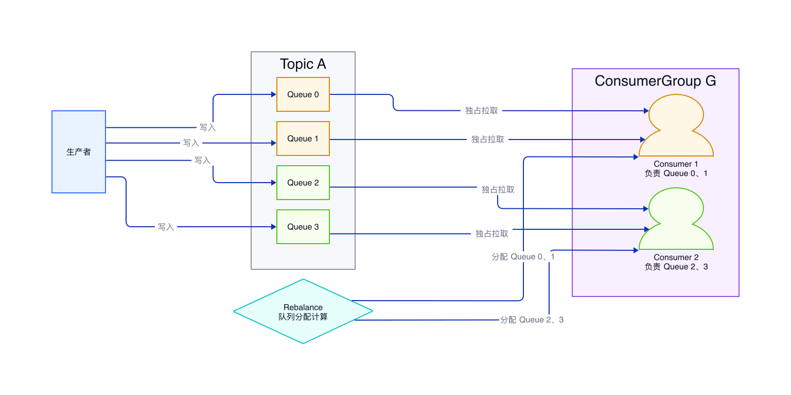
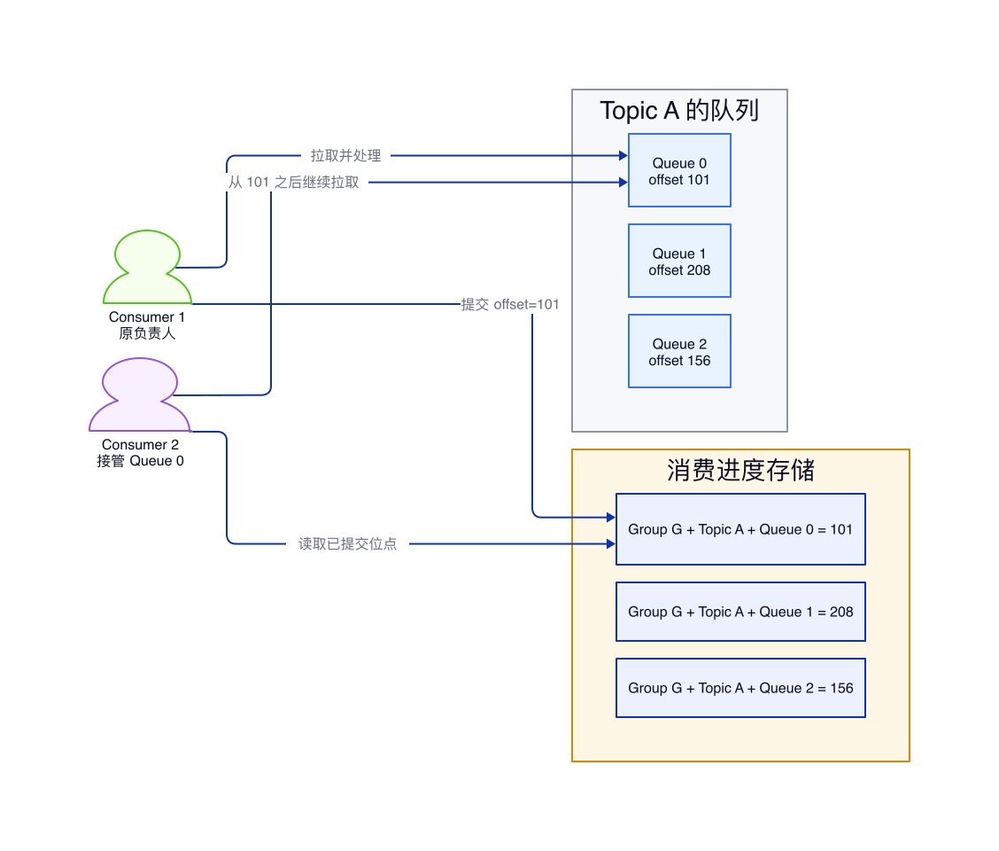
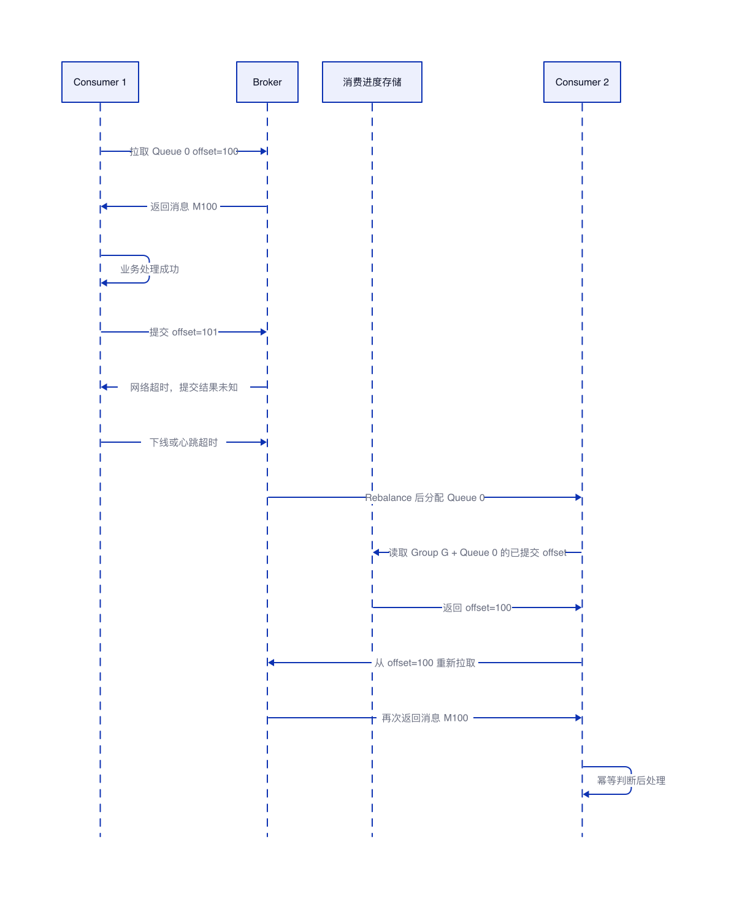

# RocketMQ 同组消费者不重复消费原理

## 结论

RocketMQ 在同一个 ConsumerGroup 内避免多消费者重复拉取同一批消息，核心依赖 **MessageQueue 独占分配**：一个 Topic 会被拆成多个 MessageQueue，同一个 ConsumerGroup 内的消费者通过 Rebalance 把这些队列分摊开；在稳定状态下，一个 MessageQueue 同一时刻只归一个消费者实例消费。

| 问题 | 结论 |
| --- | --- |
| 为什么同组消费者拿到的消息不一样 | 因为消费者拿到的是不同的 MessageQueue，队列之间的数据天然不同 |
| 谁决定队列分给哪个消费者 | ConsumerGroup 内的 Rebalance 机制，按分配策略计算队列归属 |
| 消费进度按什么维度保存 | 按 ConsumerGroup、Topic、MessageQueue 维度保存消费位点 |
| 是否等于绝对不重复 | 不是。网络超时、提交位点失败、消费者上下线重平衡时仍可能重复消费 |
| 业务侧应该怎么做 | 仍要按业务唯一键做幂等，不能假设消息只会被处理一次 |

本文基于 Apache RocketMQ 5.5.0 的同组消费模型说明，同时兼顾 4.x 和 5.x 常见 Push/Pull 消费者的理解方式。RocketMQ 5.x 增加了更面向云原生客户端的消费形态，但同一个消费组内通过服务端消费进度和负载均衡避免并发重复消费的核心思路不变。

## 核心模型：不是抢同一条消息，而是分配不同队列

RocketMQ 的 Topic 不是一个单一队列，而是由多个 MessageQueue 组成。生产者写入消息时，会把消息分散写入不同的 MessageQueue。消费者消费时，也不是所有消费者一起抢同一个逻辑队列，而是先把 MessageQueue 分配给同一个 ConsumerGroup 里的不同消费者。

稳定状态下，ConsumerGroup 内每个 MessageQueue 只会被一个消费者实例持有。例如 Topic A 有 4 个 MessageQueue，ConsumerGroup G 里有 Consumer 1 和 Consumer 2，那么常见分配结果是 Consumer 1 消费 Queue 0、Queue 1，Consumer 2 消费 Queue 2、Queue 3。这样 Consumer 1 和 Consumer 2 拉取的队列不同，拿到的消息也不同。

这个模型更接近 Kafka 的分区消费模型，而不是多个消费者直接竞争同一个队列里的每条消息。

## Rebalance：队列归属的计算过程

当消费者启动、退出、宕机恢复，或者 Topic 队列数量变化时，ConsumerGroup 会触发 Rebalance。Rebalance 会让同组内每个消费者基于同一份成员列表和队列列表，用相同的分配算法计算自己应该负责哪些 MessageQueue。

常见过程如下：

1. 消费者向 Broker 注册自己所属的 ConsumerGroup。
2. 同组消费者获取当前 ConsumerGroup 的消费者实例列表。
3. 消费者获取目标 Topic 下的 MessageQueue 列表。
4. 每个消费者使用相同的 AllocateMessageQueueStrategy 计算队列分配结果。
5. 消费者只拉取分配给自己的 MessageQueue。
6. 有消费者加入或离开时，重新执行上述分配过程。

默认分配策略会尽量平均分配 MessageQueue。队列数量大于消费者数量时，一个消费者会持有多个队列；消费者数量大于队列数量时，会有部分消费者暂时分不到队列。

| 场景 | 分配结果 | 影响 |
| --- | --- | --- |
| 4 个队列，2 个消费者 | 每个消费者约 2 个队列 | 消费能力能横向扩展 |
| 4 个队列，4 个消费者 | 每个消费者约 1 个队列 | 并行度接近队列数 |
| 4 个队列，8 个消费者 | 最多 4 个消费者有队列 | 超过队列数的消费者空闲 |
| 消费者宕机 | 宕机消费者的队列转移给其他消费者 | 触发重平衡，短时间可能重复消费 |

## 消费位点：按组和队列记录进度

RocketMQ 记录消费进度时，不是只记录 Consumer 实例维度，而是记录 ConsumerGroup、Topic、MessageQueue 对应的 offset。这样即使负责某个队列的消费者发生变化，新接手的消费者也能根据这个队列已经提交的进度继续消费。

例如 Consumer 1 原来负责 Queue 0，已经提交到 offset 101。Consumer 1 下线后，Consumer 2 接管 Queue 0。Consumer 2 会读取 ConsumerGroup G 在 Topic A、Queue 0 上已经提交的 offset，从 101 之后继续拉取，而不是从头消费整个队列。

这个设计解决的是“队列换人以后如何续上进度”的问题。它也解释了为什么消费位点必须和 ConsumerGroup 绑定：不同 ConsumerGroup 是不同业务订阅方，彼此之间应该有独立的消费进度。

## 为什么仍然可能重复消费

MessageQueue 独占分配解决的是“稳定状态下同一个队列不会被同组多个消费者同时拉取”的问题，但它不保证业务处理绝对只发生一次。RocketMQ 默认语义是 At Least Once，也就是至少投递一次。

重复消费常见发生在消费成功但 offset 没有成功提交的窗口期。比如消费者已经完成业务处理，但提交消费进度时发生网络超时。随后消费者下线或触发 Rebalance，新消费者接管同一个 MessageQueue 时，只能从服务端已记录的旧 offset 继续拉取，于是刚才已经处理过但未成功提交进度的消息会再次被投递。

常见触发场景包括：

1. 消费者处理成功，但提交 offset 失败。
2. 消费者处理成功后，还没来得及提交 offset 就宕机。
3. Broker 与消费者之间发生网络抖动，消费状态确认丢失。
4. ConsumerGroup 成员变化触发 Rebalance，队列转移给其他消费者。
5. 消费失败进入重试流程，消息被再次投递。

因此，RocketMQ 能降低同组并发重复拉取，但不能替代业务幂等。

## 和 RabbitMQ 竞争消费的区别

RabbitMQ 的普通队列模型更像多个消费者在同一个队列上竞争消息，Broker 负责把每条消息投递给其中一个消费者。RocketMQ 的 ConsumerGroup 模型则更强调队列分片：先把 Topic 拆成多个 MessageQueue，再把 MessageQueue 分配给消费者。

| 对比项 | RocketMQ ConsumerGroup | RabbitMQ 普通队列竞争消费 |
| --- | --- | --- |
| 并行单位 | MessageQueue | 单条消息投递 |
| 同组消费者关系 | 分摊不同队列 | 竞争同一队列里的消息 |
| 进度记录 | ConsumerGroup + Topic + MessageQueue | 队列消息确认状态 |
| 扩容上限 | 受 MessageQueue 数量限制 | 受队列吞吐和投递能力限制 |
| 顺序消费基础 | 同一 MessageQueue 内有序 | 单队列天然有序，但多消费者会影响处理顺序 |

理解这个区别后，就能解释一个常见现象：RocketMQ 同组消费者数量超过 MessageQueue 数量时，多出来的消费者不会继续提升并发度，因为没有更多队列可以分配。

## 实践建议

| 建议 | 原因 |
| --- | --- |
| MessageQueue 数量要按并发度提前规划 | 同组最大有效并发度受队列数量限制 |
| ConsumerGroup 名称按业务订阅语义划分 | 不同业务需要独立消费进度，不能混用同一个组 |
| 消费逻辑必须幂等 | At Least Once 语义下重复消费是正常情况 |
| 处理成功后再提交消费进度 | 避免消息未处理却被认为已经消费 |
| 监控消费堆积和重试队列 | 重平衡、消费失败和处理变慢都能通过堆积体现 |

幂等可以按业务唯一键落地，例如订单号、支付流水号、事件 ID。强一致场景优先使用数据库唯一索引配合本地事务；状态流转类场景可以使用状态机条件更新；低延迟且允许短时误差的场景可以使用带过期时间的去重键。

## 常见误区

**同组消费者不是共同抢一个 MessageQueue。** 稳定状态下，一个 MessageQueue 只分配给一个消费者实例。

**不重复拉取不等于不重复处理。** 消费成功但位点提交失败时，消息仍会再次投递。

**消费者越多并发越高有上限。** 当消费者数量超过 MessageQueue 数量，多出来的消费者没有队列可消费。

**换消费者不会丢失进度。** 进度按 ConsumerGroup 和 MessageQueue 维度记录，新消费者接管队列后会从已提交位点继续消费。