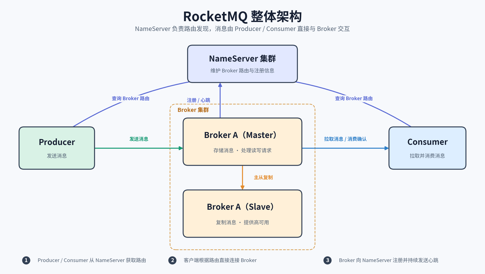
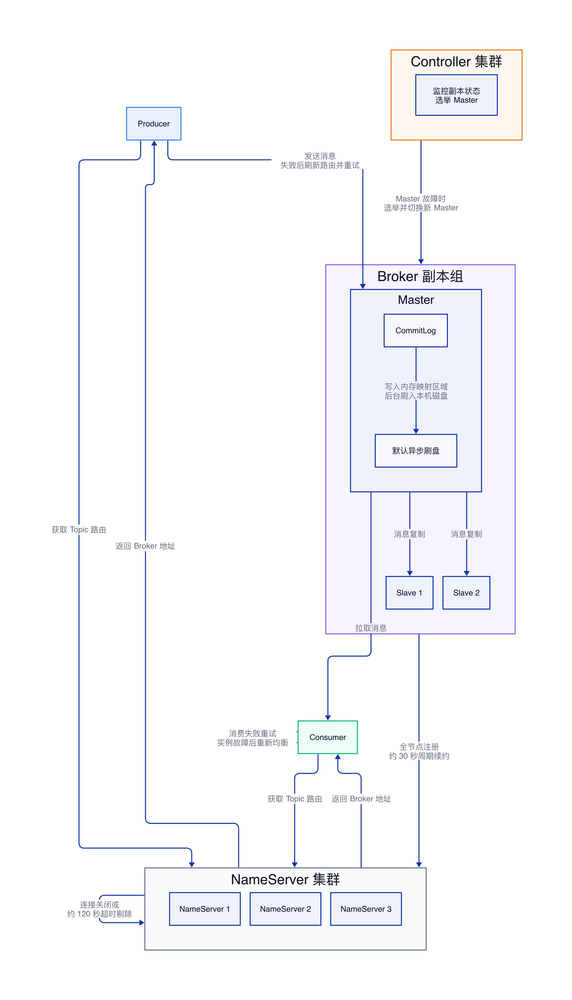

# RocketMQ 实现原理

## 结论

RocketMQ 的核心设计可以概括为：**NameServer 管路由，Broker 管数据，CommitLog 保存消息正文，ConsumeQueue 和 IndexFile 提供不同用途的索引。** 消息写入时顺序追加到 CommitLog；消费时先查 ConsumeQueue，再按物理偏移量读取 CommitLog。

| 关键点 | 结论 |
| --- | --- |
| 路由 | NameServer 保存 Topic 路由和 Broker 地址，不保存消息正文 |
| 存储 | Broker 是数据存储核心；CommitLog 是完整消息正文的唯一持久化文件 |
| 消费 | Consumer 先读取 ConsumeQueue，再根据物理偏移量从 CommitLog 取出正文 |
| 可靠性 | 默认语义是 At Least Once，可能重复投递，消费端必须实现幂等 |
| 顺序 | 同一业务键路由到同一个 MessageQueue，可保证局部顺序，但不保证全局顺序 |

## 整体架构



RocketMQ 由 NameServer、Broker、Producer 和 Consumer 四类核心角色组成。

- **NameServer**：维护 Topic 与 Broker 之间的路由关系，为客户端提供服务发现，不保存消息正文。
- **Broker**：接收消息、持久化数据并向消费者投递消息，是整个系统的数据存储核心。
- **Producer**：从 NameServer 获取 Topic 路由，将消息发送到对应 Broker。
- **Consumer**：从 Broker 拉取消息，执行业务消费逻辑并提交消费进度。

NameServer 不参与消息正文的存储和转发，因此 NameServer 故障不会直接导致已经在 Broker 落盘的消息丢失。

## 高可用实现

RocketMQ 5.x 的高可用由 NameServer 多节点、Broker 副本、Controller 自动切换、消息持久化以及客户端故障恢复共同实现。各机制负责不同的故障范围，不能相互替代。


### NameServer 路由高可用

NameServer 采用无状态多节点部署，节点之间不复制路由数据，也不通过一致性协议同步。Broker 启动后会向配置的每个 NameServer 独立注册 Broker 地址、主从关系以及 Topic 路由，并默认约每 30 秒重新注册一次。一次注册失败后，下一轮会继续尝试，因此路由最终能够恢复。

NameServer 会记录 Broker 最近一次正常通信的时间。Broker 连接关闭时会触发路由清理；连接未正常关闭但约 120 秒没有续约时，NameServer 也会将其判定为不可用并剔除。生产者和消费者在本地缓存路由，单个 NameServer 短暂故障时仍可使用已有路由访问 Broker。

该机制保证最终一致，而不是强一致。在 Broker 已经故障但 NameServer 尚未完成剔除的窗口内，客户端可能获得旧地址。生产者发送失败后会刷新路由并重试其他可写 MessageQueue。

### Broker 副本与自动切换

一个 Broker 副本组包含一个 Master 和多个 Slave。消息写入 Master 后复制到 Slave。RocketMQ 5.x 使用 Controller 维护副本组状态；Master 故障后，Controller 从符合条件的副本中选出新 Master，Broker 随后向 NameServer 更新路由，生产者和消费者刷新路由后继续收发消息。

同步复制在副本确认后才返回成功，数据可靠性更高；异步复制在 Master 本地写入完成后返回，吞吐量更高，但 Master 突然故障时存在丢失少量消息的风险。

### 刷盘与数据可靠性

RocketMQ 5.x 默认使用异步刷盘：

```properties
# 默认值。消息写入内存映射区域后即可返回，由后台线程刷入磁盘。
flushDiskType=ASYNC_FLUSH
```

异步刷盘具有更高吞吐量，但数据尚未落盘时机器突然掉电，可能丢失少量已经返回成功的消息。对消息落盘要求严格时，可以改为同步刷盘：

```properties
# 消息写入本机磁盘后才向生产者返回成功。
flushDiskType=SYNC_FLUSH
```

刷盘与副本复制解决的问题不同：刷盘保证消息从内存写入本机磁盘，副本复制保证消息保存到其他 Broker。Controller 负责故障检测和主节点切换，不会自动改变刷盘方式。

### 生产与消费链路恢复

Topic 通常在多个 Broker 上创建多个 MessageQueue。生产者发送失败后会重新获取路由并重试其他可写队列，因此单个 Broker 故障不会中断整个 Topic 的写入。发送重试可能产生重复消息，消费端必须基于业务唯一键实现幂等。

同一消费组中的多个消费者共同分配 MessageQueue。消费者实例故障后，客户端会重新均衡，将其负责的队列分配给其他实例。消费失败的消息进入重试流程，超过最大重试次数后进入死信队列。

### Master 故障恢复过程

1. Controller 检测到原 Master 不可用。
2. Controller 从符合条件的副本中选出新 Master。
3. Broker 向所有 NameServer 更新路由信息。
4. 生产者刷新路由，将消息发送到新 Master。
5. 消费者重新连接并继续消费。
6. 原 Master 恢复后以副本身份重新加入并同步数据。

## Broker 存储目录

Broker 的消息数据默认存放在 `storePathRootDir` 指定的目录中，常见默认位置是 `${user.home}/store`。

```text
store/
├── commitlog/                 # 完整消息正文
├── consumequeue/              # 按 Topic + QueueID 组织的消费索引
├── index/                     # 按 Message Key、消息 ID 查询的哈希索引
├── checkpoint                 # 刷盘时间点等检查点信息
├── abort                      # 判断 Broker 上一次是否异常退出
└── config/
    ├── consumerOffset.json    # 消费组的消费进度
    ├── topics.json            # Topic 配置
    └── delayOffset.json       # 延迟消息相关消费进度
```

## CommitLog：消息正文的唯一存储

CommitLog 采用所有 Topic 混写、顺序追加的方式保存消息。Broker 收到消息后，不会为每个 Topic 单独维护正文文件，而是把消息依次追加到 CommitLog。顺序写比随机写更适合磁盘吞吐，也降低了大量小文件带来的管理成本。

每条消息写入后都会获得一个物理偏移量。后续建立 ConsumeQueue 和 IndexFile 时，都会通过这个偏移量关联回 CommitLog。ConsumeQueue 和 IndexFile 都不是消息正文的副本，真正的完整消息只存在于 CommitLog。

## ConsumeQueue：正常消费的主索引

ConsumeQueue 按 `Topic + QueueID` 组织。每个索引条目主要保存以下内容：

- CommitLog 物理偏移量
- 消息长度
- Tag 哈希值

正常消费链路如下：

1. Consumer 根据消费进度读取 ConsumeQueue。
2. ConsumeQueue 返回 CommitLog 物理偏移量和消息长度。
3. Broker 根据物理偏移量从 CommitLog 读取完整消息正文。
4. Broker 将消息返回给 Consumer。
5. Consumer 完成业务处理后提交消费进度。

因此，ConsumeQueue 决定“应该读哪条消息”，CommitLog 负责“取出这条消息的完整内容”。

## IndexFile：面向检索和排查的辅助索引

IndexFile 使用哈希索引记录 Message Key、消息 ID 与 CommitLog 物理偏移量之间的关系，适合按业务 Key 或消息 ID 查询消息。

IndexFile 主要用于问题排查、消息追踪和管理查询，不是正常消费链路的必经路径。ConsumeQueue 面向按队列顺序消费，IndexFile 面向按 Key 检索。即使消息没有设置业务 Key，也不影响 Consumer 通过 ConsumeQueue 正常消费。

## 消息从生产到消费的完整链路

### 发送阶段

Producer 从 NameServer 获取 Topic 路由，根据队列选择策略确定 MessageQueue，并将消息发送到对应 Broker。

#### MessageQueue 的读写关系与数量规划

Producer 写入和 Consumer 读取的是同一套 MessageQueue，不存在两类不同的队列。一个 MessageQueue 由 `Topic + BrokerName + QueueId` 唯一确定。Producer 数量不决定使用几个 MessageQueue：默认发送会在多个可写 MessageQueue 之间轮转；只有显式指定队列或根据业务键固定路由时，相关消息才会持续进入同一个 MessageQueue。

Producer 所说的“写入 MessageQueue”，实际表示 Broker 将完整消息写入 CommitLog，并在指定 `Topic + QueueId` 对应的 ConsumeQueue 中建立索引。Consumer 被分配该 MessageQueue 后，先按消费位点读取 ConsumeQueue，再根据索引中的物理偏移量从 CommitLog 读取完整消息。

`writeQueueNums` 表示 Producer 可以选择并写入的队列数量，`readQueueNums` 表示 Consumer 可以分配并读取的队列数量。两者不是不同的物理队列，生产环境应保持相等。如果写队列多于读队列，Producer 可能把消息写入 Consumer 无法发现的 QueueId；如果读队列多于写队列，多出的队列不会接收新消息。

| 对比项 | Producer | Consumer |
| --- | --- | --- |
| 面向对象 | Topic 下的可写 MessageQueue | 消费组分配给当前实例的可读 MessageQueue |
| 主要操作 | 选择队列并发送消息 | 按消费位点拉取消息 |
| 队列分配方式 | 默认在可写队列间轮转 | 消费组内通过重新均衡分配 |
| 消费进度 | 不维护 | 每个消费组独立维护 |

多个消费组可以读取同一个 MessageQueue，但分别维护自己的消费位点，因此能够独立消费同一批消息，互不影响。消费失败后产生的重试队列和死信队列属于另外的 Topic，不是 Producer 最初写入的 MessageQueue。

Topic 的 MessageQueue 总数等于各 Broker 上该 Topic 队列数量之和。如果 Topic 部署在 3 个 Broker，每个 Broker 配置 8 个读写队列，那么整个 Topic 共有 24 个 MessageQueue。

队列数量没有适用于所有业务的固定值，应根据最大消费者实例数、生产峰值 TPS、消费峰值 TPS 和压测得到的单队列稳定吞吐量确定：

```text
总队列数 ≥ 最大消费者实例数
总队列数 ≥ 峰值生产 TPS ÷ 单队列稳定写入 TPS
总队列数 ≥ 峰值消费 TPS ÷ 单队列稳定消费 TPS
```

普通业务在缺少压测数据时，可以从每个 Broker 4～8 个读写队列起步，并保持 `readQueueNums = writeQueueNums`。高吞吐业务必须根据压测结果计算，不能直接创建大量队列。队列过多会增加路由数据、ConsumeQueue、消费位点和重新均衡的管理成本。

RocketMQ 不会根据 Topic 流量或消费者数量动态计算队列数。开启自动创建 Topic 时，Broker 的 `defaultTopicQueueNums` 默认是 8，经典 Java Producer 请求自动创建 Topic 时携带的 `defaultTopicQueueNums` 默认是 4。Broker 会取两个默认值中的较小值：

```text
实际队列数 = min(Producer 默认值, Broker 默认值)
           = min(4, 8)
           = 4
```

因此，默认通常会在实际创建该 Topic 的 Broker 上建立 4 个读队列和 4 个写队列。该数量不是根据负载动态计算出来的，只是默认配置产生的结果。生产环境不应依赖首次发送触发自动创建，应关闭自动创建并通过管理工具显式指定 Topic 所在 Broker、读队列数和写队列数。

扩容时应同时增加读写队列。缩容前必须停止向待移除 QueueId 写入，并确认存量消息消费完成。使用 `hash(业务键) % 队列总数` 路由顺序消息时，调整队列数量会改变取模结果，可能破坏变更前后的连续顺序。

### 存储阶段

Broker 将完整消息顺序追加到 CommitLog，随后生成对应的 ConsumeQueue 索引。如果消息携带可索引的 Key，还会建立 IndexFile 索引。

### 消费阶段

Consumer 从 Broker 拉取指定逻辑位点的消息。Broker 查询 ConsumeQueue 得到 CommitLog 物理偏移量，再读取正文并返回。Consumer 业务处理成功后提交消费进度；处理失败时，消息会按重试机制重新投递。

## 投递语义与消费幂等

RocketMQ 默认提供 **At Least Once** 语义，即消息至少会被投递一次，但不能保证绝对不重复。

网络超时、消费完成后进度提交失败、Broker 重投等情况，都可能让同一条消息再次到达消费端。因此，可靠消费不能只依赖消息中间件，业务处理必须具备幂等性。

| 方案 | 实现方式 | 适用场景 |
| --- | --- | --- |
| 数据库唯一索引 + 本地事务 | 以业务唯一键建立唯一约束，并把防重记录与业务更新放在同一事务中 | 对一致性要求高的核心业务 |
| 业务状态机条件更新 | 更新时附带前置状态条件，例如仅允许“待支付”变为“已支付” | 订单、工单等状态驱动业务 |
| Redis `SET NX EX` | 以业务唯一键抢占处理标记，并设置过期时间 | 允许一定误差、追求低延迟的场景；不能替代强一致事务 |

数据库唯一索引配合本地事务通常是更可靠的防重方式。Redis 方案需要考虑缓存丢失、过期时间设置不合理以及业务处理与标记写入不原子等问题。

## 重试与死信队列

消费失败后，RocketMQ 会把消息送入消费组对应的重试 Topic：

```text
%RETRY%consumer-group-name
```

系统按照重试策略再次投递。达到最大重试次数后，消息进入死信队列：

```text
%DLQ%consumer-group-name
```

死信消息不会自动恢复正常消费。生产环境通常需要配套监控、告警、原因分析和人工或自动补偿机制。重新投递死信消息前仍要保证业务幂等，否则补偿操作可能再次产生副作用。

## 事务消息

事务消息用于协调本地事务与消息发送，典型流程如下：

1. Producer 向 Broker 发送半消息。
2. Broker 保存半消息，但暂不向 Consumer 投递。
3. Producer 执行本地事务。
4. 本地事务成功后向 Broker 提交 Commit，失败则提交 Rollback。
5. Commit 后消息可被 Consumer 消费；Rollback 后消息被丢弃。
6. 如果 Broker 长时间未收到明确结果，会向 Producer 发起事务状态回查。

Producer 需要根据本地事务记录返回最终状态。事务消息解决的是消息发送与本地事务之间的一致性问题，但本地事务回查逻辑仍需可靠，消费端仍需实现幂等。

## 顺序消息

RocketMQ 的顺序保证建立在 MessageQueue 维度。Producer 需要把同一业务键的消息稳定路由到同一个 MessageQueue，例如按订单 ID 选择队列；Consumer 再以顺序方式消费该队列，才能保证同一业务键内的消息顺序。

这种方式提供的是局部顺序，不是全局顺序。全局顺序通常意味着所有消息进入单一队列，会明显限制并发能力。实际设计时应先确定需要保持顺序的最小业务粒度，再以该业务键进行队列路由。

## 常见理解误区

**NameServer 不保存消息。** NameServer 只维护路由与 Broker 信息，消息正文始终由 Broker 持久化。

**ConsumeQueue 不保存完整消息。** 它只保存定位 CommitLog 所需的轻量索引。

**IndexFile 不是消费主路径。** 它主要用于按 Key 或消息 ID 查询和排查。

**消费成功不等于永不重复。** 只要消费结果与进度提交之间存在故障窗口，就需要业务幂等兜底。

**顺序消息不等于全局有序。** 默认只能保证同一 MessageQueue 内的顺序。
