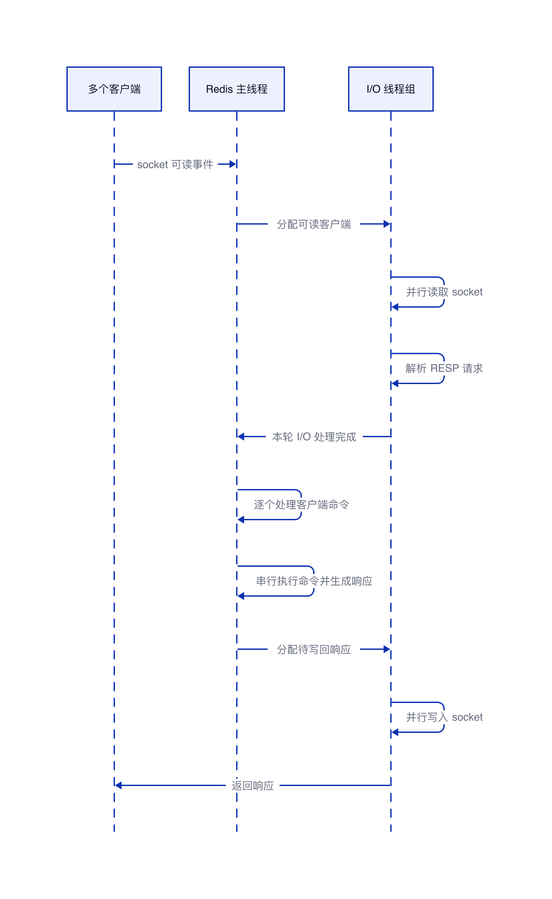

# Redis 为什么支持多线程仍会积压任务

## 结论

Redis 6.0 引入的是多线程 I/O，不是多线程执行命令。I/O 线程可以并行完成读取 socket、解析请求和写回响应，减少网络 I/O 对主线程的占用；命令执行仍由主线程单线程串行完成。

因此，多线程 I/O 提升的是网络收发阶段的处理能力，不能突破命令执行阶段的单线程吞吐上限。当请求到达速度持续高于主线程的命令执行速度时，已经解析完成的命令仍会排队，最终形成任务积压和延迟升高。


## Redis 为什么要支持多线程 I/O

Redis 早期的请求处理链路主要由主线程完成：读取 socket、解析协议、执行命令、生成响应、写回 socket。随着网络带宽、客户端连接数和单机 CPU 核数增加，socket 读写和协议解析会消耗较多 CPU 时间，主线程用于执行命令的时间随之减少。

Redis 6.0 将部分网络 I/O 工作交给多个 I/O 线程并行处理，让主线程把更多 CPU 时间用于执行命令。这种设计保留了命令串行执行的简单性，同时利用多个 CPU 核心分担网络收发开销。

## 主线程与 I/O 线程如何使用 CPU

Redis 主线程本身始终只占用 1 个 CPU 核心，不会因为开启多线程 I/O 而增加。

多线程 I/O 占用的 CPU 核心数 = `io-threads` 配置的线程数量，官方建议配置为 4（4 核以上机器）或 8（8 核以上机器），不建议超过这个范围。

## 读取多线程需要单独开启

只配置 `io-threads` 时，Redis 默认仅使用多线程写回响应。读取 socket 和协议解析仍不会自动启用多线程。要让读取和协议解析也由 I/O 线程处理，还需要显式配置：

```conf
io-threads 4
io-threads-do-reads yes
```

`io-threads-do-reads` 默认值为 `no`。因此，判断多线程 I/O 实际覆盖了哪些阶段时，必须同时检查这两个配置。

## 请求处理链路

1. 主线程接收连接就绪事件，并把客户端连接分配给 I/O 线程。
2. I/O 线程并行读取 socket；启用读取线程后，还可以完成协议解析。
3. 已解析的命令回到主线程，等待主线程处理。
4. 主线程逐条执行命令并生成响应。
5. I/O 线程并行把响应写回客户端。

多线程只覆盖链路两端的 I/O 工作，中间的命令执行仍然是串行路径。

## 为什么仍然会积压

设请求到达速率为 λ，主线程的命令执行速率为 μ。当 λ 持续大于 μ 时，单位时间内新增的命令多于完成的命令，等待执行的命令数量会持续增加。I/O 线程越快，只代表请求能更快进入待执行阶段，并不代表主线程能更快执行这些命令。

| 阶段 | 是否可以并行 | 主要瓶颈 |
| --- | --- | --- |
| 读取 socket | 可以 | 网络吞吐、I/O 线程 CPU |
| 协议解析 | 可以 | I/O 线程 CPU |
| 执行命令 | 不可以 | 主线程 CPU、命令复杂度 |
| 写回响应 | 可以 | 网络吞吐、I/O 线程 CPU |

任务积压常见于以下情况：慢命令或大键操作占用主线程时间；单条命令计算量较大；请求量持续超过单实例处理能力；大量响应虽然能并行写回，但命令生成响应之前仍要经过主线程执行。

## 处理任务积压的方向

| 瓶颈 | 处理方向 |
| --- | --- |
| 慢命令 | 替换高时间复杂度命令，拆分一次处理的数据量 |
| 大键 | 拆分大键，避免单次读取、删除或遍历耗时过长 |
| 单实例 CPU 饱和 | 按业务键分片，使用多个实例分担命令执行压力 |
| 网络 I/O 成为瓶颈 | 合理开启并调整 I/O 线程数量 |
| 突发流量 | 在业务入口限流或削峰，避免请求无限进入 Redis |

多线程 I/O 的作用是缩短网络阶段，而不是把 Redis 变成多线程命令执行引擎。判断是否需要开启它时，必须先确认瓶颈是否真的位于网络 I/O；如果瓶颈在命令执行阶段，应从命令、数据结构和实例拆分入手。