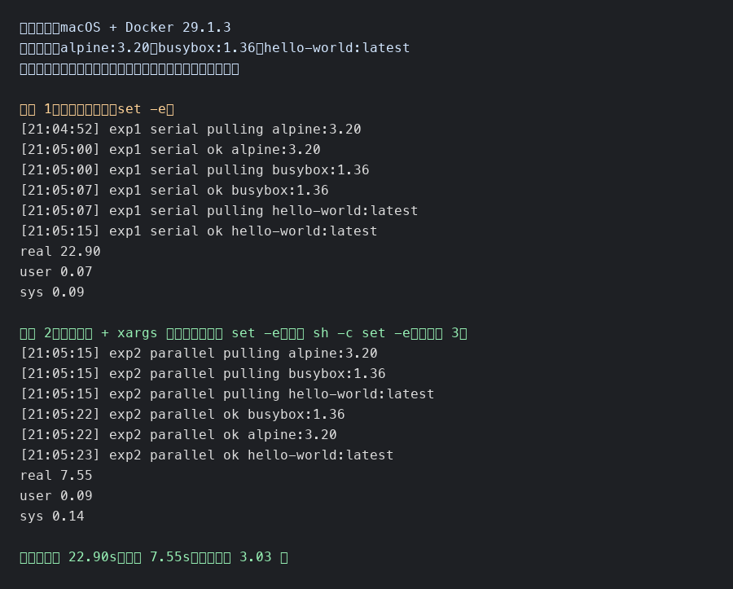

# Shell 并发拉取镜像

## 适用场景

在测试环境、离线部署准备、节点预热等场景中，经常需要提前拉取一批容器镜像。逐个执行 `docker pull` 简单但耗时；并发拉取可以同时利用网络和镜像仓库连接能力，缩短准备时间。

本文使用 `xargs -P` 控制并发数。它写法简单，适合临时批量拉取镜像，也适合放进初始化脚本中使用。

## 镜像列表变量

把要拉取的镜像维护在一个变量里，后续串行和并发脚本都从这个变量读取镜像名。

```sh
# 镜像名列表，使用空格分隔
IMAGES="alpine:3.20 busybox:1.36 hello-world:latest"
```

这种方式适合镜像数量不多、脚本需要直接自包含的场景。如果镜像很多，仍然可以改回文件或从配置系统读取。

## 直接串行拉取

最直接的方式是遍历镜像名列表变量，然后一个一个执行 `docker pull`。

```sh
#!/bin/sh

# 外层脚本遇到错误立即退出
set -e

# 镜像名列表，使用空格分隔
IMAGES="alpine:3.20 busybox:1.36 hello-world:latest"

# 逐个读取镜像名并串行拉取
for image in $IMAGES; do
  # 打印当前正在拉取的镜像，便于观察进度
  echo "[$(date +%H:%M:%S)] pulling ${image}"

  # 串行拉取镜像；当前镜像完成后才会拉取下一个
  docker pull "${image}"

  # 打印成功时间，便于核对执行结果
  echo "[$(date +%H:%M:%S)] ok ${image}"
done
```

这种方式最容易理解，但总耗时基本接近所有镜像拉取耗时之和。如果镜像数量较多，等待时间会比较明显。

## 使用 xargs 并发拉取

`xargs -P` 可以限制同时运行的任务数量。下面的示例中，`-P 4` 表示最多同时执行 4 个 `docker pull`。外层脚本和内层 `sh -c` 子进程都使用 `set -e`，这样任一关键命令失败时都能尽快退出。

```sh
#!/bin/sh

# 外层脚本遇到错误立即退出
set -e

# 镜像名列表，使用空格分隔
IMAGES="alpine:3.20 busybox:1.36 hello-world:latest"

# 把变量里的镜像名转换成逐行输入，再交给 xargs 并发执行
printf '%s\n' $IMAGES | xargs -P 4 -I {} sh -c '
  # 内层子进程遇到错误立即退出
  set -e

  # 当前要拉取的镜像名
  image="$1"

  # 打印开始时间，便于观察并发执行效果
  echo "[$(date +%H:%M:%S)] pulling ${image}"

  # 拉取镜像；失败时当前子进程会直接退出
  docker pull "${image}"

  # 打印成功时间，便于核对执行结果
  echo "[$(date +%H:%M:%S)] ok ${image}"
' sh {}
```

这里的 `sh {}` 不是多余参数。`sh -c` 后面的第一个参数会成为 `$0`，再后面的参数才会成为 `$1`。因此用一个固定的 `sh` 占位，把镜像名放到 `$1`，可以避免镜像名里包含特殊字符时被错误解析。

## 完整可用脚本

下面是一个可直接保存为 `parallel-pull-images.sh` 的版本。

```sh
#!/bin/sh

# 外层脚本遇到错误立即退出
set -e

# 镜像名列表，使用空格分隔
IMAGES="alpine:3.20 busybox:1.36 hello-world:latest"

# 最大并发数，默认 4；可以通过第一个参数覆盖
max_parallel="${1:-4}"

# 使用 xargs 按指定并发数拉取镜像
printf '%s\n' $IMAGES | xargs -P "$max_parallel" -I {} sh -c '
  # 内层子进程遇到错误立即退出
  set -e

  # 当前要拉取的镜像名
  image="$1"

  # 打印任务开始时间
  echo "[$(date +%H:%M:%S)] pulling ${image}"

  # 拉取镜像；失败时当前子进程会直接退出
  docker pull "${image}"

  # 打印任务成功时间
  echo "[$(date +%H:%M:%S)] ok ${image}"
' sh {}
```

执行方式如下：

```sh
# 使用默认并发数 4
sh parallel-pull-images.sh

# 指定并发数为 8
sh parallel-pull-images.sh 8
```

## 串行和并发耗时对比

本地使用 Docker 29.1.3 验证了串行逐个拉取和并发拉取的耗时差异。每次实验前先删除本地已有镜像，避免直接命中本地缓存。测试镜像为 `alpine:3.20`、`busybox:1.36`、`hello-world:latest`。

| 实验 | 方式 | 并发数 | 实测耗时 | 结果 |
| --- | --- | ---: | ---: | --- |
| 实验 1 | 串行逐个拉取 | 1 | 22.90s | 3 个镜像全部成功 |
| 实验 2 | 变量列表 + xargs 并发拉取 | 3 | 7.55s | 3 个镜像全部成功 |

这次测试中，并发拉取比串行逐个拉取减少了 `15.35s`，约快 `3.03` 倍。实际收益会受镜像大小、网络质量、镜像仓库限流、本机磁盘 IO 影响。



验证命令如下：

```sh
# 定义镜像名列表变量
IMAGES="alpine:3.20 busybox:1.36 hello-world:latest"

# 实验 1：删除本地镜像，避免直接命中本地缓存
docker rmi $IMAGES || true

# 实验 1：串行逐个拉取并计时
/usr/bin/time -p sh <<'EOF'
set -e

IMAGES="alpine:3.20 busybox:1.36 hello-world:latest"

for image in $IMAGES; do
  echo "[$(date +%H:%M:%S)] exp1 serial pulling ${image}"
  docker pull "${image}" >/dev/null
  echo "[$(date +%H:%M:%S)] exp1 serial ok ${image}"
done
EOF

# 实验 2：再次删除本地镜像，让并发测试也从拉取开始
docker rmi $IMAGES || true

# 实验 2：使用变量列表 + xargs 并发拉取并计时，并发数为 3
/usr/bin/time -p sh <<'EOF'
set -e

IMAGES="alpine:3.20 busybox:1.36 hello-world:latest"

printf '%s\n' $IMAGES | xargs -P 3 -I {} sh -c '
  set -e

  image="$1"
  echo "[$(date +%H:%M:%S)] exp2 parallel pulling ${image}"
  docker pull "${image}" >/dev/null
  echo "[$(date +%H:%M:%S)] exp2 parallel ok ${image}"
' sh {}
EOF
```
