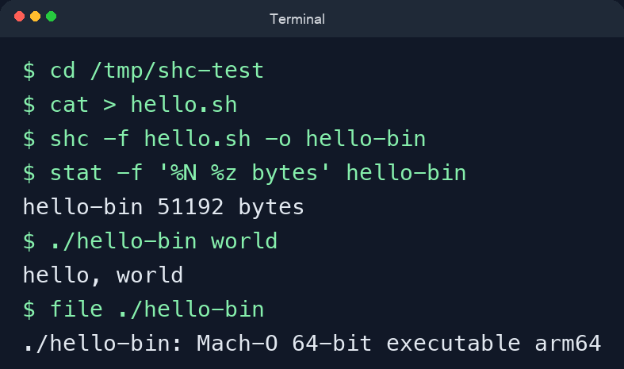

# shell 脚本转成二进制

## 结论

如果目标是把 shell 脚本交付成一个可执行文件，保留 `shc` 这一种方案就够了。它更适合单脚本分发、希望交付形式是可执行文件、同时不想直接暴露脚本内容的场景。需要注意的是，这种方式更接近“封装成可执行文件”，不代表获得了和原生编译语言完全一样的安全性或可移植性。

## 方案：shc

### 原理与适用场景

`shc` 会把 shell 脚本加密后生成可执行二进制文件。运行这个二进制时，程序会再去执行原来的脚本逻辑。它适合单文件分发、希望脚本不要直接以明文形式交付、希望使用方式更接近普通命令行程序的场景；不适合追求强安全性，也不适合完全摆脱目标机器上的 shell 运行环境。

### 示例

```bash
# 安装 shc（macOS 示例）
brew install shc

# 准备一个待转换脚本
cat > hello.sh <<'EOF'
#!/usr/bin/env bash
# 打印参数，用于验证二进制执行结果是否正确
set -euo pipefail
name="${1:-world}"
printf 'hello, %s\n' "$name"
EOF
chmod +x hello.sh

# 生成二进制
# -f: 指定输入脚本
# -o: 指定输出文件名
shc -f hello.sh -o hello-bin

# 查看产物
ls -l hello.sh hello-bin

# 执行生成的二进制
./hello-bin world
```

### 验证步骤

```bash
# 1) 准备脚本
cat > hello.sh <<'EOF'
#!/usr/bin/env bash
set -euo pipefail
name="${1:-world}"
printf 'hello, %s\n' "$name"
EOF
chmod +x hello.sh

# 2) 使用 shc 生成二进制
shc -f hello.sh -o hello-bin

# 3) 执行原脚本与二进制，确认输出一致
./hello.sh world
./hello-bin world

# 4) 检查 hello-bin 是否为本机可执行文件
file ./hello-bin
```

验证通过的标准是：`shc` 能成功生成 `hello-bin`，原脚本与二进制的输出一致，并且 `file` 能识别出它是本机平台的可执行文件。


